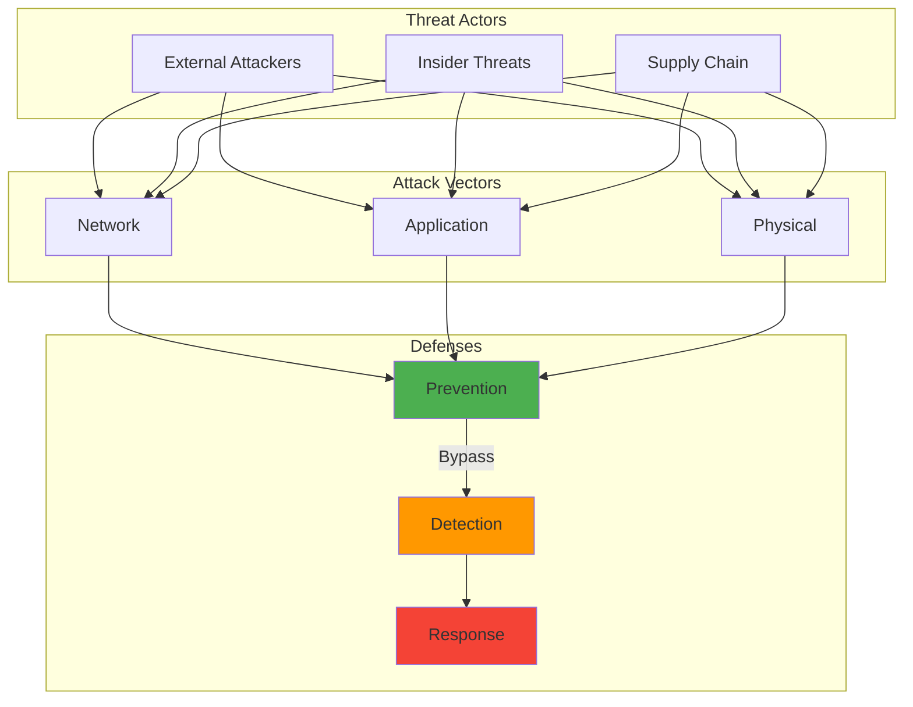

After 15+ years in cybersecurity, I've learned one truth: The moment you stop learning is the moment you become obsolete. But here's the challenge – how do you keep up with a field that literally changes every day without burning out? Here are the strategies that have worked for me.

## How It Works



## The Learning Paradox

When I started in IT support, I could learn a technology and use it for years. Now? The vulnerability I'm patching today didn't exist last week. The attack technique I'm defending against was presented at a conference last month. The AI tool I'm securing was in beta yesterday.

This creates what I call the "Learning Paradox":
- You need to learn constantly to stay relevant
- But you also need to do actual work
- And somehow maintain work-life balance
- While avoiding information overload

Sound familiar?

## My Learning Framework: The 70-20-10 Rule (Modified)

The traditional 70-20-10 rule says: 70% learning on the job, 20% from others, 10% formal training. I've modified it for cybersecurity:

- **70% Hands-On Practice**: Homelab, CTFs, real incidents
- **20% Community Learning**: Conferences, forums, peer discussions
- **10% Structured Learning**: Courses, certifications, books

But here's the key: These percentages flex based on your current needs.

## Strategy 1: Build a Learning Lab That Mirrors Reality

My homelab isn't just for fun – it's my gym for cybersecurity skills.

### Current Lab Setup
```yaml
Production_Like_Environment:
  - Domain: homelab.local (Active Directory)
  - Network_Segments:
    - DMZ: Public-facing services
    - Internal: "Corporate" network
  - Hardware:
    - RAM: 64GB DDR4
    - Storage: 2TB NVMe
    # ... (additional implementation details)
      - Network: Dream Machine Professional + Suricata
      - Deception: Honeypots
```

### Why This Works
1. **Safe to Break**: Destroyed my AD forest 3 times learning about Golden Tickets (once in May 2023, spectacularly)
2. **Real Tools**: Same software used in enterprise environments
3. **Instant Feedback**: See attacks in real-time
4. **Cost Effective**: ~$50/month in electricity vs $1000s for training – though your mileage may vary depending on hardware

### Pro Tip: Scenario-Based Learning
Every month, I give myself a scenario:
- "APT gained initial access, find and evict them"
- "Build Zero Trust for remote access"
- "Detect and stop data exfiltration"

These scenarios typically take me 2 to 3 hours to set up and run through completely. This beats following random tutorials because it mimics real work.

## Strategy 2: Curated Information Diet

Information overload is real – some days I feel like I'm drowning in threat intel and CVE notifications. Here's my filtering system that's evolved since around 2022:

### Daily (15 minutes)
- **RSS Feeds** (Feedly):
  - Krebs on Security
  - SANS Internet Storm Center
  - The Hacker News
- **Reddit** (multireddit):
  - r/netsec (sorted by hot)
  - r/blueteamsec
  - r/cybersecurity (filtered for quality)

### Weekly (1 hour)
- **Podcasts** (during commute):
  - Darknet Diaries (storytelling)
  - Security Now (technical news)
  - SANS Internet Storm Center (daily brief)
- **YouTube Channels**:
  - John Hammond (practical demos)
  - NetworkChuck (new tools)
  - David Bombal (interviews)

### Monthly (4 hours)
- **Deep Dives**:
  - One new attack technique
  - One defensive tool mastery
  - One compliance/framework update
- **Virtual Conferences**:
  - BSides recordings
  - DEFCON talks
  - Vendor webinars (selective)

### The Key: Ruthless Filtering
I use these criteria:
1. Is it actionable within 30 days?
2. Does it apply to my current role?
3. Will it matter in 6 months?

If no to all three, it goes in the "Maybe Later" bookmark folder. Though I'll admit, this system isn't perfect – sometimes I miss important trends, and what works for my filtering approach might not match your information needs.

## Strategy 3: Learning Sprints, Not Marathons

Inspired by Agile, I do 2-week learning sprints:

### Sprint Planning
```markdown
## Learning Sprint: Jan 15-29, 2024

**Goal**: Master MITRE ATT&CK Framework for Detection Engineering

**Deliverables**:
    # ... (additional implementation details)
- Red Canary's detection guide
- Florian Roth's Sigma rules
```

### Why Sprints Work
1. **Clear Focus**: One topic, not everything
2. **Time Boxed**: Prevents endless rabbit holes
3. **Measurable**: Concrete deliverables
4. **Sustainable**: Built-in breaks between sprints

## Strategy 4: The Power of Teaching

Nothing cements learning like teaching others. Here's how I do it:

### Internal Knowledge Sharing
- **Brown Bags**: Monthly lunch presentations
- **Wiki Documentation**: Step-by-step guides
- **Incident Debriefs**: Lessons learned sessions

### External Sharing
- **Blog Posts**: Like this one!
- **Conference Talks**: Local BSides, meetups
- **Mentoring**: Junior team members

### The Teaching Trick
When learning something new, I ask: "How would I explain this to a junior analyst?" This forces me to:
- Understand fundamentals, not just memorize
- Find practical examples
- Identify knowledge gaps

## Strategy 5: Strategic Certification Path

Certifications are controversial. Here's my approach:

### What I've Learned
- **Early Career**: Certs open doors (CompTIA trifecta worked for me)
- **Mid Career**: Certs validate expertise (GCIH, GNFA)
- **Senior Level**: Certs for specific needs (cloud, leadership)

### My Certification Strategy
```python
def should_get_cert(cert_name):
    questions = {
        "Does job require it?": 10,
        "Will it teach new skills?": 8,
        "Does it align with career goals?": 7,
    # ... (additional implementation details)
    
    return score >= 15  # Threshold for "worth it"
```

### Current Focus
Instead of collecting certs, I focus on:
- **Practical Skills**: Can I do the job?
- **Proof of Work**: GitHub, blog posts, talks
- **Specific Needs**: AWS Solutions Architect (passed December 2024) for cloud migration project

## Strategy 6: Learn from Incidents (Yours and Others')

Every incident is a masterclass in what not to do.

### Personal Incident Journal
```markdown
## Incident: Ransomware Near-Miss
**Date**: October 17, 2023
**What Happened**: User clicked phishing link, antivirus caught it
**What Worked**:
- Email security flagged but didn't block
    # ... (additional implementation details)
- [ ] Review email security settings
- [ ] Schedule phishing simulation
```

### Learning from Others
- **Breach Reports**: Read every Mandiant/CrowdStrike report
- **Post-Mortems**: Google's, Cloudflare's are gold
- **Threat Intel**: But only actionable intel

## Strategy 7: Balance Depth and Breadth

The specialist vs. generalist debate misses the point. You need both.

### My T-Shaped Approach
```
Broad Knowledge (1 inch deep):
━━━━━━━━━━━━━━━━━━━━━━━━━━━━━━━━━━━━━━━━━━━━
Cloud | AI/ML | Compliance | DevOps | Privacy

Deep Expertise (1 mile deep):
        ┃
    Detection
    Engineering
        ┃
    Incident
    Response
        ┃
    Network
    Security
```

### How to Build Your T
1. **Pick 2-3 Deep Areas**: Based on role and interest
2. **Maintain Broad Awareness**: Read headlines, understand basics
3. **Rotate Deep Dives**: Every 2-3 years, go deep in something new

## Practical Tools for Learning

### Note-Taking: Obsidian
```markdown
# Tool: Wazuh

## Overview
Open source SIEM/XDR platform

    # ... (additional implementation details)

# tools #siem #detection
```

### Spaced Repetition: Anki
For memorizing:
- Port numbers and protocols
- Attack technique names
- Compliance requirements
- Command syntax

### Project Tracking: GitHub
Every learning project gets a repo:
- README with goals
- Code/configs
- Lessons learned
- Future improvements

## Avoiding Burnout

This is crucial. Here's what works for me:

### Set Boundaries
- **Learning Time**: 1 hour on workdays, 2-3 on weekends
- **Off Seasons**: December is family time, minimal learning
- **Vacation Rule**: No cybersecurity content on vacation

### Make It Fun
- **Gamification**: CTFs, badges, personal challenges
- **Social Learning**: Study groups, Discord communities
- **Creative Projects**: Raspberry Pi security tools

### Remember Why
When motivation drops, I remember:
- That ransomware I stopped saved someone's family photos
- Teaching a junior analyst who now runs their own team
- Building tools that make everyone's job easier

## The Meta-Learning Skills

Beyond specific technologies, develop these:

### 1. Learning How to Learn
- **Active Recall**: Test yourself, don't just read
- **Interleaving**: Mix topics, don't batch
- **Elaboration**: Explain to rubber duck

### 2. Pattern Recognition
- Attack patterns repeat across platforms
- Defense strategies have common themes
- Today's NoSQL injection is yesterday's SQL injection

### 3. First Principles Thinking
- Understand why, not just how
- Question "best practices"
- Build mental models

## My Current Learning Stack

Here's what I'm actively learning (January 2025):

1. **AI Security**: Prompt injection, model security, LLM vulnerabilities
2. **eBPF**: Started experimenting with this in March 2024, focusing on kernel-level visibility for detection and response
3. **SOAR**: Automating response playbooks (though I'm still figuring out which platform fits my homelab best)
4. **Leadership**: Managing up, strategic thinking

## Your Learning Path

The key is personalization. My path won't be yours, and that's completely fine. Your career goals, learning style, and time availability will shape what works best. Consider these starting points:

### Early Career? Focus on:
- Fundamentals (networking, Linux, Windows)
- Hands-on labs
- Entry certifications
- Finding mentors

### Mid Career? Consider:
- Specialization areas
- Leadership skills
- Teaching/mentoring
- Building reputation

### Senior Level? Explore:
- Emerging technologies
- Business skills
- Strategic thinking
- Giving back

## Final Thoughts: It's a Marathon, Not a Sprint

After 15+ years, I'm still learning something new every day. The difference now is that I've learned how to learn efficiently, filter effectively, and maintain balance.

Remember:
- You can't know everything (and that's okay)
- Depth beats breadth for career growth
- Practical experience trumps theoretical knowledge
- Teaching others accelerates your learning
- Burnout helps no one

The cybersecurity field will keep evolving. New attacks, new defenses, new technologies. But with the right learning strategies, you can not only keep up but thrive.

What works for you? What learning strategies have you found effective? I'm always looking for new approaches – because the learning never stops.


## Further Reading

For more in-depth information on the topics covered in this post:

[NIST Cybersecurity Framework](https://www.nist.gov/cyberframework)

[OWASP Top 10](https://owasp.org/www-project-top-ten/)


---

*Found this helpful? Follow me for more cybersecurity career insights. Have questions about building your learning path? [Let's connect!](/about/#contact)*

## Learning Resources & Research

### Cybersecurity Education Research

1. **[The Skills Gap in Cybersecurity Education](https://www.nist.gov/itl/applied-cybersecurity/nice)** (2024)
   - NIST NICE Framework for cybersecurity education
   - *NIST Special Publication*

2. **[Cybersecurity Skills Development](https://www.enisa.europa.eu/topics/education)** (2024)
   - ENISA European cybersecurity skills framework
   - *European Union Agency for Cybersecurity*

### Professional Certifications

- **[ISC² Certifications](https://www.isc2.org/)** - CISSP, CCSP, SSCP
- **[CompTIA Security+](https://www.comptia.org/certifications/security)** - Entry-level security
- **[EC-Council](https://www.eccouncil.org/)** - CEH, CHFI, security certifications
- **[SANS/GIAC](https://www.giac.org/)** - Specialized security certifications

### Learning Platforms

- **[Cybrary](https://www.cybrary.it/)** - Cybersecurity career development
- **[TryHackMe](https://tryhackme.com/)** - Hands-on security training
- **[HackTheBox](https://www.hackthebox.com/)** - Penetration testing practice
- **[PentesterLab](https://pentesterlab.com/)** - Web application security

### Industry Reports

1. **[CyberSeek Cybersecurity Supply/Demand Heat Map](https://www.cyberseek.org/)** (2024)
   - Real-time cybersecurity job market data
   - *NICE/CompTIA*

2. **[Global Information Security Workforce Study](https://www.isc2.org/Research)** (2024)
   - ISC² workforce analysis and skills gaps
   - *ISC² Research*