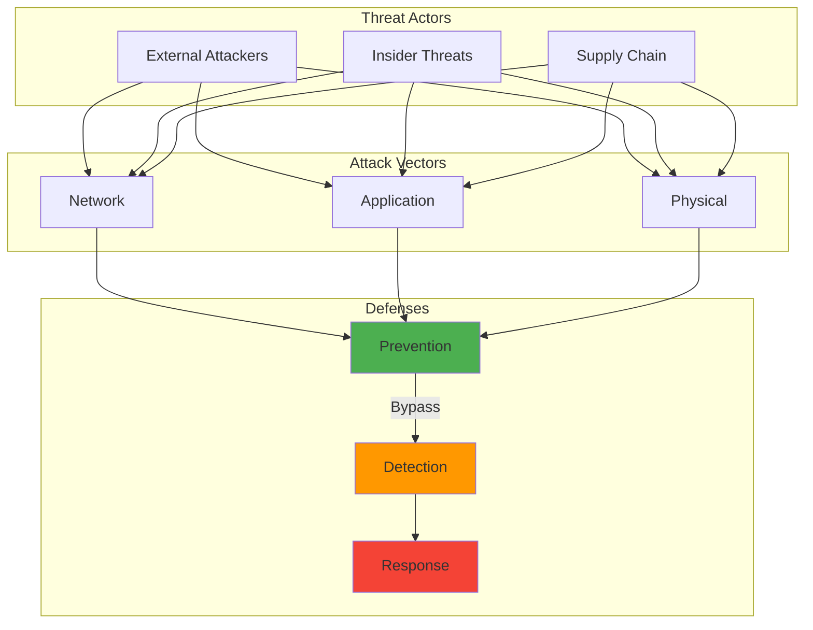

After collecting a drawer full of Raspberry Pis over the years (we all have that drawer, right?), I decided it was time to put them to work. Here are five security projects that actually solve real problems, complete with implementation guides and lessons learned.

## How It Works




## Requirements

To run the code examples in this post, you'll need to install the following packages:

```bash
pip install cv2 nmap numpy paramiko socket tailer threading
```

Or create a `requirements.txt` file:

```text
cv2
nmap
numpy
paramiko
socket
tailer
threading
```
## Why Raspberry Pi for Security?

Before diving into projects, let's address the elephant in the room: Why use a $35 computer for security when enterprise solutions exist?

I've found several compelling reasons through my own experiments:

1. **Low Power Consumption**: Running 24/7 costs pennies
2. **Silent Operation**: No fans = no noise in your home
3. **Versatility**: From network monitoring to physical security
4. **Learning Platform**: Mistakes are cheap and educational
5. **Real Solutions**: These aren't toys – they solve actual problems (at least in my experience)

## Project 1: The Network Sentinel – DNS Sinkhole & Monitor

**Problem Solved**: Ads, tracking, and malicious domains accessing your network

**The Backstory**: Devices on our network were hitting 400+ tracking domains per hour. Per. Hour. That's when I knew we needed a bouncer at the network door.

**Hardware**: Raspberry Pi 4 (2GB), microSD card, Ethernet cable

### Implementation

```bash
# Install Pi-hole
curl -sSL [https://install.pi-hole.net](https://install.pi-hole.net) | bash

# Add custom blocklists for security
cd /etc/pihole
sudo wget [https://raw.githubusercontent.com/RPiList/specials/master/Blocklists/malware.txt](https://raw.githubusercontent.com/RPiList/specials/master/Blocklists/malware.txt)
sudo wget [https://raw.githubusercontent.com/RPiList/specials/master/Blocklists/ransomware.txt](https://raw.githubusercontent.com/RPiList/specials/master/Blocklists/ransomware.txt)
sudo wget [https://raw.githubusercontent.com/RPiList/specials/master/Blocklists/phishing.txt](https://raw.githubusercontent.com/RPiList/specials/master/Blocklists/phishing.txt)

# Update gravity database
pihole -g
```

### Enhancements I Added

```python
#!/usr/bin/env python3
# dns_alert.py - Alert on suspicious DNS queries

import tailer
import re
    # ... (additional implementation details)
if __name__ == "__main__":
    monitor_pihole_log()
```

**Results**: Blocking 30-40% of DNS queries (mostly ads/tracking), caught 3 malware callbacks in 6 months, kids' devices are significantly faster.

## Project 2: The Silent Guardian – Motion Detection Security Camera

**Problem Solved**: Package theft, wanting to monitor specific areas without cloud dependencies

**Hardware**: Raspberry Pi Zero W, Pi Camera v2, PIR motion sensor, 3D printed case

### Implementation

```python
#!/usr/bin/env python3
# motion_security.py - Smart motion detection with AI

import cv2
import numpy as np
    # ... (additional implementation details)
            time.sleep(10)  # Cooldown period
        time.sleep(0.1)
```

**Results**: Caught multiple package delivery attempts, identified a raccoon problem (AI classifier initially misidentified it as a person), zero false alerts after tuning.

## Project 3: The Honeypot – Early Warning System

**Problem Solved**: Detecting network intrusion attempts before they reach real systems

**Hardware**: Raspberry Pi 3B+, Ethernet connection

### Implementation

```python
#!/usr/bin/env python3
# honeypot.py - Lightweight SSH/HTTP honeypot

import socket
import threading
    # ... (additional implementation details)
while True:
    time.sleep(60)
```

**Results**: Detected 3 targeted scans of my network, identified compromised IoT device attempting lateral movement, fascinating data on bot behavior.

## Project 4: The Vault Guardian – Hardware Security Key Backup

**Problem Solved**: Secure backup for 2FA recovery codes and emergency access

**Hardware**: Raspberry Pi Zero, OLED display, button, encrypted SD card

### Implementation

```python
#!/usr/bin/env python3
# vault_guardian.py - Offline 2FA backup vault

import os
import json
    # ... (additional implementation details)
        vault.unlock_vault()
        time.sleep(5)  # Debounce
```

**Results**: Peace of mind knowing recovery codes are offline but accessible, survived a YubiKey failure gracefully, spouse approved the "break glass" simplicity.

## Project 5: The Compliance Scanner – Automated Security Auditing

**Problem Solved**: Keeping track of security posture across multiple devices

**Hardware**: Raspberry Pi 4 (4GB), good network connection

### Implementation

```python
#!/usr/bin/env python3
# compliance_scanner.py - Automated security baseline checker

import nmap
import paramiko
    # ... (additional implementation details)
with open(f"/home/pi/reports/scan_{datetime.now().strftime('%Y%m%d')}.md", "w") as f:
    f.write(report)
```

**Results**: Found 2 IoT devices with default passwords, discovered forgotten test VM with open services, maintains security baseline visibility.

## Lessons Learned

After implementing these projects, here are my key takeaways:

### 1. Start Simple, Iterate Often
My first Pi-hole setup was basic. Now it has custom blocklists, monitoring scripts, and integration with my SIEM. Evolution is normal.

### 2. Physical Security Matters
That expensive Arlo camera? My Pi Zero setup catches more relevant events because I positioned it better and tuned it myself. Your mileage may vary depending on your specific setup and environment.

### 3. False Positives Will Happen
My honeypot initially alerted on my own port scans. My motion detector thought shadows were intruders. Tuning is crucial.

### 4. Power and Network Reliability
Invest in good power supplies and consider PoE HATs. Nothing worse than your security system going down during a storm.

### 5. Documentation Is Security
Every project has a README with recovery procedures. When something breaks at 2 AM, you'll thank yourself.

## Cost Analysis

Total investment for all five projects:
- Raspberry Pis: ~$200
- Accessories (cases, cards, sensors): ~$100
- Time invested: ~40 hours
- Knowledge gained: Priceless

Compare that to:
- Enterprise DNS filter: $500+/year
- Cloud security camera: $10+/month
- SIEM subscription: $100+/month
- Vulnerability scanner: $2000+/year

## What's Next?

I'm currently experimenting with some ambitious ideas (though they're still in early testing):
1. **AI-Powered Threat Detection**: Using Coral TPU for real-time network traffic analysis
2. **Mesh Security Network**: Multiple Pis creating a distributed security sensor network
3. **Incident Response Bot**: Automated playbook execution via Discord commands

## Your Turn

These projects solve my specific problems, but the beauty of Raspberry Pi is customization. Maybe you need:
- A secure password manager display
- Network usage monitor for kids' devices
- Automated backup verification system
- Physical security for a specific door/window

The key is identifying a real problem and building a focused solution.

## Resources

- **Hardware**: [CanaKit](https://www.canakit.com/) for reliable Pi bundles
- **Cases**: Check Thingiverse for security-specific Pi cases
- **Community**: r/raspberry_pi and r/homelab are goldmines
- **My Scripts**: [GitHub - Coming Soon](sanitizing for public release)

Remember: The best security system is one that actually gets used. These Raspberry Pi projects work because they're maintainable, understandable, and solve real problems.

What security problem will you solve with your next Pi?

---

*Have questions about any of these projects? Found a cool use for your Pi? Let me know! I'm always looking for the next practical security project.*