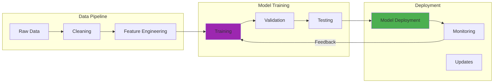

## The AI Revolution Hits Home

Like many tech enthusiasts, I've been experimenting with AI and Large Language Models (LLMs) in my homelab. But as a security professional and a parent, I quickly realized that running AI experiments at home comes with unique security and privacy challenges. I started with Llama 3.1 70B in April 2024, running on my RTX 3090 with 24GB VRAM, barely enough for inference at 4-bit quantization.

This post shares practical approaches to securing your personal AI/ML experiments, learned through both successes and (carefully contained) failures.


## Requirements

To run the code examples in this post, you'll need to install the following packages:

```bash
pip install GPUtil cryptography hashlib keyring logging psutil torch
```

Or create a `requirements.txt` file:

```text
GPUtil
cryptography
hashlib
keyring
logging
psutil
torch
```
## How It Works



## Why Security Matters for Personal AI Projects

Before diving into the technical details, let's address why this matters:

1. **Data Privacy**: AI models can memorize training data, including personal information
2. **Resource Hijacking**: ML workloads are attractive targets for cryptominers
3. **Model Poisoning**: Compromised models can generate harmful content
4. **Network Security**: AI experiments often require internet connectivity
5. **Family Safety**: When kids use AI tools, additional safeguards are essential

## Setting Up a Secure AI Sandbox

### Isolated Environment is Key

My first rule: AI experiments run in isolation. Here's my setup (though I'll admit this approach adds operational complexity, and you're trading convenience for security):

```python
# Docker Compose for isolated AI environment

services:
  ai-sandbox:
    image: pytorch/pytorch:latest
    # ... (additional implementation details)
    driver: bridge
    internal: true  # No external network access
```

### Network Segmentation for AI Workloads

AI experiments get their own VLAN with strict firewall rules:

```bash
# Dream Machine Professional firewall rules for AI VLAN
- Allow: AI VLAN -> Internal model repository
- Allow: AI VLAN -> Specific whitelisted APIs (OpenAI, Hugging Face)
- Block: AI VLAN -> Home network
- Block: AI VLAN -> Management network
- Log: All AI VLAN traffic for monitoring
```

## Securing Local LLM Deployments

Running LLMs locally (like LLaMA or Mistral) requires special consideration:

### Safe Model Loading

```python
import torch
import hashlib
from pathlib import Path

class SecureModelLoader:
    # ... (additional implementation details)
        # Add more sanitization as needed
        return sanitized
```

### Prompt Injection Protection

When building AI applications, protecting against prompt injection is crucial:

```python
class PromptSecurityFilter:
    def __init__(self):
        self.blocked_patterns = [
            r"ignore previous instructions",
            r"disregard all prior",
    # ... (additional implementation details)
        
        return sanitized
```

## Monitoring AI Resource Usage

AI workloads can consume significant resources. Here's how I monitor them:

```python
import psutil
import GPUtil
import logging
from datetime import datetime

    # ... (additional implementation details)
        
        return suspicious_processes
```

## Data Privacy in AI Experiments

### Preventing Data Leakage

When experimenting with AI, especially when using family photos or documents:

```python
class PrivacyPreservingAI:
    def __init__(self):
        self.pii_patterns = {
            'email': r'\b[A-Za-z0-9._%+-]+@[A-Za-z0-9.-]+\.[A-Z|a-z]{2,}\b',
            'phone': r'\b\d{3}[-.]?\d{3}[-.]?\d{4}\b',
    # ... (additional implementation details)
        
        return processed_data
```

### Secure API Key Management

For cloud AI services, proper API key management is essential:

```python
import os
from cryptography.fernet import Fernet
import keyring

class SecureAPIManager:
    # ... (additional implementation details)
        # Implementation for key rotation
        pass
```

## Family-Safe AI Guidelines

When kids want to experiment with AI, additional safeguards are needed:

### Content Filtering for AI Outputs

```python
class FamilySafeAI:
    def __init__(self):
        self.load_safety_filters()
    
    def is_appropriate_for_kids(self, text):
    # ... (additional implementation details)
        
        return safe_generate
```

## Lessons Learned

### 1. Start Small and Isolated
Begin with small experiments in completely isolated environments. Scale up only after understanding the security implications. That said, perfect isolation isn't always practical. I've had to make compromises when connectivity was needed for model downloads or API calls.

### 2. Monitor Everything
AI workloads can behave unexpectedly. Comprehensive monitoring helps catch issues early, though distinguishing between legitimate spikes and actual problems is probably more art than science.

### 3. Version Control for Models
Track model versions and their sources. Know exactly what you're running.

### 4. Regular Security Audits
AI tools evolve rapidly. Regular security reviews are essential, though I'll be honest, I'm still figuring out the right cadence for these audits myself.

### 5. Educate Family Members
Help family understand AI privacy implications. My family now knows to ask before sharing personal info with any AI tool.

## Tools and Resources

Essential tools for secure AI experimentation:
- **Docker/Podman**: Container isolation
- **LocalAI**: Run LLMs locally
- **Ollama**: Easy local model management
- **MindsDB**: Secure AI database layer
- **Netdata**: Real-time performance monitoring

## Future Plans

My upcoming AI security projects:
- Federated learning setup for family devices
- Homomorphic encryption for sensitive data processing
- Local voice assistant with privacy guarantees
- AI-powered security monitoring for the homelab itself

## Conclusion

Running AI experiments at home can be done securely with the right safeguards. With proper isolation, monitoring, and privacy controls, you can explore the frontiers of AI while keeping your family's data safe.

Remember: in the AI age, we're not just securing our networks and devices – we're securing our thoughts, conversations, and creative outputs. That's a responsibility worth taking seriously.

The best part? When properly secured, AI becomes a powerful tool for learning and creativity rather than a privacy risk.


## Further Reading

For more in-depth information on the topics covered in this post:

- [Papers with Code](https://paperswithcode.com/)
- [arXiv AI Research](https://arxiv.org/list/cs.AI/recent)
[NIST Cybersecurity Framework](https://www.nist.gov/cyberframework)

[OWASP Top 10](https://owasp.org/www-project-top-ten/)


---

*Building your own secure AI lab? Hit me up – I love exchanging ideas about making AI both powerful and privacy-preserving!*