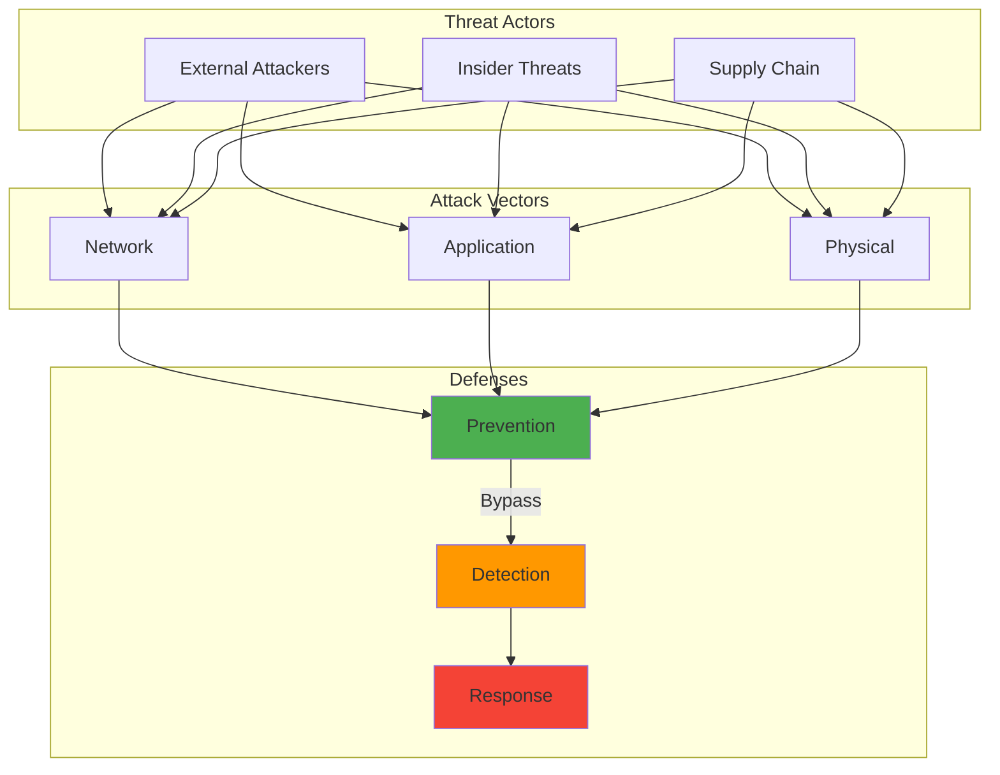

---

author: William Zujkowski
date: 2025-04-24
description: Build security-focused homelab with Proxmox, VLANs, and IDS/IPS—create testing environment for cybersecurity and family data protection.
images:
  hero:
    alt: 'Building a Security-Focused Homelab: My Journey - Hero Image'
    caption: 'Visual representation of Building a Security-Focused Homelab: My Journey'
    height: 630
    src: /assets/images/blog/hero/2025-04-24-building-secure-homelab-adventure-hero.jpg
    width: 1200
  inline: []
  og:
    alt: 'Building a Security-Focused Homelab: My Journey - Social Media Preview'
    src: /assets/images/blog/hero/2025-04-24-building-secure-homelab-adventure-og.jpg
title: 'Building a Security-Focused Homelab: My Journey'
tags:
  - homelab
  - learning
  - networking
  - security

---
## Why Every Security Professional Needs a Homelab

As a security engineer and a dad, I wear two hats: protecting enterprise systems by day and keeping my family's digital life secure by night. Building a homelab has been one of the most rewarding projects I've undertaken.

It serves as both a learning playground and a practical security solution for my home.

## How It Works



## The Journey Begins

It started simply enough – I wanted to understand how enterprise security tools actually worked without the constraints of production environments. But as any homelab enthusiast will tell you, it quickly evolved into something much more.

My initial goals were:
- Learn security tools hands-on without breaking anything important
- Protect my family's devices from increasing cyber threats
- Have a safe environment to test new technologies
- Build something interesting to show my family

## The Architecture

### Network Segmentation is Key

The foundation of my homelab is proper network segmentation. I run five VLANs:

```
VLAN 10: Management Network (Infrastructure only)
VLAN 20: Trusted Devices (Family computers, phones)
VLAN 30: IoT Devices (Smart home gadgets)
VLAN 40: Guest Network (Visitors)
VLAN 50: Security Lab (Where the magic/chaos happens)
```

Each VLAN has specific firewall rules. The IoT network, for example, can't initiate connections to other VLANs – because why does my smart toaster need to talk to my NAS? For a complete guide on [implementing zero trust microsegmentation with VLANs](/posts/2025-09-08-zero-trust-vlan-segmentation-homelab), I've documented the exact firewall rules and segmentation strategy I use.

### The Hardware Stack

I believe in starting small and growing organically. My current setup:

- **Firewall**: Dream Machine Professional on a Protectli Vault (4-port appliance)
- **Virtualization**: Proxmox cluster (3 nodes with old enterprise gear from eBay)
- **Storage**: TrueNAS with ZFS for that sweet, sweet data integrity
- **Monitoring**: Raspberry Pi cluster running various sensors

Pro tip: Enterprise gear on eBay is incredibly affordable. My entire virtualization cluster cost less than a decent gaming PC.

## Security Stack Implementation

### SIEM and Log Analysis

I run Wazuh as my SIEM, ingesting logs from:
- All network devices
- Family computers (with their permission, of course)
- Smart home devices (the chattier, the better)
- Web applications I'm testing

The dashboard is mounted on an old tablet in my office. My family now knows that when Dad stares at the "colorful graphs," someone's probably trying to hack our WiFi.

Understanding the fundamentals helped tremendously – [see my guide to cryptography fundamentals](/posts/2024-01-18-demystifying-cryptography-beginners-guide) for the background on how these security tools actually work under the hood.

### Intrusion Detection

Suricata IDS on Dream Machine Professional monitors all traffic between VLANs. I've tuned it to alert on:
- Known malware signatures
- Suspicious DNS queries
- Unusual data exfiltration patterns
- That one IoT device that keeps trying to phone home to sketchy servers

For deeper insights into [building a network traffic analysis lab with Suricata](/posts/2025-08-25-network-traffic-analysis-suricata-homelab), I've documented the complete setup process including rule tuning and alert optimization.

### Vulnerability Management

Weekly automated scans using OpenVAS keep me informed about:
- Unpatched systems (looking at you, smart TV)
- Weak configurations
- Services that shouldn't be exposed

## Real-World Wins

This isn't just academic – my homelab has caught real threats:

1. **The Compromised IoT Device**: My security camera tried establishing a connection to a known C2 server. Caught, isolated, and firmware updated.

2. **The Malicious Ad**: Kids clicked on a sketchy Minecraft mod site. DNS sinkhole blocked the malware download, and I got an alert within seconds.

3. **The Neighbor's Crypto Miner**: Guest network user (neighbor's kid) had a crypto miner on their laptop. Detected by unusual CPU patterns and blocked.

## Lessons Learned

### Start Small
Don't try to build everything at once. I started with just Dream Machine Professional and one old server. The complexity grew with my knowledge.

### Document Everything
Future you will thank present you. I maintain a private wiki with:
- Network diagrams
- Configuration notes
- Troubleshooting steps
- "Why did I do this?" explanations

### Make It Family-Friendly
Security shouldn't make life harder for your family. I've implemented:
- Self-service password reset portal
- Guest network QR codes
- "Dad's Lab Status" dashboard (green = good, red = Dad's fixing something)

### Automate Ruthlessly
If you're doing it twice, script it. My automation includes:
- Daily backup verification
- Security patch notifications
- Threat intelligence feed updates
- Coffee maker activation (critical infrastructure)

## Current Projects

The lab is never "done." Current experiments include:

- **Deception Technology**: Honeypots throughout the network to catch lateral movement
- **AI-Powered Anomaly Detection**: Training models on my network's "normal" behavior
- **Zero Trust Implementation**: Because assuming my smart lightbulbs are trustworthy seems naive
- **Incident Response Automation**: Building playbooks for common scenarios
- **IoT Security Hardening**: After [lessons from OWASP IoTGoat on IoT security](/posts/2025-09-20-iot-security-homelab-owasp), I'm rearchitecting how I isolate and monitor smart home devices

## The Unexpected Benefits

Beyond the technical learning, this project has:
- Given me stories that make sense to non-technical family ("Remember when I caught that virus before it infected your laptop?")
- Provided hands-on experience with enterprise tools
- Created a safe space for spectacular failures (yes, I've locked myself out multiple times)
- Created opportunities to discuss technology and security at home

## Resources for Getting Started

If you're thinking about building your own security homelab:

1. **Start with networking**: Understanding VLANs and firewall rules is foundational
2. **Learn one tool deeply**: Better to master Dream Machine Professional than to half-learn five firewalls
3. **Join the community**: r/homelab and r/homenetworking are goldmines
4. **Budget wisely**: Used enterprise gear > new consumer gear
5. **Have fun**: If it feels like work, you're doing it wrong

## Final Thoughts

Building a security-focused homelab has made me a better security professional and a better protector of my family's digital life. It's where theory meets practice, where failures are learning opportunities, and where that old server in your closet becomes a powerful learning platform.

Plus, there's something deeply satisfying about catching malware while sitting on your couch, knowing your defenses worked exactly as designed.

What's in your homelab? I'd love to hear about your setup and exchange ideas!

---

*Next up: "Raspberry Pi Security Projects That Actually Solve Problems" – where I'll share practical Pi projects that enhance home security.*