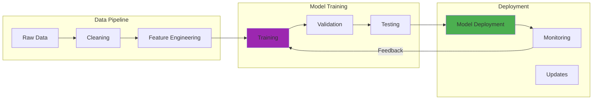

Large language models have transformed how we interact with AI — but fine-tuning them for specific tasks has traditionally required enterprise-scale infrastructure. Recent advances in parameter-efficient fine-tuning methods have changed this paradigm completely.

Parameter-efficient fine-tuning (PEFT) techniques like LoRA (Low-Rank Adaptation) and QLoRA (Quantized LoRA) enable training powerful models on consumer hardware. These methods dramatically reduce memory requirements while maintaining quality — making sophisticated AI customization accessible to individual developers.

## How It Works

## Understanding Parameter-Efficient Fine-Tuning

Traditional fine-tuning updates all model parameters during training. For large models with billions of parameters, this requires enormous computational resources. PEFT methods achieve comparable results while training only a small fraction of parameters.

### LoRA: Low-Rank Adaptation

LoRA introduces trainable rank decomposition matrices into transformer layers while keeping the original model weights frozen. Instead of updating billions of parameters, you train small adapter matrices that capture task-specific knowledge.

The key insight is that adaptation typically operates in a low-dimensional subspace. LoRA exploits this by decomposing weight updates into low-rank matrices, dramatically reducing trainable parameters.

### QLoRA: Quantized LoRA

QLoRA extends LoRA by quantizing the base model to 4-bit precision, further reducing memory requirements. This enables fine-tuning of 70B parameter models on consumer GPUs with 24GB VRAM — something previously impossible.

The quantization is carefully designed to preserve model quality while achieving massive memory savings. Combined with LoRA adapters, this approach makes large model fine-tuning remarkably accessible.

## Hardware Requirements and Considerations

Fine-tuning LLMs on consumer hardware requires careful consideration of GPU capabilities, VRAM capacity, and thermal management.

### GPU Requirements

Modern NVIDIA GPUs with Ampere or newer architectures work well for fine-tuning. Key specifications to consider:

- **VRAM Capacity**: Determines maximum model size you can train
- **Compute Capability**: Affects training speed and efficiency
- **Thermal Design**: Impacts sustained performance during long training runs
- **Power Consumption**: Factor in electricity costs for multi-hour training

### Memory Optimization Strategies

Several techniques help maximize effective VRAM utilization:

**Gradient Checkpointing**: Trades computation for memory by recomputing activations during backward pass rather than storing them. Increases training time but significantly reduces memory footprint.

**Mixed Precision Training**: Uses FP16 or BF16 for most operations while maintaining FP32 precision where needed. Reduces memory usage and accelerates training on modern GPUs.

**Gradient Accumulation**: Processes smaller batches and accumulates gradients over multiple steps before updating weights. Simulates larger effective batch sizes without requiring additional memory.

**Model Offloading**: Moves inactive parameters to CPU memory during training, bringing them back to GPU only when needed. Enables training larger models at the cost of slower training speed.

## Dataset Preparation and Quality

The quality of your fine-tuning dataset directly determines the quality of your fine-tuned model. Garbage in, garbage out applies strongly to LLM fine-tuning.

### Dataset Size Considerations

How much data do you actually need? The answer depends on your task complexity and desired quality.

For simple task adaptation, even small datasets (100-1000 examples) can produce meaningful improvements. For more complex domain adaptation or behavior modification, larger datasets (10,000+ examples) typically yield better results.

Quality matters more than quantity. A carefully curated dataset of 500 high-quality examples often outperforms a noisy dataset of 5,000 mediocre examples.

### Data Format and Structure

Most fine-tuning frameworks expect data in specific formats. Common patterns include:

**Instruction Format**: Pairs of instructions and responses, teaching the model to follow specific patterns. This format works well for task-specific adaptation.

**Conversational Format**: Multi-turn dialogues that capture context and back-and-forth interaction patterns. Useful for building conversational agents.

**Completion Format**: Prompts with expected completions, the simplest format for many tasks.

### Data Cleaning and Validation

Thorough data cleaning prevents training on problematic examples that could degrade model quality.

Remove duplicate examples, fix formatting inconsistencies, and validate that examples match your desired output format. Check for biased or problematic content that you don't want the model to learn.

Split your data into training and validation sets. Monitor validation metrics during training to detect overfitting early.

## Training Process and Hyperparameters

Successful fine-tuning requires careful configuration of training parameters and monitoring of training dynamics.

### Critical Hyperparameters

Several hyperparameters significantly impact fine-tuning quality and efficiency:

**Learning Rate**: Perhaps the most critical parameter. Too high causes instability and quality degradation. Too low results in slow convergence and potential underfitting. Typical range for LoRA fine-tuning: 1e-4 to 1e-5.

**Rank (r)**: For LoRA, determines the dimensionality of adapter matrices. Higher rank captures more information but increases trainable parameters and memory usage. Common values: 8, 16, 32.

**Alpha**: LoRA scaling factor that controls the magnitude of adapter updates. Typically set to rank value or 2x rank.

**Batch Size**: Affects training stability and speed. Larger batches generally train faster but require more memory. Use gradient accumulation to simulate larger batches on limited hardware.

**Training Epochs**: Number of complete passes through the dataset. Monitor validation metrics to determine optimal stopping point and avoid overfitting.

### Training Monitoring

Track these metrics during training to assess progress and detect issues:

**Training Loss**: Should decrease steadily. Erratic behavior suggests learning rate is too high or data has quality issues.

**Validation Loss**: Provides early warning of overfitting if it starts increasing while training loss continues decreasing.

**GPU Metrics**: Monitor temperature, power consumption, and memory usage. Thermal throttling can significantly impact training time.

**Throughput**: Tokens per second or batches per second indicates training efficiency. Useful for estimating total training time.

## Practical Challenges and Solutions

Fine-tuning LLMs presents several practical challenges that require specific strategies to overcome.

### Overfitting

Overfitting occurs when the model memorizes training data rather than learning generalizable patterns. This is particularly common with small datasets.

**Prevention Strategies**:
- Use larger, more diverse datasets when possible
- Reduce number of training epochs
- Apply dropout or weight decay regularization
- Monitor validation metrics closely and stop training early if validation loss increases

### Catastrophic Forgetting

Fine-tuning on narrow tasks can cause models to lose capabilities they had before training. The model "forgets" general knowledge while adapting to specific tasks.

**Mitigation Approaches**:
- Include diverse examples that exercise general capabilities
- Use lower learning rates to make smaller updates
- Fine-tune for fewer epochs
- Consider instruction tuning on broader task sets

### Training Instability

Training can sometimes become unstable, with loss diverging or exhibiting erratic behavior.

**Stabilization Techniques**:
- Reduce learning rate
- Use gradient clipping to prevent extreme updates
- Check data quality — corrupted examples can cause instability
- Ensure balanced dataset with consistent formatting

### Resource Constraints

Consumer hardware has limitations that require creative solutions.

**Optimization Strategies**:
- Use quantization (QLoRA) for larger models
- Enable gradient checkpointing to reduce memory usage
- Reduce batch size and use gradient accumulation
- Consider training on smaller model variants and scaling up later

## Evaluation and Quality Assessment

After fine-tuning, rigorous evaluation determines whether the model meets your quality requirements and deployment criteria.

### Automated Metrics

Quantitative metrics provide objective assessment of model performance:

**Perplexity**: Measures how well the model predicts validation data. Lower perplexity generally indicates better performance, though the absolute value depends on your domain.

**Task-Specific Metrics**: Accuracy, F1 score, BLEU, or other metrics appropriate for your specific task. These provide more meaningful assessment than generic metrics.

### Human Evaluation

Automated metrics don't capture all aspects of model quality. Human evaluation remains essential for assessing:

- Response relevance and helpfulness
- Factual accuracy and hallucination detection
- Tone and style appropriateness
- Edge case handling and failure modes

Create a diverse test set covering various scenarios and edge cases. Have evaluators rate responses on multiple dimensions using consistent rubrics.

### A/B Testing

For production deployment, A/B testing compares the fine-tuned model against baselines using real-world traffic. This provides the most reliable signal about whether fine-tuning improved performance for actual users.

## Deployment Considerations

Successfully deploying fine-tuned models requires attention to infrastructure, monitoring, and ongoing maintenance.

### Model Artifacts and Management

Organize and version fine-tuned models systematically:

- Save LoRA adapters separately from base models for efficient storage
- Track training hyperparameters, dataset versions, and evaluation metrics
- Use model registries to manage multiple versions and facilitate rollback
- Document model capabilities, limitations, and intended use cases

### Inference Optimization

Fine-tuned models need efficient inference infrastructure:

**Quantization**: Apply post-training quantization for faster inference with minimal quality loss. Techniques like GPTQ or AWQ work well.

**Batching**: Group multiple requests together to maximize GPU utilization. Implement dynamic batching for variable-length inputs.

**Caching**: Cache common prompts or intermediate states to reduce redundant computation.

### Monitoring and Iteration

Deploy monitoring to track model performance in production:

- Log prediction latencies and throughput
- Sample and review model outputs periodically
- Collect user feedback on response quality
- Monitor for distribution shift or degraded performance
- Prepare for iterative improvement through additional fine-tuning rounds

## Advanced Techniques and Optimizations

Once comfortable with basic fine-tuning, several advanced techniques can further improve results or efficiency.

### Multi-Task Learning

Training on multiple related tasks simultaneously can improve generalization and reduce catastrophic forgetting. The model learns more robust representations by seeing diverse examples.

Construct datasets that include examples from various tasks with clear task indicators in the prompts. This enables a single model to handle multiple capabilities while maintaining general knowledge.

### Continual Learning

For applications requiring ongoing adaptation, continual learning techniques enable models to learn from new data without forgetting previous knowledge.

Strategies include:
- Rehearsal: Interleaving new data with examples from previous training
- Elastic Weight Consolidation: Protecting important parameters from large updates
- Progressive Neural Networks: Adding new capacity for new tasks

### Ensemble Methods

Combining multiple fine-tuned models can improve robustness and quality:

- Train multiple models with different random seeds
- Use different training data splits or augmentation strategies
- Ensemble predictions through voting or averaging
- Route queries to specialized models based on task type

## Common Mistakes to Avoid

Learn from common pitfalls to accelerate your fine-tuning success:

**Using Insufficient or Poor Quality Data**: Small or noisy datasets lead to poor results. Invest time in dataset curation and quality assessment.

**Not Monitoring Validation Metrics**: Training without validation monitoring makes it impossible to detect overfitting until deployment. Always reserve validation data and track validation loss.

**Inappropriate Learning Rates**: Learning rate has enormous impact. Start with conservative values and adjust based on training dynamics.

**Ignoring Base Model Capabilities**: Fine-tuning works best when building on capabilities the base model already has. Tasks requiring completely new knowledge may need different approaches.

**Skipping Systematic Evaluation**: Casual testing isn't enough. Create comprehensive evaluation sets covering diverse scenarios and edge cases.

## Future Directions

The field of efficient fine-tuning continues to evolve rapidly, with several promising directions:

**Mixture of Experts**: Training sparse models where only subsets of parameters activate for each input. This enables larger effective model capacity within memory constraints.

**Meta-Learning**: Models that learn how to fine-tune themselves more efficiently, reducing the data and compute required for task adaptation.

**Automated Hyperparameter Optimization**: Systems that automatically search for optimal fine-tuning configurations, removing tedious manual tuning.

**Few-Shot and Zero-Shot Adaptation**: Techniques that enable task adaptation with minimal or no training examples, using clever prompting strategies or model architectures.

## Conclusion

Fine-tuning large language models on consumer hardware has become remarkably accessible thanks to parameter-efficient techniques like LoRA and QLoRA. With careful attention to dataset quality, hyperparameter configuration, and training dynamics, individual developers can now customize powerful models for specific applications.

The key is understanding the trade-offs between model size, training time, quality, and resource constraints. Start with smaller models and simpler tasks to build intuition. Monitor training carefully and iterate based on evaluation results.

As these techniques continue improving, expect even larger models to become fine-tunable on consumer hardware. The democratization of LLM customization opens exciting possibilities for specialized applications and domain-specific AI systems.

---

### Further Reading:

- [LoRA: Low-Rank Adaptation of Large Language Models](https://arxiv.org/abs/2106.09685) - Original LoRA paper
- [QLoRA: Efficient Finetuning of Quantized LLMs](https://arxiv.org/abs/2305.14314) - QLoRA methodology
- [Hugging Face PEFT Library](https://github.com/huggingface/peft) - Implementation and examples
- [Parameter-Efficient Fine-Tuning Methods](https://huggingface.co/blog/peft) - Overview and comparison
