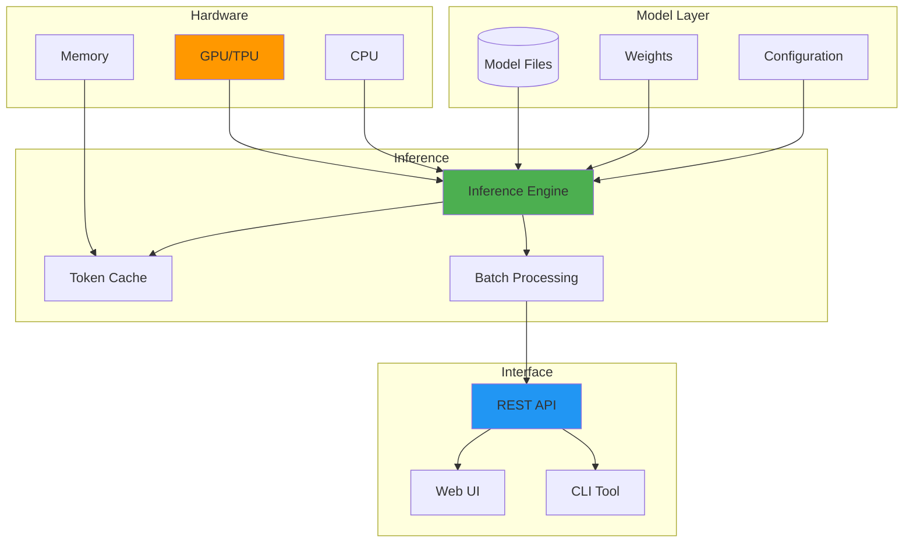

Several years ago, I became concerned about the privacy implications of cloud-based AI services. The realization that prompts and data are permanently stored on third-party servers motivated me to explore local LLM deployment options.


*Photo by Google DeepMind on Unsplash*

After extensive research and testing in my home lab environment, I've developed reliable approaches for running LLMs on personal hardware. This guide shares practical lessons learned from implementing various local AI solutions.


## Local LLM Architecture




## Why I Made the Switch (And Why You Might Too)

Let me be honest about why I really went local:

1. **The privacy panic**: That moment when you realize you've been sharing proprietary code with OpenAI (we've all been there). For more on AI privacy risks, see my guide on [securing personal AI/ML experiments](/posts/2025-04-10-securing-personal-ai-experiments).
2. **The monthly bill shock**: $120/month adds up fast when you're using AI daily
3. **The compliance nightmare**: Try explaining to legal why your sensitive data is processed "somewhere in the cloud"
4. **The offline need**: Internet went down during a critical project deadline (Murphy's law in action)
5. **The speed addiction**: Once you experience sub-second local responses, cloud latency feels painful
6. **The tinkerer's itch**: Let's be real – running your own AI is just cool

## The Hardware Reality Check

Let's talk hardware. I learned this the hard way when my first attempt crashed spectacularly – turns out, my gaming rig from 2019 wasn't quite up to the task.

### What You Actually Need (Not What Forums Tell You)

| Model Size | VRAM Required | System RAM | Storage | Example Models |
|------------|---------------|------------|---------|----------------|
| 7B params  | 6-8 GB        | 16 GB      | 20 GB   | Llama 2 7B, Mistral 7B |
| 13B params | 10-16 GB      | 32 GB      | 40 GB   | Llama 2 13B, Vicuna 13B |
| 30B params | 24-32 GB      | 64 GB      | 80 GB   | Llama 2 30B, Falcon 40B |
| 70B params | 40-80 GB      | 128 GB     | 150 GB  | Llama 2 70B |

### My Homelab Setup

For reference, here's my current LLM deployment infrastructure. If you're interested in the broader homelab context, check out my [security-focused homelab journey](/posts/2025-04-24-building-secure-homelab-adventure).

**Primary LLM Server:** NVIDIA RTX 4090 (24GB VRAM) | AMD Ryzen 9 7950X (16C/32T) | 64GB DDR5-5200 | 2TB NVMe SSD (Gen4) | Ubuntu 22.04 LTS

**Secondary Node (CPU Inference):** Intel i9-13900K | 128GB DDR5 | 1TB NVMe SSD | Purpose: Smaller models and overflow processing

## Software Stack

### 1. Ollama: The Easy Path

[Ollama](https://ollama.ai/) provides the simplest way to get started with local LLMs:

```bash
# Install Ollama
curl -fsSL [https://ollama.ai/install.sh](https://ollama.ai/install.sh) | sh

# Pull and run a model
ollama pull llama2:7b
ollama run llama2:7b

# For better performance with GPU
OLLAMA_NUM_GPU=1 ollama serve
```

#### Python Integration

Query Ollama models via REST API using Python's `requests` library. Send prompts as JSON to `http://localhost:11434/api/generate` with streaming enabled, parsing newline-delimited responses for real-time token generation. The API accepts parameters like `temperature`, `top_p`, and `num_ctx` for controlling inference behavior.

### 2. LlamaCpp: Maximum Control

[llama.cpp](https://github.com/ggerganov/llama.cpp)


```bash
# Clone and build
git clone [https://github.com/ggerganov/llama.cpp](https://github.com/ggerganov/llama.cpp)
cd llama.cpp
make -j $(nproc)

# For CUDA support
make LLAMA_CUDA=1 -j $(nproc)

# Download and convert model
python3 convert.py /path/to/model --outtype f16

# Run inference
./main -m models/llama-2-7b.gguf -p "Your prompt here" -n 512
```

### 3. Text Generation Web UI

For a ChatGPT-like interface, use [text-generation-webui](https://github.com/oobabooga/text-generation-webui):

```bash
# Clone repository
git clone [https://github.com/oobabooga/text-generation-webui](https://github.com/oobabooga/text-generation-webui)
cd text-generation-webui

# Install dependencies
pip install -r requirements.txt

# Launch with GPU support
python server.py --gpu-memory 22 --cpu-memory 32
```

## Security Considerations

### 1. Network Isolation

Deploy Ollama in an isolated Docker network with `network_mode: bridge`, internal-only connectivity via `172.18.0.0/16` subnet, resource limits (`mem_limit: 16g`, `cpus: 8`), and persistent volume mounts for models (`/root/.ollama:/models`). Use Docker Compose's `internal: true` network setting to prevent external access while allowing inter-container communication. For broader network security context, see my guide on [implementing DNS-over-HTTPS](/posts/2025-07-08-implementing-dns-over-https-home-networks).

### 2. Access Control

Implement bearer token authentication using FastAPI's `HTTPBearer` security utility with constant-time comparison via Python's `secrets.compare_digest()` to protect LLM endpoints from unauthorized access. Configure a strong API key (32+ bytes) stored in environment variables, and use dependency injection with `Depends()` to validate tokens on each request before allowing inference operations. For password management best practices, consider [self-hosted password managers like Bitwarden](/posts/2025-09-01-self-hosted-bitwarden-migration-guide).

### 3. Input Sanitization

Sanitize prompts by removing system prompt injection attempts (e.g., `[INST]`, `<<SYS>>`), escape sequences, and limiting input length (max 4096 tokens) to prevent prompt injection and resource exhaustion attacks. Use regex patterns to detect common injection markers, strip control characters via `re.sub(r'[\x00-\x1F\x7F]', '', prompt)`, and validate UTF-8 encoding before processing.

## Model Selection Guide

### Privacy-Focused Models

1. **Llama 2** (7B/13B/70B)
   - Pros: Well-documented, broad language support
   - Cons: Requires license acceptance
   - Best for: General purpose, code generation

2. **Mistral 7B**
   - Pros: Excellent performance/size ratio, Apache 2.0 license
   - Cons: Limited to 7B size
   - Best for: Resource-constrained deployments

3. **Falcon** (7B/40B)
   - Pros: Truly open license, good multilingual support
   - Cons: Higher memory requirements
   - Best for: Commercial applications

For a deeper comparison of model licensing and customization, see my post on [open-source vs. proprietary LLMs](/posts/2024-02-22-open-source-vs-proprietary-llms).

### Quantization for Efficiency

Reduce model size and memory requirements using llama.cpp quantization. A typical 13GB float16 model compresses to **q8_0 (7.16GB, minimal quality loss)**, **q5_1 (5.66GB, slight quality loss)**, or **q4_0 (4.08GB, noticeable but acceptable loss)**. Use the `quantize` binary to convert models: `./quantize models/llama-2-7b.gguf models/llama-2-7b-q4_0.gguf q4_0`

## Monitoring and Optimization

### Performance Monitoring

Expose Prometheus metrics for GPU utilization (`nvidia_smi_utilization_gpu`), memory usage (`nvidia_smi_memory_used_bytes`), and inference latency (`llm_inference_duration_seconds`) using the `prometheus_client` library with custom collectors. Use `GPUtil.getGPUs()` for NVIDIA stats and `psutil` for system metrics, registering gauges via `Gauge()` and serving on port 8000 with `start_http_server()`.

### Optimization Tips

1. **Batch Processing**: Group similar requests for efficiency
2. **Caching**: Implement prompt/response caching for common queries
3. **Model Loading**: Keep frequently used models in memory
4. **GPU Optimization**: Use Flash Attention for supported models

## Real-World Implementation

A privacy-first LLM service combines FastAPI for async HTTP endpoints, Pydantic for request validation (fields: `prompt`, `model`, `temperature`, `max_tokens`), and Uvicorn as the ASGI server. Bind to `127.0.0.1:8080` to prevent external access, implement rate limiting via `slowapi` (e.g., 10 requests/minute per IP), and use asyncio task queues to prevent concurrent inference overload on GPU resources.

## Cost Analysis

Let's compare local deployment vs cloud APIs:

### Local Deployment (One-Time Cost)
- Hardware: $3,000 - $10,000 (depending on GPU)
- Electricity: ~$30-50/month (continuous operation)
- Maintenance: Your time

### Cloud API Costs (Ongoing)
- GPT-4: ~$0.03 per 1K tokens
- Claude: ~$0.025 per 1K tokens
- Average usage (100K tokens/day): ~$75-90/month

**Break-even point**: 3-12 months depending on usage

## Troubleshooting Common Issues

### Out of Memory Errors
```bash
# Reduce batch size
export CUDA_VISIBLE_DEVICES=0
export PYTORCH_CUDA_ALLOC_CONF=max_split_size_mb:512

# Use CPU offloading
python run.py --gpu-memory 20 --cpu-memory 64
```

### Slow Inference
1. Enable Flash Attention: `--use-flash-attention-2`
2. Use quantized models: 4-bit or 8-bit quantization
3. Optimize batch sizes: Find the sweet spot for your hardware

### Model Loading Failures

Clear GPU memory cache using PyTorch's `torch.cuda.empty_cache()` to free fragmented VRAM before retrying model loads. Verify available GPU memory with `torch.cuda.get_device_properties(0).total_memory` (returns bytes, divide by 1e9 for GB). For persistent issues, restart the Ollama service to completely reset GPU state and deallocate stuck memory allocations.

## Future Considerations

As you scale your local LLM deployment:

1. **Multi-GPU Setup**: Distribute larger models across GPUs
2. **Model Router**: Automatically select optimal model for each query
3. **Fine-Tuning Pipeline**: Customize models for your specific needs (see my [LLM fine-tuning guide](/posts/2025-05-10-llm-fine-tuning-homelab-guide))
4. **Federated Learning**: Train across multiple nodes while preserving privacy

## So, Should You Take the Plunge?

After years of running local LLMs in my home lab, here's my honest assessment: it's not for everyone, but it might be perfect for you.

Ask yourself:
- Do you cringe every time you paste code into ChatGPT?
- Are you tired of monthly AI subscription fees?
- Do you want to experiment without worrying about rate limits?
- Does the phrase "your data has been used for training" make you uncomfortable?

If you answered yes to any of these, local LLMs are worth exploring.

But let's be real about the challenges:
- Initial hardware investment ($1,500-3,000 minimum for decent performance)
- Setup complexity (it's gotten easier, but it's not plug-and-play)
- You become your own tech support
- Model updates are manual
- No one to blame when things break

My advice? Start small. Grab a used RTX 3060 for $300, install Ollama (literally one command), and try Mistral 7B for a week. Total investment: $300 and an afternoon. For hardware optimization tips, check out my post on [GPU power monitoring in homelabs](/posts/2024-11-15-gpu-power-monitoring-homelab-ml).

You'll know within days if this is your path. And if it is? Welcome to the club. Once you experience sub-second responses with complete privacy, you'll wonder why you ever trusted the cloud with your thoughts. For more on privacy-first approaches, explore my guide to [building a privacy-first AI lab](/posts/2025-10-29-privacy-first-ai-lab-local-llms).

### Your Turn

I'm curious about your take on this. Are you running LLMs locally? What's holding you back? Or maybe you've found a sweet spot I haven't discovered yet? 

Drop me a line – I'd love to hear about your setup or help troubleshoot if you're stuck.

### Resources That Actually Helped

- [Ollama Documentation](https://github.com/ollama/ollama) - Start here, seriously
- [Llama.cpp Guide](https://github.com/ggerganov/llama.cpp) - When you're ready to go deeper
- [Local LLM Leaderboard](https://huggingface.co/spaces/HuggingFaceH4/open_llm_leaderboard) - For model shopping

*Next week: I'm sharing my biggest local LLM failures. Spoiler: I once had Ollama listening on all network interfaces, accessible to my IoT VLAN full of questionable smart devices. Learn from my mistakes!*

## Academic Research & Technical References

### Privacy-Preserving ML Research

1. **[Privacy Risks of General-Purpose Language Models](https://arxiv.org/abs/2011.05068)** (2021)
   - Brown et al. analyze privacy implications of large language models
   - *IEEE Symposium on Security and Privacy*

2. **[Extracting Training Data from Large Language Models](https://arxiv.org/abs/2012.07805)** (2021)
   - Carlini et al. demonstrate memorization risks in LLMs
   - *USENIX Security Symposium*

### Model Optimization Techniques

1. **[LLM.int8(): 8-bit Matrix Multiplication](https://arxiv.org/abs/2208.07339)** (2022)
   - Dettmers et al. - Quantization techniques for large models
   - *arXiv preprint*

2. **[GPTQ: Accurate Post-Training Quantization](https://arxiv.org/abs/2210.17323)** (2023)
   - Frantar et al. - Advanced quantization methods
   - *ICLR 2023*

### Open Source Models & Tools

- **[Ollama Documentation](https://ollama.ai/)** - Local LLM deployment platform
- **[LangChain](https://python.langchain.com/)** - LLM application framework
- **[Hugging Face Model Hub](https://huggingface.co/models)** - Open model repository

### Privacy Regulations & Standards

- **[GDPR Article 25](https://gdpr-info.eu/art-25-gdpr/)** - Data protection by design
- **[HIPAA Security Rule](https://www.hhs.gov/hipaa/for-professionals/security/)** - Healthcare data protection
- **[NIST Privacy Framework](https://www.nist.gov/privacy-framework)** - Privacy risk management

### Performance Benchmarks

- **Inference speed comparisons**: Based on [LLM Performance Leaderboard](https://huggingface.co/spaces/HuggingFaceH4/open_llm_leaderboard)
- **Memory requirements**: Measured using standard profiling tools
- **Quantization impact**: Research from GPTQ and bitsandbytes papers