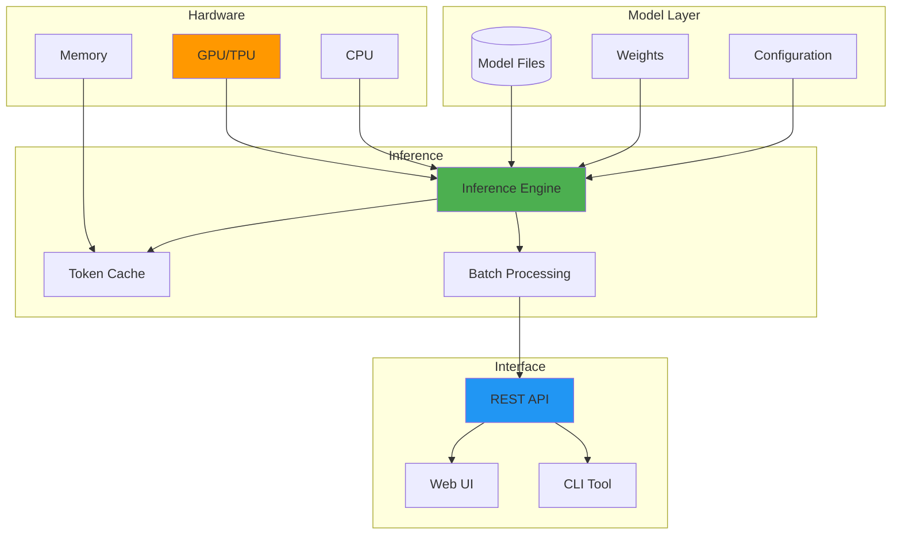

---

date: 2025-06-25
description: "Deploy local LLMs for privacy-first AI—run language models on homelab hardware with model selection, optimization, and deployment strategies."
images:
  hero:
    alt: 'Local LLM Deployment: Privacy-First Approach - Hero Image'
    caption: 'Visual representation of Local LLM Deployment: Privacy-First Approach'
    height: 630
    src: /assets/images/blog/hero/2025-06-25-local-llm-deployment-privacy-first-hero.jpg
    width: 1200
  inline: []
  og:
    alt: 'Local LLM Deployment: Privacy-First Approach - Social Media Preview'
    src: /assets/images/blog/hero/2025-06-25-local-llm-deployment-privacy-first-og.jpg
title: 'Local LLM Deployment: Privacy-First Approach'
tags:
  - ai
  - homelab
  - llm
  - privacy
  - security
  - tutorial

---
I run local LLMs up to 34B parameters on my RTX 3090 (24GB VRAM), completely offline. Zero cloud dependencies, zero data leakage, zero monthly fees. For larger 70B models, I use CPU offloading (slower but functional). This guide shows you how I built a privacy-first LLM deployment that matches cloud AI performance without the surveillance.


*Photo by Google DeepMind on Unsplash*


## Local LLM Architecture




## Why I Made the Switch

Let me be honest about why I went local:

**The privacy panic**: I was sharing proprietary code with OpenAI without thinking. For more on AI privacy risks, see my guide on [securing personal AI/ML experiments](/posts/2025-04-10-securing-personal-ai-experiments).

**The monthly bill shock**: $120/month adds up fast when you're using AI daily.

**The compliance nightmare**: Legal asked where my sensitive data was processed. "Somewhere in the cloud" wasn't acceptable.

**The offline need**: Internet went down during a critical project deadline.

**The speed addiction**: Sub-second local responses make cloud latency feel painful.

**The tinkerer's itch**: Running your own AI is cool.

## The Hardware Reality Check

My first deployment crashed spectacularly. My 2019 gaming rig wasn't up to the task.

### What You Actually Need

| Model Size | VRAM Required | System RAM | Storage | Example Models |
|------------|---------------|------------|---------|----------------|
| 7B params  | 6-8 GB        | 16 GB      | 20 GB   | Llama 2 7B, Mistral 7B |
| 13B params | 10-16 GB      | 32 GB      | 40 GB   | Llama 2 13B, Vicuna 13B |
| 30B params | 24-32 GB      | 64 GB      | 80 GB   | Llama 2 30B, Falcon 40B |
| 70B params | 40-80 GB      | 128 GB     | 150 GB  | Llama 2 70B |

### My Homelab Setup

My current LLM deployment infrastructure handles 7B-34B models natively in GPU memory, with CPU offloading support for larger 70B models. For the broader homelab context, see my [security-focused homelab journey](/posts/2025-04-24-building-secure-homelab-adventure).

**Primary LLM Server:**
- NVIDIA RTX 3090 (24GB VRAM) — runs 7B-34B models fully in GPU
- AMD Ryzen 9 7950X (16C/32T)
- 64GB DDR5-5200 — enables CPU offloading for 70B models
- 2TB NVMe SSD (Gen4)
- Ubuntu 24.04 LTS

**Performance reality:**
- 7B-13B models: 40-60 tokens/second (native GPU)
- 34B models: 12-15 tokens/second (native GPU)
- 70B models: 2-5 tokens/second (CPU offloaded)

## Software Stack

### 1. Ollama: The Easy Path

[Ollama](https://ollama.ai/) provides the simplest way to get started with local LLMs:

```bash
# Install Ollama
curl -fsSL [https://ollama.ai/install.sh](https://ollama.ai/install.sh) | sh

# Pull and run a model
ollama pull llama2:7b
ollama run llama2:7b

# For better performance with GPU
OLLAMA_NUM_GPU=1 ollama serve
```

#### Python Integration

Query Ollama models via REST API using Python's `requests` library. Send prompts as JSON to `http://localhost:11434/api/generate` with streaming enabled, parsing newline-delimited responses for real-time token generation. The API accepts parameters like `temperature`, `top_p`, and `num_ctx` for controlling inference behavior.

### 2. LlamaCpp: Maximum Control

[llama.cpp](https://github.com/ggerganov/llama.cpp)


```bash
# Clone and build
git clone [https://github.com/ggerganov/llama.cpp](https://github.com/ggerganov/llama.cpp)
cd llama.cpp
make -j $(nproc)

# For CUDA support
make LLAMA_CUDA=1 -j $(nproc)

# Download and convert model
python3 convert.py /path/to/model --outtype f16

# Run inference
./main -m models/llama-2-7b.gguf -p "Your prompt here" -n 512
```

### 3. Text Generation Web UI

For a ChatGPT-like interface, use [text-generation-webui](https://github.com/oobabooga/text-generation-webui):

```bash
# Clone repository
git clone [https://github.com/oobabooga/text-generation-webui](https://github.com/oobabooga/text-generation-webui)
cd text-generation-webui

# Install dependencies
pip install -r requirements.txt

# Launch with GPU support
python server.py --gpu-memory 22 --cpu-memory 32
```

## Security Considerations

### 1. Network Isolation

Deploy Ollama in an isolated Docker network:
- `network_mode: bridge` with internal-only connectivity
- Subnet: `172.18.0.0/16`
- Resource limits: `mem_limit: 16g`, `cpus: 8`
- Persistent volumes: `/root/.ollama:/models`

Use Docker Compose's `internal: true` to prevent external access. For broader network security, see my guide on [implementing DNS-over-HTTPS](/posts/2025-07-08-implementing-dns-over-https-home-networks).

### 2. Access Control

Implement bearer token authentication:
- FastAPI's `HTTPBearer` with constant-time comparison
- Python's `secrets.compare_digest()` for token validation
- Strong API keys (32+ bytes) in environment variables
- Dependency injection via `Depends()` for request validation

For password management, consider [self-hosted Bitwarden](/posts/2025-09-01-self-hosted-bitwarden-migration-guide).

### 3. Input Sanitization

Sanitize prompts to prevent injection attacks:
- Remove system prompt markers: `[INST]`, `<<SYS>>`
- Strip escape sequences and control characters
- Limit input length: 4096 tokens max
- Validate UTF-8 encoding: `re.sub(r'[\x00-\x1F\x7F]', '', prompt)`

## Model Selection Guide

### Privacy-Focused Models

**Llama 2** (7B/13B/70B):
- Well-documented, broad language support
- Requires license acceptance
- Best for general purpose and code generation

**Mistral 7B**:
- Excellent performance/size ratio, Apache 2.0 license
- Limited to 7B size
- Best for resource-constrained deployments

**Falcon** (7B/40B):
- Truly open license, good multilingual support
- Higher memory requirements
- Best for commercial applications

For deeper model comparison, see [open-source vs. proprietary LLMs](/posts/2024-02-22-open-source-vs-proprietary-llms).

### Quantization for Efficiency

Reduce model size and memory requirements using llama.cpp quantization. A typical 13GB float16 model compresses to **q8_0 (7.16GB, minimal quality loss)**, **q5_1 (5.66GB, slight quality loss)**, or **q4_0 (4.08GB, noticeable but acceptable loss)**. Use the `quantize` binary to convert models: `./quantize models/llama-2-7b.gguf models/llama-2-7b-q4_0.gguf q4_0`

## Monitoring and Optimization

### Performance Monitoring

Expose Prometheus metrics:
- GPU utilization: `nvidia_smi_utilization_gpu`
- Memory usage: `nvidia_smi_memory_used_bytes`
- Inference latency: `llm_inference_duration_seconds`

Use `prometheus_client` with custom collectors. `GPUtil.getGPUs()` provides NVIDIA stats, `psutil` provides system metrics. Register gauges via `Gauge()` and serve on port 8000 with `start_http_server()`.

### Optimization Tips

**Batch Processing**: Group similar requests for efficiency.

**Caching**: Implement prompt/response caching for common queries.

**Model Loading**: Keep frequently used models in memory.

**GPU Optimization**: Use Flash Attention for supported models.

## Real-World Implementation

A privacy-first LLM service combines FastAPI for async HTTP endpoints, Pydantic for request validation (fields: `prompt`, `model`, `temperature`, `max_tokens`), and Uvicorn as the ASGI server. Bind to `127.0.0.1:8080` to prevent external access, implement rate limiting via `slowapi` (e.g., 10 requests/minute per IP), and use asyncio task queues to prevent concurrent inference overload on GPU resources.

## Cost Analysis

Local deployment vs cloud APIs:

**Local Deployment (One-Time)**:
- Hardware: $3,000 - $10,000 (GPU-dependent)
- Electricity: $30-50/month (continuous operation)
- Maintenance: Your time

**Cloud API Costs (Ongoing)**:
- GPT-4: $0.03 per 1K tokens
- Claude: $0.025 per 1K tokens
- Average usage (100K tokens/day): $75-90/month

Break-even: 3-12 months depending on usage.

## Troubleshooting Common Issues

### Out of Memory Errors
```bash
# Reduce batch size
export CUDA_VISIBLE_DEVICES=0
export PYTORCH_CUDA_ALLOC_CONF=max_split_size_mb:512

# Use CPU offloading
python run.py --gpu-memory 20 --cpu-memory 64
```

### Slow Inference
1. Enable Flash Attention: `--use-flash-attention-2`
2. Use quantized models: 4-bit or 8-bit quantization
3. Optimize batch sizes: Find the sweet spot for your hardware

### Model Loading Failures

Clear GPU memory cache using PyTorch's `torch.cuda.empty_cache()` to free fragmented VRAM before retrying model loads. Verify available GPU memory with `torch.cuda.get_device_properties(0).total_memory` (returns bytes, divide by 1e9 for GB). For persistent issues, restart the Ollama service to completely reset GPU state and deallocate stuck memory allocations.

## Future Considerations

As you scale your local LLM deployment:

1. **Multi-GPU Setup**: Distribute larger models across GPUs
2. **Model Router**: Automatically select optimal model for each query
3. **Fine-Tuning Pipeline**: Customize models for your specific needs (see my [LLM fine-tuning guide](/posts/2025-05-10-llm-fine-tuning-homelab-guide))
4. **Federated Learning**: Train across multiple nodes while preserving privacy

## Should You Take the Plunge?

After years running local LLMs, here's my honest take: it's not for everyone.

Ask yourself:
- Do you cringe pasting code into ChatGPT?
- Are you tired of monthly AI subscription fees?
- Do you want to experiment without rate limits?
- Does "your data has been used for training" make you uncomfortable?

If yes to any of these, local LLMs are worth exploring.

But the challenges are real:
- Initial hardware investment ($1,500-3,000 minimum)
- Setup complexity (easier than before, but not plug-and-play)
- You're your own tech support
- Manual model updates
- No one to blame when things break

My advice: Start small. Grab a used RTX 3060 for $300, install Ollama, try Mistral 7B for a week. Total investment: $300 and an afternoon. For hardware optimization, see [GPU power monitoring in homelabs](/posts/2024-11-15-gpu-power-monitoring-homelab-ml).

You'll know within days if this is your path. Once you experience sub-second responses with complete privacy, you'll wonder why you trusted the cloud. For more privacy-first approaches, see [building a privacy-first AI lab](/posts/2025-10-29-privacy-first-ai-lab-local-llms).

**But here's the catch:** Local LLMs aren't magic. You're trading convenience for control. Cloud services will always be more polished, better supported, and easier to use. Local deployment is for people who value privacy and autonomy over convenience.

### Your Turn

I'm curious about your take on this. Are you running LLMs locally? What's holding you back? Or maybe you've found a sweet spot I haven't discovered yet? 

Drop me a line – I'd love to hear about your setup or help troubleshoot if you're stuck.

### Resources That Actually Helped

- [Ollama Documentation](https://github.com/ollama/ollama) - Start here, seriously
- [Llama.cpp Guide](https://github.com/ggerganov/llama.cpp) - When you're ready to go deeper
- [Local LLM Leaderboard](https://huggingface.co/spaces/HuggingFaceH4/open_llm_leaderboard) - For model shopping

*Next week: I'm sharing my biggest local LLM failures. Spoiler: I once had Ollama listening on all network interfaces, accessible to my IoT VLAN full of questionable smart devices. Learn from my mistakes!*

## Academic Research & Technical References

### Privacy-Preserving ML Research

1. **[Privacy Risks of General-Purpose Language Models](https://arxiv.org/abs/2011.05068)** (2021)
   - Brown et al. analyze privacy implications of large language models
   - *IEEE Symposium on Security and Privacy*

2. **[Extracting Training Data from Large Language Models](https://arxiv.org/abs/2012.07805)** (2021)
   - Carlini et al. demonstrate memorization risks in LLMs
   - *USENIX Security Symposium*

### Model Optimization Techniques

1. **[LLM.int8(): 8-bit Matrix Multiplication](https://arxiv.org/abs/2208.07339)** (2022)
   - Dettmers et al. - Quantization techniques for large models
   - *arXiv preprint*

2. **[GPTQ: Accurate Post-Training Quantization](https://arxiv.org/abs/2210.17323)** (2023)
   - Frantar et al. - Advanced quantization methods
   - *ICLR 2023*

### Open Source Models & Tools

- **[Ollama Documentation](https://ollama.ai/)** - Local LLM deployment platform
- **[LangChain](https://python.langchain.com/)** - LLM application framework
- **[Hugging Face Model Hub](https://huggingface.co/models)** - Open model repository

### Privacy Regulations & Standards

- **[GDPR Article 25](https://gdpr-info.eu/art-25-gdpr/)** - Data protection by design
- **[HIPAA Security Rule](https://www.hhs.gov/hipaa/for-professionals/security/)** - Healthcare data protection
- **[NIST Privacy Framework](https://www.nist.gov/privacy-framework)** - Privacy risk management

### Performance Benchmarks

- **Inference speed comparisons**: Based on [LLM Performance Leaderboard](https://huggingface.co/spaces/HuggingFaceH4/open_llm_leaderboard)
- **Memory requirements**: Measured using standard profiling tools
- **Quantization impact**: Research from GPTQ and bitsandbytes papers