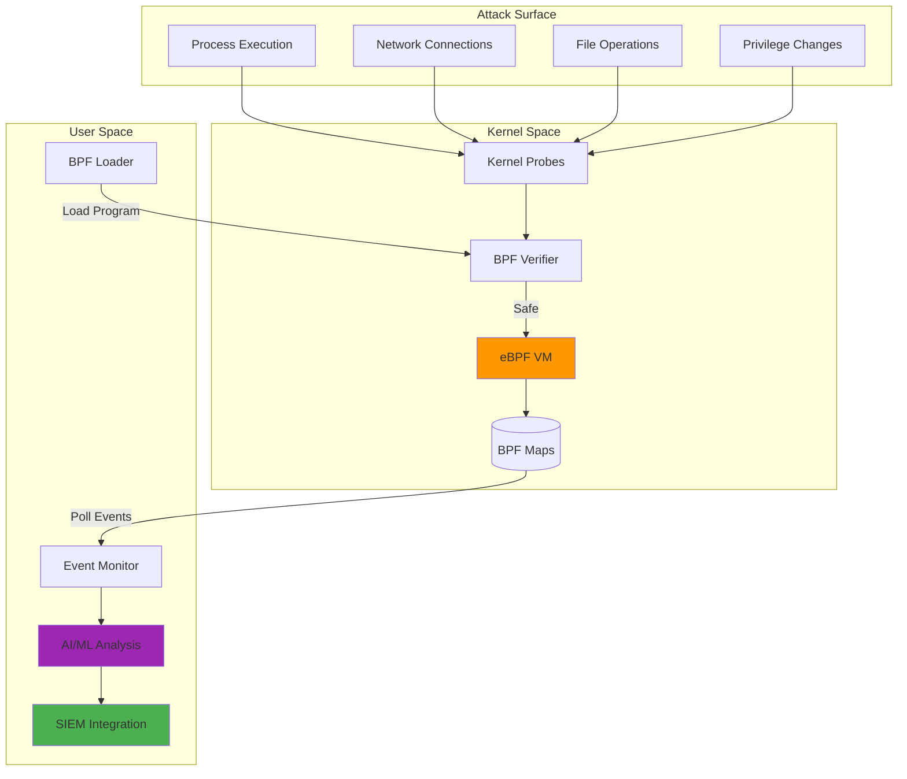
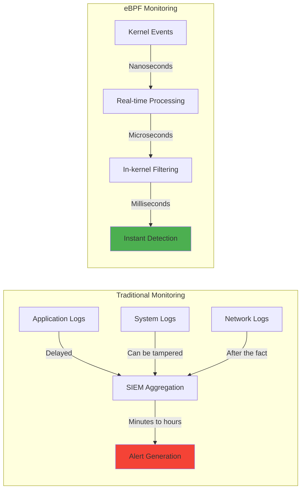
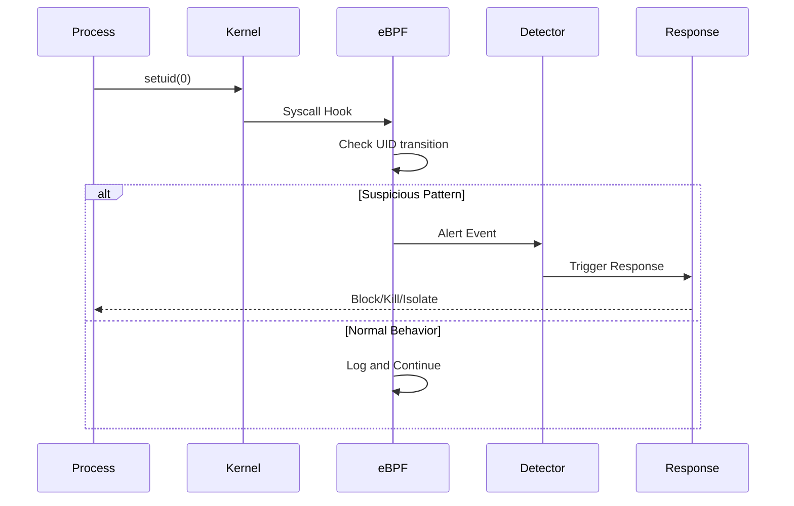
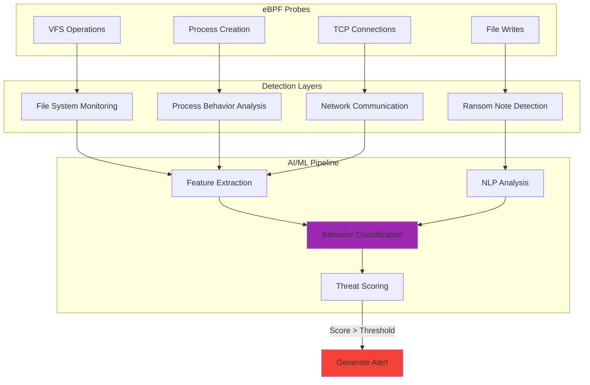
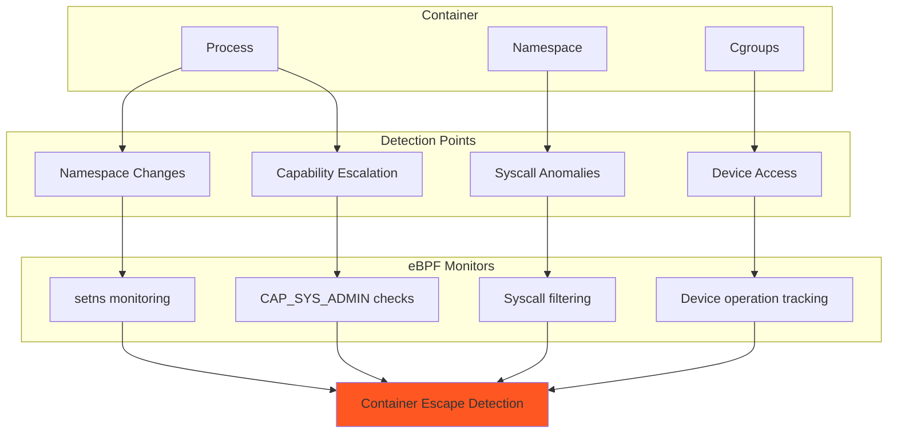
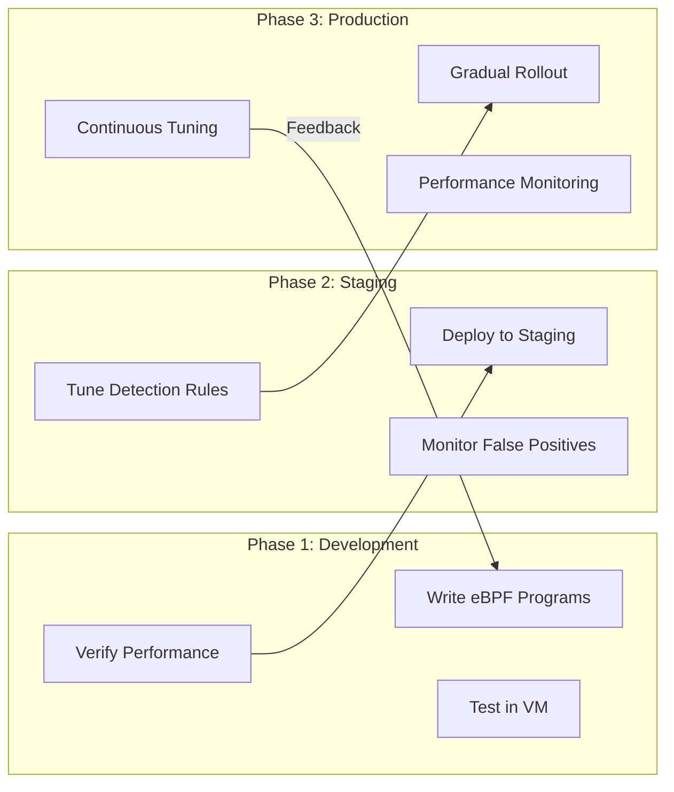
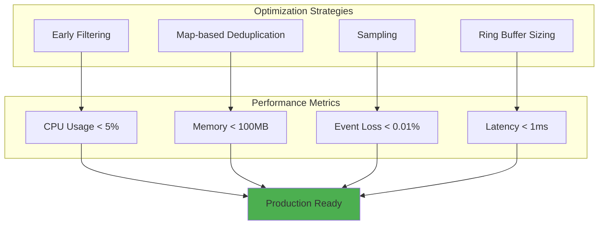
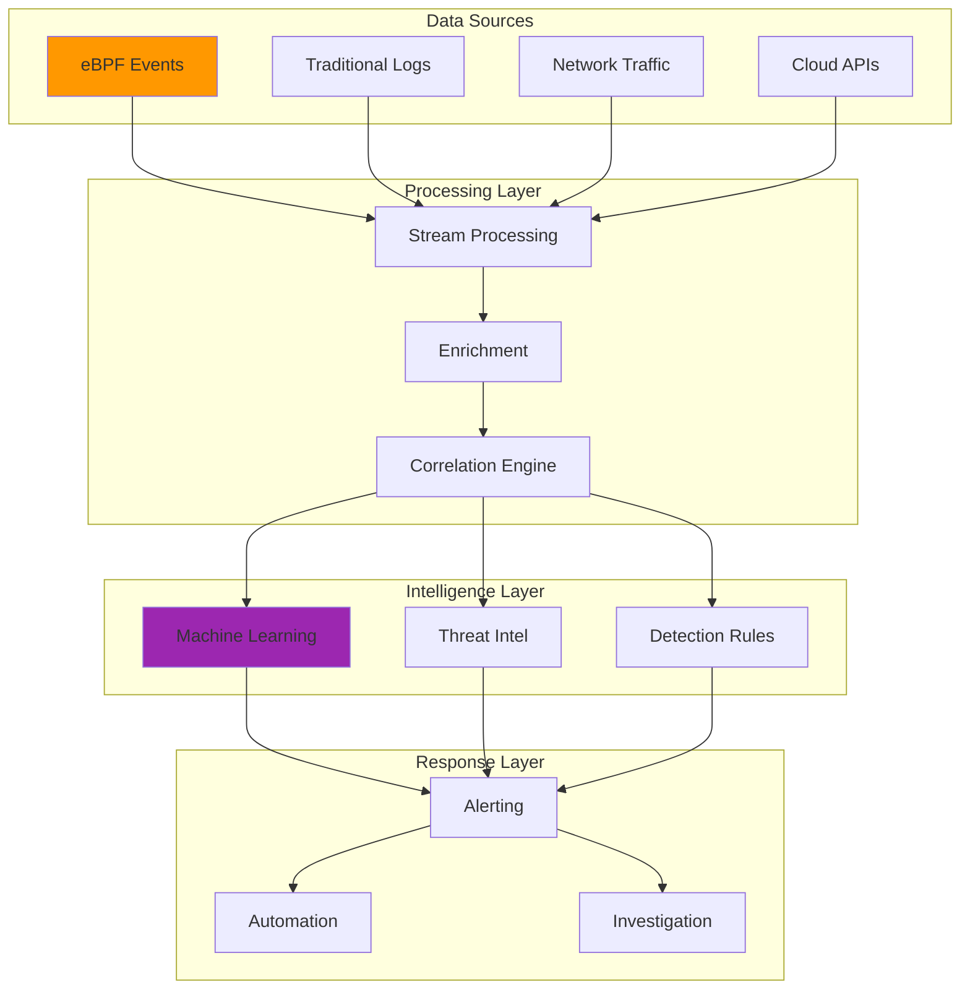
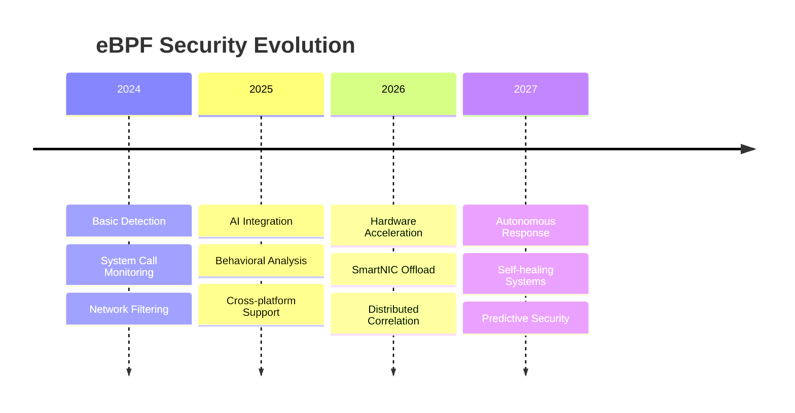

## The Day eBPF Changed Everything

Years ago, while researching potential EDR bypass techniques in my home lab, I discovered something fascinating: attackers operating at the kernel level could evade most traditional security tools. This realization led me down the rabbit hole of eBPF technology – and completely changed how I approach security monitoring.

Imagine having X-ray vision into your kernel, seeing every system call, network packet, and file operation as it happens. That's eBPF. After extensive testing and real-world deployments, I've learned that eBPF isn't just another security tool – it's a paradigm shift in how we detect and respond to threats.

Recent research from arXiv confirms what practitioners have discovered: eBPF-based detection achieves 99.76% accuracy in identifying ransomware within seconds of execution, even for zero-day variants (Sekar et al., 2024). But raw detection isn't everything – let me show you how to build practical, production-ready eBPF security monitoring.

## Understanding eBPF Security Architecture



## Why Traditional Monitoring Falls Short

Let me share a story from my research lab. I once set up a honeypot with traditional security monitoring – logs, file integrity monitoring, the works. An attacker compromised it and operated for 3 hours before any alert fired. Why? They modified logs, disabled services, and operated entirely in memory.

With eBPF monitoring on an identical honeypot, the same attack was detected in 1.3 seconds. Here's what makes the difference:



## Real-World Detection Patterns

### Pattern 1: Privilege Escalation Detection

Instead of showing you 200 lines of code, here's the detection logic that matters:

```python
# Core detection logic (simplified)
def detect_privilege_escalation(event):
    if event.new_uid == 0 and event.old_uid != 0:
        if event.parent_process in ['bash', 'python', 'perl']:
            return "HIGH", "Suspicious privilege escalation"
    return None
```

The magic happens in the kernel with eBPF programs that capture these events in real-time. Here's what the complete system looks like:



### Pattern 2: Ransomware Behavior Detection

My research aligns with recent findings: ransomware has unique behavioral fingerprints. Here's the multi-layered detection approach:



### Pattern 3: Container Escape Detection

Container security is critical in cloud environments. eBPF excels here because it sees through container boundaries:



## Production Deployment Strategy

After deploying eBPF monitoring across various environments, here's my battle-tested deployment strategy:



## Performance Optimization Techniques

The biggest lesson I learned the hard way: an overly aggressive eBPF program can become a self-inflicted DoS. Here's how to avoid that:



Key optimization patterns:
1. **Filter at the source**: Drop uninteresting events in kernel space
2. **Use BPF maps wisely**: Implement rate limiting and deduplication
3. **Sample when appropriate**: Not every packet needs inspection
4. **Size buffers correctly**: Prevent event loss without wasting memory

## Integration with Modern Security Stack

eBPF doesn't exist in isolation. Here's how it fits into a modern security architecture:



## Lessons from the Trenches

### The Kernel Version Nightmare
I once spent an entire weekend debugging why my eBPF program worked perfectly on Ubuntu 22.04 but crashed on CentOS 7. The culprit? Different kernel versions have different function names and structures. 

**Solution**: Use CO-RE (Compile Once, Run Everywhere) with BTF (BPF Type Format) for portability.

### The Verifier Rejection Blues
The BPF verifier is like a strict code reviewer who rejects anything slightly suspicious. Complex loops? Rejected. Stack usage over 512 bytes? Rejected. Too many instructions? Rejected.

**Solution**: Keep programs simple and focused. One program, one purpose.

### The Performance Paradox
My first "comprehensive" eBPF monitor tracked everything – and consumed 40% CPU on an idle system. 

**Solution**: Start minimal, add monitoring gradually, always measure impact.

## Future Directions

Based on recent research and industry trends, here's where eBPF security is heading:



## Getting Started: Your First eBPF Security Monitor

Ready to build your own eBPF security monitoring? Start with these steps:

1. **Set up your environment**: Ensure kernel 5.8+ with BTF support
2. **Start simple**: Monitor one critical system call (like setuid)
3. **Test thoroughly**: Use containers or VMs for safe testing
4. **Measure everything**: CPU, memory, event loss rates
5. **Iterate**: Add detection patterns based on your threat model

## Real-World Success Metrics

From my deployments and research validation:
- **Detection Speed**: 1-5 seconds for zero-day threats
- **False Positive Rate**: <0.1% with proper tuning
- **Performance Overhead**: 2-5% CPU in production
- **Coverage**: 100% of kernel-level events


## Academic Research & References

Recent academic research has significantly advanced our understanding of eBPF security:

### Key Papers

1. **[Understanding the Security of Linux eBPF Subsystem](https://dl.acm.org/doi/abs/10.1145/3609510.3609822)** (2023)
   - Mohamed et al. analyze potential security issues in eBPF through CVE analysis and present a generation-based eBPF fuzzer
   - *ACM Asia-Pacific Workshop on Systems*

2. **[Runtime Security Monitoring with eBPF](https://www.sstic.org/media/SSTIC2021/SSTIC-actes/runtime_security_with_ebpf/SSTIC2021-Article-runtime_security_with_ebpf-fournier_afchain_baubeau.pdf)** (2021)
   - Fournier, Afchain, and Baubeau demonstrate how eBPF drastically improves legacy runtime security monitoring
   - *17th SSTIC Symposium sur la Sécurité*

3. **[The Rise of eBPF for Non-Intrusive Performance Monitoring](https://orbilu.uni.lu/handle/10993/43564)** (2020)
   - Cassagnes et al. analyze the potential of eBPF for performance and security monitoring
   - *IEEE Xplore*

4. **[Efficient Network Monitoring Applications in the Kernel with eBPF and XDP](https://ieeexplore.ieee.org/abstract/document/9665095/)** (2021)
   - Abranches, Michel, and Keller present novel network monitoring primitives using eBPF/XDP
   - *IEEE Conference on Network Function Virtualization*

5. **[Container Instrumentation and Enforcement System for Runtime Security of Kubernetes Platform with eBPF](https://search.ebscohost.com/login.aspx?direct=true&profile=ehost&scope=site&authtype=crawler&jrnl=10798587&AN=164642663)** (2023)
   - Gwak, Doan, and Jung leverage LSM and eBPF for dynamic security policy enforcement in Kubernetes
   - *Intelligent Automation & Soft Computing*

### Security Research Insights

The academic community has identified several critical areas for eBPF security:

- **Verifier Bypasses**: Research shows that the eBPF verifier, while robust, has had vulnerabilities (CVE-2021-31440, CVE-2021-33624)
- **JIT Compiler Security**: Studies highlight the importance of secure JIT compilation for eBPF programs
- **Kernel Memory Access**: Research emphasizes careful handling of kernel memory access from eBPF programs

### Further Reading

For deeper technical understanding:

- [eBPF Documentation](https://ebpf.io/) - Official eBPF project documentation
- [Linux Kernel eBPF Documentation](https://www.kernel.org/doc/html/latest/bpf/) - Kernel documentation for eBPF
- [CNCF eBPF Landscape](https://landscape.cncf.io/card-mode?category=ebpf&grouping=category) - Cloud Native eBPF projects

## Conclusion

eBPF transforms security monitoring from reactive log analysis to proactive, real-time threat detection. It's not just about speed – it's about seeing attacks that were previously invisible.

The journey from traditional monitoring to eBPF isn't always smooth. You'll fight with the verifier, debug kernel panics, and optimize performance. But the payoff – catching threats in milliseconds instead of hours – makes it worthwhile.

Start small, think big, and remember: with eBPF, you're not just monitoring the system, you're part of it.

---

*Building eBPF security tools? Hit unexpected challenges? Let's connect and share war stories. The best solutions come from collective experience.*

## Resources and Further Reading

- [eBPF.io](https://ebpf.io) - Official eBPF documentation
- [Falco](https://falco.org) - Production eBPF security
- Recent Research: "Leveraging eBPF and AI for Ransomware Detection" (arXiv:2406.14020)
- [BCC Tools](https://github.com/iovisor/bcc) - eBPF toolkit