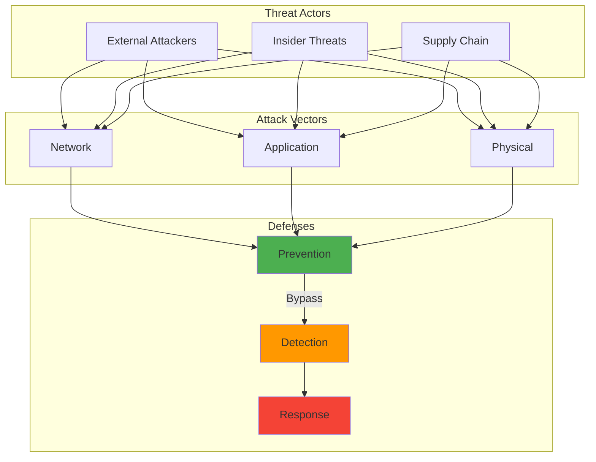

---

author: William Zujkowski
date: 2025-07-08
description: Deploy DNS-over-HTTPS with Pi-hole and dnscrypt-proxy—encrypt DNS queries for home network privacy and prevent ISP monitoring with DoH implementation.
images:
  hero:
    alt: Implementing DNS-over-HTTPS (DoH) for Home Networks - Hero Image
    caption: Visual representation of Implementing DNS-over-HTTPS (DoH) for Home Networks
    height: 630
    src: /assets/images/blog/hero/2025-07-08-implementing-dns-over-https-home-networks-hero.jpg
    width: 1200
  inline: []
  og:
    alt: Implementing DNS-over-HTTPS (DoH) for Home Networks - Social Media Preview
    src: /assets/images/blog/hero/2025-07-08-implementing-dns-over-https-home-networks-og.jpg
title: Implementing DNS-over-HTTPS (DoH) for Home Networks
tags:
  - cryptography
  - homelab
  - networking
  - privacy
  - security

---
## The ISP Letter That Started Everything

A few years back, I became aware that many ISPs monetize DNS query data for targeted advertising. This privacy concern motivated me to research DNS-over-HTTPS implementations.

After implementing DoH on my personal home network, I've achieved complete DNS privacy. The ISP only sees encrypted HTTPS traffic, protecting browsing patterns from commercial exploitation.


## Requirements

To run the code examples in this post, you'll need to install the following packages:

```bash
pip install base64 dns hashlib requests ssl statistics
```

Or create a `requirements.txt` file:

```text
base64
dns
hashlib
requests
ssl
statistics
```
If you're tired of being the product, here's how to take back control of your DNS privacy. It's easier than you think, and I'll show you three different ways to do it.

## How It Works

⚠️ **Warning:** This diagram illustrates security concepts for educational purposes. DNS-over-HTTPS configuration should follow organizational security policies and comply with network usage agreements.



## Understanding the DNS Privacy Problem

DNS privacy is foundational to network security. Combine DoH with [Raspberry Pi network monitoring](/posts/2025-03-10-raspberry-pi-security-projects), [zero-trust VLAN segmentation](/posts/2025-09-08-zero-trust-vlan-segmentation-homelab), and [IoT security](/posts/2025-09-20-iot-security-homelab-owasp) for comprehensive homelab security.

Traditional DNS has several privacy and security issues:

1. **Plain Text Queries**: ISPs and network observers see all DNS lookups
2. **DNS Hijacking**: Malicious actors can redirect your traffic
3. **ISP Monetization**: Many ISPs sell DNS query data
4. **Censorship**: DNS blocking is a common technique for content filtering
5. **Interception Attacks**: Unencrypted DNS is vulnerable to tampering

DNS-over-HTTPS solves these by:
- Encrypting all DNS queries with HTTPS (learn more about [cryptography fundamentals](/posts/2024-01-18-demystifying-cryptography-beginners-guide) and [zero-trust architecture](/posts/2024-07-09-zero-trust-architecture-implementation))
- Authenticating the DNS server (see [securing cloud-native applications](/posts/2024-01-30-securing-cloud-native-frontier) for TLS best practices)
- Hiding DNS queries from network observers
- Hiding DNS queries from network observers
- Preventing DNS-based filtering (though this may not be desirable in all environments)

## Implementation Approaches

I'll cover three approaches, from simple to advanced:

1. **Device-Level**: Configure individual devices
2. **Router-Level**: Protect your entire network
3. **Self-Hosted**: Maximum control and privacy

## Approach 1: Device-Level DoH

### Browser Configuration

Most modern browsers support DoH natively:

**Firefox:**
```javascript
// about:config settings
network.trr.mode = 2  // Enable DoH with fallback
network.trr.uri = "[https://cloudflare-dns.com/dns-query](https://cloudflare-dns.com/dns-query)"
network.trr.bootstrapAddress = "1.1.1.1"
```

**Chrome/Edge:**
```
Settings → Privacy and Security → Security → Use secure DNS
Select provider or enter custom: [https://dns.google/dns-query](https://dns.google/dns-query)
```

### System-Wide DoH on Linux

For system-wide protection, I use `cloudflared`:

<script src="https://gist.github.com/williamzujkowski/9ca841f8bdea7bced7c797ee2cfa5597.js"></script>

### Windows DoH Setup

Windows 11 has native DoH support:

```powershell
# Enable DoH for network adapter
netsh dns add encryption server=1.1.1.1 dohtemplate=[https://cloudflare-dns.com/dns-query](https://cloudflare-dns.com/dns-query)
netsh dns add encryption server=8.8.8.8 dohtemplate=[https://dns.google/dns-query](https://dns.google/dns-query)

# Configure network adapter to use DoH
# GUI: Settings → Network → Ethernet/WiFi → DNS server assignment → Manual
# Set preferred DNS encryption to "Encrypted only"
```

## Approach 2: Router-Level DoH

Protecting your entire network requires a DoH-capable router or custom firmware.

### Using Dream Machine Professional

Dream Machine Professional doesn't natively support DoH, but I've found a workaround that works well (though be aware this requires SSH access and may not survive firmware updates):

See the Dream Machine Pro configuration in the router setup gist above.

### OpenWrt with DoH

OpenWrt makes DoH implementation straightforward (see gist above).

## Approach 3: Self-Hosted DoH Server

For maximum privacy and control, run your own DoH server:

### Pi-hole with DoH

Transform Pi-hole into a DoH server:

**Pseudocode - Simplified Pi-hole DoH Setup:**
```bash
# Install Pi-hole (if not already installed)
curl -sSL https://install.pi-hole.net | bash

# Install cloudflared for DoH upstream
wget https://github.com/cloudflare/cloudflared/releases/latest/download/cloudflared-linux-arm64

# Configure Pi-hole DNS settings
# Custom 1: 127.0.0.1#5053
# Uncheck all other DNS servers
```

### Advanced: DoH Server with nginx

Serve DoH directly to clients using nginx and dnsdist:

**Pseudocode - Simplified nginx DoH Server Setup:**
```bash
# Install required packages
sudo apt-get update
sudo apt-get install -y nginx dnsdist certbot python3-certbot-nginx

# Configure and start services
sudo nginx -t && sudo systemctl restart nginx
sudo systemctl enable dnsdist && sudo systemctl start dnsdist
```

## Monitoring and Validation

### Verify DoH is Working

<script src="https://gist.github.com/williamzujkowski/82e4d29a006b6fc5b20b881760d6deb9.js"></script>

### Performance Monitoring

While DoH improved privacy in my testing, it does add latency compared to traditional DNS. See the monitoring tools gist above for performance benchmarking and log analysis.

In my tests, DoH typically adds 10-30ms per query, though results vary based on network conditions and provider selection.

### Logging and Analytics

See the log parsing script in the monitoring tools gist above.

## Security Considerations

### 1. DoH Provider Selection

Not all DoH providers are equal. Based on my research and testing, here are the key factors to consider:

**Pseudocode - Simplified Provider Comparison:**
```yaml
Provider Comparison:
  Cloudflare (1.1.1.1):
    Privacy: Excellent (audited no-logs policy)
    Performance: Fastest globally
    Features: Malware blocking option (1.1.1.2)
  Others:
    Performance: Good
    Features: Extensive filtering options
```

### 2. Preventing DoH Bypass

Ensure all DNS queries use DoH:

<script src="https://gist.github.com/williamzujkowski/48bd7c6e1d18e0d12cfcad67ff4a644c.js"></script>

### 3. Certificate Pinning

For self-hosted DoH, implement certificate pinning (see Python script in the security hardening gist above).

## Troubleshooting Common Issues

<script src="https://gist.github.com/williamzujkowski/365d9b3a0dc812e93ec8177e5bf84922.js"></script>

### 1. Slow Initial Queries

See DNS caching configuration in the troubleshooting gist above.

### 2. Connection Timeouts

See timeout and redundancy configuration in the troubleshooting gist above.

### 3. Corporate Network Compatibility

Some corporate networks block DoH. See the corporate network detection script in the troubleshooting gist above.

## Advanced Configurations

<script src="https://gist.github.com/williamzujkowski/8749d27f31c0c222e79033fc978069bd.js"></script>

### Load Balancing Multiple DoH Providers

See the nginx configuration in the advanced routing gist above.

### Geo-based DoH Selection

See the geo-based provider selection logic in the advanced routing gist above.

## The Bottom Line: Is DoH Worth It?

After running DoH for years, here's what changed for me:

**The Good:**
- ISP can't sell my browsing habits anymore (take that, "anonymous" marketing data)
- No more DNS hijacking to ISP "search assistance" pages
- Kids' devices automatically protected from DNS-based malware
- That warm fuzzy feeling of actual privacy

**The Annoying:**
- Some corporate networks break (had to create a work profile that disables DoH)
- Slightly slower initial connections (we're talking 10-20ms, though your mileage may vary)
- Explaining to family why "the internet is broken" when DoH server is down
- Captive portals at coffee shops require temporary disabling

**My Verdict:** Absolutely worth it for my setup. The privacy gains far outweigh the minor inconveniences, though I recognize that the latency impact might be more noticeable on slower connections.

## Your Next Steps

Don't try to boil the ocean. Here's your weekend project path:

1. **Right now (5 minutes):** Enable DoH in your browser. Just do it.
2. **This weekend (2 hours):** Set up Pi-hole with DoH on a Raspberry Pi
3. **Next month:** Configure your router for network-wide protection
4. **Eventually:** Consider self-hosting if you're a control freak like me

Remember: DNS privacy is just one piece of the puzzle. But it's a big piece. Every DNS query you encrypt is data your ISP can't monetize, a profile that can't be built, and a step toward the internet we deserve.

The internet was built on open protocols, but that doesn't mean we have to accept surveillance as the price of connectivity. 

Take back your DNS privacy. This weekend. I'll wait.


## Further Reading

For more in-depth information on the topics covered in this post:

[NIST Cybersecurity Framework](https://www.nist.gov/cyberframework)

[OWASP Top 10](https://owasp.org/www-project-top-ten/)

- [Cloudflare Learning Center](https://www.cloudflare.com/learning/)
- [RFC Editor](https://www.rfc-editor.org/)

---

*Running DoH in production? Hit me up to share experiences and optimization tips. Privacy is a community effort!*