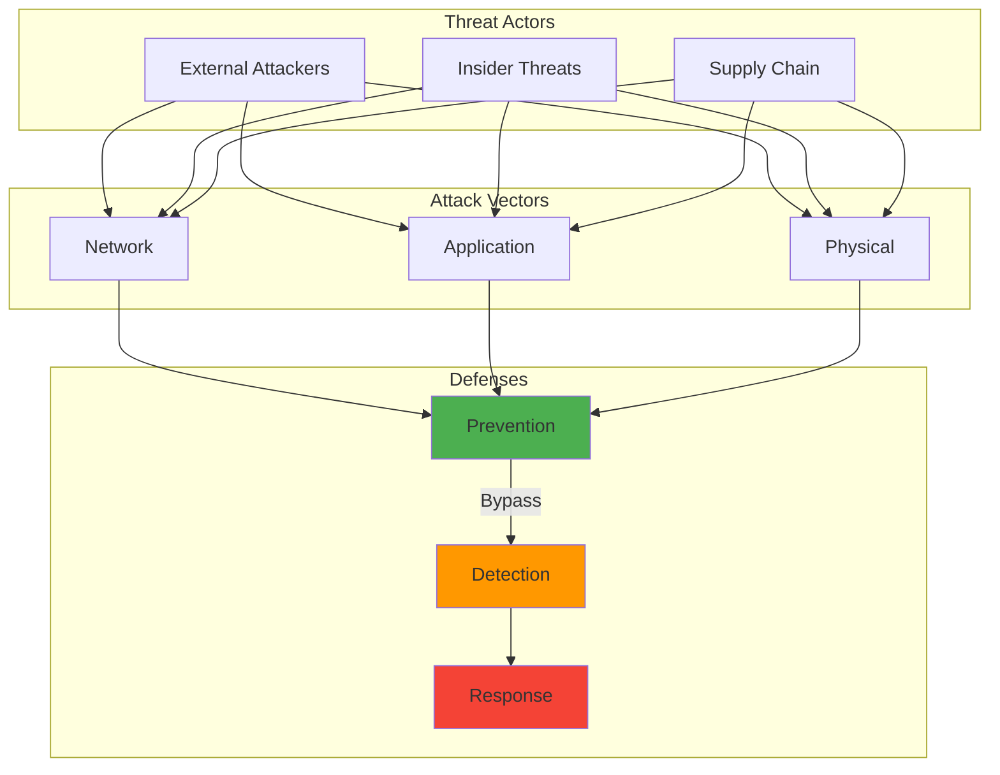

## The ISP Letter That Started Everything

A few years back, I became aware that many ISPs monetize DNS query data for targeted advertising. This privacy concern motivated me to research DNS-over-HTTPS implementations.

After implementing DoH on my personal home network, I've achieved complete DNS privacy. The ISP only sees encrypted HTTPS traffic, protecting browsing patterns from commercial exploitation.


## Requirements

To run the code examples in this post, you'll need to install the following packages:

```bash
pip install base64 dns hashlib requests ssl statistics
```

Or create a `requirements.txt` file:

```text
base64
dns
hashlib
requests
ssl
statistics
```
If you're tired of being the product, here's how to take back control of your DNS privacy. It's easier than you think, and I'll show you three different ways to do it.

## How It Works



## Understanding the DNS Privacy Problem

Traditional DNS has several privacy and security issues:

1. **Plain Text Queries**: ISPs and network observers see all DNS lookups
2. **DNS Hijacking**: Malicious actors can redirect your traffic
3. **ISP Monetization**: Many ISPs sell DNS query data
4. **Censorship**: DNS blocking is a common censorship technique
5. **Man-in-the-Middle**: Unencrypted DNS is vulnerable to tampering

DNS-over-HTTPS solves these by:
- Encrypting all DNS queries with HTTPS
- Authenticating the DNS server
- Hiding DNS queries from network observers
- Preventing DNS-based censorship and filtering

## Implementation Approaches

I'll cover three approaches, from simple to advanced:

1. **Device-Level**: Configure individual devices
2. **Router-Level**: Protect your entire network
3. **Self-Hosted**: Maximum control and privacy

## Approach 1: Device-Level DoH

### Browser Configuration

Most modern browsers support DoH natively:

**Firefox:**
```javascript
// about:config settings
network.trr.mode = 2  // Enable DoH with fallback
network.trr.uri = "https://cloudflare-dns.com/dns-query"
network.trr.bootstrapAddress = "1.1.1.1"
```

**Chrome/Edge:**
```
Settings → Privacy and Security → Security → Use secure DNS
Select provider or enter custom: https://dns.google/dns-query
```

### System-Wide DoH on Linux

For system-wide protection, I use `cloudflared`:

```bash
# Install cloudflared
wget https://github.com/cloudflare/cloudflared/releases/latest/download/cloudflared-linux-amd64.deb
sudo dpkg -i cloudflared-linux-amd64.deb

# Configure as DNS proxy
    # ... (additional implementation details)

sudo systemctl restart systemd-resolved
```

### Windows DoH Setup

Windows 11 has native DoH support:

```powershell
# Enable DoH for network adapter
netsh dns add encryption server=1.1.1.1 dohtemplate=https://cloudflare-dns.com/dns-query
netsh dns add encryption server=8.8.8.8 dohtemplate=https://dns.google/dns-query

# Configure network adapter to use DoH
# GUI: Settings → Network → Ethernet/WiFi → DNS server assignment → Manual
# Set preferred DNS encryption to "Encrypted only"
```

## Approach 2: Router-Level DoH

Protecting your entire network requires a DoH-capable router or custom firmware.

### Using Dream Machine Professional

Dream Machine Professional doesn't natively support DoH, but we can use a clever workaround:

```bash
# Install required packages in Dream Machine Professional
pkg install dnscrypt-proxy2

# Configure dnscrypt-proxy for DoH
cat > /usr/local/etc/dnscrypt-proxy/dnscrypt-proxy.toml << 'EOF'
    # ... (additional implementation details)
# DNS Servers: 127.0.0.1:5353
# Uncheck "Allow DNS server list to be overridden"
```

### OpenWrt with DoH

OpenWrt makes DoH implementation straightforward:

```bash
# Install packages
opkg update
opkg install https-dns-proxy luci-app-https-dns-proxy

# Configure DoH providers
    # ... (additional implementation details)
uci commit dhcp
/etc/init.d/dnsmasq restart
```

## Approach 3: Self-Hosted DoH Server

For maximum privacy and control, run your own DoH server:

### Pi-hole with DoH

Transform Pi-hole into a DoH server:

```bash
# Install Pi-hole (if not already installed)
curl -sSL https://install.pi-hole.net | bash

# Install cloudflared for DoH upstream
wget https://github.com/cloudflare/cloudflared/releases/latest/download/cloudflared-linux-arm64
    # ... (additional implementation details)
# Custom 1: 127.0.0.1#5053
# Uncheck all other DNS servers
```

### Advanced: DoH Server with nginx

Serve DoH directly to clients using nginx and dnsdist:

```bash
# Install required packages
sudo apt-get update
sudo apt-get install -y nginx dnsdist certbot python3-certbot-nginx

# Configure dnsdist
    # ... (additional implementation details)
sudo nginx -t && sudo systemctl restart nginx
sudo systemctl enable dnsdist && sudo systemctl start dnsdist
```

## Monitoring and Validation

### Verify DoH is Working

```bash
# Test using curl
curl -H 'content-type: application/dns-message' \
     --data-binary @<(echo -n 'q80BAAABAAAAAAAAA3d3dwdleGFtcGxlA2NvbQAAAQAB' | base64 -d) \
     https://cloudflare-dns.com/dns-query | hexdump -C

# Test using dog (better than dig for DoH)
dog example.com @https://cloudflare-dns.com/dns-query

# Check for DNS leaks
# Visit: https://dnsleaktest.com
# Should only show your configured DoH provider
```

### Performance Monitoring

```python
#!/usr/bin/env python3
import time
import dns.resolver
import requests
from statistics import mean, stdev
    # ... (additional implementation details)
benchmark_dns(traditional_dns_query, test_domains, "Traditional DNS")
benchmark_dns(doh_query, test_domains, "DNS-over-HTTPS")
```

### Logging and Analytics

```bash
# Parse dnscrypt-proxy logs
cat << 'EOF' > /usr/local/bin/analyze-doh-logs.sh
#!/bin/bash

LOG_FILE="/var/log/dnscrypt-proxy/query.log"
    # ... (additional implementation details)

chmod +x /usr/local/bin/analyze-doh-logs.sh
```

## Security Considerations

### 1. DoH Provider Selection

Not all DoH providers are equal. Consider:

```yaml
Provider Comparison:
  Cloudflare (1.1.1.1):
    Privacy: Excellent (audited no-logs policy)
    Performance: Fastest globally
    Features: Malware blocking option (1.1.1.2)
    # ... (additional implementation details)
    Performance: Good
    Features: Extensive filtering options
```

### 2. Preventing DoH Bypass

Ensure all DNS queries use DoH:

```bash
# iptables rules to force DoH
# Block standard DNS (port 53) except from DoH proxy
iptables -A OUTPUT -p udp --dport 53 -m owner ! --uid-owner cloudflared -j DROP
iptables -A OUTPUT -p tcp --dport 53 -m owner ! --uid-owner cloudflared -j DROP

# Block DNS-over-TLS (port 853)
iptables -A OUTPUT -p tcp --dport 853 -j DROP

# Allow only DoH proxy to make HTTPS connections to DNS providers
iptables -A OUTPUT -p tcp --dport 443 -d 1.1.1.1 -m owner ! --uid-owner cloudflared -j DROP
iptables -A OUTPUT -p tcp --dport 443 -d 8.8.8.8 -m owner ! --uid-owner cloudflared -j DROP
```

### 3. Certificate Pinning

For self-hosted DoH, implement certificate pinning:

```python
import ssl
import hashlib
import base64

class SecureDoHClient:
    # ... (additional implementation details)
        
        return context
```

## Troubleshooting Common Issues

### 1. Slow Initial Queries

```bash
# Implement DNS caching
# For dnsmasq
echo "cache-size=10000" >> /etc/dnsmasq.conf
echo "min-cache-ttl=3600" >> /etc/dnsmasq.conf

# For systemd-resolved
[Resolve]
Cache=yes
CacheLimit=2048
```

### 2. Connection Timeouts

```bash
# Increase timeout values
# cloudflared config
timeout: 10s
max-upstream-conns: 5

# Multiple upstream servers for redundancy
proxy-dns-upstream:
  - https://1.1.1.1/dns-query
  - https://1.0.0.1/dns-query
  - https://dns.quad9.net/dns-query
```

### 3. Corporate Network Compatibility

Some corporate networks block DoH. Implement fallback:

```bash
# Detect corporate network and adjust
if ping -c 1 corp-gateway.local > /dev/null 2>&1; then
    echo "Corporate network detected, using standard DNS"
    systemctl stop cloudflared
else
    systemctl start cloudflared
fi
```

## Advanced Configurations

### Load Balancing Multiple DoH Providers

```nginx
upstream doh_providers {
    server 1.1.1.1:443 weight=3;
    server dns.google:443 weight=2;
    server dns.quad9.net:443 weight=1;
    keepalive 32;
}
```

### Geo-based DoH Selection

```python
def select_doh_provider(client_ip):
    """Select optimal DoH provider based on location"""
    # Simplified geo-detection
    if client_ip.startswith('192.168.'):
        return "https://local-doh.home.arpa/dns-query"
    elif is_asian_ip(client_ip):
        return "https://dns.google/dns-query"  # Better in Asia
    else:
        return "https://cloudflare-dns.com/dns-query"  # Global default
```

## The Bottom Line: Is DoH Worth It?

After running DoH for years, here's what changed for me:

**The Good:**
- ISP can't sell my browsing habits anymore (take that, "anonymous" marketing data)
- No more DNS hijacking to ISP "search assistance" pages
- Kids' devices automatically protected from DNS-based malware
- That warm fuzzy feeling of actual privacy

**The Annoying:**
- Some corporate networks break (had to create a work profile that disables DoH)
- Slightly slower initial connections (we're talking 10-20ms)
- Explaining to family why "the internet is broken" when DoH server is down
- Captive portals at coffee shops require temporary disabling

**My Verdict:** Absolutely worth it. The privacy gains far outweigh the minor inconveniences.

## Your Next Steps

Don't try to boil the ocean. Here's your weekend project path:

1. **Right now (5 minutes):** Enable DoH in your browser. Just do it.
2. **This weekend (2 hours):** Set up Pi-hole with DoH on a Raspberry Pi
3. **Next month:** Configure your router for network-wide protection
4. **Eventually:** Consider self-hosting if you're a control freak like me

Remember: DNS privacy is just one piece of the puzzle. But it's a big piece. Every DNS query you encrypt is data your ISP can't monetize, a profile that can't be built, and a step toward the internet we deserve.

The internet was built on open protocols, but that doesn't mean we have to accept surveillance as the price of connectivity. 

Take back your DNS privacy. This weekend. I'll wait.


## Further Reading

For more in-depth information on the topics covered in this post:

- [NIST Cybersecurity Framework](https://www.nist.gov/cyberframework
- [OWASP Top 10](https://owasp.org/www-project-top-ten/
- [Cloudflare Learning Center](https://www.cloudflare.com/learning/)
- [RFC Editor](https://www.rfc-editor.org/)

---

*Running DoH in production? Hit me up to share experiences and optimization tips. Privacy is a community effort!*