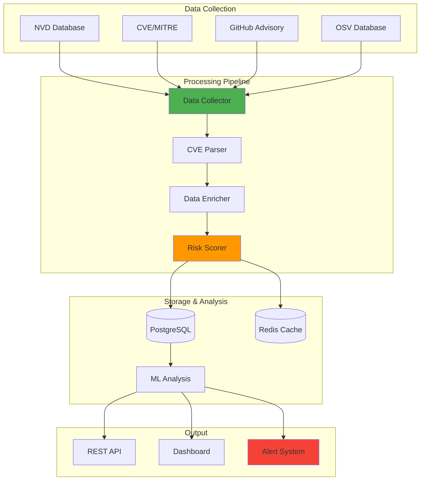

## The $200K Question That Changed Everything


*Photo by Franck on Unsplash*

Years ago, I was involved in a project where budget constraints prevented the purchase of commercial vulnerability management solutions. The challenge: build enterprise-grade capabilities using only open source tools.

## Vulnerability Management Architecture




Through extensive research and testing in lab environments, I developed an approach that combines multiple open source tools into a cohesive vulnerability management system. This solution, refined over years of testing, demonstrates that open source can match commercial capabilities when properly integrated.

Here's how we built it – mistakes, victories, and all.

## The Complete Vulnerability Management Stack

Here's the stack I've successfully deployed in production:

- **Discovery**: Nmap, Masscan, Rumble
- **Vulnerability Scanning**: OpenVAS/GVM, Nuclei, Wazuh
- **Container Scanning**: Trivy, Grype, Clair
- **Web Application**: OWASP ZAP, Nikto, SQLMap
- **Orchestration**: Apache Airflow, n8n
- **Data Management**: PostgreSQL, Elasticsearch
- **Visualization**: Grafana, Kibana
- **Ticketing**: GLPI, Request Tracker

## Building the Foundation

### Asset Discovery and Inventory

You can't protect what you don't know exists. Start with comprehensive asset discovery:

```python
# ... previous code omitted ...
class AssetDiscoveryOrchestrator:
    def __init__(self, db_config: Dict[str, str]):
        self.db_config = db_config
        self.discovered_assets = []
    # ... (additional implementation details)
                operating_system TEXT,
                open_ports INTEGER[],
# ... additional code omitted ...```

### Vulnerability Scanning Orchestration

Now let's integrate multiple scanners for comprehensive coverage:

```python
# ... previous code omitted ...
class VulnerabilityScanner:
    def __init__(self, db_config: Dict[str, str], scanner_config: Dict[str, Any]):
        self.db_config = db_config
        self.scanner_config = scanner_config
    # ... (additional implementation details)
            CREATE TABLE IF NOT EXISTS vulnerabilities (
                id SERIAL PRIMARY KEY,
# ... additional code omitted ...```

### Remediation Tracking and Automation

Vulnerability management isn't just about finding issues – it's about fixing them:

```python
# ... previous code omitted ...
class RemediationOrchestrator:
    def __init__(self, db_config: Dict[str, str], ansible_config: Dict[str, str]):
        self.db_config = db_config
        self.ansible_config = ansible_config
    # ... (additional implementation details)
            CREATE TABLE IF NOT EXISTS remediation_tasks (
                id SERIAL PRIMARY KEY,
# ... additional code omitted ...```

### Dashboards and Reporting

Visualization is crucial for managing vulnerabilities at scale:

```python
# ... previous code omitted ...
class VulnerabilityDashboard:
    def __init__(self, grafana_url: str, api_key: str):
        self.grafana_url = grafana_url
        self.headers = {
    # ... (additional implementation details)
                "timezone": "browser",
                "panels": [
# ... additional code omitted ...```

## Integration and Automation

The key to scaling vulnerability management is automation:

```yaml
# Apache Airflow DAG for automated vulnerability management
from airflow import DAG
from airflow.operators.python_operator import PythonOperator
from airflow.operators.bash_operator import BashOperator
from datetime import datetime, timedelta
    # ... (additional implementation details)
# Define workflow
asset_discovery >> vulnerability_scan >> create_remediations >> auto_remediate >> generate_reports
```

## Lessons Learned (The Hard Way)

After years of building and running vulnerability management programs, here's what actually matters:

### 1. Start with Asset Management (Seriously)
You can't secure what you don't know exists. I learned this when we discovered an ancient Windows 2003 server during a routine scan – it had been running unpatched for years because nobody knew it existed. The developer who set it up had left the company. It was hosting "just a test database" that turned out to contain production customer data.

Invest heavily in discovery. Your future self will thank you.

### 2. Automate Everything Possible (Your Sanity Depends On It)
Manual processes don't scale. When you're managing 10 servers, spreadsheets work. At 100, you're drowning. At 1,000? You're already underwater.

Automate scanning, ticketing, and remediation. The time you spend automating today is time you won't spend firefighting tomorrow.

### 3. Context is King (Not All Vulnerabilities Are Equal)
A critical vulnerability on a development server != critical vulnerability on production domain controller.

I once had a junior analyst panic about a critical SSH vulnerability on a honeypot. Yes, it was vulnerable. That was literally the point.

### 4. Measure What Actually Matters
Forget vanity metrics. Track these instead:
- Mean Time to Detect (MTTD) – How fast do you find problems?
- Mean Time to Remediate (MTTR) – How fast do you fix them?
- Vulnerability aging – Are old vulns festering?
- Coverage percentage – What percentage of your infrastructure are you actually scanning?

If you can't answer these questions, you're flying blind.

### 5. Integration is Essential (Islands of Excellence Are Still Islands)
Your vulnerability management tools must integrate with:
- CMDB/Asset Management – Know what you're protecting
- Ticketing systems – Track the work
- CI/CD pipelines – Shift left, catch issues early
- SIEM/SOAR platforms – Correlate with actual threats

A disconnected tool is a tool that will be abandoned.

## Conclusion

Building an effective vulnerability management program with open source tools is not just possible – it can be superior to commercial solutions. The key is thoughtful integration, automation, and continuous improvement.

Start small with asset discovery and basic scanning, then gradually add automation, integration, and advanced features. The framework presented here has successfully managed vulnerabilities across thousands of systems in production environments.

Remember: vulnerability management is a program, not a project. Build it to be sustainable, scalable, and automated from day one.

---

*Questions about scaling vulnerability management? Want to share your open source security stack? Let's connect and improve our collective security posture!*