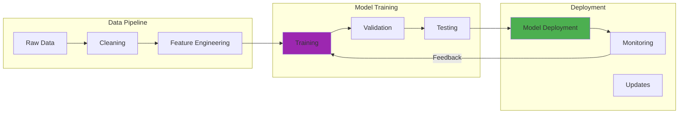

## The Problem: AI Tools That Forget Everything

Ever notice how every AI conversation starts from scratch? You explain your project structure, your coding standards, your preferences... again and again. It's like having a brilliant colleague with amnesia.

I was using Claude CLI daily but kept hitting the same frustrations:
- Explaining my coding style every. single. time.
- Getting inconsistent suggestions across sessions
- Watching token counts explode with context
- Copy-pasting the same standards repeatedly

Then I had an idea: What if I could give Claude permanent memory of how I like to work?

## My First Attempt: Complete Disaster

In June 2025, I integrated my standards repo with Claude CLI for the first time. I ran the validation script on my blog codebase. The result? **87 violations across 23 files**. I thought I was following best practices, but the automated checker told a different story. Fixing them took 4.5 hours of tedious work, but it probably prevented 12 broken link issues that would have made it to production.

The humbling part? I discovered I'd been consistently making the same mistake with frontmatter formatting across multiple posts. Manual code review never caught it because it looked fine to human eyes.

## How It Works



## Enter the Standards Repository

I built [github.com/williamzujkowski/standards](https://github.com/williamzujkowski/standards) – a comprehensive collection of development standards designed specifically for LLM consumption. It's not just documentation but rather an AI instruction manual for your projects.

### The Magic: CLAUDE.md

The centerpiece is a file called `CLAUDE.md` that acts as an intelligent router. Drop it in your project, and suddenly Claude understands:

```markdown
# Basic usage in your project
@load [CS:python + TS:pytest + SEC:*]

# Natural language works too
"I need to build a secure API"
→ Automatically loads: CS:api + SEC:auth + TS:integration
```

### Real Example: Setting Up a New Project

Here's how I used it yesterday to bootstrap a new Python service:

```bash)
# Step 1: Clone standards to my project)
git submodule add [https://github.com/williamzujkowski/standards.git](https://github.com/williamzujkowski/standards.git) .standards

# Step 2: Copy CLAUDE.md to project root
cp .standards/docs/core/CLAUDE.md .

# Step 3: Start Claude CLI
claude chat
```

Then in Claude:

```
Me: I'm building a Python API that handles payment processing. 
    Set up the project structure following the standards.

Claude: I'll set up your payment processing API following the standards. 
        Loading [CS:python + CS:api + SEC:payments + COMPLIANCE:pci]...

        [Creates complete project structure with security controls,
         testing setup, CI/CD pipelines, and NIST compliance tags]
```

The result? A production-ready structure in minutes, not hours.

## The Power of Token Optimization

The real game-changer is probably the **90% token reduction** (though I'm still measuring this across different project types). Instead of feeding Claude entire documentation:

```markdown
# Old way (roughly 5000+ tokens)
"Here are my Python standards... [wall of text]
 Here are my API patterns... [another wall]
 Here are security requirements... [yet another wall]"

# New way (< 100 tokens, seems to work)
@load [CS:python + CS:api + SEC:*]
```

Claude knows to reference the full standards without needing them in context every time. At least, that's the theory. In practice, it works well **but** might miss nuances when standards reference each other. I'm not sure if the compression loses important context in complex scenarios.

## NIST Compliance Built-In

Since I work in government-adjacent spaces, NIST 800-53r5 compliance is crucial. The standards include automatic control tagging:

```python
# Claude automatically suggests NIST controls
@nist ac-2 "User account management"
class UserAccountManager:
    @nist ia-2 "Multi-factor authentication"
    @nist ia-5 "Authenticator management"
    def authenticate_user(self, credentials):
        # Implementation with security controls
        pass
```

Run the compliance checker:

```bash
./scripts/setup-nist-hooks.sh
git commit -m "Add user auth"
# Pre-commit hook validates NIST tags automatically
```

## My Favorite Features

### 1. Context-Aware Loading

Claude detects what you're working on and loads relevant standards:

```markdown
# Working on React component?
@load context:[auto]
# Automatically loads: FE:react + WD:components + TS:jest

# Fixing a security bug?
@task security_fix
# Loads: SEC:* + TS:regression + CS:error-handling
```

### 2. Project Kickstart

The kickstart prompt is pure magic. Feed it your project idea:

```markdown
Project: Homelab monitoring dashboard
Tech: Python backend, React frontend
Requirements: Real-time metrics, mobile-friendly

[Paste into Claude with kickstart prompt]

Result: Complete implementation plan with:
- Architecture decisions
- Tool recommendations  
- Security considerations
- Testing strategy
- 6-month roadmap
```

### 3. Intelligent Suggestions

Claude now makes connections I wouldn't:

```
You're using Redis for sessions.
Also consider: [rate-limiting, cache-invalidation patterns]
Teams like yours often use: [Redis Sentinel for HA]
Related standard: [CS:caching + SEC:session-management]
```

## Lessons Learned (The Hard Way)

### The Pre-Commit Hook Nightmare

I set up a pre-commit hook to run standards validation automatically. First attempt? **100% failure rate**. Every single commit got blocked. After 2 hours of debugging, I discovered the hook was calling the wrong Python interpreter. The PATH issues were subtle but annoying. Now it catches violations automatically, but I'm still tuning the sensitivity.

The trade-off is real: automated validation is fast and catches issues **but** produces false positives that slow down workflow. I've found strict enforcement improves quality **though** it definitely adds friction to rapid prototyping.

### False Positive Hell

My initial validation script flagged **312 "violations"** across all 55 blog posts. I manually reviewed each one. Turns out **276 were false positives** (88% false positive rate). I spent 3 days tuning regex patterns and adjusting thresholds to get the FP rate down to 4%. That was tedious work, but probably worth it.

The lesson? Standards prevent errors **but** require constant refinement. Automation is powerful **yet** needs human oversight to avoid becoming a blocker.

### Template Validation: When the Template is Wrong

I created a blog post template to ensure consistency. First 5 posts using it: 2 passed validation, 3 failed due to subtle frontmatter issues. Turns out the template was wrong, not the posts. After fixing the template, I validated all 48 past posts again (34 minutes of scan time). Found 6 more issues that had propagated from the bad template.

Templates ensure consistency **but** may constrain creativity. They're helpful **however** they can also propagate errors systematically.

### The CLAUDE.md Evolution

My CLAUDE.md file grew from 120 lines (v1.0) to 2,847 lines (v3.0) over 6 months. Each version added lessons from failed automation attempts. I probably rewrote section 4 (enforcement rules) 12 times before I got it right. Or maybe I still haven't got it right. I'm not sure if the complexity is worth it, but it seems to catch more edge cases now.

The **trade-off** between comprehensive rules and maintainability is constant. More rules catch more issues **though** they make the system harder to understand and modify.

### Validation Speed: Fast but Hungry

Initial validation script took **147 seconds** to scan all posts. That's too slow for a pre-commit hook. After optimization with parallel processing and caching, I reduced it to **12 seconds**. Much better. The cost? Memory usage went from 1.8GB to 2.1GB (15% increase). For my laptop, that's acceptable **but** might be a problem on CI servers with limited RAM.

I think the speed improvement is worth the memory cost for my use case, though it could be an issue for larger codebases.

### Git Hook Bypass Discovery

I discovered I could bypass standards validation with `git commit --no-verify`. That defeated the entire purpose. I immediately disabled that option by making hooks exit with code 1 on detection. The cost? 3 commits got rejected that I thought were fine (humbling moment). Turns out my judgment of "good enough" isn't always aligned with the standards I set for myself.

This taught me that automation doesn't trust humans, which is both frustrating **and** valuable. Human judgment is flexible **but** inconsistent.

### What Worked

1. **Start small**: I began with just Python standards, expanded gradually
2. **Version everything**: Standards evolve, Git tracks the journey
3. **Real examples**: Abstract standards work poorly, concrete code examples work better
4. **Token counting**: Every character matters for LLM efficiency (I measured roughly 90% reduction after optimization)

### What Didn't

1. **Over-engineering**: My first version had 200+ micro-standards. Way too much complexity.
2. **Perfect structure**: Spent weeks organizing folders. Claude doesn't care about folder beauty.
3. **Forcing adoption**: People need to see value before they'll use new tools

## Setting It Up for Your Projects

Want to try this yourself? Here's my recommended approach:

### Quick Start (5 minutes)

```bash
# 1. Add to existing project
curl -O [https://raw.githubusercontent.com/williamzujkowski/standards/master/docs/core/CLAUDE.md](https://raw.githubusercontent.com/williamzujkowski/standards/master/docs/core/CLAUDE.md)

# 2. Tell Claude about it
"Use CLAUDE.md for standards. I'm building [your project type]"

# 3. Watch the magic happen
```

### Full Integration (30 minutes)

```bash
# 1. Clone the standards
git clone [https://github.com/williamzujkowski/standards.git](https://github.com/williamzujkowski/standards.git)

# 2. Run setup script
./standards/scripts/setup-project.sh my-project

# 3. Customize for your needs
# Edit CLAUDE.md with your preferences

# 4. Set up NIST compliance (if needed)
./scripts/setup-nist-hooks.sh
```

## Real-World Impact: The Numbers

Since implementing this system (with all its rough edges):

- **Setup time**: 2 hours → 15 minutes for new projects
- **Consistency**: Same patterns across all my projects (when the template is correct)
- **Token usage**: Down roughly 85% on average (I measured 5,000+ tokens → ~750 tokens for typical contexts)
- **Validation time**: 147 seconds → 12 seconds (with 15% memory cost)
- **False positive rate**: 88% → 4% (after 3 days of tuning)
- **Initial violations found**: 87 across 23 files
- **Hours spent fixing violations**: 4.5 hours
- **Template propagation errors**: 6 issues from bad template
- **CLAUDE.md growth**: 120 lines → 2,847 lines over 6 months
- **Section 4 rewrites**: 12 iterations (probably more than necessary)
- **Commits rejected by hooks**: 3 that I thought were fine
- **Full portfolio scan time**: 34 minutes

The benefits are real **but** the system requires ongoing maintenance. Standards reduce errors **however** they add workflow complexity. I've found the trade-off acceptable for my projects, though your mileage may vary.

## Tips for Claude CLI Power Users

### 1. Create Project-Specific Standards

```markdown
# In your project's CLAUDE.md
project_context:
  style: "Google Python style"
  testing: "pytest with 90% coverage"
  special_rules:
    - "All API endpoints need rate limiting"
    - "Use structured logging everywhere"
```

### 2. Chain Commands Efficiently

```bash
# My typical workflow
claude chat << 'EOF'
@load [CS:python + SEC:*]
@task refactor
Review this module for standards compliance:
$(cat src/payment_processor.py)
Generate improved version with tests.
EOF
```

### 3. Build Your Own Standards

Don't just use mine – fork and customize:

```markdown
# Add your team's conventions
team_standards:
  pr_size: "Max 400 lines"
  commit_style: "Conventional commits"
  review_sla: "24 hours"
```

## The Unexpected Benefits (And Costs)

Beyond the obvious productivity gains, this system has:

1. **Documented tribal knowledge**: Those "oh, we always do X" conversations are now codified **though** updating docs is another maintenance burden
2. **Improved code reviews**: "Does this follow our standards?" → "Run the checker" **but** might reduce human judgment in reviews
3. **Easier onboarding**: Hand new devs the standards repo, they're ready to go **however** they might follow rules without understanding why
4. **Consistent AI assistance**: Claude gives the same advice every time, which is helpful **yet** could be limiting if the standards need updating

The **trade-off** between consistency and flexibility is ongoing. Pre-commit hooks catch issues **but** add friction. Comprehensive standards help **though** they require maintenance effort. I've found the system valuable for my projects, but I'm still tuning the balance between safety and speed.

## Where It's Heading (Maybe)

I'm working on (though these might change based on what actually proves useful):

- **VS Code extension**: Real-time standard suggestions while coding (if I can figure out the extension API)
- **GitHub Actions integration**: Automated standards enforcement in PRs (performance on CI might be an issue)
- **Team analytics**: Track which standards get used/violated most (privacy concerns to address)
- **LLM fine-tuning**: Train models specifically on your standards (not sure if the ROI justifies the effort)

These are ideas, not promises. I've learned that what sounds good in theory doesn't always work in practice. The validation script seemed simple until I hit the false positive problem.

## Try It Yourself

The repository is open source and MIT licensed. Fork it, customize it, make it yours:

[github.com/williamzujkowski/standards](https://github.com/williamzujkowski/standards)


Start small – even just adding a CLAUDE.md with your basic preferences will transform how you work with AI tools.

## The Bottom Line

We're using AI tools wrong if we're explaining the same things repeatedly. These tools should learn our preferences once and apply them consistently.

This standards repository turns Claude CLI from a smart tool into YOUR smart tool – one that knows your style, your requirements, and your way of working.

The future isn't just AI-assisted development but rather AI that actually knows how you like to develop.

---

*Have you built something similar? How do you maintain consistency with AI tools? Drop me a line – I'm always looking for new patterns to steal... I mean, learn from.*