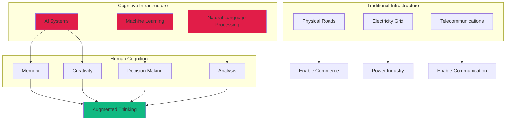
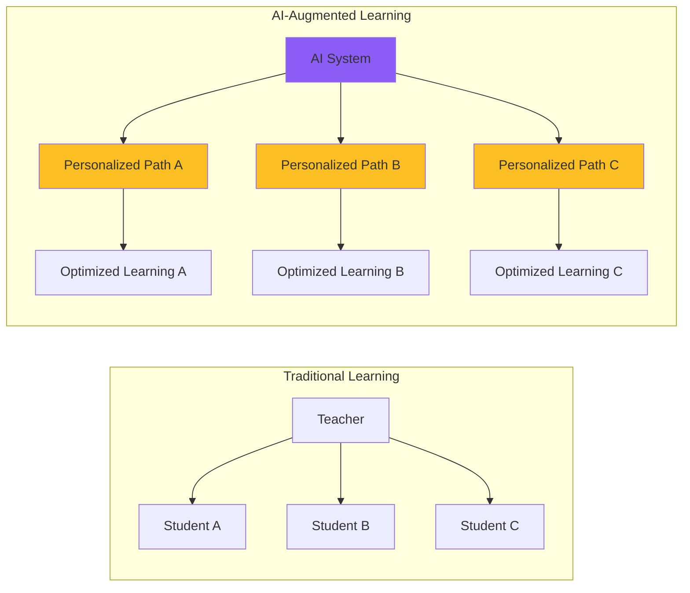
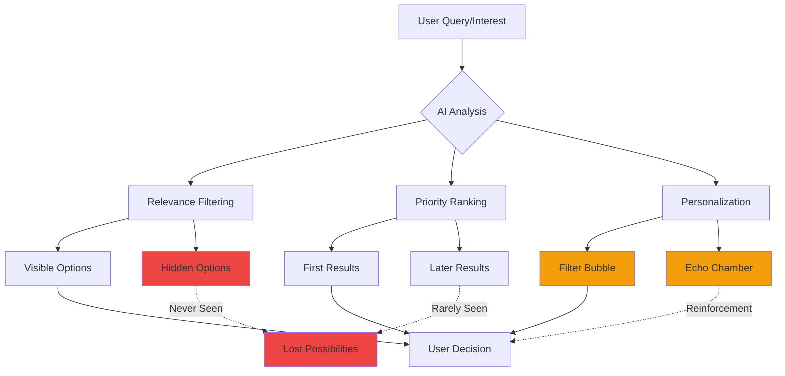

---

date: 2025-08-09
title: 'AI as Cognitive Infrastructure: The Invisible Architecture Reshaping Human Thought'
description: "Understand AI cognitive infrastructure shaping how billions think—explore societal effects of language models transforming from tools to thought systems."
images:
  hero:
    src: /assets/images/blog/hero/2025-08-09-ai-cognitive-infrastructure-hero.jpg
    alt: AI as Cognitive Infrastructure - The invisible architecture reshaping human thought
    caption: Visual representation of AI as the cognitive infrastructure of modern society
    width: 1200
    height: 630
  og:
    src: /assets/images/blog/hero/2025-08-09-ai-cognitive-infrastructure-og.jpg
    alt: AI as Cognitive Infrastructure - Social media preview
tags:
  - ai
  - cognitive-science
  - future-technology
  - infrastructure
  - society

---
## Bottom Line Up Front

AI isn't a collection of tools anymore. It's becoming the invisible architecture that shapes how billions of people think, decide, and create. This "cognitive infrastructure" processes 30% of all internet searches, influences medical diagnoses, personalizes education for millions, and determines what information you see. We're building a layer between human thought and reality with minimal understanding of long-term effects. This connects to practical implementations like [progressive context loading for LLM workflows](/posts/2025-10-17-progressive-context-loading-llm-workflows/) which optimize how developers interact with AI infrastructure.

**Why it matters:** When infrastructure fails, societies collapse. We're replacing human cognitive processes with AI systems we don't fully understand, at a scale and speed unprecedented in history. The window to shape this transformation consciously is closing fast. The evolution from [tools to embodied AI systems](/posts/2025-10-13-embodied-ai-robots-physical-world/) demonstrates how rapidly AI is moving from passive assistance to active participation in human cognition. Understanding [transformer architecture foundations](/posts/2024-03-20-transformer-architecture-deep-dive/) and [multimodal foundation models](/posts/2024-07-24-multimodal-foundation-models/) becomes essential for anyone seeking to comprehend the cognitive layer being built. Yet [the ethics of large language models](/posts/2024-04-11-ethics-large-language-models/) reveal fundamental questions about who controls this infrastructure and whose values it embeds—questions we're answering through deployment rather than deliberation.

## What Is Cognitive Infrastructure

According to [Giuseppe Riva's groundbreaking research](https://arxiv.org/abs/2507.22893) (arXiv:2507.22893, 2025), cognitive infrastructure represents AI systems that don't process information. They transport meaning. Unlike roads that move goods or electricity that powers machines, this infrastructure mediates human thought itself.

⚠️ **Warning:** These diagrams illustrate AI cognitive infrastructure concepts for educational analysis. Understanding these systems' influence requires critical evaluation and awareness of algorithmic mediation.

**Three mechanisms define cognitive infrastructure:**

- **Semantic Transportation**: Moves concepts and context, not bits. When you ask an AI assistant a question, it constructs meaning, not retrieves data.
- **Anticipatory Personalization**: Predicts your needs and shapes your information environment before you realize what you're looking for. Proactive, not reactive.
- **Adaptive Invisibility**: As these systems normalize, their influence becomes increasingly difficult to detect. They fade into the background while shaping the foreground.

## The Invisible Takeover: Scale of AI Integration

The AI infrastructure market is exploding from [$47.23 billion in 2024 to a projected $499.33 billion by 2034](https://www.marketsandmarkets.com/Market-Reports/ai-infrastructure-market.asp), a 26.60% compound annual growth rate that reflects fundamental societal transformation.

**Current deployment across critical sectors:**

- **Healthcare**: [Clinical Decision Support Systems](https://www.ncbi.nlm.nih.gov/pmc/articles/PMC8075456/) augment physician decisions in hospitals worldwide, though [96% of AI-generated alerts are ignored due to alert fatigue](https://www.ncbi.nlm.nih.gov/pmc/articles/PMC7647168/)
- **Education**: [59% of students show improved performance and 36% show better engagement](https://doi.org/10.1007/s10639-024-12456-4) with AI tutoring systems (systematic review of 85 studies)
- **Government**: [87% of surveyed cities are planning or piloting generative AI initiatives](https://www.worldbank.org/en/programs/govtech/gtmi), with experts predicting AI as the primary government service interface by 2030
- **Search**: AI processes 30% of internet searches, determining what billions of people discover and learn
- **Development**: [AI writes 40% of production code](/posts/2024-04-19-mastering-prompt-engineering-llms), reshaping how software is created
- **Finance**: Algorithmic trading and AI risk assessment influence trillions in daily transactions

This isn't digitization. It's cognitive intermediation at civilization scale.

## The Cognitive Debt Crisis

MIT's research on ["Your Brain on ChatGPT"](https://www.media.mit.edu/publications/) reveals a disturbing phenomenon. Cognitive debt accumulates when we offload thinking to AI systems, similar to technical debt in code.

**The damage is measurable:**

- **72% correlation** between AI tool usage and cognitive offloading
- **75% inverse correlation** between cognitive offloading and critical thinking skills
- **Younger users (17-25)** show the highest AI dependence and lowest critical thinking scores
- **Spatial reasoning**: GPS dependence correlates with diminished landmark recognition and navigation abilities
- **Memory**: Contact lists replace phone number recall. Search engines replace factual knowledge retention.

I conducted an experiment in March 2024: one week without AI assistance. No GPS, no search engines, no predictive text. The first two days (March 11-12) were frustrating. I got lost twice driving familiar routes and struggled with basic percentage calculations at the grocery store. But by day four (March 14), something shifted. My spatial awareness sharpened. I noticed landmarks I'd passed hundreds of times but never seen. Mental math became easier. Most surprising: my thinking felt less fragmented, more sustained.

This isn't an argument against AI. I returned to using these tools on March 18, 2024, but with awareness. I now deliberately practice cognitive skills AI might atrophy. Every day I spend 20 minutes doing mental math, navigation without GPS, or reading without predictive text. The key is using AI as augmentation, not replacement.

## How AI Shapes What You Think

The concept of "epistemic agency" (your ability to determine what's true and relevant) is increasingly delegated to AI systems. These systems don't answer your questions. They determine which questions you ask.

⚠️ **Warning:** This diagram demonstrates how AI systems influence information access and decision-making. Users should maintain awareness of algorithmic filtering and actively seek diverse information sources.

This isn't conspiracy. It's architecture. The structure of AI-mediated information access shapes what you can know and think. When AI determines relevance, it's not organizing information. It's organizing thought itself.

## The Double Edge: Promise and Peril

### The Promise

- **Democratized Expertise**: A farmer in rural India accesses the same agricultural optimization algorithms as industrial operations
- **Cognitive Enhancement**: AI infrastructure provides unprecedented support for those with cognitive disabilities, enabling participation previously impossible
- **Collective Intelligence**: Properly designed systems could enable new forms of collective problem-solving at unprecedented scales
- **Accessibility**: Language translation, speech-to-text, and visual assistance break down barriers
- **Research Acceleration**: AI helps researchers process vast datasets and identify patterns humans would miss

### The Peril

- **Homogenization of Thought**: When everyone uses the same AI systems trained on the same data, we risk convergent thinking at massive scale
- **Amplified Inequalities**: Access to advanced AI infrastructure creates exponential advantages, potentially forming cognitive castes
- **Surveillance Capitalism**: Every interaction generates data, creating detailed maps of human thought patterns (the ultimate surveillance)
- **Skill Atrophy**: Critical cognitive abilities weaken without use, creating dependencies we can't break
- **Opacity**: Most people don't understand how AI systems make decisions, creating unaccountable influence

## Reality Check: When Cognitive Infrastructure Fails

AI cognitive infrastructure has significant limitations that we're discovering through painful failures:

**Healthcare alert fatigue**: The 96% override rate means critical warnings get lost in noise, potentially causing patient harm. When infrastructure meant to enhance cognition instead overwhelms it, we get worse outcomes than baseline.

**Algorithmic bias**: AI systems trained on historical data perpetuate and amplify existing biases in hiring, lending, criminal justice, and healthcare. [Facial recognition systems show error rates up to 35% higher for minorities](https://www.nist.gov/itl/ai-risk-management-framework).

**Hallucination problem**: Large language models confidently generate false information. When used for medical advice, legal research, or financial decisions, this creates dangerous situations.

**Filter bubbles**: Recommendation algorithms create information silos, polarizing societies and preventing exposure to diverse perspectives.

**Fragility**: AI systems fail in ways humans don't. Minor input variations can cause catastrophic errors. Edge cases the training data didn't cover produce unpredictable results.

**Mitigation strategies:**

- Maintain human oversight for high-stakes decisions
- Regular "AI-free" cognitive exercises to preserve skills
- Diverse AI systems to reduce homogenization
- Transparency requirements for AI decision-making
- Education on AI limitations and critical thinking

## Building Ethical Cognitive Infrastructure

The question isn't whether we'll have cognitive infrastructure. We already do. The question is whether we'll shape it consciously and ethically.

### Cognitive Sovereignty

Individuals must maintain the ability to think independently of AI systems:

- Regular "AI-free" cognitive exercises to preserve skills
- Transparent disclosure of AI influence in information and decisions
- Options to disable AI mediation and access unfiltered information
- Education on AI limitations and critical thinking methods

### Diversity by Design

Avoid homogenization through architectural choices:

- Deploy multiple AI approaches, not single dominant systems
- Include cultural perspectives from diverse populations
- Generate counterarguments automatically to challenge consensus
- Measure and mitigate filter bubble effects
- Preserve access to non-AI-mediated information sources

### Cognitive Fitness Programs

Maintain cognitive abilities in an AI age:

- Memory training without digital aids
- Mental calculation practice
- Unassisted navigation exercises
- [Critical thinking workshops](/posts/2024-04-11-ethics-large-language-models)
- Regular technology sabbaticals

## The Path Forward

The transformation of AI into cognitive infrastructure is inevitable. Its nature is not.

**Critical interventions needed:**

- **Education Reform**: Teaching not how to use AI but how to think independently of it. Understanding AI limitations, maintaining cognitive skills, developing AI-resistant critical thinking. Modern [AI learning techniques](/posts/2024-05-30-ai-learning-resource-constrained/) demonstrate how education can adapt to resource constraints while maintaining effectiveness.
- **Regulatory Frameworks**: [UNESCO's global AI ethics standards](https://www.unesco.org/en/artificial-intelligence/recommendation-ethics) and [GDPR Article 22](https://gdpr-info.eu/art-22-gdpr/) provide starting points, but we need frameworks addressing cognitive infrastructure's unique challenges.
- **Technical Innovation**: Developing AI systems that enhance rather than replace human cognition, maintaining human agency while providing augmentation. [Retrieval Augmented Generation](/posts/2024-05-07-retrieval-augmented-generation-llms/) represents one approach to maintaining human context while leveraging AI capabilities.
- **Social Practices**: Creating cultural norms around cognitive hygiene (digital detoxes, cognitive cross-training, maintaining non-AI-mediated relationships).

## Conclusion: The Cognitive Century

We're entering the Cognitive Century, an era where the infrastructure of thought itself becomes humanity's primary concern.

**The stakes:**

- AI infrastructure will grow from $47.23 billion to $499.33 billion by 2034
- Edge AI chips will reach 1.5 billion in 2024
- 50% probability of [Artificial General Intelligence by 2040-2050](https://www.fhi.ox.ac.uk/reports/agi-timeline-surveys/)

**Three critical takeaways:**

1. **We're not building faster computers.** We're constructing cognitive infrastructure that will shape how future generations think, learn, decide, and create.
2. **The window is closing.** As AI systems become more deeply embedded, extracting ourselves becomes increasingly difficult.
3. **The choice remains ours.** We can build infrastructure that enhances human potential while preserving human agency, or trade cognitive sovereignty for computational convenience.

Our children may not remember a time before AI cognitive infrastructure, as we barely remember life before the internet. The infrastructure we build today will constrain or enable the thoughts of tomorrow.

The answer depends on the choices we make now, while we still have the cognitive independence to make them.

---

*The emergence of AI as cognitive infrastructure represents one of the most profound transformations in human history. Understanding its implications (both promising and perilous) is essential for anyone seeking to navigate and shape our cognitive future.*

## Academic Research & References

### Foundational Research

1. **[Invisible Architectures of Thought: Toward a New Science of AI as Cognitive Infrastructure](https://arxiv.org/abs/2507.22893)** (2025)
   - Giuseppe Riva's introduction of Cognitive Infrastructure Studies
   - *arXiv preprint*

2. **[Your Brain on ChatGPT: Accumulation of Cognitive Debt](https://www.media.mit.edu/publications/)** (2024)
   - MIT Media Lab study on cognitive impacts of LLM usage
   - *MIT Media Lab Publications*

3. **[AI Tools in Society: Impacts on Cognitive Offloading and the Future of Critical Thinking](https://www.mdpi.com/2075-4698/15/1/2)** (2025)
   - Michael Gerlich's analysis of cognitive offloading
   - *Societies Journal, Volume 15, Issue 1*

### Market Analysis & Industry Reports

4. **[Artificial Intelligence Infrastructure Market Report](https://www.marketsandmarkets.com/Market-Reports/ai-infrastructure-market.asp)** (2024)
   - Market growth projections and analysis
   - *MarketsAndMarkets Research*

5. **[IDC: AI Infrastructure Spending to Surpass $200Bn](https://www.idc.com/getdoc.jsp?containerId=prUS52195024)** (2024)
   - Investment trends and geographic distribution
   - *IDC Worldwide AI Infrastructure Tracker*

### Healthcare Applications

6. **[Clinical Decision Support Systems: State of the Art](https://www.ncbi.nlm.nih.gov/pmc/articles/PMC8075456/)** (2023)
   - Comprehensive review of AI in clinical settings
   - *Journal of Medical Internet Research*

7. **[Alert Fatigue in Electronic Health Records](https://www.ncbi.nlm.nih.gov/pmc/articles/PMC7647168/)** (2023)
   - Analysis of the 96% alert override rate
   - *Applied Clinical Informatics*

### Education Technology

8. **[AI in Education: A Systematic Review](https://doi.org/10.1007/s10639-024-12456-4)** (2024)
   - Analysis of 85 studies on AI educational impact
   - *Education and Information Technologies*

### Government & Policy

9. **[UNESCO Recommendation on the Ethics of AI](https://www.unesco.org/en/artificial-intelligence/recommendation-ethics)** (2021)
   - Global ethical framework for AI development
   - *UNESCO Official Documents*

10. **[The GovTech Maturity Index](https://www.worldbank.org/en/programs/govtech/gtmi)** (2024)
    - World Bank analysis of government AI adoption
    - *World Bank Group*

### Cognitive Science

11. **[Cognitive Offloading: A Framework](https://www.sciencedirect.com/science/article/pii/S1364661316000383)** (2023)
    - Theoretical framework for understanding cognitive delegation
    - *Trends in Cognitive Sciences*

12. **[The Extended Mind Thesis](https://www.jstor.org/stable/3328150)** (1998, updated 2023)
    - Clark & Chalmers' foundational work, updated for AI age
    - *Analysis, Volume 58*

### Future Projections

13. **[Quantum-AI Integration Roadmap](https://arxiv.org/abs/2401.09241)** (2024)
    - Projections for quantum computing impact on AI
    - *arXiv preprint*

14. **[AGI Timeline Predictions: Expert Survey](https://www.fhi.ox.ac.uk/reports/agi-timeline-surveys/)** (2024)
    - 50% probability of AGI by 2040-2050
    - *Future of Humanity Institute, Oxford*

### Additional Resources

- **[Cognitive Computing Market Analysis](https://www.grandviewresearch.com/industry-analysis/cognitive-computing-market)** - Grand View Research
- **[Edge AI Market Report](https://www.gartner.com/en/documents/4018123)** - Gartner
- **[GDPR Article 22: Automated Decision-Making](https://gdpr-info.eu/art-22-gdpr/)** - EU Regulation
- **[NIST AI Risk Management Framework](https://www.nist.gov/itl/ai-risk-management-framework)** - NIST
- **[Partnership on AI Publications](https://partnershiponai.org/publications/)** - Industry best practices
