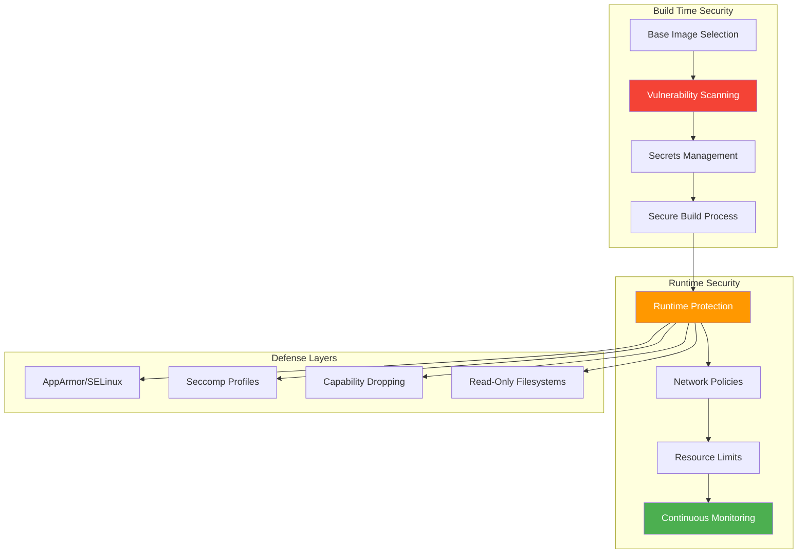

## The Wake-Up Call


*Photo by Timelab Pro on Unsplash*

A few years back, I ran a simple web app in my homelab Docker container. It was "just for testing," so I skipped a few security best practices. A month later, during a routine scan, I discovered my container had been mining cryptocurrency. The attacker got in through an outdated base image with a known vulnerability.

That mistake taught me container security isn't optional—even in a homelab.

## Container Security Architecture



Today, my homelab runs dozens of containers across Docker and K3s with defense-in-depth security. Here's how I hardened them.

## The Foundation: Base Image Selection

Your security posture starts with the base image. I learned this the hard way.

### Minimal Base Images

```dockerfile
# Bad: Full OS with unnecessary attack surface
FROM ubuntu:latest

# Better: Minimal distro
FROM alpine:3.19

# Best: Distroless for production apps
FROM gcr.io/distroless/static-debian11:nonroot
```

**Why distroless?** No shell, no package manager, no utilities—just your application. An attacker with code execution can't pivot because there's nothing to execute.

### Image Verification

Always verify image signatures:

```bash
# Enable Docker Content Trust
export DOCKER_CONTENT_TRUST=1

# Verify image provenance
docker trust inspect alpine:3.19

# Use cosign for advanced verification
cosign verify --key cosign.pub gcr.io/distroless/static:nonroot
```

## Build-Time Security

### Multi-Stage Builds

Separate build dependencies from runtime:

```dockerfile
# Stage 1: Build
FROM golang:1.21-alpine AS builder
WORKDIR /build
COPY . .
RUN CGO_ENABLED=0 go build -ldflags="-s -w" -o app

# Stage 2: Runtime (distroless)
FROM gcr.io/distroless/static-debian11:nonroot
COPY --from=builder /build/app /app
USER nonroot:nonroot
ENTRYPOINT ["/app"]
```

This approach:
- Removes build tools from final image
- Reduces image size by 90%+
- Limits attack surface dramatically

### Vulnerability Scanning Pipeline

I scan every image before deployment using Grype:

```bash
#!/bin/bash
# scan-image.sh

IMAGE=$1
SEVERITY_THRESHOLD="HIGH"

echo "Scanning $IMAGE for vulnerabilities..."

# Scan with Grype
grype "$IMAGE" -o json > scan-results.json

# Check for critical/high vulnerabilities
CRITICAL=$(jq '[.matches[] | select(.vulnerability.severity=="Critical")] | length' scan-results.json)
HIGH=$(jq '[.matches[] | select(.vulnerability.severity=="High")] | length' scan-results.json)

echo "Found $CRITICAL critical and $HIGH high vulnerabilities"

if [ "$CRITICAL" -gt 0 ] || [ "$HIGH" -gt 5 ]; then
    echo "❌ Image failed security scan"
    exit 1
fi

echo "✅ Image passed security scan"
```

Integration with GitHub Actions:

```yaml
name: Container Security Scan

on: [push, pull_request]

jobs:
  scan:
    runs-on: ubuntu-latest
    steps:
      - uses: actions/checkout@v4

      - name: Build image
        run: docker build -t myapp:test .

      - name: Run Grype scan
        uses: anchore/scan-action@v3
        with:
          image: "myapp:test"
          fail-build: true
          severity-cutoff: high

      - name: Run Trivy scan
        uses: aquasecurity/trivy-action@master
        with:
          image-ref: 'myapp:test'
          format: 'sarif'
          output: 'trivy-results.sarif'
```

### Secrets Management

**Never bake secrets into images.** Use secret injection at runtime:

```yaml
# docker-compose.yml with secrets
version: '3.8'
services:
  app:
    image: myapp:latest
    secrets:
      - db_password
      - api_key
    environment:
      DB_PASSWORD_FILE: /run/secrets/db_password
      API_KEY_FILE: /run/secrets/api_key

secrets:
  db_password:
    file: ./secrets/db_password.txt
  api_key:
    file: ./secrets/api_key.txt
```

For K3s, I use sealed secrets:

```bash
# Install sealed-secrets controller
kubectl apply -f https://github.com/bitnami-labs/sealed-secrets/releases/download/v0.24.0/controller.yaml

# Create and seal a secret
kubectl create secret generic db-creds \
  --from-literal=password='mypassword' \
  --dry-run=client -o yaml | \
kubeseal -o yaml > sealed-secret.yaml

# Safe to commit sealed-secret.yaml to git
kubectl apply -f sealed-secret.yaml
```

## Runtime Security

### User Namespaces and Non-Root Execution

Run containers as non-root users:

```dockerfile
# Create non-root user
RUN addgroup -S appgroup && adduser -S appuser -G appgroup

# Switch to non-root user
USER appuser

# Ensure files are owned correctly
COPY --chown=appuser:appgroup . /app
```

Enable user namespace remapping in Docker:

```json
{
  "userns-remap": "default",
  "storage-driver": "overlay2"
}
```

### Capability Dropping

Drop unnecessary Linux capabilities:

```yaml
# docker-compose.yml
services:
  app:
    image: myapp:latest
    cap_drop:
      - ALL
    cap_add:
      - NET_BIND_SERVICE  # Only if binding to ports <1024
    security_opt:
      - no-new-privileges:true
```

For K3s pods:

```yaml
apiVersion: v1
kind: Pod
metadata:
  name: secure-pod
spec:
  securityContext:
    runAsNonRoot: true
    runAsUser: 1000
    fsGroup: 2000
    seccompProfile:
      type: RuntimeDefault
  containers:
  - name: app
    image: myapp:latest
    securityContext:
      allowPrivilegeEscalation: false
      readOnlyRootFilesystem: true
      capabilities:
        drop:
        - ALL
```

### Network Policies

Implement zero-trust networking in K3s:

```yaml
# Default deny all traffic
apiVersion: networking.k8s.io/v1
kind: NetworkPolicy
metadata:
  name: default-deny-all
spec:
  podSelector: {}
  policyTypes:
  - Ingress
  - Egress

---
# Allow specific traffic
apiVersion: networking.k8s.io/v1
kind: NetworkPolicy
metadata:
  name: allow-web-to-api
spec:
  podSelector:
    matchLabels:
      app: api
  policyTypes:
  - Ingress
  ingress:
  - from:
    - podSelector:
        matchLabels:
          app: web
    ports:
    - protocol: TCP
      port: 8080
```

### Resource Limits

Prevent resource exhaustion attacks:

```yaml
# docker-compose.yml
services:
  app:
    image: myapp:latest
    deploy:
      resources:
        limits:
          cpus: '1.0'
          memory: 512M
        reservations:
          cpus: '0.5'
          memory: 256M
    ulimits:
      nofile:
        soft: 1024
        hard: 2048
      nproc:
        soft: 64
        hard: 128
```

## Advanced Hardening

### AppArmor Profiles

Create custom AppArmor profile for Docker:

```bash
# /etc/apparmor.d/docker-myapp
#include <tunables/global>

profile docker-myapp flags=(attach_disconnected,mediate_deleted) {
  #include <abstractions/base>

  # Deny all file writes except to /tmp
  deny /** w,
  /tmp/** rw,

  # Allow reading config
  /etc/myapp/** r,

  # Network access
  network inet tcp,
  network inet udp,
}
```

Load and enforce:

```bash
apparmor_parser -r /etc/apparmor.d/docker-myapp
docker run --security-opt apparmor=docker-myapp myapp:latest
```

### Seccomp Profiles

Restrict system calls:

```json
{
  "defaultAction": "SCMP_ACT_ERRNO",
  "architectures": [
    "SCMP_ARCH_X86_64",
    "SCMP_ARCH_X86",
    "SCMP_ARCH_X32"
  ],
  "syscalls": [
    {
      "names": [
        "accept4", "bind", "connect", "read", "write",
        "close", "stat", "fstat", "open", "openat"
      ],
      "action": "SCMP_ACT_ALLOW"
    }
  ]
}
```

Apply the profile:

```bash
docker run --security-opt seccomp=myapp-seccomp.json myapp:latest
```

### Read-Only Root Filesystem

Mount root filesystem as read-only:

```yaml
# K3s pod with read-only root
apiVersion: v1
kind: Pod
metadata:
  name: readonly-app
spec:
  containers:
  - name: app
    image: myapp:latest
    securityContext:
      readOnlyRootFilesystem: true
    volumeMounts:
    - name: tmp
      mountPath: /tmp
    - name: cache
      mountPath: /app/cache
  volumes:
  - name: tmp
    emptyDir: {}
  - name: cache
    emptyDir: {}
```

## Continuous Monitoring

### Runtime Security with Falco

Install Falco for runtime threat detection:

```bash
# Install on K3s
helm repo add falcosecurity https://falcosecurity.github.io/charts
helm install falco falcosecurity/falco \
  --namespace falco --create-namespace \
  --set falcosidekick.enabled=true \
  --set falcosidekick.webui.enabled=true
```

Custom Falco rules:

```yaml
# /etc/falco/rules.d/custom-rules.yaml
- rule: Unauthorized Process in Container
  desc: Detect unauthorized process execution
  condition: >
    spawned_process and
    container and
    not proc.name in (node, python3, java)
  output: >
    Unauthorized process started in container
    (user=%user.name command=%proc.cmdline container=%container.name)
  priority: WARNING

- rule: Container Drift Detection
  desc: Detect binary execution from non-standard locations
  condition: >
    spawned_process and
    container and
    not proc.exepath startswith /usr
  output: >
    Binary executed from unexpected location
    (command=%proc.cmdline path=%proc.exepath container=%container.name)
  priority: ERROR
```

### Log Aggregation and Analysis

Ship container logs to Wazuh:

```yaml
# filebeat.yml for container logs
filebeat.inputs:
- type: container
  paths:
    - /var/lib/docker/containers/*/*.log
  processors:
    - add_docker_metadata:
        host: "unix:///var/run/docker.sock"

output.logstash:
  hosts: ["wazuh:5044"]
```

## Compliance and Auditing

### CIS Benchmark Scanning

Use Docker Bench Security:

```bash
git clone https://github.com/docker/docker-bench-security.git
cd docker-bench-security
sudo sh docker-bench-security.sh
```

For Kubernetes, use kube-bench:

```bash
kubectl apply -f https://raw.githubusercontent.com/aquasecurity/kube-bench/main/job.yaml
kubectl logs job/kube-bench
```

### Admission Controllers

Enforce policies with OPA Gatekeeper:

```yaml
# Require security contexts
apiVersion: constraints.gatekeeper.sh/v1beta1
kind: K8sRequiredSecurityContext
metadata:
  name: require-security-context
spec:
  match:
    kinds:
      - apiGroups: [""]
        kinds: ["Pod"]
  parameters:
    requiredFields:
      - runAsNonRoot
      - readOnlyRootFilesystem
```

## Lessons Learned

After hardening dozens of containers in my homelab:

### 1. Security is Layers, Not a Single Wall
No single control prevents all attacks. Defense in depth—combining image scanning, runtime protection, network policies, and monitoring—provides real security.

### 2. Automate Everything
Manual security checks don't scale. Integrate scanning into your CI/CD pipeline so vulnerable images never make it to production.

### 3. Least Privilege is Non-Negotiable
Drop all capabilities by default. Run as non-root. Use read-only filesystems. Only grant permissions when absolutely necessary.

### 4. Monitor Runtime Behavior
Build-time scanning catches known vulnerabilities, but runtime monitoring (like Falco) catches zero-days and behavioral anomalies.

### 5. Test Your Defenses
Regularly run penetration tests against your containers. Tools like [botb](https://github.com/brompwnie/botb) can help identify breakout paths.

## Practical Checklist

Before deploying any container:

- [ ] Use minimal base images (Alpine, distroless)
- [ ] Scan for vulnerabilities (Grype, Trivy)
- [ ] Run as non-root user
- [ ] Drop all unnecessary capabilities
- [ ] Enable read-only root filesystem
- [ ] Set resource limits (CPU, memory)
- [ ] Use secrets management (not environment variables)
- [ ] Apply network policies (default deny)
- [ ] Enable security profiles (AppArmor, seccomp)
- [ ] Configure logging and monitoring
- [ ] Test container escape scenarios

## Research & References

### Container Security Standards

1. **[CIS Docker Benchmark](https://www.cisecurity.org/benchmark/docker)** - Docker security best practices
   - Center for Internet Security

2. **[CIS Kubernetes Benchmark](https://www.cisecurity.org/benchmark/kubernetes)** - Kubernetes security hardening guide
   - Center for Internet Security

### Academic Research

1. **[Container Security: Issues, Challenges, and the Road Ahead](https://ieeexplore.ieee.org/document/7966067)** (2017)
   - IEEE Access - Comprehensive container security analysis

2. **[Analysis of Docker Security](https://arxiv.org/abs/1804.05039)** (2018)
   - arXiv preprint - Docker attack surface analysis

### Security Tools

- **[Anchore Grype](https://github.com/anchore/grype)** - Vulnerability scanner
- **[Aqua Trivy](https://github.com/aquasecurity/trivy)** - Multi-purpose security scanner
- **[Falco](https://falco.org/)** - Runtime security monitoring
- **[OPA Gatekeeper](https://open-policy-agent.github.io/gatekeeper/)** - Policy enforcement

### Best Practices Guides

- **[Docker Security Cheat Sheet](https://cheatsheetseries.owasp.org/cheatsheets/Docker_Security_Cheat_Sheet.html)** - OWASP
- **[Kubernetes Security Overview](https://kubernetes.io/docs/concepts/security/)** - Official docs
- **[NSA Kubernetes Hardening Guide](https://media.defense.gov/2022/Aug/29/2003066362/-1/-1/0/CTR_KUBERNETES_HARDENING_GUIDANCE_1.2_20220829.PDF)** - NSA/CISA

## Conclusion

Container security isn't complicated—it's about applying consistent, layered controls. Start with secure base images, scan for vulnerabilities, apply runtime protections, and monitor continuously.

My homelab cryptocurrency mining incident taught me that "just testing" environments need the same security rigor as production. The controls I've shared here are battle-tested across my Docker and K3s deployments, catching real threats before they become incidents.

Security is a journey, not a destination. Start with the basics, automate what you can, and continuously improve your defenses.

---

*Running containers in your homelab? What security controls have you implemented? I'd love to hear about your approach and lessons learned!*
