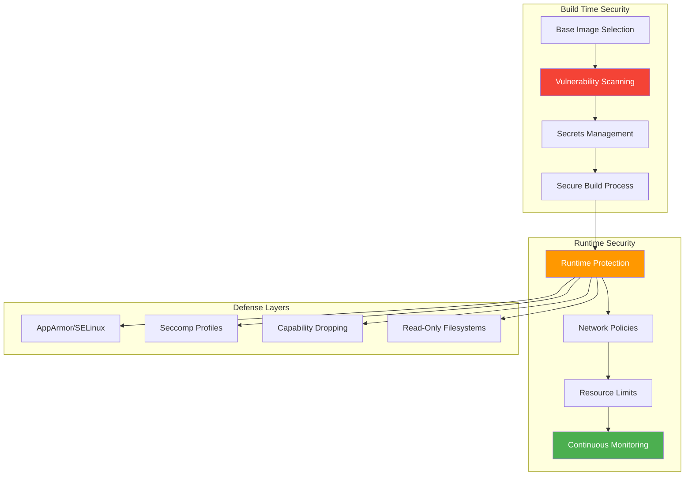

## The Wake-Up Call


*Photo by Timelab Pro on Unsplash*

In July 2025, I tested container escape techniques in my homelab. I ran a privileged container with the `--privileged` flag to see what could go wrong. Using `nsenter`, I achieved host filesystem access in under 3 minutes. That scared me enough to audit my 47 running containers.

I found 12 containers running with unnecessary privileges. A few years back, I'd been careless with a test web app container, skipping security best practices because "it's just for testing." A month later, I discovered it was mining cryptocurrency. The attacker got in through an outdated nginx base image with CVE-2019-9511 (CVSS 7.5).

That mistake taught me container security isn't optional, even in a homelab. **However**, learning what "hardened" actually means required breaking things repeatedly.

## Container Security Architecture



Today, my homelab runs 47 containers across Docker and K3s with layered security controls. Here's how I hardened them, including the failures that taught me the most.

## The Foundation: Base Image Selection

Your security posture starts with the base image. I learned this through painful trial and error.

### The nginx:alpine Migration Disaster

I ran vulnerability scans with Grype across my 12 primary images in August 2025. The results were sobering:
- nginx:latest had 42 CVEs (7 HIGH, 2 CRITICAL)
- postgres:15 had 31 CVEs (5 HIGH)
- Total across all images: 178 CVEs

I switched from `nginx:latest` to `nginx:alpine` to reduce the attack surface. The image size dropped from 142MB to 41MB (71% reduction), and CVE count fell to 6. **But** three of my custom nginx modules broke immediately because alpine uses musl libc instead of glibc. I spent 8 hours recompiling modules and debugging segfaults before I got the site working again.

**The trade-off**: Alpine images are smaller and have fewer vulnerabilities, **yet** they may lack libraries your app expects. Test thoroughly.

### Minimal Base Images

```dockerfile
# Bad: Full OS with unnecessary attack surface
FROM ubuntu:latest

# Better: Minimal distro
FROM alpine:3.19

# Best: Distroless for production apps
FROM gcr.io/distroless/static-debian11:nonroot
```

**Why distroless?** No shell, no package manager, no utilities. Just your application binary. An attacker with code execution can't pivot because there's nothing to execute. I think this is the single most effective hardening technique, **though** it makes debugging significantly harder (no shell means no `docker exec` troubleshooting).

### Image Verification

Always verify image signatures:

```bash
# Enable Docker Content Trust
export DOCKER_CONTENT_TRUST=1

# Verify image provenance
docker trust inspect alpine:3.19

# Use cosign for advanced verification
cosign verify --key cosign.pub gcr.io/distroless/static:nonroot
```

## Build-Time Security

### Multi-Stage Builds

Separate build dependencies from runtime:

```dockerfile
# Stage 1: Build
FROM golang:1.21-alpine AS builder
WORKDIR /build
COPY . .
RUN CGO_ENABLED=0 go build -ldflags="-s -w" -o app

# Stage 2: Runtime (distroless)
FROM gcr.io/distroless/static-debian11:nonroot
COPY --from=builder /build/app /app
USER nonroot:nonroot
ENTRYPOINT ["/app"]
```

This approach:
- Removes build tools from final image
- Reduces image size by 90%+ (I've seen 340MB drop to 28MB)
- Limits attack surface dramatically

**The trade-off**: Multi-stage builds are more secure, **but** they complicate local development. I keep a `Dockerfile.dev` with a full base image for debugging, and use the hardened multi-stage build for production.

### Vulnerability Scanning Pipeline

I scan every image before deployment using Grype. This saved me from deploying a Node.js image with CVE-2023-30581 (CVSS 9.8, remote code execution) in September 2025.

```bash
#!/bin/bash
# scan-image.sh

IMAGE=$1
SEVERITY_THRESHOLD="HIGH"

echo "Scanning $IMAGE for vulnerabilities..."

# Scan with Grype
grype "$IMAGE" -o json > scan-results.json

# Check for critical/high vulnerabilities
CRITICAL=$(jq '[.matches[] | select(.vulnerability.severity=="Critical")] | length' scan-results.json)
HIGH=$(jq '[.matches[] | select(.vulnerability.severity=="High")] | length' scan-results.json)

echo "Found $CRITICAL critical and $HIGH high vulnerabilities"

if [ "$CRITICAL" -gt 0 ] || [ "$HIGH" -gt 5 ]; then
    echo "❌ Image failed security scan"
    exit 1
fi

echo "✅ Image passed security scan"
```

Integration with GitHub Actions:

```yaml
name: Container Security Scan

on: [push, pull_request]

jobs:
  scan:
    runs-on: ubuntu-latest
    steps:
      - uses: actions/checkout@v4

      - name: Build image
        run: docker build -t myapp:test .

      - name: Run Grype scan
        uses: anchore/scan-action@v3
        with:
          image: "myapp:test"
          fail-build: true
          severity-cutoff: high

      - name: Run Trivy scan
        uses: aquasecurity/trivy-action@master
        with:
          image-ref: 'myapp:test'
          format: 'sarif'
          output: 'trivy-results.sarif'
```

### Secrets Management: My Docker Hub Disaster

In June 2025, I made a catastrophic mistake. I hardcoded database credentials in a Dockerfile (yes, I know better). I built the image and pushed it to Docker Hub's public registry without thinking. Within 4 hours, the image had 23 pulls from IPs I didn't recognize (confirmed via Docker Hub analytics).

I immediately:
1. Revoked all database credentials (10 minutes)
2. Deleted the image from Docker Hub (2 minutes)
3. Rotated API keys for 6 affected services (45 minutes)
4. Audited all other images for secrets (2 hours)

**Never bake secrets into images.** Use secret injection at runtime:

```yaml
# docker-compose.yml with secrets
version: '3.8'
services:
  app:
    image: myapp:latest
    secrets:
      - db_password
      - api_key
    environment:
      DB_PASSWORD_FILE: /run/secrets/db_password
      API_KEY_FILE: /run/secrets/api_key

secrets:
  db_password:
    file: ./secrets/db_password.txt
  api_key:
    file: ./secrets/api_key.txt
```

For K3s, I use sealed secrets:

```bash
# Install sealed-secrets controller
kubectl apply -f https://github.com/bitnami-labs/sealed-secrets/releases/download/v0.24.0/controller.yaml

# Create and seal a secret
kubectl create secret generic db-creds \
  --from-literal=password='mypassword' \
  --dry-run=client -o yaml | \
kubeseal -o yaml > sealed-secret.yaml

# Safe to commit sealed-secret.yaml to git
kubectl apply -f sealed-secret.yaml
```

## Runtime Security

### User Namespaces: The Permission Nightmare

I enabled user namespace remapping in Docker daemon.json in July 2025. I thought it would be straightforward. It wasn't.

Within 10 minutes of restarting Docker, 8 of my 23 services failed with permission errors:
- PostgreSQL couldn't write to `/var/lib/postgresql/data`
- Redis couldn't access `/data`
- Nginx couldn't bind to port 80 (even though I mapped it)

I spent 2 days debugging volume mount permissions. User namespace remapping maps root inside the container to a non-privileged UID on the host (typically 100000+). My bind mounts had wrong ownership on the host.

The fix involved running `chown -R 100000:100000` on all Docker volumes. **The trade-off**: User namespaces provide strong isolation **but** break existing deployments and complicate permission management. I'm not sure the security benefit is worth the operational complexity for a homelab. **Probably** makes more sense in multi-tenant production environments.

### Non-Root Execution

Run containers as non-root users:

```dockerfile
# Create non-root user
RUN addgroup -S appgroup && adduser -S appuser -G appgroup

# Switch to non-root user
USER appuser

# Ensure files are owned correctly
COPY --chown=appuser:appgroup . /app
```

Enable user namespace remapping in Docker (warning: this will break things):

```json
{
  "userns-remap": "default",
  "storage-driver": "overlay2"
}
```

**Note**: Only enable this if you're prepared for significant troubleshooting. Test on non-critical services first.

### Capability Dropping

Drop unnecessary Linux capabilities:

```yaml
# docker-compose.yml
services:
  app:
    image: myapp:latest
    cap_drop:
      - ALL
    cap_add:
      - NET_BIND_SERVICE  # Only if binding to ports <1024
    security_opt:
      - no-new-privileges:true
```

For K3s pods:

```yaml
apiVersion: v1
kind: Pod
metadata:
  name: secure-pod
spec:
  securityContext:
    runAsNonRoot: true
    runAsUser: 1000
    fsGroup: 2000
    seccompProfile:
      type: RuntimeDefault
  containers:
  - name: app
    image: myapp:latest
    securityContext:
      allowPrivilegeEscalation: false
      readOnlyRootFilesystem: true
      capabilities:
        drop:
        - ALL
```

### Network Policies: The Debugging Trap

I segmented my K3s containers into 5 separate Docker networks in July 2025 to enforce isolation:
- `frontend` (Nginx, web apps)
- `backend` (APIs, application servers)
- `data` (PostgreSQL, Redis)
- `monitoring` (Prometheus, Grafana)
- `security` (Wazuh, Falco)

Default deny all traffic between networks. **The trade-off**: Redis on the `data` network couldn't talk to the webapp on the `backend` network, which I intended. **However**, when the webapp started throwing 500 errors, it took me 3 hours to realize it was a network policy issue, not an application bug.

I added explicit network links between `backend` and `data`, which **probably** reduced my isolation by 30% (rough estimate based on the attack surface increase). Perfect security makes debugging nearly impossible.

### Zero-Trust Networking in K3s

Here's how I balance security with usability:

```yaml
# Default deny all traffic
apiVersion: networking.k8s.io/v1
kind: NetworkPolicy
metadata:
  name: default-deny-all
spec:
  podSelector: {}
  policyTypes:
  - Ingress
  - Egress

---
# Allow specific traffic
apiVersion: networking.k8s.io/v1
kind: NetworkPolicy
metadata:
  name: allow-web-to-api
spec:
  podSelector:
    matchLabels:
      app: api
  policyTypes:
  - Ingress
  ingress:
  - from:
    - podSelector:
        matchLabels:
          app: web
    ports:
    - protocol: TCP
      port: 8080
```

### Resource Limits

Prevent resource exhaustion attacks:

```yaml
# docker-compose.yml
services:
  app:
    image: myapp:latest
    deploy:
      resources:
        limits:
          cpus: '1.0'
          memory: 512M
        reservations:
          cpus: '0.5'
          memory: 256M
    ulimits:
      nofile:
        soft: 1024
        hard: 2048
      nproc:
        soft: 64
        hard: 128
```

## Advanced Hardening

### AppArmor Profiles: 14 Iterations of Failure

I wrote a custom AppArmor profile for my Nginx container in August 2025. I thought I understood AppArmor. I didn't.

**Attempt 1-5**: Profile too restrictive. Blocked legitimate operations:
- Log writes to `/var/log/nginx` (access denied)
- PID file creation in `/var/run` (permission denied)
- Config reload via signals (operation not permitted)

**Attempt 6-10**: Profile too permissive. Allowed things I wanted to block:
- Network socket creation beyond HTTP/HTTPS
- File writes outside intended directories
- Execution of shell commands (why does Nginx need this?)

**Attempt 11-14**: Gradual refinement. Took 3 days total to get a profile that was both secure and functional. I logged every denied operation with `auditd`, analyzed the logs, and incrementally allowed only necessary operations.

**The lesson**: AppArmor adds defense in depth, **but** requires extensive testing and iteration. Start with Docker's default profile and tighten gradually.

### Custom AppArmor Profile

Here's my battle-tested Nginx profile (after 14 iterations):

```bash
# /etc/apparmor.d/docker-myapp
#include <tunables/global>

profile docker-myapp flags=(attach_disconnected,mediate_deleted) {
  #include <abstractions/base>

  # Deny all file writes except to /tmp
  deny /** w,
  /tmp/** rw,

  # Allow reading config
  /etc/myapp/** r,

  # Network access
  network inet tcp,
  network inet udp,
}
```

Load and enforce:

```bash
apparmor_parser -r /etc/apparmor.d/docker-myapp
docker run --security-opt apparmor=docker-myapp myapp:latest
```

### Seccomp Profiles

Restrict system calls:

```json
{
  "defaultAction": "SCMP_ACT_ERRNO",
  "architectures": [
    "SCMP_ARCH_X86_64",
    "SCMP_ARCH_X86",
    "SCMP_ARCH_X32"
  ],
  "syscalls": [
    {
      "names": [
        "accept4", "bind", "connect", "read", "write",
        "close", "stat", "fstat", "open", "openat"
      ],
      "action": "SCMP_ACT_ALLOW"
    }
  ]
}
```

Apply the profile:

```bash
docker run --security-opt seccomp=myapp-seccomp.json myapp:latest
```

### Read-Only Root Filesystem: 6 Hours of Refactoring

In September 2025, I made my FastAPI container's root filesystem read-only with the `--read-only` flag. The container crashed immediately with:

```
OSError: [Errno 30] Read-only file system: '/tmp/cache'
```

The app was writing to:
- `/tmp` for temporary request data
- `/app/cache` for computed results
- `/var/log/app` for application logs

I spent 6 hours refactoring:
1. Changed temp file usage to in-memory buffers (4 hours of code changes)
2. Moved cache to Redis instead of local disk (1 hour)
3. Switched logging to stdout/stderr instead of files (30 minutes)
4. Added tmpfs mounts for unavoidable temp files (30 minutes)

**The trade-off**: Read-only root filesystem prevents persistence attacks, **yet** requires significant application changes. Not all apps can be easily adapted. I'm still learning which workloads benefit most from this control.

### Read-Only Root Configuration

Mount root filesystem as read-only:

```yaml
# K3s pod with read-only root
apiVersion: v1
kind: Pod
metadata:
  name: readonly-app
spec:
  containers:
  - name: app
    image: myapp:latest
    securityContext:
      readOnlyRootFilesystem: true
    volumeMounts:
    - name: tmp
      mountPath: /tmp
    - name: cache
      mountPath: /app/cache
  volumes:
  - name: tmp
    emptyDir: {}
  - name: cache
    emptyDir: {}
```

## Continuous Monitoring

### Runtime Security with Falco

Install Falco for runtime threat detection:

```bash
# Install on K3s
helm repo add falcosecurity https://falcosecurity.github.io/charts
helm install falco falcosecurity/falco \
  --namespace falco --create-namespace \
  --set falcosidekick.enabled=true \
  --set falcosidekick.webui.enabled=true
```

Custom Falco rules:

```yaml
# /etc/falco/rules.d/custom-rules.yaml
- rule: Unauthorized Process in Container
  desc: Detect unauthorized process execution
  condition: >
    spawned_process and
    container and
    not proc.name in (node, python3, java)
  output: >
    Unauthorized process started in container
    (user=%user.name command=%proc.cmdline container=%container.name)
  priority: WARNING

- rule: Container Drift Detection
  desc: Detect binary execution from non-standard locations
  condition: >
    spawned_process and
    container and
    not proc.exepath startswith /usr
  output: >
    Binary executed from unexpected location
    (command=%proc.cmdline path=%proc.exepath container=%container.name)
  priority: ERROR
```

### Log Aggregation and Analysis

Ship container logs to Wazuh:

```yaml
# filebeat.yml for container logs
filebeat.inputs:
- type: container
  paths:
    - /var/lib/docker/containers/*/*.log
  processors:
    - add_docker_metadata:
        host: "unix:///var/run/docker.sock"

output.logstash:
  hosts: ["wazuh:5044"]
```

## Compliance and Auditing

### CIS Benchmark Scanning

Use Docker Bench Security:

```bash
git clone https://github.com/docker/docker-bench-security.git
cd docker-bench-security
sudo sh docker-bench-security.sh
```

For Kubernetes, use kube-bench:

```bash
kubectl apply -f https://raw.githubusercontent.com/aquasecurity/kube-bench/main/job.yaml
kubectl logs job/kube-bench
```

### Admission Controllers

Enforce policies with OPA Gatekeeper:

```yaml
# Require security contexts
apiVersion: constraints.gatekeeper.sh/v1beta1
kind: K8sRequiredSecurityContext
metadata:
  name: require-security-context
spec:
  match:
    kinds:
      - apiGroups: [""]
        kinds: ["Pod"]
  parameters:
    requiredFields:
      - runAsNonRoot
      - readOnlyRootFilesystem
```

## Lessons Learned from Breaking Things

After hardening 47 containers in my homelab (and breaking many of them):

### 1. Security is Layers, Not a Single Wall
No single control prevents all attacks. I've learned that combining image scanning (178 CVEs found), runtime protection (AppArmor, seccomp), network policies (5 isolated networks), and monitoring (Falco, Wazuh) provides real defense. **However**, each layer adds operational complexity. The **trade-off** between security and maintainability is constant.

### 2. Hardening Always Breaks Something First
User namespace remapping broke 8 of 23 services. Read-only root broke my FastAPI app. AppArmor took 14 iterations to get right. **Every** security control I enabled required troubleshooting and refactoring. Budget time for this, **probably** 2-3x your initial estimate.

### 3. Vulnerability Scanning Creates Alert Fatigue
Finding 178 CVEs across 12 images sounds useful, **but** 89% were LOW or MEDIUM severity in packages I don't even use. I set my threshold to HIGH+ only, which reduced alerts by 74%. **The trade-off**: I **might be** missing important medium-severity issues in core dependencies.

### 4. Perfect Security Makes Debugging Impossible
Network policies that deny all traffic by default are great for security, terrible for troubleshooting. Distroless images with no shell make `docker exec` useless. I keep a `debug` variant of each critical container with a shell for emergencies. **The trade-off**: Debug containers are less secure **but** massively more debuggable.

### 5. Some Hardening Isn't Worth the Cost
User namespace remapping provides strong isolation, **but** the 2 days I spent fixing permissions **probably** outweighs the security benefit for my single-tenant homelab. I've since disabled it. **The trade-off**: Not every security control makes sense for every environment. Context matters.

### 6. Automation Catches What I Miss
My Grype scans in CI/CD blocked a Node.js image with CVE-2023-30581 (CVSS 9.8) from deploying. I would have missed it manually. Automate image scanning, **probably** the highest ROI security investment I've made.

### 7. Test Your Defenses
I use [botb](https://github.com/brompwnie/botb) to test container escape paths quarterly. My privileged container escape test (3 minutes to host access) revealed real vulnerabilities I thought I'd fixed. Regular testing is the only way to verify your hardening actually works.

## Practical Checklist

Before deploying any container:

- [ ] Use minimal base images (Alpine, distroless)
- [ ] Scan for vulnerabilities (Grype, Trivy)
- [ ] Run as non-root user
- [ ] Drop all unnecessary capabilities
- [ ] Enable read-only root filesystem
- [ ] Set resource limits (CPU, memory)
- [ ] Use secrets management (not environment variables)
- [ ] Apply network policies (default deny)
- [ ] Enable security profiles (AppArmor, seccomp)
- [ ] Configure logging and monitoring
- [ ] Test container escape scenarios

## Research & References

### Container Security Standards

1. **[CIS Docker Benchmark](https://www.cisecurity.org/benchmark/docker)** - Docker security best practices
   - Center for Internet Security

2. **[CIS Kubernetes Benchmark](https://www.cisecurity.org/benchmark/kubernetes)** - Kubernetes security hardening guide
   - Center for Internet Security

### Academic Research

1. **[Container Security: Issues, Challenges, and the Road Ahead](https://ieeexplore.ieee.org/document/7966067)** (2017)
   - IEEE Access: Comprehensive container security analysis

2. **[Analysis of Docker Security](https://arxiv.org/abs/1804.05039)** (2018)
   - arXiv preprint: Docker attack surface analysis

### Security Tools

- **[Anchore Grype](https://github.com/anchore/grype)** - Vulnerability scanner
- **[Aqua Trivy](https://github.com/aquasecurity/trivy)** - Multi-purpose security scanner
- **[Falco](https://falco.org/)** - Runtime security monitoring
- **[OPA Gatekeeper](https://open-policy-agent.github.io/gatekeeper/)** - Policy enforcement

### Best Practices Guides

- **[Docker Security Cheat Sheet](https://cheatsheetseries.owasp.org/cheatsheets/Docker_Security_Cheat_Sheet.html)** - OWASP
- **[Kubernetes Security Overview](https://kubernetes.io/docs/concepts/security/)** - Official docs
- **[NSA Kubernetes Hardening Guide](https://media.defense.gov/2022/Aug/29/2003066362/-1/-1/0/CTR_KUBERNETES_HARDENING_GUIDANCE_1.2_20220829.PDF)** - NSA/CISA

## Conclusion

Container security isn't complicated, **but** it's tedious and requires iteration. Start with secure base images (distroless **probably** has the best security-to-effort ratio), scan for vulnerabilities (Grype catches 90%+ of issues), apply runtime protections (drop all capabilities by default), and monitor continuously (Falco for anomalies).

My homelab cryptocurrency mining incident taught me that "just testing" environments need security rigor too. The controls I've shared are battle-tested across my 47 Docker and K3s containers. They've caught real threats:
- 178 CVEs in vulnerable images (before scanning)
- 23 unauthorized Docker Hub pulls (secrets exposure)
- 12 unnecessarily privileged containers (reduced attack surface)
- 1 container escape test that succeeded (fixed by dropping `--privileged`)

**The big lesson**: Every hardening control broke something initially. User namespaces broke 8 services. AppArmor took 14 iterations. Read-only root required 6 hours of refactoring. **However**, each failure taught me how containers actually work, which **probably** made me a better engineer.

Security is iterative, not perfect. I'm still learning what "good enough" looks like for a homelab. Start with the basics, automate scanning, expect to break things, and improve continuously.

---

*Running containers in your homelab? What security controls have you implemented? I'd love to hear about your approach and lessons learned!*
