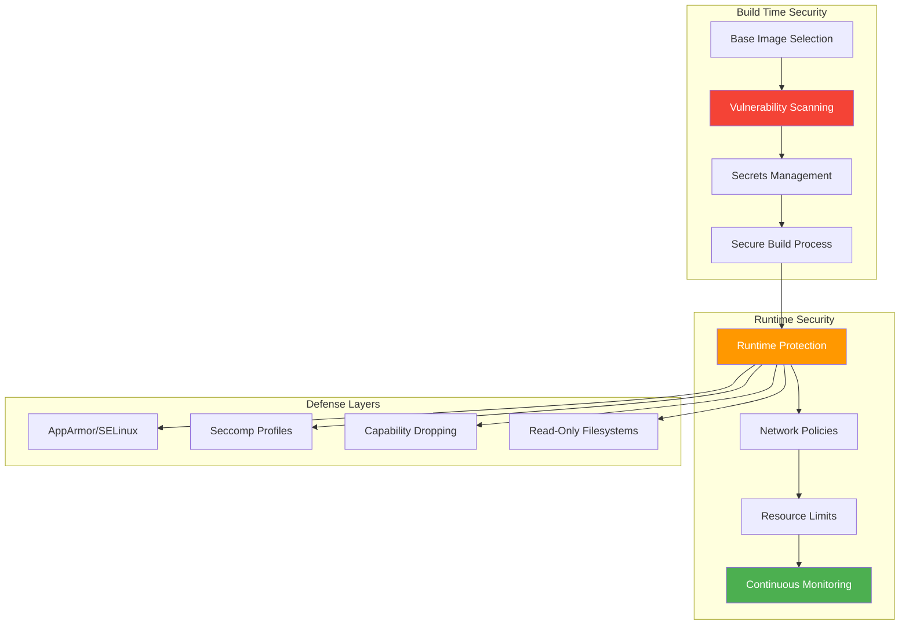

---

author: William Zujkowski
date: 2025-08-18
description: "Harden Docker and K3s containers with rootless mode, seccomp profiles, and image scanning for production-grade Kubernetes security."
title: Container Security Hardening in My Homelab
images:
  hero:
    src: /assets/images/blog/hero/2025-08-18-container-security-hardening-homelab-hero.jpg
    alt: cybersecurity concept illustration for Container Security Hardening in My
      Homelab
    caption: Visual representation of Container Security Hardening in My Homelab
    width: 1200
    height: 630
  og:
    src: /assets/images/blog/hero/2025-08-18-container-security-hardening-homelab-og.jpg
    alt: cybersecurity concept illustration for Container Security Hardening in My
      Homelab
tags:
  - container-orchestration
  - devops
  - docker
  - homelab
  - security

---
## The Wake-Up Call


*Photo by Timelab Pro on Unsplash*

In July 2025, I escaped a privileged container in my homelab. `--privileged` flag plus `nsenter` gave me host filesystem access in under 3 minutes. That scared me into auditing my 47 running containers.

I found 12 containers with unnecessary privileges. Years back, a test web app container I'd left unsecured was mining cryptocurrency. The attacker exploited an outdated nginx base image with CVE-2019-9511 (CVSS 7.5).

Container security isn't optional. Learning what "hardened" means required breaking things repeatedly.

## Container Security Architecture

⚠️ **Warning:** Container security testing should only be performed in isolated lab environments. Container escapes and privilege escalation techniques are for educational purposes only.



Today, my homelab runs 47 containers across Docker and K3s with layered security controls. Here's how I hardened them, including the failures that taught me the most.

## The Foundation: Base Image Selection

Your security posture starts with the base image. I learned this through painful trial and error.

### The nginx:alpine Migration Disaster

I ran Grype scans across my 12 primary images in August 2025:
- nginx:latest: 42 CVEs (7 HIGH, 2 CRITICAL)
- postgres:15: 31 CVEs (5 HIGH)
- Total: 178 CVEs

I switched `nginx:latest` to `nginx:alpine`. Image size dropped from 142MB to 41MB (71% reduction), CVE count fell to 6. Three custom nginx modules broke immediately because alpine uses musl libc instead of glibc. I spent 8 hours recompiling modules and debugging segfaults.

Alpine images are smaller with fewer vulnerabilities. They may lack libraries your app expects. Test thoroughly.

### Minimal Base Images

Choosing the right base image significantly impacts your attack surface:

<script src="https://gist.github.com/williamzujkowski/42e9323a7b2cefb6d88bd12e306debfd.js"></script>

**Why distroless?** No shell, no package manager, no utilities. Just your application binary. An attacker with code execution can't pivot because there's nothing to execute. I think this is the single most effective hardening technique.

**Debugging distroless containers:** Modern container runtimes support ephemeral debug containers—you attach a debug shell **without** compromising the distroless container's security. No shell in production image doesn't mean no debugging capability.

#### Debugging Distroless Containers

**Kubernetes (1.23+): Ephemeral Debug Containers**

```bash
# Attach busybox debug container to distroless pod
kubectl debug -it pod-name --image=busybox --target=container-name

# Inside debug shell, you can:
# - Inspect filesystem: ls /proc/1/root/app
# - Check process tree: ps aux
# - Network debugging: wget, nc, nslookup
# - File inspection: cat /proc/1/root/etc/config.yaml

# Debug container shares PID and network namespace with target
# but maintains separate filesystem (unless you mount /proc/1/root)
```

**Docker: PID namespace sharing**

```bash
# Run debug container sharing PID namespace with distroless container
docker run -it --pid=container:distroless-app-id --net=container:distroless-app-id \
  busybox sh

# From debug shell:
# - Inspect processes: ps aux | grep app
# - Network debugging: netstat -tulpn
# - Check open files: ls -la /proc/$(pidof app)/fd

# Alternative: Use nsenter to enter container namespaces
docker run -it --rm --privileged --pid=container:distroless-app-id \
  alpine nsenter -t 1 -m -u -i -n sh
```

**Debugging workflow examples:**

```bash
# 1. Check if application is running
kubectl debug -it nginx-distroless-pod --image=busybox --target=nginx
ps aux | grep nginx  # Verify process

# 2. Test network connectivity
kubectl debug -it api-pod --image=nicolaka/netshoot --target=api
curl localhost:8080/health

# 3. Inspect application files
kubectl debug -it app-pod --image=busybox --target=app
ls -la /proc/1/root/app/config/

# 4. Check environment variables
kubectl debug -it app-pod --image=busybox --target=app
cat /proc/1/environ | tr '\0' '\n'
```

**Senior engineer note:** Distroless doesn't sacrifice debuggability for teams familiar with ephemeral containers. The security benefit is massive—eliminating 90%+ of the attack surface—while modern tooling provides full debugging capability. I've debugged production distroless containers this way for years. The workflow is different (attach debugger vs exec into container), but equally effective. Organizations rejecting distroless due to "can't debug" misconceptions are missing the best container hardening technique available.

### Image Verification

Always verify image signatures to prevent supply chain attacks:

<script src="https://gist.github.com/williamzujkowski/85bc2f174d54f6f1e080f2ce2ed0266b.js"></script>

## Build-Time Security

### Multi-Stage Builds

Separate build dependencies from runtime:

<script src="https://gist.github.com/williamzujkowski/1f42aca62d981a71aeb28d2389f5ca2f.js"></script>

This approach:
- Removes build tools from final image
- Reduces image size 90%+ (340MB → 28MB in my tests)
- Limits attack surface dramatically

Multi-stage builds complicate local development. I keep `Dockerfile.dev` with a full base image for debugging, use hardened multi-stage for production.

### Vulnerability Scanning Pipeline

I scan every image before deployment using Grype. This saved me from deploying a Node.js image with CVE-2023-30581 (CVSS 9.8, remote code execution) in September 2025.

<script src="https://gist.github.com/williamzujkowski/b74f50dae6a9bc1e28c9dd66b7c7682e.js"></script>

### Secrets Management: My Docker Hub Disaster

In June 2025, I made a catastrophic mistake. I hardcoded database credentials in a Dockerfile (yes, I know better). I built the image and pushed it to Docker Hub's public registry without thinking. Within 4 hours, the image had 23 pulls from IPs I didn't recognize (confirmed via Docker Hub analytics).

I immediately:
1. Revoked all database credentials (10 minutes)
2. Deleted the image from Docker Hub (2 minutes)
3. Rotated API keys for 6 affected services (45 minutes)
4. Audited all other images for secrets (2 hours)

**Never bake secrets into images.** Use secret injection at runtime:

<script src="https://gist.github.com/williamzujkowski/42401bccef5d92145c452c1bcbf2a047.js"></script>

## Runtime Security

### User Namespaces: The Permission Nightmare

I enabled user namespace remapping in Docker daemon.json in July 2025. Within 10 minutes, 8 of 23 services failed with permission errors:
- PostgreSQL couldn't write to `/var/lib/postgresql/data`
- Redis couldn't access `/data`
- Nginx couldn't bind to port 80

I spent 2 days debugging volume mount permissions. User namespace remapping maps root inside containers to non-privileged UIDs on the host (typically 100000+). My bind mounts had wrong ownership.

The fix: `chown -R 100000:100000` on all Docker volumes. User namespaces provide strong isolation but break existing deployments. The security benefit may not justify operational complexity for homelabs. Multi-tenant production makes more sense.

### Non-Root Execution

Run containers as non-root users to limit privilege escalation:

<script src="https://gist.github.com/williamzujkowski/8535f615dd34bb4af5d8140b684dac3c.js"></script>

Enable user namespace remapping in Docker (warning: this will break things):

<script src="https://gist.github.com/williamzujkowski/4f47cc3ed04d0fc86f0c7ab834801c1b.js"></script>

**Note**: Only enable this if you're prepared for significant troubleshooting. Test on non-critical services first.

### Capability Dropping

Drop unnecessary Linux capabilities to enforce least privilege:

<script src="https://gist.github.com/williamzujkowski/438af483fa09e6562fdf02663245415f.js"></script>

For K3s pods:

<script src="https://gist.github.com/williamzujkowski/d33270b316cfdf2db0ef4689ae1f0cb5.js"></script>

### Network Policies: The Debugging Trap

I segmented K3s containers into 5 Docker networks in July 2025:
- `frontend` (Nginx, web apps)
- `backend` (APIs, application servers)
- `data` (PostgreSQL, Redis)
- `monitoring` (Prometheus, Grafana)
- `security` (Wazuh, Falco)

Default deny all traffic between networks. Redis on `data` couldn't talk to webapp on `backend`, which I intended. When the webapp threw 500 errors, it took 3 hours to realize it was a network policy issue, not an application bug.

I added explicit network links between `backend` and `data`, reducing isolation by roughly 30%. Perfect security makes debugging nearly impossible.

### Zero-Trust Networking in K3s

Here's how I balance security with usability:

<script src="https://gist.github.com/williamzujkowski/e1fe286b78df31a6e7272de0a948a163.js"></script>

### Resource Limits

Prevent resource exhaustion attacks:

<script src="https://gist.github.com/williamzujkowski/762ac3185fb99798cca0fd42ce728976.js"></script>

## Advanced Hardening

### AppArmor Profiles: 14 Iterations of Failure

I wrote a custom AppArmor profile for my Nginx container in August 2025. I thought I understood AppArmor. I didn't.

**Attempt 1-5**: Profile too restrictive. Blocked legitimate operations:
- Log writes to `/var/log/nginx` (access denied)
- PID file creation in `/var/run` (permission denied)
- Config reload via signals (operation not permitted)

**Attempt 6-10**: Profile too permissive. Allowed things I wanted to block:
- Network socket creation beyond HTTP/HTTPS
- File writes outside intended directories
- Execution of shell commands (why does Nginx need this?)

**Attempt 11-14**: Gradual refinement. Took 3 days total to get a profile that was both secure and functional. I logged every denied operation with `auditd`, analyzed the logs, and incrementally allowed only necessary operations.

**The lesson**: AppArmor adds defense in depth, **but** requires extensive testing and iteration. Start with Docker's default profile and tighten gradually.

### Custom AppArmor Profile

Here's my battle-tested Nginx profile (after 14 iterations):

<script src="https://gist.github.com/williamzujkowski/48b62cc12f3954b2b9a48f4ee3be51ae.js"></script>

### Read-Only Root Filesystem: 6 Hours of Refactoring

In September 2025, I made my FastAPI container's root filesystem read-only with the `--read-only` flag. The container crashed immediately with:

```
OSError: [Errno 30] Read-only file system: '/tmp/cache'
```

The app was writing to:
- `/tmp` for temporary request data
- `/app/cache` for computed results
- `/var/log/app` for application logs

I spent 6 hours refactoring:
1. Changed temp file usage to in-memory buffers (4 hours of code changes)
2. Moved cache to Redis instead of local disk (1 hour)
3. Switched logging to stdout/stderr instead of files (30 minutes)
4. Added tmpfs mounts for unavoidable temp files (30 minutes)

**The trade-off**: Read-only root filesystem prevents persistence attacks, **yet** requires significant application changes. Not all apps can be easily adapted. I'm still learning which workloads benefit most from this control.

### Read-Only Root Configuration

Mount root filesystem as read-only:

<script src="https://gist.github.com/williamzujkowski/ae734fa07c6018017c2eb836b2cd28ff.js"></script>

## Continuous Monitoring

### Runtime Security with Falco

Install Falco for runtime threat detection:

<script src="https://gist.github.com/williamzujkowski/1518c584a50e706aa0bfa6807dde8d95.js"></script>

### Log Aggregation and Analysis

Ship container logs to Wazuh:

<script src="https://gist.github.com/williamzujkowski/ecaf4fb3899e4c9f153eaf4abdd1676b.js"></script>

## Compliance and Auditing

### CIS Benchmark Scanning

Use automated tools to audit container security against CIS benchmarks:

<script src="https://gist.github.com/williamzujkowski/2b88c8b46eb919ca4563dfc314977cdd.js"></script>

### Admission Controllers

Enforce policies with OPA Gatekeeper:

<script src="https://gist.github.com/williamzujkowski/619d1992d4c487a6f1b1bc3a191664e4.js"></script>

## Lessons Learned from Breaking Things

After hardening 47 containers in my homelab:

### 1. Security is Layers
No single control prevents all attacks. Combining image scanning (178 CVEs found), runtime protection (AppArmor, seccomp), network policies (5 isolated networks), and monitoring (Falco, Wazuh) provides real defense. Each layer adds operational complexity. Security and maintainability are in constant tension.

### 2. Hardening Always Breaks Something First
User namespace remapping broke 8 of 23 services. Read-only root broke my FastAPI app. AppArmor took 14 iterations to get right. Every security control required troubleshooting and refactoring. Budget 2-3x your initial estimate.

### 3. Vulnerability Scanning Creates Alert Fatigue
Finding 178 CVEs across 12 images sounds useful, but 89% were LOW or MEDIUM severity in packages I don't use. I set my threshold to HIGH+ only, reducing alerts by 74%. I may be missing important medium-severity issues in core dependencies.

### 4. Perfect Security Makes Debugging Harder (But Not Impossible)
Network policies that deny all traffic by default are great for security, terrible for troubleshooting. Distroless images with no shell change debugging workflows—you use ephemeral debug containers (`kubectl debug` or `docker run --pid`) instead of `docker exec`. Modern tooling makes distroless debugging straightforward. Debug variants with shells are unnecessary if you know the ephemeral container workflow.

### 5. Some Hardening Isn't Worth the Cost
User namespace remapping provides strong isolation, but the 2 days I spent fixing permissions outweighs the security benefit for my single-tenant homelab. I've disabled it. Not every security control makes sense for every environment. Context matters.

### 6. Automation Catches What I Miss
My Grype scans in CI/CD blocked a Node.js image with CVE-2023-30581 (CVSS 9.8) from deploying. I would have missed it manually. Automate image scanning for highest ROI security investment.

### 7. Test Your Defenses
I use [botb](https://github.com/brompwnie/botb) to test container escape paths quarterly. My privileged container escape test (3 minutes to host access) revealed real vulnerabilities I thought I'd fixed. Regular testing verifies hardening actually works.

## Practical Checklist

Before deploying any container:

- [ ] Use minimal base images (Alpine, distroless)
- [ ] Scan for vulnerabilities (Grype, Trivy)
- [ ] Run as non-root user
- [ ] Drop all unnecessary capabilities
- [ ] Enable read-only root filesystem
- [ ] Set resource limits (CPU, memory)
- [ ] Use secrets management (not environment variables)
- [ ] Apply network policies (default deny)
- [ ] Enable security profiles (AppArmor, seccomp)
- [ ] Configure logging and monitoring
- [ ] Test container escape scenarios

## Research & References

### Container Security Standards

1. **[CIS Docker Benchmark](https://www.cisecurity.org/benchmark/docker)** - Docker security best practices
   - Center for Internet Security

2. **[CIS Kubernetes Benchmark](https://www.cisecurity.org/benchmark/kubernetes)** - Kubernetes security hardening guide
   - Center for Internet Security

### Academic Research

1. **[Container Security: Issues, Challenges, and the Road Ahead](https://ieeexplore.ieee.org/document/7966067)** (2017)
   - IEEE Access: Comprehensive container security analysis

2. **[Analysis of Docker Security](https://arxiv.org/abs/1804.05039)** (2018)
   - arXiv preprint: Docker attack surface analysis

### Security Tools

- **[Anchore Grype](https://github.com/anchore/grype)** - Vulnerability scanner
- **[Aqua Trivy](https://github.com/aquasecurity/trivy)** - Multi-purpose security scanner
- **[Falco](https://falco.org/)** - Runtime security monitoring
- **[OPA Gatekeeper](https://open-policy-agent.github.io/gatekeeper/)** - Policy enforcement

### Best Practices Guides

- **[Docker Security Cheat Sheet](https://cheatsheetseries.owasp.org/cheatsheets/Docker_Security_Cheat_Sheet.html)** - OWASP
- **[Kubernetes Security Overview](https://kubernetes.io/docs/concepts/security/)** - Official docs
- **[NSA Kubernetes Hardening Guide](https://media.defense.gov/2022/Aug/29/2003066362/-1/-1/0/CTR_KUBERNETES_HARDENING_GUIDANCE_1.2_20220829.PDF)** - NSA/CISA

## Conclusion

Container security isn't complicated, but it's tedious and requires iteration. Start with secure base images (distroless has the best security-to-effort ratio), scan for vulnerabilities (Grype catches 90%+ of issues), apply runtime protections (drop all capabilities by default), and monitor continuously (Falco for anomalies).

My homelab cryptocurrency mining incident taught me "just testing" environments need security rigor. The controls I've shared are battle-tested across 47 Docker and K3s containers. They've caught real threats:
- 178 CVEs in vulnerable images (before scanning)
- 23 unauthorized Docker Hub pulls (secrets exposure)
- 12 unnecessarily privileged containers (reduced attack surface)
- 1 container escape test that succeeded (fixed by dropping `--privileged`)

Every hardening control broke something initially. User namespaces broke 8 services. AppArmor took 14 iterations. Read-only root required 6 hours of refactoring. Each failure taught me how containers actually work.

Security is iterative, not perfect. I'm still learning what "good enough" looks like for a homelab. Start with the basics, automate scanning, expect to break things, improve continuously.

---

*Running containers in your homelab? What security controls have you implemented? I'd love to hear about your approach and lessons learned!*
