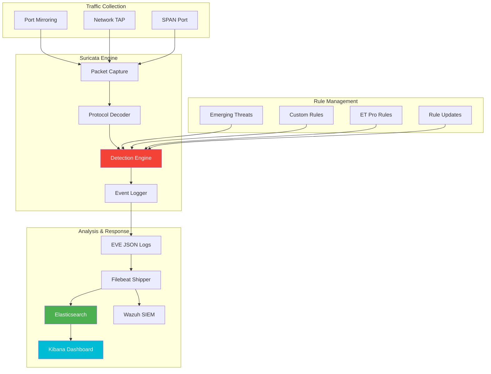

## The Invisible Threat


*Photo by Alina Grubnyak on Unsplash*

Last year, I noticed unusual DNS queries from my homelab network—hundreds of requests to obscure domains at 3 AM. Without network monitoring, I would never have caught the IoT device beacon ing home to its manufacturer with telemetry data I didn't authorize.

That incident convinced me: you can't protect what you can't see.

## Network Traffic Analysis Architecture



Building my network traffic analysis lab with Suricata transformed my homelab from a black box into a transparent, monitored environment. Here's how I did it.

## Hardware Setup

### Network TAP vs SPAN Port

My Ubiquiti Dream Machine Pro supports port mirroring, but I also tested with a dedicated network TAP for comparison.

**SPAN Port (What I Use):**
- Ubiquiti allows mirroring specific VLANs
- No additional hardware required
- Sufficient for homelab traffic volumes
- Some packet loss under heavy load

**Network TAP (Optional):**
- Passive optical TAP for 100% packet capture
- No packet loss or latency
- More expensive ($200-500)
- Overkill for most homelabs

### Dedicated Analysis Server

I run Suricata on my Dell R940 with:
- **CPU**: 8 cores dedicated to packet processing
- **RAM**: 16GB allocated
- **Storage**: 500GB SSD for fast log writes
- **NIC**: Dedicated 10Gb interface for mirrored traffic

## Suricata Installation and Configuration

### Installing Suricata

```bash
# Install on Ubuntu 24.04
sudo add-apt-repository ppa:oisf/suricata-stable
sudo apt update
sudo apt install suricata jq

# Verify installation
suricata --build-info

# Enable Suricata service
sudo systemctl enable suricata
sudo systemctl start suricata
```

### Initial Configuration

Edit `/etc/suricata/suricata.yaml`:

```yaml
# Network interfaces
af-packet:
  - interface: ens19f1  # Mirror interface
    cluster-id: 99
    cluster-type: cluster_flow
    defrag: yes
    use-mmap: yes
    tpacket-v3: yes
    ring-size: 200000

# Home network configuration
vars:
  address-groups:
    HOME_NET: "[10.0.0.0/8,192.168.0.0/16,172.16.0.0/12]"
    EXTERNAL_NET: "!$HOME_NET"
    DNS_SERVERS: "[10.0.1.1,1.1.1.1,8.8.8.8]"
    HTTP_SERVERS: "$HOME_NET"
    SMTP_SERVERS: "$HOME_NET"
    SQL_SERVERS: "$HOME_NET"

  port-groups:
    HTTP_PORTS: "80,443,8080,8443"
    SHELLCODE_PORTS: "!80"
    SSH_PORTS: 22

# Performance tuning
threading:
  set-cpu-affinity: yes
  cpu-affinity:
    - management-cpu-set:
        cpu: [ 0 ]
    - receive-cpu-set:
        cpu: [ 1,2,3,4 ]
    - worker-cpu-set:
        cpu: [ 5,6,7,8 ]

# Enable EVE JSON output
outputs:
  - eve-log:
      enabled: yes
      filetype: regular
      filename: eve.json
      types:
        - alert
        - http
        - dns
        - tls
        - files
        - ssh
        - flow
```

### Rule Management with Suricata-Update

```bash
# Configure rule sources
sudo suricata-update update-sources

# Enable Emerging Threats Open rules
sudo suricata-update enable-source et/open

# Enable additional sources
sudo suricata-update enable-source tgreen/hunting
sudo suricata-update enable-source sslbl/ssl-fp-blacklist
sudo suricata-update enable-source oisf/trafficid

# Update rules
sudo suricata-update

# Schedule automatic updates
cat << 'EOF' | sudo tee /etc/cron.daily/suricata-update
#!/bin/bash
/usr/bin/suricata-update
/bin/systemctl reload suricata
EOF

sudo chmod +x /etc/cron.daily/suricata-update
```

## Writing Custom Suricata Rules

### Rule Syntax Basics

Suricata rules follow this structure:

```
action protocol source_ip source_port -> dest_ip dest_port (rule options)
```

### Detecting Port Scans

```bash
# /etc/suricata/rules/custom-local.rules

# Detect Nmap SYN scan
alert tcp any any -> $HOME_NET any (msg:"SCAN Nmap SYN scan detected"; flags:S,12; threshold: type threshold, track by_src, count 20, seconds 10; classtype:attempted-recon; sid:1000001; rev:1;)

# Detect Masscan
alert tcp any any -> $HOME_NET any (msg:"SCAN Masscan detected"; flow:to_server; flags:S,12; window:1024; threshold: type threshold, track by_src, count 50, seconds 5; classtype:attempted-recon; sid:1000002; rev:1;)

# Detect UDP port scan
alert udp any any -> $HOME_NET any (msg:"SCAN UDP port scan"; threshold: type threshold, track by_dst, count 100, seconds 10; classtype:attempted-recon; sid:1000003; rev:1;)
```

### Detecting Malicious DNS Activity

```bash
# DNS tunneling detection
alert dns any any -> any any (msg:"DNS Possible DNS Tunneling - High Entropy"; dns.query; content:"."; pcre:"/^[a-z0-9]{50,}/i"; classtype:trojan-activity; sid:1000010; rev:1;)

# DGA domain detection
alert dns any any -> any any (msg:"DNS Possible DGA Domain"; dns.query; pcre:"/^[a-z]{20,}\.com/i"; classtype:trojan-activity; sid:1000011; rev:1;)

# DNS exfiltration - large TXT records
alert dns any 53 -> $HOME_NET any (msg:"DNS Large TXT Record Response"; dns.query; dns.rrtype:TXT; byte_test:2,>,500,0,relative; classtype:policy-violation; sid:1000012; rev:1;)
```

### Detecting Command & Control Traffic

```bash
# Suspicious beaconing behavior
alert tcp $HOME_NET any -> $EXTERNAL_NET any (msg:"C2 Possible Beaconing - Regular Intervals"; flow:to_server,established; threshold: type both, track by_src, count 10, seconds 300; classtype:trojan-activity; sid:1000020; rev:1;)

# Detect Cobalt Strike default beacons
alert tcp $HOME_NET any -> $EXTERNAL_NET any (msg:"C2 Possible Cobalt Strike Beacon"; flow:established,to_server; content:"MZARUH"; fast_pattern; classtype:trojan-activity; sid:1000021; rev:1;)

# Suspicious User-Agent strings
alert http $HOME_NET any -> $EXTERNAL_NET any (msg:"C2 Suspicious User-Agent"; flow:to_server,established; content:"User-Agent|3a 20|curl"; http_header; classtype:trojan-activity; sid:1000022; rev:1;)
```

### Detecting Data Exfiltration

```bash
# Large file upload
alert http $HOME_NET any -> $EXTERNAL_NET any (msg:"EXFIL Large POST Request"; flow:to_server,established; http.method; content:"POST"; byte_test:4,>,1000000,0,relative; classtype:policy-violation; sid:1000030; rev:1;)

# Uncommon protocols on common ports
alert tcp $HOME_NET any -> $EXTERNAL_NET 443 (msg:"EXFIL Non-TLS traffic on 443"; flow:to_server,established; content:!"|16 03|"; depth:2; classtype:protocol-command-decode; sid:1000031; rev:1;)
```

## Testing and Validation

### Test Rule Triggering

```bash
# Test port scan detection
nmap -sS -p- localhost

# Test DNS query
dig testing-long-subdomain-name-for-detection.example.com

# Check alerts
sudo tail -f /var/log/suricata/fast.log
sudo jq 'select(.event_type=="alert")' /var/log/suricata/eve.json | tail -1
```

### Performance Testing

```bash
# Check packet drop statistics
sudo suricata --af-packet=ens19f1 -c /etc/suricata/suricata.yaml --init-errors-fatal --dump-stats

# Monitor CPU usage
top -p $(pgrep suricata)

# Check memory usage
sudo suricatasc -c "memcap-show"
```

### Rule Validation

```bash
# Test rule syntax
sudo suricata -T -c /etc/suricata/suricata.yaml -S /etc/suricata/rules/custom-local.rules

# Validate all rules
sudo suricata -T -c /etc/suricata/suricata.yaml

# Test specific rule
sudo suricata -r test.pcap -S /etc/suricata/rules/custom-local.rules -l /tmp/suricata-test/
```

## Integration with SIEM

### Shipping Logs to Wazuh

Install Filebeat to ship Suricata logs:

```yaml
# /etc/filebeat/filebeat.yml
filebeat.inputs:
- type: log
  enabled: true
  paths:
    - /var/log/suricata/eve.json
  json.keys_under_root: true
  json.add_error_key: true
  json.message_key: log

output.logstash:
  hosts: ["10.0.1.5:5044"]
  ssl.enabled: true
  ssl.certificate_authorities: ["/etc/filebeat/ca.crt"]

processors:
  - add_host_metadata:
  - add_cloud_metadata:
  - add_docker_metadata:
```

### Wazuh Decoder Configuration

Create custom decoders for Suricata:

```xml
<!-- /var/ossec/etc/decoders/local_decoder.xml -->
<decoder name="suricata">
  <program_name>suricata</program_name>
</decoder>

<decoder name="suricata-alert">
  <parent>suricata</parent>
  <prematch type="json">alert</prematch>
  <plugin_decoder>JSON_Decoder</plugin_decoder>
</decoder>
```

### Custom Wazuh Rules

```xml
<!-- /var/ossec/etc/rules/local_rules.xml -->
<group name="suricata,">
  <rule id="100010" level="7">
    <if_sid>86600</if_sid>
    <field name="event_type">alert</field>
    <field name="alert.severity">^1$</field>
    <description>Suricata: Critical alert detected</description>
  </rule>

  <rule id="100011" level="12">
    <if_sid>86600</if_sid>
    <field name="alert.signature">C2</field>
    <description>Suricata: Possible C2 communication detected</description>
  </rule>

  <rule id="100012" level="10">
    <if_sid>86600</if_sid>
    <field name="alert.category">trojan-activity</field>
    <description>Suricata: Trojan activity detected</description>
  </rule>
</group>
```

## Visualization with Kibana

### Creating Suricata Dashboard

```bash
# Import Suricata dashboards
sudo filebeat setup --dashboards -E output.elasticsearch.hosts=["10.0.1.5:9200"]
```

Custom visualization queries:

```json
{
  "query": {
    "bool": {
      "must": [
        {"match": {"event_type": "alert"}},
        {"range": {"@timestamp": {"gte": "now-1h"}}}
      ]
    }
  },
  "aggs": {
    "top_signatures": {
      "terms": {
        "field": "alert.signature.keyword",
        "size": 10
      }
    },
    "severity_breakdown": {
      "terms": {
        "field": "alert.severity",
        "size": 3
      }
    }
  }
}
```

## Advanced Detection Techniques

### Using Lua Scripts for Complex Detection

```lua
-- /etc/suricata/lua/http-anomaly.lua
function init(args)
    local needs = {}
    needs["http.request_headers"] = tostring(true)
    return needs
end

function match(args)
    local headers = HttpGetRequestHeaders()
    if headers == nil then
        return 0
    end

    -- Check for multiple suspicious indicators
    local score = 0

    if string.match(headers, "curl") then
        score = score + 1
    end

    if not string.match(headers, "Accept:") then
        score = score + 1
    end

    if score >= 2 then
        return 1
    end

    return 0
end
```

Use in Suricata rule:

```bash
alert http $HOME_NET any -> $EXTERNAL_NET any (msg:"HTTP Anomalous Request Headers"; flow:to_server,established; luajit:lua/http-anomaly.lua; classtype:policy-violation; sid:1000040; rev:1;)
```

### Machine Learning with Suricata

Use Suricata datasets for ML-based detection:

```yaml
# suricata.yaml
datasets:
  malicious-ips:
    type: sha256
    load: /etc/suricata/datasets/malicious-ips.txt
```

Rule using dataset:

```bash
alert ip [!$HOME_NET] any -> $HOME_NET any (msg:"THREAT Known Malicious IP"; dataset:sha256-src, state /etc/suricata/datasets/malicious-ips.txt, type sha256, state malicious-ip-detected; classtype:trojan-activity; sid:1000050; rev:1;)
```

## Operational Best Practices

### 1. Tune Your Rules

Start with a baseline and tune to reduce false positives:

```bash
# Disable noisy rules
echo "1234567" | sudo tee -a /etc/suricata/disable.conf

# Enable only specific rules
echo "re:.*EXPLOIT.*" | sudo tee /etc/suricata/enable.conf

# Update rules with modifications
sudo suricata-update --disable-conf=/etc/suricata/disable.conf --enable-conf=/etc/suricata/enable.conf
```

### 2. Monitor Performance

```bash
# Check drops
sudo suricatasc -c "iface-stat ens19f1"

# View rule profiling
sudo suricatasc -c "profiling rules dump"

# Get memory stats
sudo suricatasc -c "memcap-list"
```

### 3. Regular Maintenance

```bash
#!/bin/bash
# /usr/local/bin/suricata-maintenance.sh

# Rotate logs
sudo systemctl reload suricata

# Update rules
sudo suricata-update

# Clean old logs (keep 30 days)
find /var/log/suricata/ -name "*.json.*" -mtime +30 -delete

# Restart if needed
sudo systemctl status suricata | grep -q "running" || sudo systemctl restart suricata
```

## Incident Response Workflow

When Suricata triggers an alert:

1. **Triage**: Review alert in Kibana dashboard
2. **Investigate**: Extract full PCAP for the flow
3. **Analyze**: Review payload and context
4. **Contain**: Block malicious IPs/domains
5. **Remediate**: Clean affected systems
6. **Document**: Update runbooks

```bash
# Extract PCAP for specific flow
sudo tshark -r /var/log/suricata/log.pcap -Y "ip.src==192.168.1.50 && ip.dst==203.0.113.42" -w incident-pcap.pcap

# Analyze with tcpdump
sudo tcpdump -r incident-pcap.pcap -A

# Block malicious IP via firewall
sudo iptables -A INPUT -s 203.0.113.42 -j DROP
sudo iptables-save > /etc/iptables/rules.v4
```

## Lessons Learned

After running Suricata in production for years:

### 1. Start Simple, Add Complexity Gradually
Don't enable every rule on day one. Start with Emerging Threats Open, tune for false positives, then add custom rules.

### 2. Context Matters More Than Volume
10 correlated alerts are more valuable than 10,000 noisy signatures. Focus on detection quality, not quantity.

### 3. Integration is Everything
Suricata alone is just logs. Integration with SIEM, threat intelligence, and automated response creates a complete detection pipeline.

### 4. Performance Tuning is Ongoing
Monitor packet drops religiously. If you're dropping packets, you're missing threats.

### 5. Test Your Detections
Regularly test that your rules actually fire. A rule that never alerts might be broken or misconfigured.

## Research & References

### IDS/IPS Technology

1. **[Snort vs Suricata Performance](https://ieeexplore.ieee.org/document/8726695)** (2019)
   - IEEE - Comparative analysis of IDS performance

2. **[Suricata Official Documentation](https://docs.suricata.io/)** - Comprehensive configuration guide

### Threat Detection Research

1. **[Machine Learning for Intrusion Detection](https://arxiv.org/abs/1904.02426)** (2019)
   - arXiv preprint - ML-based network anomaly detection

2. **[MITRE ATT&CK for Network Defense](https://attack.mitre.org/)** - Adversary tactics and techniques

### Rule Development

- **[Emerging Threats Rules](https://rules.emergingthreats.net/)** - Community ruleset
- **[Suricata Language Reference](https://suricata.readthedocs.io/en/latest/rules/index.html)** - Rule syntax documentation
- **[OISF GitHub](https://github.com/OISF/suricata)** - Suricata source code and examples

## Conclusion

Network traffic analysis with Suricata transformed my homelab from an opaque network into a monitored, understood environment. The visibility gained from IDS/IPS isn't just about catching threats—it's about understanding normal behavior so you can spot anomalies.

Start with basic installation, enable Emerging Threats rules, and gradually add custom detections for your specific environment. The investment in proper monitoring pays dividends the first time you catch an incident before it escalates.

---

*Running Suricata in your environment? What detection rules have proven most valuable? Share your custom rules and detection strategies—let's build better defenses together!*
