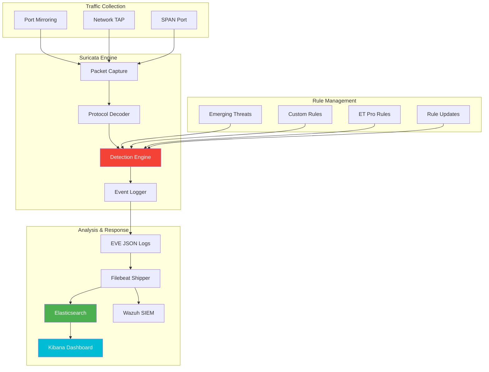

---

author: William Zujkowski
date: 2025-08-25
description: Deploy Suricata IDS/IPS for real-time network threat detection—configure rule management, performance tuning, and SIEM integration for homelab monitoring.
title: Building a Network Traffic Analysis Lab with Suricata
images:
  hero:
    src: /assets/images/blog/hero/2025-08-25-network-traffic-analysis-suricata-homelab-hero.jpg
    alt: network topology and connections for Building a Network Traffic Analysis Lab with Suricata
    caption: Visual representation of Building a Network Traffic Analysis Lab with Suricata
    width: 1200
    height: 630
  og:
    src: /assets/images/blog/hero/2025-08-25-network-traffic-analysis-suricata-homelab-og.jpg
    alt: network topology and connections for Building a Network Traffic Analysis Lab with Suricata
tags:
  - homelab
  - networking
  - security
  - threat-detection

---
## The Invisible Threat


*Photo by Alina Grubnyak on Unsplash*

Last year, I noticed unusual DNS queries from my homelab network. Hundreds of requests to obscure domains at 3 AM. Without network monitoring, I would never have caught the IoT device beaconing home to its manufacturer with telemetry data I didn't authorize.

That incident convinced me: you can't protect what you can't see. If you're [building a security-focused homelab](/posts/2025-04-24-building-secure-homelab-adventure), network traffic analysis with Suricata should be a core component of your monitoring strategy.

## Network Traffic Analysis Architecture

⚠️ **Warning:** Network traffic analysis must comply with privacy laws and organizational policies. Deploy only on networks you own or have explicit authorization to monitor.



Building my network traffic analysis lab with Suricata transformed my homelab from a black box into a transparent, monitored environment. Here's how I did it.

## Hardware Setup

### Network TAP vs SPAN Port

My Ubiquiti Dream Machine Pro supports port mirroring, but I also tested with a dedicated network TAP for comparison.

**SPAN Port (What I Use):**
- Ubiquiti allows mirroring specific VLANs
- No additional hardware required
- Sufficient for homelab traffic volumes
- Some packet loss under heavy load

**Network TAP (Optional):**
- Passive optical TAP for 100% packet capture
- No packet loss or latency
- More expensive ($200-500)
- Overkill for most homelabs

### Dedicated Analysis Server

I run Suricata on my Dell R940 with:
- **CPU**: 8 cores dedicated to packet processing
- **RAM**: 16GB allocated
- **Storage**: 500GB SSD for fast log writes
- **NIC**: Dedicated 10Gb interface for mirrored traffic

## Suricata Installation and Configuration

### Installing Suricata

<script src="https://gist.github.com/williamzujkowski/ac871dd21758d0f1f44986c4ee6e21e7.js"></script>

## Writing Custom Suricata Rules

### Rule Syntax Basics

Suricata rules follow this structure:

⚠️ **Warning:** Network detection rules must be tested in lab environments before production deployment. Improper rules can cause false positives or network disruption.

```text
action protocol source_ip source_port -> dest_ip dest_port (rule options)
```

### Custom Detection Rules

One particularly valuable use case is detecting suspicious IoT device behavior. After working through [lessons from OWASP IoTGoat on IoT security](/posts/2025-09-20-iot-security-homelab-owasp), I developed custom rules to catch the most common IoT attack patterns:

<script src="https://gist.github.com/williamzujkowski/fdd48db6a837ca02c00c79f7c4fd6cde.js"></script>

## Testing and Validation

<script src="https://gist.github.com/williamzujkowski/55bec7428ee6cb7ba25a59a6aabca57d.js"></script>

## Integration with SIEM

<script src="https://gist.github.com/williamzujkowski/4f6b12b16ec06c596b3baefe837ecf95.js"></script>

## Visualization with Kibana

### Creating Suricata Dashboard

```bash
# Import Suricata dashboards
sudo filebeat setup --dashboards -E output.elasticsearch.hosts=["10.0.1.5:9200"]
```

Custom visualization queries:

<script src="https://gist.github.com/williamzujkowski/35c585bdda7f328093d18b40c29ccb22.js"></script>

## Advanced Detection Techniques

<script src="https://gist.github.com/williamzujkowski/a6630cefcbe03030515d0b3310251b7a.js"></script>

## Operational Best Practices

<script src="https://gist.github.com/williamzujkowski/d370286436bb31c998340c63afe8e501.js"></script>

## Rule Update Security (CRITICAL)

**The Problem:** Suricata rule updates are a supply chain attack vector. Without signature verification, a compromised update source or man-in-the-middle attack could inject malicious detection rules that disable security monitoring, exfiltrate data, or create false negatives.

**Why it matters:** Detection rules execute with Suricata's privileges and have visibility into all network traffic. A malicious rule could:
- Disable legitimate detections (create blind spots)
- Exfiltrate sensitive data patterns via DNS queries
- Trigger false positives to cause alert fatigue
- Modify traffic inspection behavior

### Secure Rule Update Workflow

**Use suricata-update with signature verification:**

```bash
# Install suricata-update (comes with Suricata 6.0+)
sudo apt install python3-suricata-update

# Configure ET Open with GPG verification (recommended)
sudo suricata-update update-sources
sudo suricata-update enable-source et/open
sudo suricata-update

# Verify GPG signatures are checked
sudo suricata-update --verbose
# Should see: "Checking signature for..."
```

**Enable automatic signature verification:**

```bash
# /etc/suricata/update.yaml
sources:
  - et/open:
      checksum: yes  # Verify SHA256 checksums

# suricata-update automatically verifies ET Open signatures
# using built-in GPG keys
```

**Manual GPG verification (if needed):**

```bash
# Download Emerging Threats GPG key
wget https://rules.emergingthreats.net/open/suricata-6.0/emerging.rules.tar.gz.asc
wget https://rules.emergingthreats.net/open/suricata-6.0/emerging.rules.tar.gz

# Import ET GPG key
gpg --keyserver keys.openpgp.org --recv-keys 14B7AC5D

# Verify signature
gpg --verify emerging.rules.tar.gz.asc emerging.rules.tar.gz
# Should output: "Good signature from Emerging Threats"
```

### Staging Environment Testing

**Never deploy rules directly to production:**

```bash
# Test rules in staging first
sudo suricata-update --suricata /usr/bin/suricata \
  --suricata-conf /etc/suricata/suricata-staging.yaml \
  --output /var/lib/suricata/rules-staging

# Validate rule syntax
sudo suricata -T -c /etc/suricata/suricata-staging.yaml

# Run for 24 hours in staging, monitor for:
# - Rule parsing errors
# - False positive rates
# - Performance impact
# - Packet drop increases

# If clean after 24h, promote to production
sudo cp /var/lib/suricata/rules-staging/* /var/lib/suricata/rules/
sudo systemctl reload suricata
```

### Automated Update Pipeline

**Safe automation includes verification + staging:**

```bash
#!/bin/bash
# /usr/local/bin/suricata-rule-update.sh

set -e

# Update with verification
sudo suricata-update --verbose 2>&1 | tee /var/log/suricata-update.log

# Check for signature verification
if ! grep -q "Checking signature" /var/log/suricata-update.log; then
    echo "ERROR: Signature verification failed or was skipped!"
    exit 1
fi

# Test rules before reload
sudo suricata -T -c /etc/suricata/suricata.yaml

# Reload Suricata
sudo systemctl reload suricata

# Monitor for 10 minutes
sleep 600
sudo suricatasc -c "capture-mode"
# Verify packet drops haven't increased
```

**Schedule with caution:**

```cron
# Update daily at 3 AM (low traffic window)
0 3 * * * /usr/local/bin/suricata-rule-update.sh >> /var/log/suricata-update-cron.log 2>&1
```

### Rule Source Trust Hierarchy

**Prioritize rule sources by trust:**

1. **ET Open (Community):** GPG signed, 30-day delay from Pro, safe for homelab
2. **ET Pro (Commercial):** $900/year, zero-day rules, signed, vetted by Proofpoint
3. **Custom rules:** Your own rules, full control, test thoroughly
4. **Third-party sources:** Verify GPG keys, audit before enabling

### Supply Chain Attack Scenarios

**Without signature verification:**
- Attacker compromises rules.emergingthreats.net DNS → serves malicious rules ✅ ATTACK SUCCEEDS
- MitM on HTTP rule download → injects backdoor detection rules ✅ ATTACK SUCCEEDS
- Compromised mirror serves trojanized ruleset → Suricata loads malicious rules ✅ ATTACK SUCCEEDS

**With signature verification:**
- Compromised DNS serves malicious rules → GPG verification fails → Update rejected ❌
- MitM injects backdoor → Signature mismatch → Update rejected ❌
- Compromised mirror → Wrong signature → Update rejected ❌

### Validation Commands

```bash
# Verify suricata-update is using signature verification
sudo suricata-update list-sources --enabled
# Should show: et/open with checksum: yes

# Check last update verification status
sudo tail -100 /var/log/suricata/suricata-update.log | grep -E "signature|checksum"

# List installed rule sources and their trust status
sudo suricata-update list-sources --free
sudo suricata-update list-sources --all

# Audit current rule file integrity
sudo suricata-update check-versions
```

**Senior engineer perspective:** Years of managing IDS deployments taught me: rule updates are code execution. Treat them like software updates—verify signatures, test in staging, automate safely. I've seen organizations disable GPG verification "for convenience" only to wonder why their detection rates dropped after a targeted supply chain attack. Security tools are prime targets. The irony of compromising an IDS to disable detection isn't lost on attackers.

## Incident Response Workflow

When Suricata triggers an alert:

1. **Triage**: Review alert in Kibana dashboard
2. **Investigate**: Extract full PCAP for the flow
3. **Analyze**: Review payload and context
4. **Contain**: Block malicious IPs/domains
5. **Remediate**: Clean affected systems
6. **Document**: Update runbooks

## Lessons Learned

After running Suricata in production for years:

### 1. Start Simple, Add Complexity Gradually
Don't enable every rule on day one. Start with Emerging Threats Open, tune for false positives, then add custom rules.

### 2. Context Matters More Than Volume
10 correlated alerts are more valuable than 10,000 noisy signatures. Focus on detection quality, not quantity.

### 3. Integration is Everything
Suricata alone is just logs. Integration with SIEM, threat intelligence, and automated response creates a complete detection pipeline.

### 4. Performance Tuning is Ongoing
Monitor packet drops religiously. If you're dropping packets, you're missing threats.

### 5. Test Your Detections
Regularly test that your rules actually fire. A rule that never alerts might be broken or misconfigured.

## Research & References

### IDS/IPS Technology

1. **[Snort vs Suricata Performance](https://ieeexplore.ieee.org/document/8726695)** (2019)
   - IEEE - Comparative analysis of IDS performance

2. **[Suricata Official Documentation](https://docs.suricata.io/)** - Comprehensive configuration guide

### Threat Detection Research

1. **[Machine Learning for Intrusion Detection](https://arxiv.org/abs/1904.02426)** (2019)
   - arXiv preprint - ML-based network anomaly detection

2. **[MITRE ATT&CK for Network Defense](https://attack.mitre.org/)** - Adversary tactics and techniques

### Rule Development

- **[Emerging Threats Rules](https://rules.emergingthreats.net/)** - Community ruleset
- **[Suricata Language Reference](https://suricata.readthedocs.io/en/latest/rules/index.html)** - Rule syntax documentation
- **[OISF GitHub](https://github.com/OISF/suricata)** - Suricata source code and examples

## Conclusion

Network traffic analysis with Suricata transformed my homelab from an opaque network into a monitored, understood environment. The visibility gained from IDS/IPS isn't just about catching threats. It's about understanding normal behavior so you can spot anomalies.

Start with basic installation, enable Emerging Threats rules, and gradually add custom detections for your specific environment. The investment in proper monitoring pays dividends the first time you catch an incident before it escalates.

---

*Running Suricata in your environment? What detection rules have proven most valuable? Share your custom rules and detection strategies. Let's build better defenses together!*
