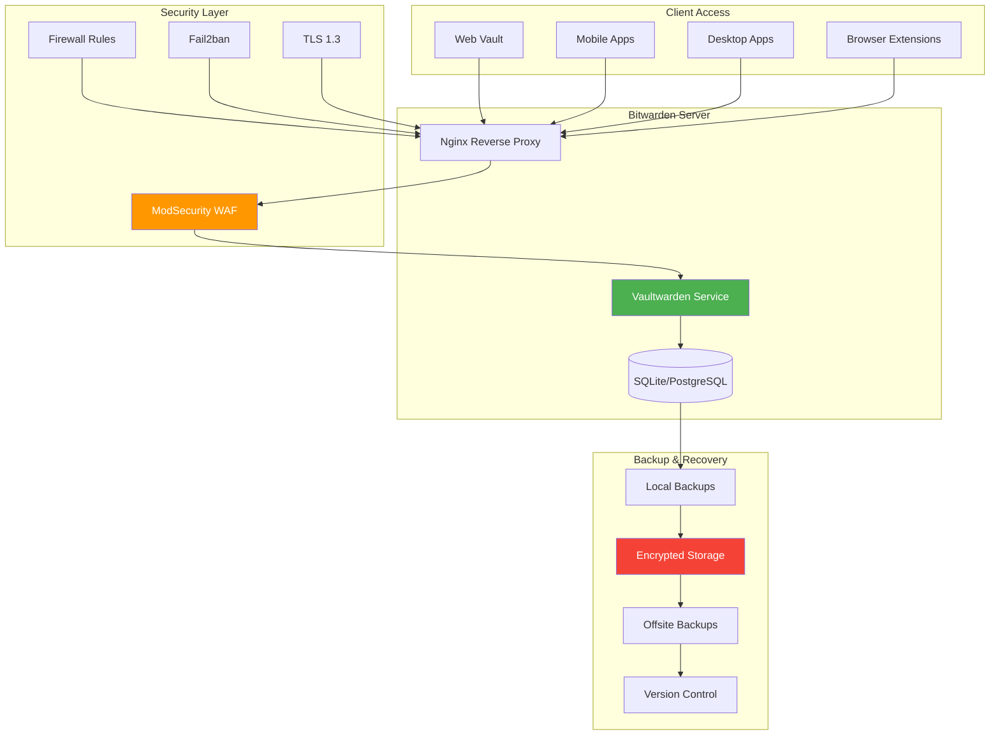

---

author: William Zujkowski
date: 2025-09-01
description: "Migrate to self-hosted Bitwarden—deploy secure vault with backup strategies, SSL certificates, and database encryption for full control."
title: 'Self-Hosted Password Manager Migration: Bitwarden Deep Dive'
images:
  hero:
    src: /assets/images/blog/hero/2025-09-01-self-hosted-bitwarden-migration-guide-hero.jpg
    alt: 'cybersecurity concept illustration for Self-Hosted Password Manager Migration: Bitwarden Deep Dive'
    caption: 'Visual representation of Self-Hosted Password Manager Migration: Bitwarden Deep Dive'
    width: 1200
    height: 630
  og:
    src: /assets/images/blog/hero/2025-09-01-self-hosted-bitwarden-migration-guide-og.jpg
    alt: 'cybersecurity concept illustration for Self-Hosted Password Manager Migration: Bitwarden Deep Dive'
tags:
  - cryptography
  - homelab
  - passwords
  - privacy
  - security

---
## The Cloud Password Manager Breach That Changed Everything


*Photo by FLY:D on Unsplash*

**BLUF:** Cloud password manager breaches happen every few years. When LastPass disclosed their 2022 incident, I moved 500+ passwords to self-hosted Bitwarden. Two years later, I have better security, zero vendor lock-in, and complete data ownership. Here's how to migrate safely.

## Self-Hosted Password Management Architecture



## Why Self-Host?

Self-hosting password management shifts trust from vendors to yourself. The trade-off is operational responsibility.

**Benefits:**
- **Full control**: Own infrastructure and data
- **Zero vendor risk**: No third-party breaches
- **Network privacy**: Passwords never leave your network
- **Custom security**: Tailor to your threat model
- **Zero cost**: Free for personal use (Vaultwarden)

**Drawbacks:**
- **You're the security team**: Patching, monitoring, incident response
- **Complexity overhead**: More components to secure
- **Availability burden**: Downtime affects all devices
- **Disaster planning required**: Infrastructure loss needs backup strategy

Self-hosting makes sense if you have technical skills and reliable infrastructure. Cloud services are better if you lack experience or time for maintenance.

## Choosing Bitwarden vs Vaultwarden

Two implementations offer different trade-offs:

**Bitwarden (Official):**
- Full feature set
- Requires .NET runtime
- ~500MB RAM usage
- Official support channels

**Vaultwarden (Rust rewrite):**
- ~10MB RAM (98% reduction)
- Single binary deployment
- API-compatible with all clients
- Community support only

I run Vaultwarden for resource efficiency and deployment simplicity. My Proxmox LXC container uses 47MB total with database included.

## Installation and Setup

### Docker Compose Deployment

<script src="https://gist.github.com/williamzujkowski/dc0728c2908e4689896f35bec5f3855a.js"></script>

### Deploy the Stack

<script src="https://gist.github.com/williamzujkowski/b8cb1cd1d6ff8f64425f02ec912a6d1a.js"></script>

## Reverse Proxy Configuration

### Nginx with TLS

<script src="https://gist.github.com/williamzujkowski/f11619209152dd8cf3ed558335ac7a3f.js"></script>

## Security Hardening

### Fail2ban Configuration

Protect against brute-force attacks:

<script src="https://gist.github.com/williamzujkowski/28d9a26bcff2a02c2d0aabbaf570b409.js"></script>

Restart Fail2ban:

```bash
sudo systemctl restart fail2ban
sudo fail2ban-client status vaultwarden
```

### Firewall Rules

<script src="https://gist.github.com/williamzujkowski/0549ee4b142ddff4d684e8ec21fb0317.js"></script>

### Two-Factor Authentication

Enable 2FA for all accounts through web vault:

- Navigate: Settings → Security → Two-step Login
- Select: Authenticator App (TOTP)
- Scan QR code with Aegis/Authy/Google Authenticator
- Save recovery code offline (printed, in safe)

Recovery codes are critical. Without them, device loss means account lockout.

### Admin Panel Security (CRITICAL)

**The Problem:** Vaultwarden enables an admin panel at `/admin` by default. Without proper configuration, anyone who discovers this endpoint can access server settings, disable security features, and view administrative information.

**Why it matters:** An exposed admin panel is a critical vulnerability for internet-facing deployments. The risk severity depends on your deployment:
- **Internet-exposed:** CRITICAL (CVE-waiting-to-happen)
- **Internal-only:** HIGH (lateral movement risk)
- **Localhost-only:** MEDIUM (requires local access)

**Required configuration in docker-compose.yml:**

```yaml
environment:
  - ADMIN_TOKEN=${ADMIN_TOKEN}
  - DISABLE_ADMIN_TOKEN=false  # Optional: Disable after initial setup
  # - ADMIN_TOKEN="" # Completely disables admin panel (recommended after configuration)
```

**Generate secure admin token:**

```bash
# Generate 48-byte random token
openssl rand -base64 48

# Add to .env file (NEVER commit this!)
echo "ADMIN_TOKEN=$(openssl rand -base64 48)" >> .env

# Set restrictive permissions
chmod 600 .env
```

**Best practices:**
1. **Initial setup:** Set ADMIN_TOKEN for configuration access
2. **After configuration:** Either disable completely (`ADMIN_TOKEN=""`) or restrict by IP
3. **Never:** Leave admin panel accessible without authentication
4. **Production:** Disable panel entirely unless actively debugging

**IP restriction (if panel needed long-term):**

Add to nginx configuration:

```nginx
location /admin {
    allow 192.168.1.0/24;  # Your management network
    deny all;
    proxy_pass http://vaultwarden:80;
}
```

**Verification:**

```bash
# Test authentication requirement
curl -I https://vault.example.com/admin
# Should return 401 Unauthorized or redirect to login

# Test IP restriction (if configured)
curl -I https://vault.example.com/admin
# From restricted IP: Should return 403 Forbidden
```

**Senior engineer note:** Years of production experience taught me admin interfaces are often forgotten after initial setup. The security-conscious approach: configure once, disable immediately. Vaultwarden's runtime configuration rarely needs changes. If you do need admin access later, temporarily enable with environment variable, make changes, then disable again.

### YubiKey Integration

For hardware 2FA:

1. Settings → Security → Two-step Login
2. Choose YubiKey OTP Security Key
3. Insert YubiKey and tap when prompted
4. Register up to 5 keys (have backups!)

## Data Migration

### Exporting from Cloud Password Managers

**From LastPass:**
```
1. Log into LastPass web vault
2. More Options → Advanced → Export
3. Save as CSV
4. Import to Bitwarden: Tools → Import Data
```

**From 1Password:**
```
1. File → Export → All Items
2. Choose format: 1Password Interchange Format (1PIF)
3. Import to Bitwarden
```

**From Dashlane:**
```
1. File → Export → Unsecured Archive (CSV)
2. Import to Bitwarden
```

### Post-Migration Cleanup

```bash
# Securely delete export files
shred -vfz -n 10 lastpass-export.csv

# Verify all passwords imported
# Check organizations, folders, and items manually

# Update master passwords on all devices
```

## Backup Strategy

### Automated Database Backups

<script src="https://gist.github.com/williamzujkowski/f007271e97105ae16de1d28a2cfbe9d7.js"></script>

Schedule with cron:

```bash
# Run daily at 3 AM
0 3 * * * /usr/local/bin/backup-vaultwarden.sh
```

### Testing Backup Restoration

<script src="https://gist.github.com/williamzujkowski/327bbe4806d93f947478373788a4ede5.js"></script>

**Test your backups regularly!** A backup you haven't tested is just wishful thinking.

## Monitoring and Maintenance

### Health Check Script

<script src="https://gist.github.com/williamzujkowski/b5fd9b8c6991a5e43587cb78f30ff344.js"></script>

### Prometheus Metrics

Export metrics for monitoring:

```yaml
# Add to docker-compose.yml
  vaultwarden-exporter:
    image: vaultwarden/vaultwarden-exporter:latest
    container_name: vaultwarden-exporter
    restart: unless-stopped
    environment:
      - VAULTWARDEN_URL=http://vaultwarden:80
    ports:
      - "9998:9998"
    networks:
      - bitwarden-net
```

## Client Setup

### Browser Extension

1. Install Bitwarden extension for your browser
2. Click extension icon → Settings (gear icon)
3. Set Server URL: `https://vault.example.com`
4. Log in with master password + 2FA

### Mobile Apps

**iOS:**
1. Install Bitwarden from App Store
2. Settings → Self-hosted
3. Enter Server URL: `https://vault.example.com`
4. Log in

**Android:**
1. Install Bitwarden from F-Droid or Play Store
2. Settings → Self-hosted
3. Enter Server URL: `https://vault.example.com`
4. Enable biometric unlock after login

### CLI Client

<script src="https://gist.github.com/williamzujkowski/4b8fc96deb050dd4376e396d71044031.js"></script>

## Disaster Recovery Plan

### Scenario 1: Server Failure

1. **Immediate**: All clients have cached credentials (work offline)
2. **Short-term**: Restore from backup to new server
3. **Long-term**: Implement HA setup with failover

### Scenario 2: Ransomware Attack

1. **Disconnect**: Immediately isolate infected systems
2. **Assess**: Determine extent of encryption
3. **Restore**: Use offsite encrypted backups
4. **Verify**: Check data integrity before going live

### Scenario 3: Total Infrastructure Loss

1. **Emergency access**: Bitwarden export file stored offline
2. **Rebuild**: Deploy from scratch using backups
3. **Verify**: Test logins and 2FA before production use

## Lessons Learned

Two years of self-hosting taught specific operational realities:

**1. Test backups monthly**
I caught a corrupted backup during routine testing. That would have been catastrophic during real disaster recovery. Testing is not optional.

**2. Single server works for personal use**
99.9% uptime without HA cluster. Good backups matter more than redundancy. Restoring from backup takes 15 minutes.

**3. Automate monitoring**
Caught expiring SSL certificate via automated checks. Manual vigilance fails. Scripts catch problems at 3 AM.

**4. Security is about trade-offs**
Perfect security makes systems unusable. Match security to your threat model, not theoretical maximums.

**5. Documentation saves time**
2 AM outages require clear runbooks. Past-you writing documentation helps future-you during emergencies.

## Security Considerations

**Risks I Accept:**
- Single server (mitigated by backups)
- Self-signed internal CA (for internal services)
- Home internet outage (have mobile backup)

**Risks I Don't Accept:**
- Unencrypted backups
- Weak master passwords
- Missing 2FA
- **Exposed admin panel** (see Admin Panel Security section for mitigation)

## Performance and Scaling

Vaultwarden runs efficiently on minimal hardware:

- **RAM**: ~15MB (Vaultwarden) + ~50MB (PostgreSQL)
- **CPU**: <1% idle, ~5% during sync
- **Storage**: ~50MB database + attachments
- **Network**: <50ms latency on local network

Database holds 500+ passwords and 50+ shared items without performance degradation. Sync across 6 devices completes in <2 seconds.

## Conclusion

Self-hosting Bitwarden gave me complete password ownership. Two years of operation cost zero vendor fees and zero data breaches. The operational overhead is real but manageable.

This approach works if you have technical skills and reliable infrastructure. Cloud services make more sense if you lack time or experience.

Start with basic Docker Compose deployment. Master operations first. Add advanced security and monitoring later. Your 500+ passwords are worth the effort.

---

*Self-hosting password managers? Share your setup, challenges, and lessons learned. Let's learn from each other's experiences!*
