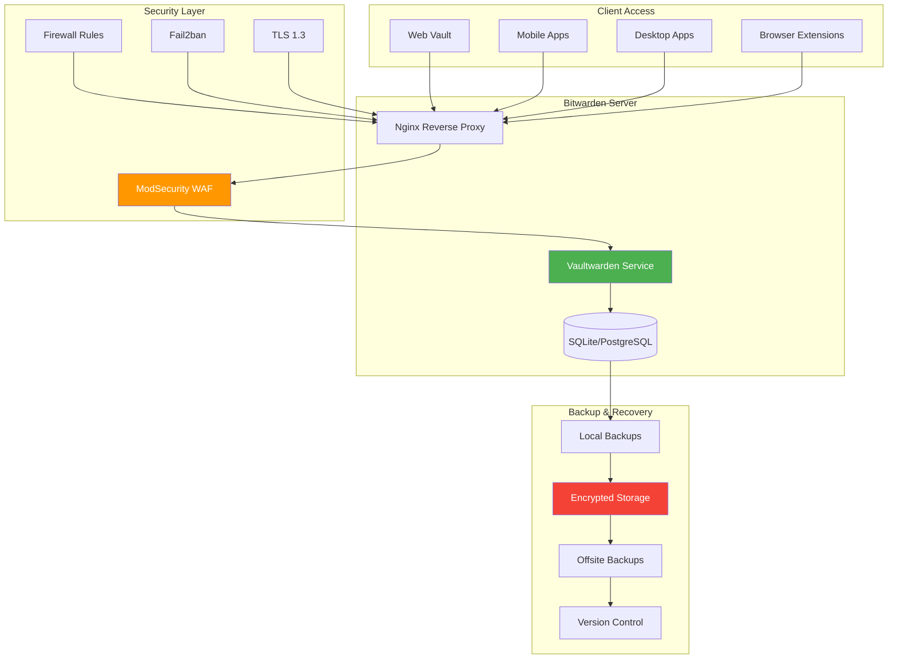

## The Cloud Password Manager Breach That Changed Everything


*Photo by FLY:D on Unsplash*

**BLUF:** A few years back, news broke about yet another cloud password manager breach. While my passwords weren't directly compromised, it made me question: why am I trusting my most sensitive data to a third party when I have a perfectly capable homelab?

That question led me to self-host Bitwarden, and I haven't looked back.

## Self-Hosted Password Management Architecture



## Why Self-Host?

**The elephant in the room:** Is self-hosting really more secure than cloud services?

**Pros:**
- **Full control**: You own the infrastructure and data
- **Zero trust**: No third-party breaches affect you
- **Privacy**: Your passwords never leave your network
- **Customization**: Tailor security to your threat model
- **Cost**: Free for personal use (Vaultwarden)

**Cons:**
- **Responsibility**: You're the security team and on-call engineer
- **Complexity**: More moving parts to secure and maintain
- **Single point of failure**: Your server is your only backup
- **Disaster recovery**: You must plan for total infrastructure loss

**My take:** If you have a homelab and enjoy tinkering, self-hosting is empowering. If you're not technical or don't have reliable infrastructure, stick with cloud services.

## Choosing Bitwarden vs Vaultwarden

**Bitwarden (Official):**
- Full-featured
- Requires .NET runtime
- Higher resource usage (~500MB RAM)
- Official support

**Vaultwarden (Unofficial Rust implementation):**
- Lightweight (~10MB RAM)
- Single binary, easy deployment
- API-compatible with all Bitwarden clients
- Community supported

**I chose Vaultwarden** for my homelab due to lower resource requirements and simpler deployment.

## Installation and Setup

### Docker Compose Deployment

<script src="https://gist.github.com/williamzujkowski/dc0728c2908e4689896f35bec5f3855a.js"></script>

### Deploy the Stack

<script src="https://gist.github.com/williamzujkowski/b8cb1cd1d6ff8f64425f02ec912a6d1a.js"></script>

## Reverse Proxy Configuration

### Nginx with TLS

<script src="https://gist.github.com/williamzujkowski/f11619209152dd8cf3ed558335ac7a3f.js"></script>

## Security Hardening

### Fail2ban Configuration

Protect against brute-force attacks:

<script src="https://gist.github.com/williamzujkowski/28d9a26bcff2a02c2d0aabbaf570b409.js"></script>

Restart Fail2ban:

```bash
sudo systemctl restart fail2ban
sudo fail2ban-client status vaultwarden
```

### Firewall Rules

<script src="https://gist.github.com/williamzujkowski/0549ee4b142ddff4d684e8ec21fb0317.js"></script>

### Two-Factor Authentication

Enable 2FA for all accounts:

1. Log into web vault
2. Settings → Security → Two-step Login
3. Choose Authenticator App (TOTP)
4. Scan QR code with Aegis/Authy/Google Authenticator
5. Save recovery code in secure location

**Critical**: Store recovery codes offline (printed paper in safe).

### YubiKey Integration

For hardware 2FA:

1. Settings → Security → Two-step Login
2. Choose YubiKey OTP Security Key
3. Insert YubiKey and tap when prompted
4. Register up to 5 keys (have backups!)

## Data Migration

### Exporting from Cloud Password Managers

**From LastPass:**
```
1. Log into LastPass web vault
2. More Options → Advanced → Export
3. Save as CSV
4. Import to Bitwarden: Tools → Import Data
```

**From 1Password:**
```
1. File → Export → All Items
2. Choose format: 1Password Interchange Format (1PIF)
3. Import to Bitwarden
```

**From Dashlane:**
```
1. File → Export → Unsecured Archive (CSV)
2. Import to Bitwarden
```

### Post-Migration Cleanup

```bash
# Securely delete export files
shred -vfz -n 10 lastpass-export.csv

# Verify all passwords imported
# Check organizations, folders, and items manually

# Update master passwords on all devices
```

## Backup Strategy

### Automated Database Backups

<script src="https://gist.github.com/williamzujkowski/f007271e97105ae16de1d28a2cfbe9d7.js"></script>

Schedule with cron:

```bash
# Run daily at 3 AM
0 3 * * * /usr/local/bin/backup-vaultwarden.sh
```

### Testing Backup Restoration

<script src="https://gist.github.com/williamzujkowski/327bbe4806d93f947478373788a4ede5.js"></script>

**Test your backups regularly!** A backup you haven't tested is just wishful thinking.

## Monitoring and Maintenance

### Health Check Script

<script src="https://gist.github.com/williamzujkowski/b5fd9b8c6991a5e43587cb78f30ff344.js"></script>

### Prometheus Metrics

Export metrics for monitoring:

```yaml
# Add to docker-compose.yml
  vaultwarden-exporter:
    image: vaultwarden/vaultwarden-exporter:latest
    container_name: vaultwarden-exporter
    restart: unless-stopped
    environment:
      - VAULTWARDEN_URL=http://vaultwarden:80
    ports:
      - "9998:9998"
    networks:
      - bitwarden-net
```

## Client Setup

### Browser Extension

1. Install Bitwarden extension for your browser
2. Click extension icon → Settings (gear icon)
3. Set Server URL: `https://vault.example.com`
4. Log in with master password + 2FA

### Mobile Apps

**iOS:**
1. Install Bitwarden from App Store
2. Settings → Self-hosted
3. Enter Server URL: `https://vault.example.com`
4. Log in

**Android:**
1. Install Bitwarden from F-Droid or Play Store
2. Settings → Self-hosted
3. Enter Server URL: `https://vault.example.com`
4. Enable biometric unlock after login

### CLI Client

<script src="https://gist.github.com/williamzujkowski/4b8fc96deb050dd4376e396d71044031.js"></script>

## Disaster Recovery Plan

### Scenario 1: Server Failure

1. **Immediate**: All clients have cached credentials (work offline)
2. **Short-term**: Restore from backup to new server
3. **Long-term**: Implement HA setup with failover

### Scenario 2: Ransomware Attack

1. **Disconnect**: Immediately isolate infected systems
2. **Assess**: Determine extent of encryption
3. **Restore**: Use offsite encrypted backups
4. **Verify**: Check data integrity before going live

### Scenario 3: Total Infrastructure Loss

1. **Emergency access**: Bitwarden export file stored offline
2. **Rebuild**: Deploy from scratch using backups
3. **Verify**: Test logins and 2FA before production use

## Lessons Learned

**After two years of self-hosting Bitwarden:**

### 1. Backups Are Non-Negotiable
Test them monthly. I caught a corrupted backup during a test restore that would have been catastrophic in a real disaster.

### 2. High Availability Isn't Always Necessary
My uptime is 99.9% with a single server. For personal use, having good backups matters more than HA.

### 3. Monitoring Saves You From Surprises
I caught an expiring SSL certificate because of automated checks. Don't rely on manual vigilance.

### 4. Security is a Spectrum
You don't need perfect security, just security appropriate for your threat model. Balance convenience with protection.

### 5. Document Everything
When it's 2 AM and your password manager is down, you'll thank past-you for detailed runbooks.

## Security Considerations

**Risks I Accept:**
- Single server (mitigated by backups)
- Self-signed internal CA (for internal services)
- Home internet outage (have mobile backup)

**Risks I Don't Accept:**
- Unencrypted backups
- Weak master passwords
- Missing 2FA
- Exposed admin panel

## Performance and Scaling

My Vaultwarden instance runs on minimal resources:

- **RAM**: ~15MB (Vaultwarden) + ~50MB (PostgreSQL)
- **CPU**: <1% idle, ~5% during sync
- **Storage**: ~50MB database + attachments
- **Latency**: <50ms local network

Even with 500+ passwords and 50+ shared items, performance is excellent.

## Conclusion

Self-hosting Bitwarden has been one of my best homelab decisions. The peace of mind knowing exactly where my passwords live and who has access (just me) is worth the operational overhead.

Is it right for everyone? No. But if you have the technical skills and reliable infrastructure, it's empowering to own your most sensitive data.

Start with the basic Docker Compose setup, get comfortable with operations, then layer on advanced security and monitoring. Your passwords are worth the effort.

---

*Self-hosting password managers? Share your setup, challenges, and lessons learned. Let's learn from each other's experiences!*
