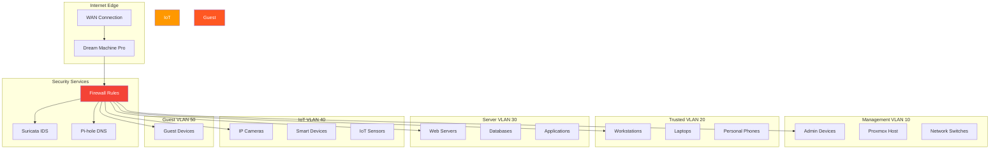

## The IoT Camera That Taught Me About Network Segmentation


*Photo by Alina Grubnyak on Unsplash*

Years ago, I bought a cheap IP camera for my homelab. Within hours, it was beaconing to servers in China, scanning my network, and attempting to access my NAS. All because I put it on the same network as my trusted devices.

That camera is now in a VLAN jail, where it belongs.

## Zero Trust Network Architecture



## VLAN Design Philosophy

### The Zero Trust Principle

**Traditional approach:** Trust everything inside the network perimeter.
**Zero trust approach:** Verify explicitly, enforce least privilege, assume breach.

My VLAN design follows these principles:

1. **Default deny**: No traffic flows between VLANs unless explicitly allowed
2. **Least privilege**: Each VLAN has minimum required access
3. **Explicit allow**: Every connection must have a business justification
4. **Continuous monitoring**: Log and alert on anomalous traffic

### VLAN Segmentation Strategy

| VLAN ID | Name | Purpose | Trust Level | Internet Access |
|---------|------|---------|-------------|-----------------|
| 1 | Default | Unused (disabled) | None | No |
| 10 | Management | Network infrastructure | High | Limited |
| 20 | Trusted | Personal devices | High | Full |
| 30 | Servers | Production services | Medium | Controlled |
| 40 | IoT | Smart home devices | Low | Restricted |
| 50 | Guest | Visitor devices | None | Full (isolated) |
| 60 | Lab | Testing/experiments | Low | Full |
| 70 | DMZ | Public-facing services | Low | Full |

## Ubiquiti Dream Machine Pro Configuration

### Initial Setup

```bash
# SSH into UDM Pro
ssh admin@10.0.0.1

# Enable advanced features
set system advanced enable

# Configure VLANs
configure
set interfaces ethernet eth1 vif 10 description "Management"
set interfaces ethernet eth1 vif 10 address 10.0.10.1/24
set interfaces ethernet eth1 vif 20 description "Trusted"
set interfaces ethernet eth1 vif 20 address 10.0.20.1/24
set interfaces ethernet eth1 vif 30 description "Servers"
set interfaces ethernet eth1 vif 30 address 10.0.30.1/24
set interfaces ethernet eth1 vif 40 description "IoT"
set interfaces ethernet eth1 vif 40 address 10.0.40.1/24
set interfaces ethernet eth1 vif 50 description "Guest"
set interfaces ethernet eth1 vif 50 address 10.0.50.1/24
commit
save
```

### DHCP Configuration

```json
{
  "vlans": [
    {
      "id": 10,
      "name": "Management",
      "subnet": "10.0.10.0/24",
      "dhcp": {
        "enabled": true,
        "start": "10.0.10.100",
        "end": "10.0.10.200",
        "lease_time": 86400,
        "dns": ["10.0.10.5"],
        "gateway": "10.0.10.1"
      }
    },
    {
      "id": 40,
      "name": "IoT",
      "subnet": "10.0.40.0/24",
      "dhcp": {
        "enabled": true,
        "start": "10.0.40.100",
        "end": "10.0.40.250",
        "lease_time": 86400,
        "dns": ["10.0.10.5"],
        "gateway": "10.0.40.1"
      }
    }
  ]
}
```

## Firewall Rules

### Rule Structure

Follow this rule ordering for predictable behavior:

1. Explicit allow rules (most specific first)
2. Logging rules
3. Explicit deny rules
4. Default deny (implicit)

### Management VLAN Rules

```json
{
  "rules": [
    {
      "name": "Allow Management to All",
      "action": "accept",
      "source": "10.0.10.0/24",
      "destination": "any",
      "protocol": "all",
      "logging": true
    },
    {
      "name": "Allow SSH to Management",
      "action": "accept",
      "source": "10.0.20.0/24",
      "destination": "10.0.10.0/24",
      "protocol": "tcp",
      "port": 22,
      "logging": true
    }
  ]
}
```

### IoT VLAN Rules (Most Restrictive)

```json
{
  "rules": [
    {
      "name": "Block IoT to Management",
      "action": "drop",
      "source": "10.0.40.0/24",
      "destination": "10.0.10.0/24",
      "protocol": "all",
      "logging": true
    },
    {
      "name": "Block IoT to Trusted",
      "action": "drop",
      "source": "10.0.40.0/24",
      "destination": "10.0.20.0/24",
      "protocol": "all",
      "logging": true
    },
    {
      "name": "Allow IoT to Internet HTTP/HTTPS",
      "action": "accept",
      "source": "10.0.40.0/24",
      "destination": "any",
      "protocol": "tcp",
      "port": "80,443",
      "logging": false
    },
    {
      "name": "Allow Trusted to IoT HTTP",
      "action": "accept",
      "source": "10.0.20.0/24",
      "destination": "10.0.40.0/24",
      "protocol": "tcp",
      "port": "80,443,554,8080",
      "logging": true
    },
    {
      "name": "Allow IoT DNS",
      "action": "accept",
      "source": "10.0.40.0/24",
      "destination": "10.0.10.5",
      "protocol": "udp",
      "port": 53
    },
    {
      "name": "Block All Other IoT Traffic",
      "action": "drop",
      "source": "10.0.40.0/24",
      "destination": "any",
      "protocol": "all",
      "logging": true
    }
  ]
}
```

### Server VLAN Rules

```json
{
  "rules": [
    {
      "name": "Allow Trusted to Servers HTTPS",
      "action": "accept",
      "source": "10.0.20.0/24",
      "destination": "10.0.30.0/24",
      "protocol": "tcp",
      "port": "443,8443",
      "logging": false
    },
    {
      "name": "Allow Servers to Internet Updates",
      "action": "accept",
      "source": "10.0.30.0/24",
      "destination": "any",
      "protocol": "tcp",
      "port": "80,443",
      "logging": true
    },
    {
      "name": "Block Servers to Management",
      "action": "drop",
      "source": "10.0.30.0/24",
      "destination": "10.0.10.0/24",
      "protocol": "all",
      "logging": true
    }
  ]
}
```

## Advanced Segmentation Techniques

### Micro-Segmentation with mDNS Reflector

Allow service discovery across VLANs without full connectivity:

```bash
# Install Avahi daemon on UDM Pro
apt-get update
apt-get install avahi-daemon

# Configure /etc/avahi/avahi-daemon.conf
[server]
use-ipv4=yes
use-ipv6=no
allow-interfaces=eth1.20,eth1.40
enable-reflector=yes
reflect-ipv=yes
reflect-filters=_airplay._tcp.local,_raop._tcp.local,_homekit._tcp.local
```

This allows AirPlay, Chromecast, and HomeKit to work across VLANs without full L2 connectivity.

### Private VLAN (PVLAN) for IoT Isolation

Isolate IoT devices from each other:

```bash
# Create isolated ports within IoT VLAN
configure
set interfaces ethernet eth1 vif 40 private-vlan isolated
set interfaces ethernet eth2 switchport private-vlan host-association 40 isolated
set interfaces ethernet eth3 switchport private-vlan host-association 40 isolated
commit
```

Now devices on eth2 and eth3 can reach the gateway but not each other.

### Dynamic VLAN Assignment with RADIUS

Automatically assign VLANs based on device identity:

```bash
# /etc/freeradius/3.0/users
camera01  Cleartext-Password := "secure-password"
          Tunnel-Type = VLAN,
          Tunnel-Medium-Type = IEEE-802,
          Tunnel-Private-Group-Id = 40

admin-laptop  Cleartext-Password := "admin-password"
              Tunnel-Type = VLAN,
              Tunnel-Medium-Type = IEEE-802,
              Tunnel-Private-Group-Id = 10
```

## DNS-Based Access Control

### Pi-hole for VLAN-Specific Filtering

```bash
# /etc/pihole/custom.list
# Block telemetry domains for IoT VLAN
0.0.0.0 phone-home.camera-vendor.com
0.0.0.0 telemetry.iot-vendor.com
0.0.0.0 stats.smart-device.com

# Conditional forwarding for internal domains
server=/lab.home/10.0.30.5
server=/mgmt.home/10.0.10.5
```

### DNS Query Logging for Threat Detection

```bash
#!/bin/bash
# /usr/local/bin/analyze-dns-queries.sh

# Find IoT devices querying suspicious domains
tail -n 10000 /var/log/pihole.log | \
    grep "10.0.40" | \
    grep -v "google.com\|amazonaws.com\|cloudflare.com" | \
    awk '{print $6}' | sort | uniq -c | sort -rn | head -20

# Alert on high query volumes from single device
tail -n 10000 /var/log/pihole.log | \
    grep "10.0.40" | \
    awk '{print $5}' | sort | uniq -c | sort -rn | \
    awk '$1 > 100 {print "High query volume from " $2 ": " $1 " queries"}'
```

## Monitoring and Alerting

### NetFlow Analysis

```bash
# Enable NetFlow on UDM Pro
configure
set system flow-accounting interface eth1
set system flow-accounting netflow version 9
set system flow-accounting netflow server 10.0.10.5 port 2055
commit

# Analyze with nfdump
nfdump -R /var/cache/nfdump -s srcip/bytes -n 20
nfdump -R /var/cache/nfdump 'src net 10.0.40.0/24 and not (dst net 10.0.40.0/24 or dst port 53 or dst port 123)'
```

### Traffic Analysis Alerts

```python
#!/usr/bin/env python3
# /usr/local/bin/vlan-traffic-monitor.py

import subprocess
import json
from datetime import datetime

def analyze_cross_vlan_traffic():
    """Detect unexpected cross-VLAN traffic"""

    # Expected patterns (whitelist)
    allowed_flows = {
        ('10.0.20.0/24', '10.0.30.0/24', 443),  # Trusted to Servers HTTPS
        ('10.0.20.0/24', '10.0.40.0/24', 80),   # Trusted to IoT HTTP
    }

    # Parse firewall logs
    with open('/var/log/firewall.log') as f:
        for line in f:
            if 'ACCEPT' not in line:
                continue

            # Extract source, destination, port
            parts = line.split()
            src = parts[5]
            dst = parts[7]
            port = int(parts[9])

            # Check if flow is allowed
            flow = (src, dst, port)
            if flow not in allowed_flows:
                alert(f"Unexpected traffic: {src} -> {dst}:{port}")

def alert(message):
    """Send alert via multiple channels"""
    print(f"[ALERT] {message}")

    # Log to syslog
    subprocess.run(['logger', '-t', 'vlan-monitor', message])

    # Send to monitoring system
    # subprocess.run(['curl', '-X', 'POST', 'http://monitoring/api/alert',
    #                 '-d', json.dumps({'message': message})])

if __name__ == '__main__':
    analyze_cross_vlan_traffic()
```

## Testing and Validation

### Connectivity Testing Matrix

```bash
#!/bin/bash
# /usr/local/bin/test-vlan-segmentation.sh

# Test connectivity between VLANs
declare -A vlans=(
    [mgmt]="10.0.10.100"
    [trusted]="10.0.20.100"
    [servers]="10.0.30.100"
    [iot]="10.0.40.100"
    [guest]="10.0.50.100"
)

echo "VLAN Segmentation Test Results"
echo "=============================="
echo ""

for src_vlan in "${!vlans[@]}"; do
    src_ip="${vlans[$src_vlan]}"

    for dst_vlan in "${!vlans[@]}"; do
        dst_ip="${vlans[$dst_vlan]}"

        if [ "$src_vlan" == "$dst_vlan" ]; then
            continue
        fi

        # Test ICMP
        if timeout 2 ping -c 1 -I "$src_ip" "$dst_ip" &>/dev/null; then
            echo "✅ $src_vlan -> $dst_vlan: ICMP allowed"
        else
            echo "❌ $src_vlan -> $dst_vlan: ICMP blocked"
        fi

        # Test TCP 443
        if timeout 2 nc -z -w 1 -s "$src_ip" "$dst_ip" 443 &>/dev/null; then
            echo "✅ $src_vlan -> $dst_vlan: TCP 443 allowed"
        else
            echo "❌ $src_vlan -> $dst_vlan: TCP 443 blocked"
        fi
    done
    echo ""
done
```

### Automated Penetration Testing

```bash
#!/bin/bash
# /usr/local/bin/test-vlan-breakout.sh

# Simulate attacker on IoT VLAN trying to break out
IOT_IP="10.0.40.50"
TARGET_IPS=("10.0.10.100" "10.0.20.100" "10.0.30.100")

echo "Testing VLAN Breakout Prevention"
echo "================================"
echo "Simulating attacker at $IOT_IP"
echo ""

for target in "${TARGET_IPS[@]}"; do
    echo "Attempting to reach $target..."

    # Port scanning
    nmap -Pn -p 22,80,443,3389,445 --source-ip "$IOT_IP" "$target" -oN "/tmp/vlan-test-$target.txt"

    # Service enumeration
    if grep -q "open" "/tmp/vlan-test-$target.txt"; then
        echo "⚠️  WARNING: Open ports found on $target from IoT VLAN!"
        cat "/tmp/vlan-test-$target.txt"
    else
        echo "✅ $target properly isolated from IoT VLAN"
    fi
    echo ""
done
```

## Troubleshooting Common Issues

### Issue 1: Device Can't Get DHCP

```bash
# Check DHCP server logs
tail -f /var/log/daemon.log | grep dhcpd

# Verify VLAN tagging
tcpdump -i eth1 -e -n -v vlan 40 and port 67

# Test from server
sudo dhcping -s 10.0.40.1 -c 10.0.40.2 -i eth1.40
```

### Issue 2: Inter-VLAN Routing Not Working

```bash
# Verify IP forwarding is enabled
sysctl net.ipv4.ip_forward

# Check routing table
ip route show

# Verify firewall rules
iptables -L -v -n | grep "10.0.40"

# Test routing
traceroute -s 10.0.20.100 10.0.40.100
```

### Issue 3: mDNS/Bonjour Not Working

```bash
# Verify Avahi is running
systemctl status avahi-daemon

# Test mDNS reflection
avahi-browse -a -t

# Check firewall allows UDP 5353
tcpdump -i any -n udp port 5353
```

## Performance Optimization

### Hardware Offloading

```bash
# Enable hardware NAT on UDM Pro
configure
set system offload hwnat enable
set system offload ipsec enable
commit

# Verify offloading status
show ubnt offload
```

### VLAN Performance Tuning

```bash
# Increase MTU for inter-VLAN routing (if supported)
configure
set interfaces ethernet eth1 mtu 9000
set interfaces ethernet eth1 vif 20 mtu 9000
set interfaces ethernet eth1 vif 30 mtu 9000
commit

# Monitor VLAN interface stats
watch -n 1 'ifconfig eth1.20 | grep -E "RX|TX"'
```

## Lessons Learned

After years of running segmented VLANs:

### 1. Start Simple, Add Complexity Gradually
Don't create 20 VLANs on day one. Start with 3-4 logical segments, validate they work, then expand.

### 2. Document Your Rules
Future you will thank present you. I maintain a wiki page with every firewall rule and its justification.

### 3. Default Deny is Your Friend
Block everything by default, then explicitly allow what's needed. It's harder to setup but infinitely more secure.

### 4. Test Your Segmentation Regularly
I run automated tests weekly to ensure segmentation hasn't degraded over time.

### 5. Monitor, Don't Just Configure
Firewall rules without logging are security theater. Log everything and alert on anomalies.

## Security Benefits Realized

Since implementing VLAN segmentation:

- **Reduced attack surface**: Compromised IoT devices can't pivot to trusted networks
- **Easier forensics**: VLAN ID in logs immediately identifies affected segment
- **Improved performance**: Broadcast domains are smaller, reducing noise
- **Compliance**: Network segmentation requirement satisfied
- **Peace of mind**: Sketchy cameras can't access my NAS

## Research & References

### Zero Trust Networking

1. **[BeyondCorp: A New Approach to Enterprise Security](https://research.google/pubs/pub43231/)** (2014)
   - Google's zero trust implementation
   - ACM Queue

2. **[Zero Trust Networks](https://www.oreilly.com/library/view/zero-trust-networks/9781491962183/)** - O'Reilly book by Gilman and Barth

### VLAN Best Practices

1. **[VLAN Security Best Practices](https://www.cisco.com/c/en/us/td/docs/switches/lan/catalyst6500/ios/12-2SX/configuration/guide/book/vlans.html)** - Cisco documentation

2. **[Private VLAN (PVLAN) Deployment Guide](https://tools.ietf.org/html/rfc5517)** - IETF RFC 5517

### Network Segmentation Standards

- **[PCI DSS Network Segmentation](https://www.pcisecuritystandards.org/documents/Guidance-PCI-DSS-Scoping-and-Network-Segmentation_v1.pdf)** - Payment Card Industry requirements
- **[NIST SP 800-41: Guidelines on Firewalls and Firewall Policy](https://csrc.nist.gov/publications/detail/sp/800-41/rev-1/final)**
- **[CIS Controls v8: Network Segmentation](https://www.cisecurity.org/controls/network-infrastructure-management)**

## Conclusion

VLAN segmentation transformed my homelab from a flat, vulnerable network into a defense-in-depth architecture. The cheap IoT camera that inspired this journey is now safely contained, unable to reach anything important.

Zero trust isn't about perfection—it's about making each compromised device a dead end rather than a jumping-off point. Start with logical segments, implement strict firewall rules, monitor everything, and iterate.

Your homelab will be more secure, more organized, and far more interesting to manage.

---

*How are you segmenting your homelab network? What firewall rules have saved you from disaster? Share your VLAN strategies and war stories!*
