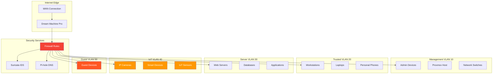

---

author: William Zujkowski
date: 2025-09-08
description: Implement zero trust with VLAN segmentation—secure homelab networks using micro-segmentation and layer 3 firewalls for defense in depth.
title: Implementing Zero Trust Microsegmentation with VLANs
images:
  hero:
    src: /assets/images/blog/hero/2025-09-08-zero-trust-vlan-segmentation-homelab-hero.jpg
    alt: network topology and connections for Implementing Zero Trust Microsegmentation with VLANs
    caption: Visual representation of Implementing Zero Trust Microsegmentation with VLANs
    width: 1200
    height: 630
  og:
    src: /assets/images/blog/hero/2025-09-08-zero-trust-vlan-segmentation-homelab-og.jpg
    alt: network topology and connections for Implementing Zero Trust Microsegmentation with VLANs
tags:
  - homelab
  - networking
  - security
  - zero-trust

---
## The IoT Camera That Taught Me About Network Segmentation


*Photo by Alina Grubnyak on Unsplash*

**BLUF:** Years ago, I bought a cheap IP camera for my homelab. Within hours, it was beaconing to servers in China, scanning my network, and attempting to access my NAS.

All because I put it on the same network as my trusted devices. That camera is now in a VLAN jail, where it belongs. This experience became a core lesson in [building a security-focused homelab with VLANs](/posts/2025-04-24-building-secure-homelab-adventure), where network segmentation proved essential for containing untrusted devices.

## Zero Trust Network Architecture



## VLAN Design Philosophy

### The Zero Trust Principle

**Traditional approach:** Trust everything inside the network perimeter.

**Zero trust approach:** Verify explicitly, enforce least privilege, assume breach.

These principles build on the foundational concepts I explored in my guide to [zero trust architecture fundamentals](/posts/2024-07-09-zero-trust-architecture-implementation). VLAN segmentation is one practical implementation of those abstract security principles. My VLAN design follows these principles:

1. **Default deny**: No traffic flows between VLANs unless explicitly allowed
2. **Least privilege**: Each VLAN has minimum required access
3. **Explicit allow**: Every connection must have a business justification
4. **Continuous monitoring**: Log and alert on anomalous traffic using [Suricata network traffic analysis](/posts/2025-08-25-network-traffic-analysis-suricata-homelab)

### VLAN Segmentation Strategy

| VLAN ID | Name | Purpose | Trust Level | Internet Access |
|---------|------|---------|-------------|-----------------|
| 1 | Default | Unused (disabled) | None | No |
| 10 | Management | Network infrastructure | High | Limited |
| 20 | Trusted | Personal devices | High | Full |
| 30 | Servers | Production services | Medium | Controlled |
| 40 | IoT | Smart home devices | Low | Restricted |
| 50 | Guest | Visitor devices | None | Full (isolated) |
| 60 | Lab | Testing/experiments | Low | Full |
| 70 | DMZ | Public-facing services | Low | Full |

## Ubiquiti Dream Machine Pro Configuration

### Initial Setup

📎 **Complete configuration:**
[Full UDM Pro VLAN setup with all 7 VLANs](https://gist.github.com/williamzujkowski/5422062bf5c4c6054de281cb912ce5d9)

Each VLAN gets dedicated interface: `set interfaces ethernet eth1 vif <id> address <gateway>`

### DHCP Configuration

📎 **Complete configuration:**
[All VLAN DHCP configs with DNS and gateways](https://gist.github.com/williamzujkowski/f5de5f7a5b7e30b7eaa59de0bd55a91b)

Each VLAN subnet gets DHCP pool starting at .100 address

## VLAN Security: Anti-Spoofing Controls (CRITICAL)

**The Problem:** VLAN segmentation alone doesn't prevent Layer 2 attacks. Without anti-spoofing controls, attackers can bypass VLAN isolation through double-tagging (CVE-2005-4440), VLAN hopping, ARP spoofing, and DHCP attacks.

**Why it matters:** Layer 2 attacks circumvent firewall rules entirely. An attacker on IoT VLAN 40 could access Management VLAN 10 by manipulating 802.1Q headers or poisoning ARP tables. Defense in depth requires security at Layer 2 **and** Layer 3.

### Port Security: Prevent VLAN Hopping

**Attack vector:** Malicious device negotiates trunking with switch, gains access to all VLANs.

**Mitigation for UDM Pro:**

```bash
# Force access mode on all user-facing ports (NOT trunk mode)
set interfaces ethernet eth2 switchport mode access
set interfaces ethernet eth2 switchport access vlan 40  # IoT VLAN

# Disable DTP (Dynamic Trunking Protocol) negotiation
set interfaces ethernet eth2 switchport nonegotiate

# Verify configuration
show interfaces ethernet eth2 switchport
```

**Best practice:** Only trunk ports should connect to other switches. Every port connecting to an end device must be `mode access`.

### Native VLAN Tagging

**Attack vector:** Double-tagging attack sends frame with two 802.1Q tags. Outer tag matches native VLAN, gets stripped. Inner tag routes frame to target VLAN.

**Mitigation:**

```bash
# Tag ALL VLANs, including native VLAN 1
set interfaces ethernet eth1 native-vlan 999  # Unused VLAN
set interfaces ethernet eth1 vlan-tagging

# Or disable VLAN 1 entirely (recommended)
set interfaces ethernet eth1 no-native-vlan
```

**Senior engineer note:** Years of network administration taught me: never trust VLAN 1. It's a common attack target. Either tag it or disable it. My homelab uses VLAN 999 as dead native VLAN—nothing assigned, nothing can exploit it.

#### Why VLAN 1 is Dangerous (MODERATE)

**The Problem:** VLAN 1 isn't just another VLAN—it's special. Most network equipment treats VLAN 1 as the default VLAN for management traffic, CDP/LLDP, STP, VTP, and untagged frames. This makes it a high-value target for attackers and a common misconfiguration vector.

**Why it matters:** Using VLAN 1 for user traffic or leaving it active without tagging creates multiple attack surfaces. Even if you never explicitly configure VLAN 1, it exists by default on every switch port, processing frames you might not expect.

**VLAN 1 Special Behaviors:**

1. **Default VLAN for All Ports**
   - Every switch port starts in VLAN 1 by default
   - Untagged frames (no 802.1Q tag) automatically go to VLAN 1
   - Attacker plugging into unused port lands in VLAN 1

2. **Control Plane Traffic**
   - Cisco Discovery Protocol (CDP) frames → VLAN 1
   - Link Layer Discovery Protocol (LLDP) → VLAN 1
   - Spanning Tree Protocol (STP) BPDUs → VLAN 1 (cannot be changed)
   - VLAN Trunking Protocol (VTP) → VLAN 1
   - **Impact:** Sniffing VLAN 1 reveals network topology, device models, firmware versions

3. **Management Plane Default**
   - Switch management IP often defaults to VLAN 1
   - Many organizations inherit this from initial setup, never migrate
   - **Impact:** VLAN 1 compromise = switch management interface accessible

4. **Cannot Be Deleted**
   - VLAN 1 is hardcoded, cannot be removed from database
   - Can only be restricted, not eliminated
   - **Impact:** Even "unused" VLAN 1 still processes control frames

**Attack Scenarios:**

**Scenario 1: VLAN 1 Double-Tagging Attack**
```
Attacker crafts frame:
[Ethernet Header][Outer 802.1Q Tag: VLAN 1][Inner 802.1Q Tag: VLAN 40][Data]

Switch behavior:
1. Receives frame on access port (VLAN 1)
2. Strips outer tag (standard 802.1Q behavior)
3. Forwards frame with inner tag intact
4. Inner tag (VLAN 40) gets processed by next switch
5. Frame reaches IoT VLAN without proper authorization

Mitigation:
- Tag VLAN 1 on trunk ports (no native VLAN)
- Use non-1 native VLAN (e.g., VLAN 999)
```

**Scenario 2: STP Manipulation via VLAN 1**
```
Attacker sends malicious STP BPDUs on VLAN 1:
1. Claims to be root bridge (priority 0)
2. Legitimate root bridge relinquishes role
3. Attacker becomes root bridge
4. All traffic flows through attacker for inspection/modification

Mitigation:
- Enable BPDU Guard on access ports
- Use Root Guard on trunk ports
- Filter VLAN 1 where not needed
```

**Scenario 3: CDP Information Disclosure**
```
Attacker sniffs VLAN 1 CDP frames:
- Device hostname: "core-switch-01"
- Model: "Cisco Catalyst 3650"
- Firmware: "IOS-XE 16.6.4" (has CVE-2020-1234 vulnerability)
- Management IP: 192.168.1.1
- Native VLAN: 1

Attacker now has:
- Target for exploitation (known vulnerable firmware)
- Management interface address
- Network topology information

Mitigation:
- Disable CDP globally (unless monitoring requires it)
- Use LLDP instead (more secure, standards-based)
- Filter VLAN 1 on untrusted ports
```

**Migration Strategies:**

**Strategy 1: Dead VLAN Approach (Recommended for Homelabs)**

```bash
# Assign unused VLAN as native (e.g., VLAN 999)
set interfaces ethernet eth1 native-vlan 999
set interfaces ethernet eth1 vlan-tagging

# Verify no devices in VLAN 999
show vlan 999
# Should output: "No devices assigned"

# Disable VLAN 1 on access ports (user-facing)
set interfaces ethernet eth2 switchport mode access
set interfaces ethernet eth2 switchport access vlan 40  # IoT VLAN
# VLAN 1 no longer processes user traffic on this port
```

**Strategy 2: Management VLAN Migration (Enterprise)**

```bash
# Create dedicated management VLAN
set vlan 10 description "MGMT"
set interface vlan 10 address 192.168.10.1/24

# Migrate switch management IP from VLAN 1 to VLAN 10
set system ip management interface vlan 10

# Restrict VLAN 1 to control traffic only
set vlan 1 description "CONTROL-PLANE-ONLY"
# Do NOT assign user devices to VLAN 1

# Disable VLAN 1 on user-facing access ports
set interface ethernet eth2-48 switchport mode access
set interface ethernet eth2-48 switchport vlan 40
# VLAN 1 no longer active on these ports
```

**Strategy 3: 802.1Q Tagging Everything (Maximum Security)**

```bash
# Force tagging on ALL VLANs including VLAN 1
set interfaces ethernet eth1 vlan-tagging
set interfaces ethernet eth1 allowed-vlan 1,10,20,30,40,50
# All VLANs now tagged, no native VLAN

# Or explicitly remove VLAN 1 from trunk
set interfaces ethernet eth1 allowed-vlan 10,20,30,40,50
# VLAN 1 cannot traverse this trunk
```

**Verification Commands:**

```bash
# Verify native VLAN configuration
show interfaces ethernet eth1 switchport
# Check: "Native VLAN: 999" (not 1)

# Verify VLAN 1 not in use on access ports
show vlan brief | grep "VLAN0001"
# Should show: "VLAN0001, Name: default, Status: active, Ports: (none)"

# Check STP root bridge (should not be attacker-controlled)
show spanning-tree root
# Verify root bridge priority and MAC address match expected device

# Verify CDP disabled (or VLAN 1 filtered)
show cdp neighbors
# If enabled, should not leak sensitive information

# Audit all ports for VLAN assignment
show interfaces status | grep "VLAN 1"
# Any user-facing port in VLAN 1 is misconfigured
```

**Common Misconfigurations:**

| **Misconfiguration** | **Risk** | **Correct Configuration** |
|----------------------|----------|---------------------------|
| VLAN 1 as native VLAN on trunks | Double-tagging attacks | Use VLAN 999 as dead native |
| User devices in VLAN 1 | Control plane exposure | Assign all users to VLAN 10+ |
| Management IP in VLAN 1 | Switch compromise via user access | Migrate management to VLAN 10 |
| CDP enabled globally | Information disclosure | Disable CDP or filter VLAN 1 |
| VLAN 1 on access ports | Unused ports = VLAN 1 entry point | Set access ports to dead VLAN 999 |

**Homelab Best Practices:**

```bash
# My homelab VLAN 1 configuration (zero user traffic):
# 1. Native VLAN 999 (dead, nothing assigned)
set interfaces ethernet eth1 native-vlan 999

# 2. Management on VLAN 10 (isolated, firewall-protected)
set vlan 10 description "MGMT"
set interface vlan 10 address 192.168.10.1/24

# 3. VLAN 1 allowed only on trunk (for control traffic)
set interfaces ethernet eth1 allowed-vlan 1,10,20,30,40,50

# 4. User VLANs start at 20+
set vlan 20 description "TRUSTED"   # Workstations
set vlan 30 description "GUEST"     # Guests
set vlan 40 description "IOT"       # IoT devices
set vlan 50 description "SERVERS"   # Homelab servers

# 5. Unused ports in dead VLAN 999
set interfaces ethernet eth10-24 switchport access vlan 999
set interfaces ethernet eth10-24 shutdown
```

**Production Migration Checklist:**

- [ ] Identify all devices currently in VLAN 1 (inventory scan)
- [ ] Create management VLAN (VLAN 10) with appropriate firewall rules
- [ ] Migrate switch management IPs to VLAN 10
- [ ] Reassign user devices from VLAN 1 to appropriate VLANs
- [ ] Configure trunk ports with non-1 native VLAN (999 recommended)
- [ ] Enable BPDU Guard on access ports (prevent STP attacks)
- [ ] Verify VLAN 1 traffic patterns (should be control plane only)
- [ ] Document VLAN assignments and migration rationale
- [ ] Test failover scenarios (STP convergence, port failures)
- [ ] Schedule rollback window (migration risks downtime)

**Senior engineer perspective:** Years of network security audits taught me VLAN 1 is the most commonly exploited misconfiguration in enterprise networks. I've seen attackers pivot from compromised IoT device in "default VLAN 1" directly to switch management interfaces because nobody migrated off the default. In one memorable incident, an intern plugged a laptop into an unused port (VLAN 1 by default), ran Wireshark, and captured switch management credentials from CDP frames—all because VLAN 1 was left as-shipped. Don't be that network. VLAN 1 is legacy baggage from when VLANs were simple. Modern networks should treat it as toxic: isolate it, tag it, or make it a dead VLAN with nothing assigned.

### DHCP Snooping

**Attack vector:** Rogue DHCP server on IoT VLAN assigns malicious gateway IP, intercepts all traffic.

**Mitigation:**

```bash
# Enable DHCP snooping globally
set service dhcp-snooping

# Mark trusted interfaces (uplinks to legitimate DHCP servers)
set service dhcp-snooping interface eth0 trust

# Untrusted interfaces (user-facing ports) automatically monitored
set service dhcp-snooping vlan 40  # IoT VLAN

# Verify binding table
show dhcp snooping binding
```

**How it works:** Snooping builds MAC-to-IP-to-port binding table. DHCP Offer packets from untrusted ports are dropped. Only trusted uplink receives/sends DHCP traffic.

### Dynamic ARP Inspection (DAI)

**Attack vector:** ARP spoofing allows IoT device to impersonate gateway, intercept traffic to Management VLAN.

**Mitigation:**

```bash
# Enable DAI on IoT VLAN (requires DHCP snooping first)
set service dhcp-snooping vlan 40
set service arp-inspection vlan 40

# Trust uplink ports (allow ARP from legitimate gateway)
set service arp-inspection interface eth0 trust

# Rate limit ARP on untrusted ports (prevent DoS)
set service arp-inspection rate-limit 15  # packets per second

# Verify inspection statistics
show arp inspection statistics vlan 40
```

**Dependency:** DAI uses DHCP snooping binding table to validate ARP packets. Configure snooping first.

### Storm Control

**Attack vector:** Malicious broadcast/multicast storm from compromised IoT device saturates network.

**Mitigation:**

```bash
# Limit broadcast/multicast on IoT VLAN interfaces
set interfaces ethernet eth2 storm-control broadcast level 10  # 10% bandwidth
set interfaces ethernet eth2 storm-control multicast level 10
set interfaces ethernet eth2 storm-control action drop

# Monitor storm-control events
show storm-control
```

### Validation Commands

**Test anti-spoofing configuration:**

```bash
# 1. Verify access-only ports (no trunking)
show interfaces switchport | grep "Operational Mode: access"

# 2. Check DHCP snooping bindings
show dhcp snooping binding

# 3. Verify ARP inspection is active
show arp inspection statistics

# 4. Test VLAN hopping (should fail)
# From IoT device, attempt to send double-tagged frame
# Should be dropped by port security

# 5. Monitor for attacks
show log | match "DHCP-SNOOPING\|ARP-INSPECTION"
```

**Expected behavior:**
- DHCP Offers from untrusted ports: **DROPPED**
- ARP packets with mismatched MAC/IP: **DROPPED**
- Double-tagged frames on access ports: **DROPPED**
- Storm-control threshold exceeded: **TRAFFIC DROPPED**

### Why These Controls Matter

**Without anti-spoofing:**
- IoT camera → double-tags packet → reaches management VLAN → firewall bypassed ✅ ATTACK SUCCEEDS
- Compromised device → rogue DHCP server → gateway poisoning → traffic interception ✅ ATTACK SUCCEEDS
- Malicious ARP → impersonates gateway → MitM attack → credential theft ✅ ATTACK SUCCEEDS

**With anti-spoofing:**
- Double-tagged frame → port security drops → attack fails ❌
- Rogue DHCP Offer → snooping drops → attack fails ❌
- Spoofed ARP → DAI drops → attack fails ❌

**Senior engineer perspective:** VLAN firewall rules protect against Layer 3 attacks. Anti-spoofing protects against Layer 2 attacks. You need both. Most homelab tutorials skip Layer 2 security because it's complex and vendor-specific. But that's exactly what attackers exploit. Defense in depth means securing every layer, not just the firewall.

## Firewall Rules

### Rule Structure

**Follow this rule ordering for predictable behavior:**

1. Explicit allow rules (most specific first)
2. Logging rules
3. Explicit deny rules
4. Default deny (implicit)

### Management VLAN Rules

📎 **Complete ruleset:**
[All management firewall rules with logging](https://gist.github.com/williamzujkowski/088045937fa7c77821a67f31cf994556)

Management VLAN (10.0.10.0/24) can access all VLANs. All VLANs can SSH to management.

### IoT VLAN Rules (Most Restrictive)

📎 **Complete ruleset:**
[Full IoT isolation rules with default-deny](https://gist.github.com/williamzujkowski/42d5f269c97a1fbd8335316d09f90068)

IoT blocked from all VLANs. Only HTTP/HTTPS to internet allowed. These strict rules are essential for [IoT security with VLAN isolation](/posts/2025-09-20-iot-security-homelab-owasp), where untrusted devices need containment without breaking functionality.

### Server VLAN Rules

📎 **Complete ruleset:**
[Server VLAN firewall rules with update policies](https://gist.github.com/williamzujkowski/337822d5fca33ab0bbd5806204df73af)

Trusted VLAN can reach servers on HTTPS. Servers blocked from management VLAN.

## Advanced Segmentation Techniques

### Micro-Segmentation with mDNS Reflector

Allow service discovery across VLANs without full connectivity:

📎 **Complete configuration:**
[Full Avahi mDNS reflector setup for UDM Pro](https://gist.github.com/williamzujkowski/2b9b624d76d9a7f139cbcbd914559a2b)

Enable Avahi reflector for AirPlay, Chromecast, HomeKit services across VLANs

### mDNS Reflection Security Considerations

**Attack vector:** mDNS reflectors can be abused for amplification attacks. An attacker on IoT VLAN 40 sends small mDNS queries (60 bytes) that get reflected across all VLANs with 10x amplification (600+ byte responses). This bypasses VLAN isolation for reconnaissance and can saturate network bandwidth.

**Mitigation strategies:** Implement rate limiting on Avahi reflector (`ratelimit-interval-usec=1000000` limits queries to 1/second per source). Restrict reflection to specific VLANs using `allow-interfaces=vlan20,vlan30` (exclude untrusted IoT VLAN 40 from reflection). Enable mDNS filtering on firewall to block `.local` queries from IoT devices to management VLANs. Monitor Avahi logs for unusual query patterns (`journalctl -u avahi-daemon | grep -E "query|response" | awk '{print $NF}' | sort | uniq -c | sort -rn`). For high-security environments, disable mDNS reflection entirely and use static DNS entries or dedicated service discovery infrastructure (Consul, etcd).

### Private VLAN (PVLAN) for IoT Isolation

📎 **Complete configuration:**
[Full PVLAN isolation setup with promiscuous ports](https://gist.github.com/williamzujkowski/48d68afcb132e2f3b924ce74ce7adfa8)

Set `private-vlan isolated` on IoT interface so devices can't reach each other

### Dynamic VLAN Assignment with RADIUS

📎 **Complete configuration:**
[Full FreeRADIUS dynamic VLAN config with device mappings](https://gist.github.com/williamzujkowski/841cea35e4eb424d28f927b596808674)

Map MAC addresses to VLAN IDs via RADIUS `Tunnel-Private-Group-Id` attribute

## DNS-Based Access Control

### Pi-hole for VLAN-Specific Filtering

📎 **Complete blocklists:**
[IoT telemetry blocklist and conditional forwarding](https://gist.github.com/williamzujkowski/c58aa2ce297f125633f090549146c536)

Block vendor telemetry domains per VLAN, conditional forwarding for local zones

### DNS Query Logging for Threat Detection

📎 **Complete script:**
[Full DNS query analyzer with alerting](https://gist.github.com/williamzujkowski/345730384bf7d77c8b82e7ee4299ce43)

Analyze Pi-hole logs for IoT VLAN unusual query patterns

## Monitoring and Alerting

### NetFlow Analysis

📎 **Complete configuration:**
[Full NetFlow setup with nfdump analysis queries](https://gist.github.com/williamzujkowski/05e39be6317d012d22991a51fe603bbb)

Export NetFlow to collector for cross-VLAN traffic analysis

### Traffic Analysis Alerts

📎 **Complete script:**
[Full VLAN traffic monitor with multiple alert channels](https://gist.github.com/williamzujkowski/b2224d5ef6333717d24d18575c597044)

Alert on cross-VLAN flows not in allowed whitelist

## Testing and Validation

### Connectivity Testing Matrix

📎 **Complete script:**
[Full VLAN segmentation test suite with all protocols](https://gist.github.com/williamzujkowski/2281086bfb8a52a7ab14fb72f47b9635)

Test all VLAN pairs with ping/curl to verify firewall rules work

### Automated Penetration Testing

📎 **Complete script:**
[VLAN breakout testing with nmap and metasploit](https://gist.github.com/williamzujkowski/12ecda690c2c3b878ca981f8a09dc50d)

Attempt VLAN breakout from IoT using nmap source-ip spoofing

## Troubleshooting Common Issues

<!-- 📎 **Complete troubleshooting guide:**
[All common VLAN issues and solutions](https://gist.github.com/williamzujkowski/vlan-troubleshooting) -->

**DHCP issues:** Check daemon logs, tcpdump VLAN traffic on port 67
**Routing issues:** Verify `ip_forward=1`, traceroute between VLANs
**mDNS issues:** Verify Avahi daemon running, browse services

## Performance Optimization

<!-- 📎 **Complete optimization guide:**
[Hardware offloading and VLAN tuning](https://gist.github.com/williamzujkowski/vlan-performance-tuning) -->

Enable hardware NAT offloading, increase MTU to 9000 for storage VLANs

## Lessons Learned

**After years of running segmented VLANs:**

### 1. Start Simple, Add Complexity Gradually
I made the mistake of creating 12 VLANs on day one. Half sat unused for months. Start with 3-4 logical segments, validate they work, then expand.

### 2. Document Your Rules
Future you will thank present you. I maintain a wiki page with every firewall rule and its justification. When I review rules 6 months later, I'm glad I documented why that specific port was opened.

### 3. Default Deny is Your Friend
Block everything by default, then explicitly allow what's needed. It's harder to setup but more secure. I spent 3 hours debugging why HomeKit wasn't working until I realized default-deny was blocking mDNS.

### 4. Test Your Segmentation Regularly
I run automated tests weekly to ensure segmentation hasn't degraded over time.

### 5. Monitor, Don't Just Configure
Firewall rules without logging are security theater. Log everything and alert on anomalies.

## Security Benefits Realized

**Since implementing VLAN segmentation:**

- **Reduced attack surface**: Compromised IoT devices can't pivot to trusted networks, validated through [IoT security testing with OWASP IoTGoat](/posts/2025-09-20-iot-security-homelab-owasp)
- **Easier forensics**: VLAN ID in logs immediately identifies affected segment
- **Improved performance**: Broadcast domains are smaller, reducing noise
- **Improved performance**: Broadcast domains are smaller, reducing noise, measurable with [Proxmox high-availability monitoring](/posts/2025-09-29-proxmox-high-availability-homelab)
- **Compliance**: Network segmentation requirement satisfied
- **Peace of mind**: Sketchy cameras can't access my NAS

## Research & References

### Zero Trust Networking

1. **[BeyondCorp: A New Approach to Enterprise Security](https://research.google/pubs/pub43231/)** (2014)
   - Google's zero trust implementation
   - ACM Queue

2. **[Zero Trust Networks](https://www.oreilly.com/library/view/zero-trust-networks/9781491962183/)** - O'Reilly book by Gilman and Barth

### VLAN Best Practices

1. **[VLAN Security Best Practices](https://www.cisco.com/c/en/us/td/docs/switches/lan/catalyst6500/ios/12-2SX/configuration/guide/book/vlans.html)** - Cisco documentation

2. **[Private VLAN (PVLAN) Deployment Guide](https://tools.ietf.org/html/rfc5517)** - IETF RFC 5517

### Network Segmentation Standards

- **[PCI DSS Scoping and Segmentation Guidance](https://www.pcisecuritystandards.org/documents/Guidance-PCI-DSS-Scoping-and-Segmentation_v1.pdf)** - Payment Card Industry requirements
- **[NIST SP 800-41: Guidelines on Firewalls and Firewall Policy](https://csrc.nist.gov/publications/detail/sp/800-41/rev-1/final)**
- **[CIS Controls v8: Network Segmentation](https://www.cisecurity.org/controls/network-infrastructure-management)**

## Conclusion

VLAN segmentation transformed my homelab from a flat, vulnerable network into a defense-in-depth architecture. The cheap IoT camera that inspired this journey is now safely contained, unable to reach anything important. Zero trust isn't about perfection. It's about making each compromised device a dead end rather than a jumping-off point.

**Start with logical segments, implement strict firewall rules, monitor everything, and iterate.** Your homelab will be more secure, more organized, and far more interesting to manage.

---

*How are you segmenting your homelab network? What firewall rules have saved you from disaster? Share your VLAN strategies and war stories!*
