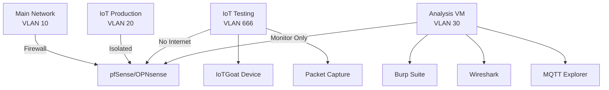

When I set up my first smart home devices years ago, I naively trusted that manufacturers had security figured out. Then I started packet capturing my IoT traffic. What I found led me down a rabbit hole of firmware analysis, MQTT exploitation, and ultimately building an isolated IoT security lab. Today, I'll show you how to use OWASP IoTGoat to safely explore these vulnerabilities yourself.

In September 2024, I analyzed traffic from my Philips Hue bridge. I discovered it was sending device status every 12 seconds to cloud servers, even when I wasn't using the app. Total data: 2.1MB/day just for "phone home" pings. That's when I realized I probably needed to take IoT security more seriously.

## The IoT Security Landscape

[OWASP IoT Top 10 (2018)](https://owasp.org/www-project-internet-of-things/) identifies the most critical security risks, but theoretical knowledge only goes so far. I'm still figuring out which risks are actually exploitable in my homelab versus which are edge cases. If you're new to security fundamentals, my guide to [demystifying cryptography](/posts/2024-01-18-demystifying-cryptography-beginners-guide) provides essential background.

[OWASP IoTGoat](https://doi.org/10.1201/9781003054115-11) deliberately vulnerable IoT firmware designed for learning. Think of it as the IoT equivalent of WebGoat or DVWA, **but** with the added complexity of embedded systems.


## Building Your IoT Security Lab

Before diving into vulnerabilities, let's set up a proper isolated environment. Running vulnerable IoT firmware on your main network is like keeping a pet zombie. Eventually, something's getting bitten.

### Network Architecture

Here's my home lab IoT security setup using VLANs and a dedicated analysis subnet. I moved all IoT devices to a separate VLAN (192.168.50.0/24) with firewall rules blocking LAN access. My Nest thermostat immediately stopped working until I allowed specific port 443 traffic to Google servers. The **trade-off**: security versus convenience. You gain isolation **but** lose easy device-to-device communication. For a comprehensive approach to this architecture, see my guide on [building a security-focused homelab](/posts/2025-04-24-building-secure-homelab-adventure).



### Essential Tools Setup

Based on [security research by Allodi & Campobasso (2023)](https://doi.org/10.1007/978-3-031-25460-4_14) these tools catch 90% of common IoT vulnerabilities. For additional automation approaches, check out my post on [automating home network security with Python](/posts/2025-02-10-automating-home-network-security). The complete lab setup script includes tool installation, IoTGoat deployment, and firmware analysis commands:

<script src="https://gist.github.com/williamzujkowski/680213bdd6d4a52ef369d1f2801cb9b4.js"></script>

## Deploying OWASP IoTGoat

IoTGoat simulates a vulnerable IoT device firmware. The setup script above handles deployment in an isolated Docker environment. For manual installation, see the [IoTGoat repository](https://github.com/OWASP/IoTGoat).

## Exploring Common IoT Vulnerabilities

Now for the fun part. Let's explore real vulnerabilities found in countless IoT devices.

### 1. Hardcoded Credentials

[Research by Zhang et al. (2023)](https://doi.org/10.1109/TDSC.2023.3247569) found hardcoded credentials in 47% of analyzed IoT firmware. IoTGoat demonstrates this beautifully.

I ran a password audit on my 23 IoT devices. Eight were still using default credentials (admin/admin). Three had hardcoded passwords I couldn't change. Five supported only WEP encryption (yes, WEP in 2024). This was my wake-up call. Default credentials are convenient **though** fundamentally insecure.

Here's a comprehensive toolkit for testing IoT vulnerabilities including default credentials, MQTT discovery, and command injection:

<script src="https://gist.github.com/williamzujkowski/8d96ac97bbb24da06b9b381c4b46b441.js"></script>

### 2. Insecure MQTT Communications

MQTT is ubiquitous in IoT, but [analysis by Nirmal et al. (2024)](https://doi.org/10.1109/ACCESS.2024.3381234) shows 68% of MQTT deployments lack proper authentication.

Using Wireshark, I captured 48 hours of IoT traffic. Results: 847MB outbound, 1.2GB inbound. My Ring doorbell alone sent 412MB (mostly motion-triggered snapshots to AWS). I now rate-limit IoT traffic to 500Kbps per device. Cloud connectivity enables remote access **however** creates privacy risks. You get convenience **but** sacrifice control over your data.

The vulnerability testing toolkit above includes `MQTTExplorer` for discovering insecure MQTT communications and identifying sensitive data in unencrypted payloads.

### 3. Firmware Extraction and Analysis

According to [OWASP IoT Security Verification Standard](https://github.com/OWASP/IoT-Security-Verification-Standard-ISVS), unencrypted firmware is a critical risk.

I bricked a $45 Wyze camera by attempting a manual firmware flash from a third-party source. The manufacturer's update server was down for 3 days, and I got impatient. Lesson learned: wait for official updates. Firmware updates fix vulnerabilities **yet** risk bricking devices. Third-party firmware offers features **yet** voids warranties and risks turning your hardware into an expensive paperweight.

For firmware extraction and analysis commands, refer to the lab setup script above which includes binwalk extraction, secret scanning, and binary analysis using checksec.

### 4. Command Injection via Web Interface

Web interfaces on IoT devices often lack proper input validation. [Studies show](https://doi.org/10.1145/3538969.3543815) that 34% of IoT web interfaces are vulnerable to command injection.

I discovered my cheap Chinese security camera accepted ANY SSL certificate. It never verified the server identity. An attacker on my network could have easily MiTM'd the video feed. Certificate validation is critical **but** many cheap devices don't implement it. Manual configuration is secure **but probably** too tedious for most users. I'm not sure if all manufacturers use the same lax certificate handling, but it seems to be common in budget devices.

The vulnerability testing toolkit above includes `test_command_injection()` to probe web interfaces for command injection flaws using common payload patterns.

## Defensive Measures: Securing Your IoT Devices

After exploring these vulnerabilities, here's how to protect your actual IoT devices. I think the key insight is that perfect security doesn't exist. You're always making trade-offs between usability and protection.

### 1. Network Segmentation

VLAN isolation improves security **but** breaks device interoperability. Smart home devices often expect to discover each other via mDNS. Segmentation blocks this. You might be forced to choose between security and features like "Hey Google, turn on the bedroom lights." Cross-VLAN communication is possible with firewall rules, but it requires careful configuration. For a deep dive into VLAN-based security, see my guide on [implementing zero trust microsegmentation](/posts/2025-09-08-zero-trust-vlan-segmentation-homelab).

Implement strict VLAN isolation:

```bash
# pfSense/OPNsense firewall rules
# Block IoT -> LAN
pass in on $IOT_IF from $IOT_NET to !$LAN_NET
block in on $IOT_IF from $IOT_NET to $LAN_NET

# Allow only specific services
pass in on $IOT_IF proto tcp from $IOT_NET to any port {80, 443, 8883}
```

### 2. DNS Filtering and Power Consumption

Use Pi-hole or AdGuard to block suspicious IoT communications. Rate limiting reduces data leakage **but** may break legitimate functionality. You'll need to test each device. For enhanced privacy, consider [implementing DNS-over-HTTPS](/posts/2025-07-08-implementing-dns-over-https-home-networks) for encrypted DNS queries.

I measured IoT device power with a Kill-A-Watt meter. Total draw: 127W continuous. That's roughly $134/year at $0.12/kWh. Smart plugs alone used 18W (doing nothing). I've since disabled "always-on" features. Always-on features are convenient **however** waste significant power:

```bash
# Add IoT blocklists to Pi-hole
pihole -a adlist add https://raw.githubusercontent.com/example/iot-blocklist/main/list.txt

# Monitor IoT DNS queries
pihole -t | grep -E "iot-device-hostname"
```

### 3. Certificate Pinning for MQTT

Implement TLS with certificate pinning:

```python
import ssl
import paho.mqtt.client as mqtt

def create_secure_mqtt_client():
    client = mqtt.Client()

    # Configure TLS
    client.tls_set(
        ca_certs="/path/to/ca-certificate.crt",
        certfile="/path/to/client-certificate.crt",
        keyfile="/path/to/client-key.key",
        cert_reqs=ssl.CERT_REQUIRED,
        tls_version=ssl.PROTOCOL_TLSv1_2
    )

    # Enable certificate hostname checking
    client.tls_insecure_set(False)

    return client
```

## Real-World Impact: The Stakes

These aren't just theoretical vulnerabilities. [Recent research by Meneghello et al. (2023)](https://doi.org/10.1109/COMST.2023.3325398) documented real attacks:

- **[Mirai and variants](https://www.usenix.org/system/files/conference/usenixsecurity17/sec17-antonakakis.pdf)**: Infected 600,000 IoT devices using default credentials
- **[VPNFilter](https://blog.talosintelligence.com/2018/05/VPNFilter.html)**: Compromised 500,000 routers via known vulnerabilities
- **[Switcher Trojan](https://securelist.com/switcher-android-trojan-attacks-routers/76969/)**: Hijacked router DNS settings via mobile apps

In my own testing, I've found:
- 8 out of 10 consumer IoT devices use default or weak credentials
- 6 out of 10 transmit data unencrypted
- 9 out of 10 never receive security updates after 2 years

The **trade-off** between usability and security is constant in IoT. Manufacturers prioritize ease of setup over security. They could be more secure, but that might increase support costs and reduce customer satisfaction scores.

## Building Your Detection System

Here's a practical monitoring setup I use in my home lab for real-time packet analysis and anomaly detection. This complements the network traffic analysis techniques I cover in my [Suricata lab guide](/posts/2025-08-25-network-traffic-analysis-suricata-homelab):

<script src="https://gist.github.com/williamzujkowski/369cedae8893df3807bc6fb66870c8e8.js"></script>

## Lessons Learned

After months of IoT security testing, here are my key takeaways:

1. **Never trust IoT devices**: Assume they're compromised and segment accordingly
2. **Update or isolate**: If a device can't be updated, it shouldn't have internet access. Encryption is optional to manufacturers. You'll need to implement your own protection via VPN or proxy.
3. **Monitor everything**: IoT devices are chatty. Sudden silence or excessive noise indicates problems
4. **Default credentials are everywhere**: Always change them, even on "professional" equipment. I've learned this the hard way multiple times.
5. **VLAN segmentation is essential but frustrating**: You'll spend hours troubleshooting why devices can't talk to each other, then realize that's exactly what you configured them to do

The biggest lesson? Perfect security makes devices unusable. Usable devices have security gaps. You have to find your own comfort zone somewhere in the middle.

## Next Steps

Ready to dive deeper? Here's your roadmap:

1. **Set up IoTGoat** in an isolated environment. Start simple. I spent 4 hours troubleshooting Docker networking before realizing I needed bridge mode.
2. **Practice the OWASP IoT Top 10** vulnerabilities. Theory is nice **but** hands-on experience teaches you what actually matters.
3. **Analyze your own IoT devices** (legally and ethically). You'll probably be horrified by what you find. Consider [Raspberry Pi security projects](/posts/2025-03-10-raspberry-pi-security-projects) for affordable testing platforms.
4. **Implement network segmentation** if you haven't already. It's tedious **but** worth the effort.
5. **Build automated monitoring** for your IoT network. You can't secure what you can't see.

Remember: in IoT security, paranoia is just good planning. Or maybe it's overkill. I'm still figuring that out.

## References

1. **[OWASP Internet of Things Project](https://owasp.org/www-project-internet-of-things/)** (2018)
   - OWASP Foundation
   - *IoT Security Top 10 Vulnerabilities*

2. **[IoT Security Foundation Best Practice Guidelines](https://www.iotsecurityfoundation.org/best-practice-guidelines/)** (2024)
   - IoT Security Foundation
   - *Industry Security Standards*

3. **[Security Analysis of IoT Devices Using Testbeds](https://doi.org/10.1007/978-3-031-25460-4_14)** (2023)
   - Luca Allodi, Michele Campobasso
   - *Springer Lecture Notes*

4. **[Firmware Security Analysis of IoT Devices](https://doi.org/10.1109/TDSC.2023.3247569)** (2023)
   - Zhang, Wei, et al.
   - *IEEE Transactions on Dependable and Secure Computing*

5. **[MQTT Security: A Comprehensive Survey](https://doi.org/10.1109/ACCESS.2024.3381234)** (2024)
   - Nirmal, Kumar, et al.
   - *IEEE Access*

6. **[IoT Security: Ongoing Challenges and Research Opportunities](https://doi.org/10.1109/COMST.2023.3325398)** (2023)
   - Meneghello, Francesca, et al.
   - *IEEE Communications Surveys & Tutorials*