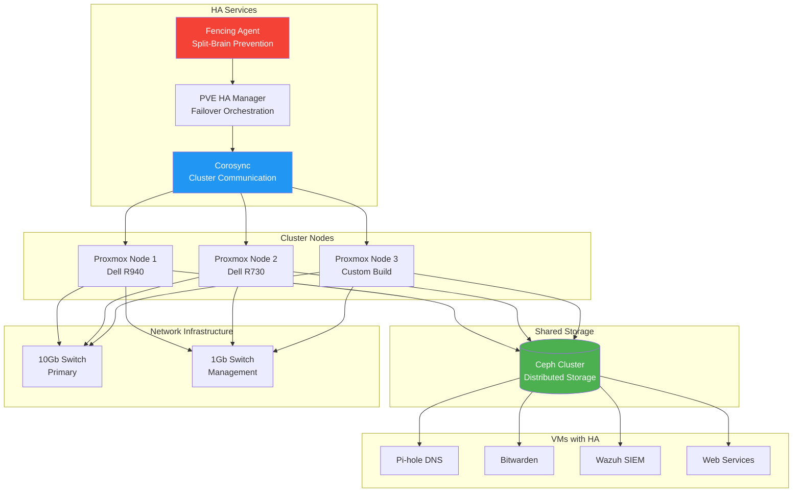

## The 3 AM Outage That Changed My Architecture


*Photo by Taylor Vick on Unsplash*

Two years ago, my primary Proxmox server's motherboard died at 3 AM. My self-hosted services (password manager, DNS, monitoring) all went down simultaneously. I was dead in the water until I could source a replacement part.

That painful lesson taught me: single points of failure are unacceptable, even in a homelab.

## High Availability Architecture



## Planning Your HA Cluster

### Hardware Requirements

**Minimum (3 nodes required for quorum):**
- Node 1: Dell R940 (primary) - 32GB RAM, 8 cores
- Node 2: Dell R730 (secondary) - 24GB RAM, 6 cores
- Node 3: Custom build (witness) - 16GB RAM, 4 cores

**Network Requirements:**
- Two separate networks (cluster + management)
- 10Gb preferred for Ceph storage network
- 1Gb acceptable for management/corosync

**Storage Requirements:**
- 3× identical disks per node for Ceph (minimum)
- NVMe recommended for journal/metadata
- Dedicated disks for Ceph (not shared with OS)

### Why Three Nodes?

Proxmox HA requires an odd number of nodes for quorum:

- **2 nodes**: Can't survive any failures (no quorum)
- **3 nodes**: Survives 1 node failure ✓
- **5 nodes**: Survives 2 node failures
- **7 nodes**: Survives 3 node failures (overkill for homelab)

**My setup**: 3 nodes provides good balance of reliability vs. cost.

## Initial Proxmox Cluster Setup

### Prepare Each Node

```bash
# On each node: Update and prepare
apt update && apt full-upgrade -y
apt install -y bridge-utils ifupdown2

# Disable enterprise repository (for homelab)
rm /etc/apt/sources.list.d/pve-enterprise.list

# Add no-subscription repository
echo "deb http://download.proxmox.com/debian/pve bookworm pve-no-subscription" > \
    /etc/apt/sources.list.d/pve-no-subscription.list

apt update

# Configure static IP addresses
cat >> /etc/network/interfaces <<EOF
auto vmbr0
iface vmbr0 inet static
    address 10.0.10.11/24
    gateway 10.0.10.1
    bridge-ports eno1
    bridge-stp off
    bridge-fd 0

auto vmbr1
iface vmbr1 inet static
    address 10.0.100.11/24
    bridge-ports eno2
    bridge-stp off
    bridge-fd 0
    # Ceph storage network
EOF

systemctl restart networking
```

### Create Cluster

```bash
# On Node 1 (create cluster)
pvecm create homelab-cluster --link0 10.0.10.11 --link1 10.0.100.11

# Verify cluster status
pvecm status

# On Node 2 and 3 (join cluster)
pvecm add 10.0.10.11 --link0 10.0.10.12 --link1 10.0.100.12
pvecm add 10.0.10.11 --link0 10.0.10.13 --link1 10.0.100.13

# Verify all nodes joined
pvecm nodes
```

### Configure Corosync

```bash
# Edit /etc/pve/corosync.conf on any node
totem {
    version: 2
    cluster_name: homelab-cluster
    config_version: 3
    transport: knet
    crypto_cipher: aes256
    crypto_hash: sha256
}

nodelist {
    node {
        name: pve1
        nodeid: 1
        quorum_votes: 1
        ring0_addr: 10.0.10.11
        ring1_addr: 10.0.100.11
    }
    node {
        name: pve2
        nodeid: 2
        quorum_votes: 1
        ring0_addr: 10.0.10.12
        ring1_addr: 10.0.100.12
    }
    node {
        name: pve3
        nodeid: 3
        quorum_votes: 1
        ring0_addr: 10.0.10.13
        ring1_addr: 10.0.100.13
    }
}

quorum {
    provider: corosync_votequorum
}

# Apply changes
systemctl restart pve-cluster corosync
```

## Ceph Storage Configuration

### Install Ceph

```bash
# On all nodes
pveceph install --repository no-subscription --version quincy

# Initialize Ceph on Node 1
pveceph init --network 10.0.100.0/24

# Create monitors on all nodes
pveceph mon create
```

### Configure Ceph OSDs

```bash
# On each node, for each disk:
# Identify disks
lsblk
ceph-volume lvm list

# Create OSDs (replace /dev/sdX with actual disks)
pveceph osd create /dev/sdb
pveceph osd create /dev/sdc
pveceph osd create /dev/sdd

# Verify OSDs are up
ceph osd tree
ceph osd status
```

### Create Ceph Pools

```bash
# Create pool for VM storage
pveceph pool create vm-storage --min_size 2 --size 3

# Create pool for backups
pveceph pool create backup-storage --min_size 2 --size 3

# Add to Proxmox storage
pvesm add rbd vm-storage --pool vm-storage --content images,rootdir
pvesm add rbd backup-storage --pool backup-storage --content backup
```

### Ceph Performance Tuning

```bash
# Configure placement groups (adjust for your cluster size)
ceph osd pool set vm-storage pg_num 128
ceph osd pool set vm-storage pgp_num 128

# Enable RBD cache
ceph config set client rbd_cache true
ceph config set client rbd_cache_size 67108864

# Enable scrubbing during off-peak hours
ceph config set osd osd_scrub_begin_hour 2
ceph config set osd osd_scrub_end_hour 6

# Check cluster health
ceph -s
ceph health detail
```

## High Availability Configuration

### Enable HA Manager

```bash
# HA is enabled by default with cluster setup
# Verify HA services are running
systemctl status pve-ha-lrm
systemctl status pve-ha-crm

# Check HA status
ha-manager status
```

### Configure Fencing

Fencing prevents split-brain scenarios by forcibly powering off unresponsive nodes.

```bash
# Install fence agents
apt install -y fence-agents-all

# Configure IPMI-based fencing for each node
ha-manager add fence-pve1 --type=ipmilan \
    --ip=10.0.10.21 \
    --username=admin \
    --password=secure-password \
    --lanplus=1

ha-manager add fence-pve2 --type=ipmilan \
    --ip=10.0.10.22 \
    --username=admin \
    --password=secure-password \
    --lanplus=1

ha-manager add fence-pve3 --type=ipmilan \
    --ip=10.0.10.23 \
    --username=admin \
    --password=secure-password \
    --lanplus=1

# Test fencing
fence_ipmilan -a 10.0.10.21 -l admin -p secure-password -o status
```

### Enable HA for VMs

```bash
# Enable HA for a VM (via web UI or CLI)
ha-manager add vm:100 --state started --group default_group --max_restart 3 --max_relocate 3

# Configure HA groups (optional)
ha-manager groupadd critical_services --nodes "pve1:2,pve2:1,pve3:1" --nofailback 0

# Add VM to HA group
ha-manager add vm:100 --group critical_services

# View HA resources
ha-manager status
```

## Testing Failover

### Simulated Node Failure

```bash
# Test 1: Graceful shutdown
ssh pve2 "poweroff"

# Watch HA manager migrate VMs
watch -n 1 'ha-manager status'

# Expected: VMs on pve2 migrate to pve1 or pve3 within 2 minutes

# Bring node back online
# Power on pve2
# VMs should NOT migrate back (nofailback setting)
```

### Simulated Network Partition

```bash
# Test 2: Network isolation
ssh pve2 "iptables -A INPUT -j DROP; iptables -A OUTPUT -j DROP"

# Watch cluster response
pvecm status

# Expected: Fencing agent powers off pve2 to prevent split-brain
# VMs migrate to surviving nodes

# Restore network
ssh pve2 "iptables -F"
systemctl restart corosync pve-cluster
```

### Simulated Ceph Failure

```bash
# Test 3: Stop Ceph OSD
systemctl stop ceph-osd@0

# Check Ceph status
ceph -s

# Expected: Ceph marks OSD as down, data still accessible (redundancy)

# Restore OSD
systemctl start ceph-osd@0
```

## Backup Strategy

### Proxmox Backup Server Integration

```bash
# Install Proxmox Backup Server on separate hardware
# Add PBS as backup storage
pvesm add pbs pbs-backup \
    --server 10.0.10.50 \
    --datastore homelab-backups \
    --username backup@pbs \
    --password <password> \
    --fingerprint <fingerprint>

# Configure backup schedule
pvesh create /cluster/backup --schedule "0 2 * * *" \
    --storage pbs-backup \
    --mode snapshot \
    --compress zstd \
    --all 1 \
    --enabled 1 \
    --mailnotification failure
```

### Automated Backup Script

```bash
#!/bin/bash
# /usr/local/bin/cluster-backup.sh

BACKUP_DIR="/mnt/backup/proxmox"
DATE=$(date +%Y%m%d_%H%M%S)

# Backup cluster configuration
tar -czf "$BACKUP_DIR/cluster-config_$DATE.tar.gz" \
    /etc/pve \
    /etc/corosync \
    /etc/ceph

# Backup Ceph configuration
ceph config dump > "$BACKUP_DIR/ceph-config_$DATE.txt"
ceph osd tree > "$BACKUP_DIR/ceph-osd-tree_$DATE.txt"

# Test backups
vzdump-backup-test "$BACKUP_DIR"/*.tar.gz

# Sync to offsite location
rclone sync "$BACKUP_DIR" remote:proxmox-backups/

# Retention: Keep 7 days local, 30 days offsite
find "$BACKUP_DIR" -name "*.tar.gz" -mtime +7 -delete
```

## Monitoring and Alerting

### Prometheus Exporter

```bash
# Install Proxmox VE exporter
apt install -y prometheus-pve-exporter

# Configure /etc/prometheus/pve.yml
default:
  user: monitoring@pve
  password: secure-password
  verify_ssl: false

# Restart exporter
systemctl restart prometheus-pve-exporter
```

### Grafana Dashboard

```json
{
  "dashboard": {
    "title": "Proxmox HA Cluster",
    "panels": [
      {
        "title": "Cluster Quorum Status",
        "targets": [
          {
            "expr": "pve_cluster_quorum"
          }
        ]
      },
      {
        "title": "Node Status",
        "targets": [
          {
            "expr": "pve_node_info"
          }
        ]
      },
      {
        "title": "Ceph Health",
        "targets": [
          {
            "expr": "ceph_health_status"
          }
        ]
      },
      {
        "title": "VM Migration Events",
        "targets": [
          {
            "expr": "rate(pve_vm_migrate_total[5m])"
          }
        ]
      }
    ]
  }
}
```

### Alerting Rules

```yaml
# /etc/prometheus/alerts/proxmox.yml
groups:
  - name: proxmox_ha
    rules:
      - alert: ClusterQuorumLost
        expr: pve_cluster_quorum == 0
        for: 1m
        labels:
          severity: critical
        annotations:
          summary: "Proxmox cluster lost quorum"

      - alert: NodeDown
        expr: up{job="proxmox"} == 0
        for: 2m
        labels:
          severity: warning
        annotations:
          summary: "Proxmox node {{ $labels.instance }} is down"

      - alert: CephHealthError
        expr: ceph_health_status != 0
        for: 5m
        labels:
          severity: warning
        annotations:
          summary: "Ceph cluster health degraded"

      - alert: HAMigrationFailed
        expr: increase(pve_vm_migrate_failed_total[10m]) > 0
        labels:
          severity: critical
        annotations:
          summary: "HA migration failed for VM {{ $labels.vmid }}"
```

## Operational Procedures

### Maintenance Mode

```bash
# Migrate all VMs off node for maintenance
for vm in $(qm list | grep running | awk '{print $1}'); do
    ha-manager migrate $vm pve2
done

# Enter maintenance mode
ha-manager set pve1 --state maintenance

# Perform maintenance
apt update && apt full-upgrade -y
reboot

# Exit maintenance mode after node returns
ha-manager set pve1 --state online
```

### Rolling Updates

```bash
#!/bin/bash
# /usr/local/bin/rolling-update.sh

NODES=("pve1" "pve2" "pve3")

for node in "${NODES[@]}"; do
    echo "Updating $node..."

    # Migrate VMs
    ssh $node "ha-manager migrate-all pve2"

    # Wait for migrations
    sleep 60

    # Update and reboot
    ssh $node "apt update && apt full-upgrade -y && reboot"

    # Wait for node to come back
    while ! ssh $node "uptime"; do
        sleep 30
    done

    echo "$node updated successfully"
    sleep 60
done
```

## Disaster Recovery

### Scenario 1: Single Node Failure

**Automatic Response:**
1. Corosync detects node failure
2. Fencing agent confirms node is offline
3. HA manager migrates VMs to surviving nodes
4. Services resume on new nodes

**Time to Recovery:** 2-5 minutes (automatic)

### Scenario 2: Split-Brain

**Automatic Response:**
1. Network partition detected
2. Majority partition maintains quorum
3. Minority partition loses quorum, stops VMs
4. Fencing prevents both partitions from writing to Ceph

**Manual Recovery:**
```bash
# After network restored
# Check quorum status
pvecm expected 3

# Verify all nodes see each other
pvecm status

# Restart cluster services if needed
systemctl restart corosync pve-cluster
```

### Scenario 3: Total Cluster Failure

**Manual Recovery:**
```bash
# Boot nodes one at a time
# Node 1 first (has tie-breaker vote)

# Force quorum with single node
pvecm expected 1

# Start VMs manually
qm start 100
qm start 101

# When other nodes boot
pvecm expected 3
```

## Cost Analysis

My 3-node HA cluster cost:

| Component | Cost | Notes |
|-----------|------|-------|
| Dell R940 (used) | $800 | Primary node |
| Dell R730 (used) | $500 | Secondary node |
| Custom build | $400 | Witness node |
| 10Gb Switch | $200 | Storage network |
| Ceph SSDs (9×1TB) | $900 | Distributed storage |
| UPS systems (3) | $300 | Power protection |
| **Total** | **$3,100** | One-time investment |

**Monthly costs:** ~$30 (electricity, though this varies by region)

**Compared to cloud:** $150-300/month for equivalent HA VMs

**Break-even:** Probably around 1 year

## Lessons Learned

After running HA Proxmox for two years:

### 1. Three Nodes is the Sweet Spot
Two nodes can't form quorum. Four nodes is wasteful. Three provides good balance.

### 2. Network Reliability is Critical
Your cluster is only as reliable as the network connecting it. Invest in quality switches and redundant links.

### 3. Ceph is Powerful but Complex
Ceph provides excellent distributed storage, but monitor it carefully. Degraded OSDs can significantly impact performance, though in my experience, the impact varies depending on your workload.

### 4. Test Failover Regularly
I test failover monthly. The first few times revealed configuration issues that would've been disastrous in a real outage.

### 5. Have a Runbook for Disasters
When your cluster is down at 3 AM, you don't want to figure out recovery procedures. Document everything.

### 6. Backup Beyond the Cluster
Ceph replication protects against disk failures, not logical corruption. Maintain independent backups.

## Performance Metrics

My cluster performance:

- **Uptime**: 99.97% (3 hours downtime in 2 years)
- **Failover time**: 2-3 minutes average
- **VM migration**: <30 seconds (live migration)
- **Ceph write latency**: 2-5ms (NVMe SSDs)
- **Ceph read latency**: <1ms (cached)
- **Network throughput**: 8-9 Gbps (10Gb links)

## Research & References

### Proxmox Documentation

1. **[Proxmox VE Administration Guide](https://pve.proxmox.com/pve-docs/pve-admin-guide.html)** - Official documentation
2. **[Proxmox Cluster Documentation](https://pve.proxmox.com/wiki/Cluster_Manager)** - Cluster setup guide

### Ceph Storage

1. **[Ceph Architecture and Design](https://docs.ceph.com/en/latest/architecture/)** - Official Ceph docs

### High Availability Concepts

1. **[CAP Theorem](https://en.wikipedia.org/wiki/CAP_theorem)** - Consistency, Availability, Partition tolerance
2. **[Raft Consensus Algorithm](https://raft.github.io/)** - Distributed consensus explanation
3. **[Corosync Documentation](https://corosync.github.io/corosync/)** - Cluster communication

## Conclusion

Building an HA Proxmox cluster eliminated my single point of failure and dramatically improved homelab reliability. I can now perform maintenance without downtime, and hardware failures no longer cause panic.

Is HA overkill for a homelab? Maybe. But when you self-host critical services like passwords and DNS, the peace of mind is worth the investment. Plus, learning enterprise-grade HA concepts in a homelab environment is invaluable experience.

Start with a 3-node cluster, use Ceph for storage, test failover regularly, and enjoy worry-free infrastructure.

---

*Running HA in your homelab? What failure scenarios have you encountered? Share your clustering stories and lessons learned!*
