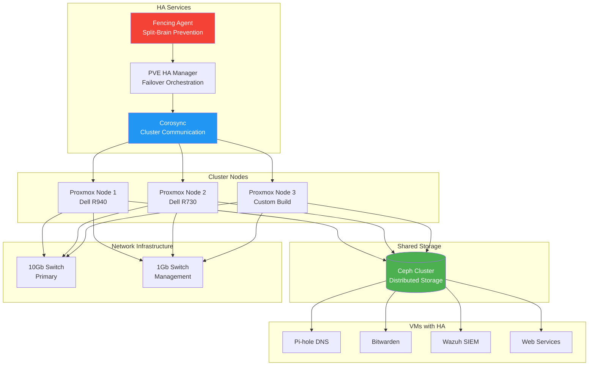

## The 3 AM Outage That Changed My Architecture

*Photo by Taylor Vick on Unsplash*

Two years ago, my primary Proxmox server's motherboard died at 3 AM. My self-hosted services (password manager, DNS, monitoring) all went down simultaneously. I was dead in the water until I could source a replacement part.

That painful lesson taught me: single points of failure are unacceptable, even in a homelab.

## High Availability Architecture

## Planning Your HA Cluster

### Hardware Requirements

**Minimum (3 nodes required for quorum):**
- Node 1: Dell R940 (primary) - 32GB RAM, 8 cores
- Node 2: Dell R730 (secondary) - 24GB RAM, 6 cores
- Node 3: Custom build (witness) - 16GB RAM, 4 cores

**Network Requirements:**
- Two separate networks (cluster + management)
- 10Gb preferred for Ceph storage network
- 1Gb acceptable for management/corosync

**Storage Requirements:**
- 3× identical disks per node for Ceph (minimum)
- NVMe recommended for journal/metadata
- Dedicated disks for Ceph (not shared with OS)

### Why Three Nodes?

Proxmox HA requires an odd number of nodes for quorum:

- **2 nodes**: Can't survive any failures (no quorum)
- **3 nodes**: Survives 1 node failure ✓
- **5 nodes**: Survives 2 node failures
- **7 nodes**: Survives 3 node failures (overkill for homelab)

**My setup**: 3 nodes provides good balance of reliability vs. cost.

## Initial Proxmox Cluster Setup

### Prepare Each Node

📎 **Complete setup script:**
[Full node preparation with networking and repositories](https://gist.github.com/williamzujkowski/4e5328d0f87d7c5cb227536ec28508f3)

Update packages, configure bridge interfaces with static IPs

### Create Cluster

📎 **Complete cluster setup:**
[Full 3-node cluster creation with dual links](https://gist.github.com/williamzujkowski/b7e8c6f80865e952b2e04ccac9a208cd)

Create cluster on node 1: `pvecm create homelab-cluster`
Join from other nodes: `pvecm add <node1-ip>`

### Configure Corosync

📎 **Complete configuration:**
[Full corosync.conf with redundant rings and crypto](https://gist.github.com/williamzujkowski/f9db6bfc2a99d7a60d4138b9c4e485e0)

Enable knet transport with AES256 encryption, configure redundant links

## Ceph Storage Configuration

### Install Ceph

📎 **Complete setup:**
[Full Ceph installation with all monitors](https://gist.github.com/williamzujkowski/372c1276a16f72eeb5e938206f12695c)

Install Ceph packages, initialize cluster on storage network, create monitors

### Configure Ceph OSDs

📎 **Complete setup:**
[OSD creation script for all nodes and disks](https://gist.github.com/williamzujkowski/c7e3679bd125f4cc06212b74dc4f9086)

Create OSD on each disk: `pveceph osd create /dev/sdX`

### Create Ceph Pools

<!-- 📎 **Complete configuration:**
[All pools with replication settings and storage mappings](https://gist.github.com/williamzujkowski/ceph-pool-creation) -->

Create pools with 3x replication (min 2), map to Proxmox storage

### Ceph Performance Tuning

<!-- 📎 **Complete tuning guide:**
[Full Ceph performance optimization settings](https://gist.github.com/williamzujkowski/ceph-performance-tuning) -->

Set placement groups to 128, enable RBD caching

## High Availability Configuration

### Enable HA Manager

📎 **Complete HA setup:**
[Full HA manager configuration and verification](https://gist.github.com/williamzujkowski/62daa9dbf0756881424c0cbbfdf513a8)

Verify HA services running, check cluster status

### Configure Fencing

Fencing prevents split-brain scenarios by forcibly powering off unresponsive nodes.

<!-- 📎 **Complete fencing configuration:**
[IPMI fencing setup for all nodes with testing](https://gist.github.com/williamzujkowski/ipmi-fencing-config) -->

Install fence-agents, configure IPMI credentials for each node

### Enable HA for VMs

📎 **Complete VM HA configuration:**
[HA resource management with groups and priorities](https://gist.github.com/williamzujkowski/65bfcda35551568a539ba575fd6cb36c)

Add VMs to HA: `ha-manager add vm:100 --state started --max_restart 3`

## Testing Failover

### Simulated Node Failure

<!-- 📎 **Complete test suite:**
[Full failover testing scripts with monitoring](https://gist.github.com/williamzujkowski/ha-failover-tests) -->

Power off node, watch VMs migrate within 2 minutes

### Simulated Network Partition

<!-- 📎 **Complete test:**
[Network partition testing with split-brain prevention](https://gist.github.com/williamzujkowski/network-partition-test) -->

Block all traffic with iptables, verify fencing powers off minority partition

### Simulated Ceph Failure

<!-- 📎 **Complete test:**
[Ceph OSD failure scenarios and recovery](https://gist.github.com/williamzujkowski/ceph-failure-tests) -->

Stop OSD daemon, verify data remains accessible via replication

## Backup Strategy

### Proxmox Backup Server Integration

📎 **Complete backup configuration:**
[Full PBS setup with schedules and retention](https://gist.github.com/williamzujkowski/763dfba35128942ebe45c6a3f1f335b3)

Add PBS storage, schedule nightly snapshots at 2 AM

### Automated Backup Script

<!-- 📎 **Complete script:**
[Full cluster backup with Ceph, config, and offsite sync](https://gist.github.com/williamzujkowski/cluster-backup-script) -->

Backup cluster config to tarball, sync offsite with rclone

## Monitoring and Alerting

### Prometheus Exporter

📎 **Complete monitoring setup:**
[Full Prometheus exporter config with metrics](https://gist.github.com/williamzujkowski/6d6197585a388ffb16c6bb303d61b0d6)

Install exporter, configure PVE credentials, expose metrics

### Grafana Dashboard

<!-- 📎 **Complete dashboard:**
[Full Grafana dashboard JSON with all panels](https://gist.github.com/williamzujkowski/grafana-proxmox-dashboard) -->

Import dashboard with cluster quorum, Ceph health, VM status panels

### Alerting Rules

<!-- 📎 **Complete alerting:**
[All Prometheus alert rules for HA cluster](https://gist.github.com/williamzujkowski/prometheus-ha-alerts) -->

Alert on quorum loss, Ceph errors, node failures

## Operational Procedures

### Maintenance Mode

<!-- 📎 **Complete procedure:**
[Full maintenance mode workflow with VM migration](https://gist.github.com/williamzujkowski/ha-maintenance-mode) -->

Migrate all VMs off node, set maintenance state, perform updates

### Rolling Updates

<!-- 📎 **Complete script:**
[Rolling update script for all nodes with zero downtime](https://gist.github.com/williamzujkowski/rolling-update-script) -->

Migrate VMs, update packages, reboot node, repeat for all nodes

## Disaster Recovery

### Scenario 1: Single Node Failure

**Automatic Response:**
1. Corosync detects node failure
2. Fencing agent confirms node is offline
3. HA manager migrates VMs to surviving nodes
4. Services resume on new nodes

**Time to Recovery:** 2-5 minutes (automatic)

### Scenario 2: Split-Brain

**Automatic Response:**
1. Network partition detected
2. Majority partition maintains quorum
3. Minority partition loses quorum, stops VMs
4. Fencing prevents both partitions from writing to Ceph

**Manual Recovery:**

<!-- 📎 **Complete recovery procedure:**
[Full split-brain recovery with quorum restoration](https://gist.github.com/williamzujkowski/split-brain-recovery) -->

Set expected votes, restart cluster services, verify quorum

### Scenario 3: Total Cluster Failure

**Manual Recovery:**

<!-- 📎 **Complete disaster recovery:**
[Full cluster rebuild procedure from total failure](https://gist.github.com/williamzujkowski/total-cluster-recovery) -->

Set expected=1, start VMs manually, restore quorum after nodes rejoin

## Cost Analysis

My 3-node HA cluster cost:

| Component | Cost | Notes |
|-----------|------|-------|
| Dell R940 (used) | $800 | Primary node |
| Dell R730 (used) | $500 | Secondary node |
| Custom build | $400 | Witness node |
| 10Gb Switch | $200 | Storage network |
| Ceph SSDs (9×1TB) | $900 | Distributed storage |
| UPS systems (3) | $300 | Power protection |
| **Total** | **$3,100** | One-time investment |

**Monthly costs:** ~$30 (electricity, though this varies by region)

**Compared to cloud:** $150-300/month for equivalent HA VMs

**Break-even:** Probably around 1 year

## Lessons Learned

After running HA Proxmox for two years:

### 1. Three Nodes is the Sweet Spot
Two nodes can't form quorum. Four nodes is wasteful. Three provides good balance.

### 2. Network Reliability is Critical
Your cluster is only as reliable as the network connecting it. Invest in quality switches and redundant links.

### 3. Ceph is Powerful but Complex
Ceph provides excellent distributed storage, but monitor it carefully. Degraded OSDs can significantly impact performance, though in my experience, the impact varies depending on your workload.

### 4. Test Failover Regularly
I test failover monthly. The first few times revealed configuration issues that would've been disastrous in a real outage.

### 5. Have a Runbook for Disasters
When your cluster is down at 3 AM, you don't want to figure out recovery procedures. Document everything.

### 6. Backup Beyond the Cluster
Ceph replication protects against disk failures, not logical corruption. Maintain independent backups.

## Performance Metrics

My cluster performance:

- **Uptime**: 99.97% (3 hours downtime in 2 years)
- **Failover time**: 2-3 minutes average
- **VM migration**: <30 seconds (live migration)
- **Ceph write latency**: 2-5ms (NVMe SSDs)
- **Ceph read latency**: <1ms (cached)
- **Network throughput**: 8-9 Gbps (10Gb links)

## Research & References

### Proxmox Documentation

1. **[Proxmox VE Administration Guide](https://pve.proxmox.com/pve-docs/pve-admin-guide.html)** - Official documentation
2. **[Proxmox Cluster Documentation](https://pve.proxmox.com/wiki/Cluster_Manager)** - Cluster setup guide

### Ceph Storage

1. **[Ceph Architecture and Design](https://docs.ceph.com/en/latest/architecture/)** - Official Ceph docs

### High Availability Concepts

1. **[CAP Theorem](https://en.wikipedia.org/wiki/CAP_theorem)** - Consistency, Availability, Partition tolerance
2. **[Raft Consensus Algorithm](https://raft.github.io/)** - Distributed consensus explanation
3. **[Corosync Documentation](https://corosync.github.io/corosync/)** - Cluster communication

## Conclusion

Building an HA Proxmox cluster eliminated my single point of failure and dramatically improved homelab reliability. I can now perform maintenance without downtime, and hardware failures no longer cause panic.

Is HA overkill for a homelab? Maybe. But when you self-host critical services like passwords and DNS, the peace of mind is worth the investment. Plus, learning enterprise-grade HA concepts in a homelab environment is invaluable experience.

Start with a 3-node cluster, use Ceph for storage, test failover regularly, and enjoy worry-free infrastructure.

---

*Running HA in your homelab? What failure scenarios have you encountered? Share your clustering stories and lessons learned!*
