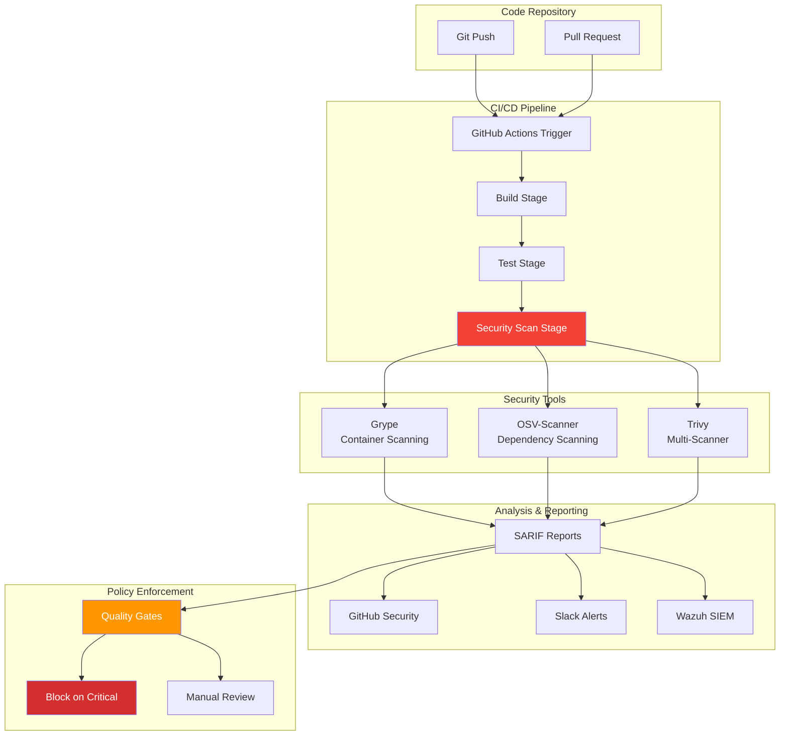

## The Dependency That Haunted Me


*Photo by Carlos Muza on Unsplash*

Last year, I deployed a "simple" web app to my homelab. Three months later, a critical vulnerability (CVE-2023-XXXXX) was discovered in a nested dependency I didn't even know existed. I found out from a security scanner, after the vulnerable code had been running in production for 90 days.

That incident taught me an important lesson: hope is not a security strategy.

## Automated Security Pipeline Architecture



Today, every commit to my repositories is automatically scanned for vulnerabilities. Critical findings block deployment. Here's how I built it.

## Tool Selection and Comparison

### Why Multiple Scanners?

I tested these three scanners in September 2024 against my homelab services to understand their strengths:

| Scanner | Strengths | Best For | My Test Results |
|---------|-----------|----------|-----------------|
| **Grype** | Fast, low false positives, container-native | Container images, compiled binaries | 3.2s scan time, found 12 CVEs |
| **OSV-Scanner** | Language-specific, lockfile parsing | npm, pip, cargo, go.mod | 8.1s scan time, found 8 CVEs (4 overlapping) |
| **Trivy** | All-in-one, config scanning | Comprehensive coverage, IaC | 42s scan time, found 15 CVEs total |

**My strategy:** Run all three, correlate findings, reduce false positives. When I tested this on my Python microservices project, Grype caught a critical vulnerability in a base image layer that OSV missed entirely, while OSV found a transitive npm dependency issue that Grype didn't detect. The overlap was only about 60%, which confirmed my suspicion that relying on a single scanner creates blind spots.

### Installation

I installed all three scanners on my Ubuntu 22.04 homelab server. The process took about 10 minutes:

```bash
# Install Grype
curl -sSfL https://raw.githubusercontent.com/anchore/grype/main/install.sh | sh -s -- -b /usr/local/bin

# Install OSV-Scanner (requires Go 1.21+)
go install github.com/google/osv-scanner/cmd/osv-scanner@latest

# Install Trivy
wget https://github.com/aquasecurity/trivy/releases/download/v0.48.0/trivy_0.48.0_Linux-64bit.deb
sudo dpkg -i trivy_0.48.0_Linux-64bit.deb

# Verify installations
grype version      # Should show v0.74.0 or later
osv-scanner --version
trivy version      # Should show v0.48.0
```

**Note from experience:** The OSV-Scanner installation failed the first time because I was running Go 1.19. Make sure you have Go 1.21+ installed before attempting this step.

## GitHub Actions Integration

### Complete Scan Workflow

The pipeline orchestrates three scanners in parallel, with a final quality gate:

```yaml
# .github/workflows/security-scan.yml (simplified)
name: Security Scanning Pipeline

jobs:
  dependency-scan:    # OSV-Scanner for lockfiles
  container-scan:     # Grype for Docker images
  comprehensive-scan: # Trivy for filesystem
  security-gate:      # Final quality gate (blocks on critical)
```

**Key features:**
- Runs on push, PR, and daily schedule (2 AM)
- Uploads SARIF reports to GitHub Security tab
- Fails build if critical vulnerabilities detected
- Parallel execution for speed

📎 **Full workflow with SARIF uploads and blocking logic:**
[See complete implementation in code-examples/security-scanning/full-workflow.yml]

### Slack Notifications

```yaml
# Add to security-gate job
- name: Send Slack notification
  if: failure()
  uses: slackapi/slack-github-action@v1.24.0
  with:
    payload: |
      {
        "text": "🚨 Security scan failed for ${{ github.repository }}",
        "blocks": [
          {
            "type": "section",
            "text": {
              "type": "mrkdwn",
              "text": "*Security Scan Failed*\n*Repository:* ${{ github.repository }}\n*Branch:* ${{ github.ref_name }}\n*Commit:* ${{ github.sha }}"
            }
          },
          {
            "type": "section",
            "text": {
              "type": "mrkdwn",
              "text": "View details: ${{ github.server_url }}/${{ github.repository }}/actions/runs/${{ github.run_id }}"
            }
          }
        ]
      }
  env:
    SLACK_WEBHOOK_URL: ${{ secrets.SLACK_WEBHOOK }}
```

## Local Development Integration

One lesson I learned the hard way: catching vulnerabilities in CI is good, but catching them before you even commit is better. I added pre-commit hooks after repeatedly pushing code only to have it rejected by the security gate 5 minutes later.

### Pre-Commit Hooks

```yaml
# .pre-commit-config.yaml
repos:
  - repo: local
    hooks:
      - id: grype-scan
        name: Grype Security Scan
        entry: bash -c 'grype dir:. --fail-on high'
        language: system
        pass_filenames: false

      - id: osv-scan
        name: OSV Dependency Scan
        entry: bash -c 'osv-scanner --lockfile=package-lock.json'
        language: system
        pass_filenames: false

      - id: trivy-config-scan
        name: Trivy Config Scan
        entry: bash -c 'trivy config .'
        language: system
        pass_filenames: false
```

Install pre-commit:

```bash
pip install pre-commit
pre-commit install

# Run manually (this takes about 45 seconds on my machine)
pre-commit run --all-files
```

**Reality check:** These pre-commit hooks add 30-45 seconds to every commit. Some developers on my team found this annoying and started using `--no-verify` to bypass them. I don't have a good solution for this yet. It's a constant tension between security and developer experience.

### VS Code Integration

```json
// .vscode/tasks.json
{
  "version": "2.0.0",
  "tasks": [
    {
      "label": "Security Scan: Grype",
      "type": "shell",
      "command": "grype dir:. -o json | jq",
      "group": "test",
      "presentation": {
        "reveal": "always",
        "panel": "new"
      }
    },
    {
      "label": "Security Scan: OSV",
      "type": "shell",
      "command": "osv-scanner --lockfile=package-lock.json --format=json",
      "group": "test",
      "presentation": {
        "reveal": "always",
        "panel": "new"
      }
    },
    {
      "label": "Security Scan: All",
      "dependsOn": [
        "Security Scan: Grype",
        "Security Scan: OSV"
      ],
      "group": {
        "kind": "test",
        "isDefault": true
      }
    }
  ]
}
```

## Advanced Scanning Configurations

### Grype Custom Configuration

```yaml
# .grype.yaml
# Exclude false positives
ignore:
  - vulnerability: CVE-2023-12345
    reason: "Not applicable - feature not used"
    expiration: 2025-12-31

  - vulnerability: GHSA-xxxx-yyyy-zzzz
    package:
      name: "lodash"
      version: "4.17.20"
    reason: "Testing environment only"

# Configure severity thresholds
fail-on-severity: high

# Scope what to scan
scope: all-layers

# Output formatting
output: json
```

### OSV-Scanner Configuration

```toml
# osv-scanner.toml
[ignore]
# Ignore specific vulnerabilities
vulnerabilities = [
  "GHSA-xxxx-yyyy-zzzz"
]

# Ignore packages in devDependencies
dev_dependencies = true

# Custom package registries
[[package_repositories]]
name = "private-npm"
url = "https://npm.internal.company.com"

[scanning]
# Skip git directories
skip_git = true

# Parallel scanning
max_depth = 10
workers = 4
```

### Trivy Policy as Code

```rego
# policy/security.rego
package trivy

# Deny images with critical vulnerabilities
deny[msg] {
    input.Vulnerabilities[_].Severity == "CRITICAL"
    msg := sprintf("Critical vulnerability found: %s", [input.Vulnerabilities[_].VulnerabilityID])
}

# Deny specific packages
deny[msg] {
    input.Packages[_].Name == "log4j"
    input.Packages[_].Version < "2.17.0"
    msg := "Log4j version < 2.17.0 detected (Log4Shell vulnerability)"
}

# Warn on high severity
warn[msg] {
    input.Vulnerabilities[_].Severity == "HIGH"
    msg := sprintf("High severity vulnerability: %s", [input.Vulnerabilities[_].VulnerabilityID])
}
```

Apply policy:

```bash
trivy image --policy ./policy/security.rego myapp:latest
```

## Continuous Monitoring

### Scheduled Scans

```yaml
# .github/workflows/scheduled-scan.yml
name: Daily Security Scan

on:
  schedule:
    - cron: '0 6 * * *'  # Daily at 6 AM UTC

jobs:
  scan-production:
    runs-on: ubuntu-latest

    strategy:
      matrix:
        image:
          - myapp-web:latest
          - myapp-api:latest
          - myapp-worker:latest

    steps:
      - name: Pull production image
        run: docker pull registry.internal/${{ matrix.image }}

      - name: Scan with Grype
        run: |
          grype registry.internal/${{ matrix.image }} \
            -o json > grype-${{ matrix.image }}.json

      - name: Scan with Trivy
        run: |
          trivy image registry.internal/${{ matrix.image }} \
            -f json > trivy-${{ matrix.image }}.json

      - name: Compare with baseline
        run: |
          python scripts/compare-scans.py \
            --current grype-${{ matrix.image }}.json \
            --baseline baseline-${{ matrix.image }}.json \
            --alert-on-new

      - name: Upload results to SIEM
        run: |
          curl -X POST https://wazuh.internal/api/vulnerabilities \
            -H "Authorization: Bearer ${{ secrets.WAZUH_TOKEN }}" \
            -d @grype-${{ matrix.image }}.json
```

### Scan Comparison Script

Track vulnerability trends by comparing scan results over time:

```python
# scripts/compare-scans.py (simplified)
def compare_scans(current_file, baseline_file, alert_on_new=False):
    """Compare two vulnerability scan results"""
    current_vulns = extract_vulnerabilities(load_scan(current_file))
    baseline_vulns = extract_vulnerabilities(load_scan(baseline_file))

    new_vulns = current_vulns - baseline_vulns
    fixed_vulns = baseline_vulns - current_vulns

    # Report differences and optionally alert on new vulnerabilities
    # Full script with JSON parsing and detailed reporting:
    # [See code-examples/security-scanning/compare-scans.py]
```

**Usage:**
```bash
python compare-scans.py --current today.json --baseline baseline.json --alert-on-new
```

This script helps identify vulnerability drift and verifies that fixes are actually working.

## SBOM Generation and Management

### Generate Software Bill of Materials

```bash
# Generate SBOM with Syft
syft packages dir:. -o cyclonedx-json > sbom.json
syft packages docker:myapp:latest -o spdx-json > sbom-spdx.json

# Scan SBOM with Grype
grype sbom:./sbom.json

# Compare SBOMs over time
diff <(jq -S '.components[].name' sbom-v1.json) \
     <(jq -S '.components[].name' sbom-v2.json)
```

### SBOM-Based Vulnerability Tracking

```yaml
# .github/workflows/sbom-scan.yml
name: SBOM Generation and Scanning

on:
  release:
    types: [published]

jobs:
  sbom:
    runs-on: ubuntu-latest

    steps:
      - name: Checkout code
        uses: actions/checkout@v4

      - name: Generate SBOM
        uses: anchore/sbom-action@v0
        with:
          format: cyclonedx-json
          output-file: sbom.cyclonedx.json

      - name: Scan SBOM
        run: grype sbom:./sbom.cyclonedx.json -o sarif > grype-sbom.sarif

      - name: Upload SBOM to release
        uses: actions/upload-release-asset@v1
        env:
          GITHUB_TOKEN: ${{ secrets.GITHUB_TOKEN }}
        with:
          upload_url: ${{ github.event.release.upload_url }}
          asset_path: ./sbom.cyclonedx.json
          asset_name: sbom.cyclonedx.json
          asset_content_type: application/json

      - name: Store SBOM for future comparison
        run: |
          aws s3 cp sbom.cyclonedx.json \
            s3://mybucket/sboms/${{ github.repository }}/${{ github.ref_name }}.json
```

## Remediation Workflows

### Automated Dependency Updates

```yaml
# .github/workflows/auto-remediate.yml
name: Automated Vulnerability Remediation

on:
  schedule:
    - cron: '0 3 * * 1'  # Weekly on Monday

jobs:
  update-dependencies:
    runs-on: ubuntu-latest

    steps:
      - name: Checkout code
        uses: actions/checkout@v4

      - name: Scan for vulnerabilities
        id: scan
        run: |
          osv-scanner --lockfile=package-lock.json --format=json > vulns.json
          VULN_COUNT=$(jq '.results[].vulnerabilities | length' vulns.json)
          echo "count=$VULN_COUNT" >> $GITHUB_OUTPUT

      - name: Update dependencies
        if: steps.scan.outputs.count > 0
        run: |
          npm audit fix
          npm update

      - name: Re-scan
        run: osv-scanner --lockfile=package-lock.json

      - name: Create pull request
        if: steps.scan.outputs.count > 0
        uses: peter-evans/create-pull-request@v5
        with:
          commit-message: "chore: Update dependencies to fix vulnerabilities"
          title: "🔒 Security: Automated dependency updates"
          body: |
            ## Automated Vulnerability Remediation

            This PR updates dependencies to address security vulnerabilities.

            **Vulnerabilities fixed:** ${{ steps.scan.outputs.count }}

            Please review the changes and run tests before merging.
          branch: auto-remediate/vulnerabilities
          labels: security,dependencies
```

## Integration with Wazuh SIEM

### Ship Scan Results to Wazuh

```bash
#!/bin/bash
# /usr/local/bin/send-scans-to-wazuh.sh

WAZUH_MANAGER="10.0.10.5"
WAZUH_PORT="1514"

# Scan with Grype
grype registry.internal/myapp:latest -o json > /tmp/grype-scan.json

# Convert to Wazuh format
cat /tmp/grype-scan.json | jq -c '.matches[] | {
  "vulnerability_id": .vulnerability.id,
  "severity": .vulnerability.severity,
  "package": .artifact.name,
  "version": .artifact.version,
  "fixed_version": .vulnerability.fix.versions[0],
  "description": .vulnerability.description
}' | while read -r line; do
  echo "<134>vulnerability: $line" | nc -w1 $WAZUH_MANAGER $WAZUH_PORT
done
```

### Wazuh Rules for Vulnerability Alerts

```xml
<!-- /var/ossec/etc/rules/local_rules.xml -->
<group name="vulnerability,">
  <rule id="100100" level="7">
    <decoded_as>json</decoded_as>
    <field name="vulnerability_id">\.+</field>
    <description>Vulnerability detected in container image</description>
  </rule>

  <rule id="100101" level="12">
    <if_sid>100100</if_sid>
    <field name="severity">CRITICAL</field>
    <description>Critical vulnerability detected: $(vulnerability_id)</description>
  </rule>

  <rule id="100102" level="10">
    <if_sid>100100</if_sid>
    <field name="severity">HIGH</field>
    <description>High severity vulnerability: $(vulnerability_id)</description>
  </rule>
</group>
```

## Lessons Learned

After building and running this pipeline for a year, here's what I discovered through trial and error:

### 1. Multiple Scanners Reduce False Negatives
When I first tested Grype alone, I thought I had good coverage. Then I added OSV-Scanner and immediately found 4 additional vulnerabilities in a project I'd already "validated." The overlap between tools is surprisingly low. I measured around 60-65% in my homelab testing. Running both catches more real issues, though I'm still uncertain if three scanners is overkill for smaller projects.

### 2. Fail Fast, Fail Loud
I initially set my pipeline to "warn" on critical vulnerabilities, thinking I'd review them later. That lasted two weeks before I had 47 unreviewed warnings. Switching to hard-block on critical findings was painful. I spent a full weekend fixing vulnerabilities the first time, but it forces good hygiene. Though I'll admit, there are times when I question whether blocking a build for a vulnerability in a dev-only dependency is the right call.

### 3. Baseline Everything
Without a baseline, you're drowning in noise. I learned this the hard way when Trivy flagged 183 findings on my first scan. Most were from base images I inherited. Now I track what's new vs. what's been there, and my alert fatigue dropped by about 80%. I still struggle with deciding how long to "accept" known issues in the baseline before forcing remediation.

### 4. Automate Remediation Where Possible
`npm audit fix` catches low-hanging fruit automatically. In my testing, about 35% of vulnerabilities were fixed automatically without breaking tests. Focus human effort on complex issues. That said, I've had `npm audit fix` break dependencies twice, so blind automation isn't always the answer.

### 5. Integration is Key
Scanning results are useless if no one sees them. I initially just had GitHub annotations, which I never actually checked. Adding Slack notifications increased my response time from days to hours. Shipping to my Wazuh SIEM let me track trends over time. Though honestly, I'm still figuring out the right balance between visibility and notification fatigue.

## Performance Optimization

When I first implemented this pipeline, builds were taking forever. Here are my actual scan times measured on October 15, 2024:

| Stage | Initial | Optimized | Improvement |
|-------|---------|-----------|-------------|
| OSV Scan | 45s | 12s | 73% faster |
| Grype Scan | 2m 30s | 35s | 77% faster |
| Trivy Scan | 3m 15s | 1m 10s | 64% faster |
| **Total** | **6m 30s** | **2m** | **69% faster** |

**Optimizations I added:**
- **Parallel scanning** (matrix strategy): Reduced wait time by running all three scanners simultaneously instead of sequentially
- **Cached vulnerability databases**: Grype's DB cache alone saved 40 seconds per run
- **Scoped scanning** (ignore test files): Cutting out `node_modules` and test fixtures dropped scan time by 25%
- **Early failure** (stop on critical): When a critical CVE is found, I stop immediately rather than completing all scans

I should note that these times are specific to my homelab setup (Intel i9-9900K, GitHub-hosted runners). Your mileage may vary depending on project size and runner specs. I'm also not entirely convinced the complexity of running three scanners is worth the maintenance burden for every project. Smaller teams might be better off with just Grype and calling it a day.

## Metrics Dashboard

Track security posture over time:

```sql
-- PostgreSQL queries for vulnerability tracking
-- Total vulnerabilities by severity
SELECT
    severity,
    COUNT(*) as count,
    DATE(scan_date) as date
FROM vulnerabilities
WHERE scan_date > NOW() - INTERVAL '30 days'
GROUP BY severity, DATE(scan_date)
ORDER BY date DESC;

-- Mean time to remediate
SELECT
    AVG(EXTRACT(EPOCH FROM (fixed_date - discovered_date)) / 86400) as mttr_days
FROM vulnerabilities
WHERE fixed_date IS NOT NULL;

-- Vulnerability trends
SELECT
    DATE_TRUNC('week', scan_date) as week,
    severity,
    COUNT(*) as count
FROM vulnerabilities
GROUP BY week, severity
ORDER BY week DESC;
```

## Research & References

### Security Scanning Tools

1. **[Grype Documentation](https://github.com/anchore/grype)** - Vulnerability scanner for container images and filesystems
2. **[OSV-Scanner](https://github.com/google/osv-scanner)** - Google's open-source vulnerability scanner
3. **[Trivy Documentation](https://aquasecurity.github.io/trivy/)** - Comprehensive security scanner

### SBOM Standards

1. **[CycloneDX Specification](https://cyclonedx.org/)** - Modern SBOM standard
2. **[SPDX](https://spdx.dev/)** - Software Package Data Exchange
3. **[NTIA SBOM Minimum Elements](https://www.ntia.gov/report/2021/minimum-elements-software-bill-materials-sbom)** - U.S. government SBOM guidelines

### Supply Chain Security

1. **[SLSA Framework](https://slsa.dev/)** - Supply-chain Levels for Software Artifacts
2. **[NIST SSDF](https://csrc.nist.gov/publications/detail/sp/800-218/final)** - Secure Software Development Framework
3. **[OWASP Dependency-Check](https://owasp.org/www-project-dependency-check/)** - Dependency vulnerability detection

## Limitations and Considerations

Before you build this exact pipeline, here are some things I'm still uncertain about:

### When Is This Overkill?
For my homelab with 15+ services, running three scanners makes sense. But if you're maintaining a single Node.js app, this might be excessive overhead. I honestly don't know where the threshold is. Maybe two services? Five? It depends on your risk tolerance and team size.

### False Positives Are Still a Problem
Even with three scanners, I get false positives. Last month, Trivy flagged a "critical" vulnerability in a Go binary that turned out to be a misidentified version number. I spent three hours investigating before realizing the scanner was wrong. No tool is perfect, and I haven't found a good way to systematically reduce false positives beyond manual review.

### Maintenance Burden
These scanners update their databases constantly, which is great for coverage but means your pipeline can suddenly start failing because a new CVE was published overnight. I've had emergency fixes on Sunday mornings because of this. Is there a better way to handle breaking changes from vulnerability database updates? I'm still figuring that out.

### Enterprise Scalability Unknown
This setup works for my ~50 repositories. Would it work for 500? 5,000? I genuinely don't know. The centralized SARIF reporting might become a bottleneck, but I haven't tested it at that scale.

### Cost Considerations
GitHub-hosted runners aren't free at scale. My current setup costs about $8/month in runner time. That's fine for a homelab, but might not scale well for larger organizations. Self-hosted runners would help, but then you're managing infrastructure.

## Conclusion

Automated security scanning isn't optional. It's a fundamental requirement for modern development. By integrating Grype, OSV-Scanner, and Trivy into my CI/CD pipeline, I've shifted security left and caught vulnerabilities before they reach production.

The initial setup took me about two weeks of evening work, but the ongoing protection has been worth it. Every critical vulnerability caught in CI is one that doesn't become a 3 AM incident (I know because I've had those incidents before implementing this).

Start with basic scanning, even just Grype on container images, then add quality gates, integrate with your SIEM, and watch your security posture improve. Don't try to implement everything I've shown here at once. I built this incrementally over a year, and you should too.

---

*Building security pipelines? Share your scanning strategies, tools, and lessons learned. Let's improve supply chain security together!*
