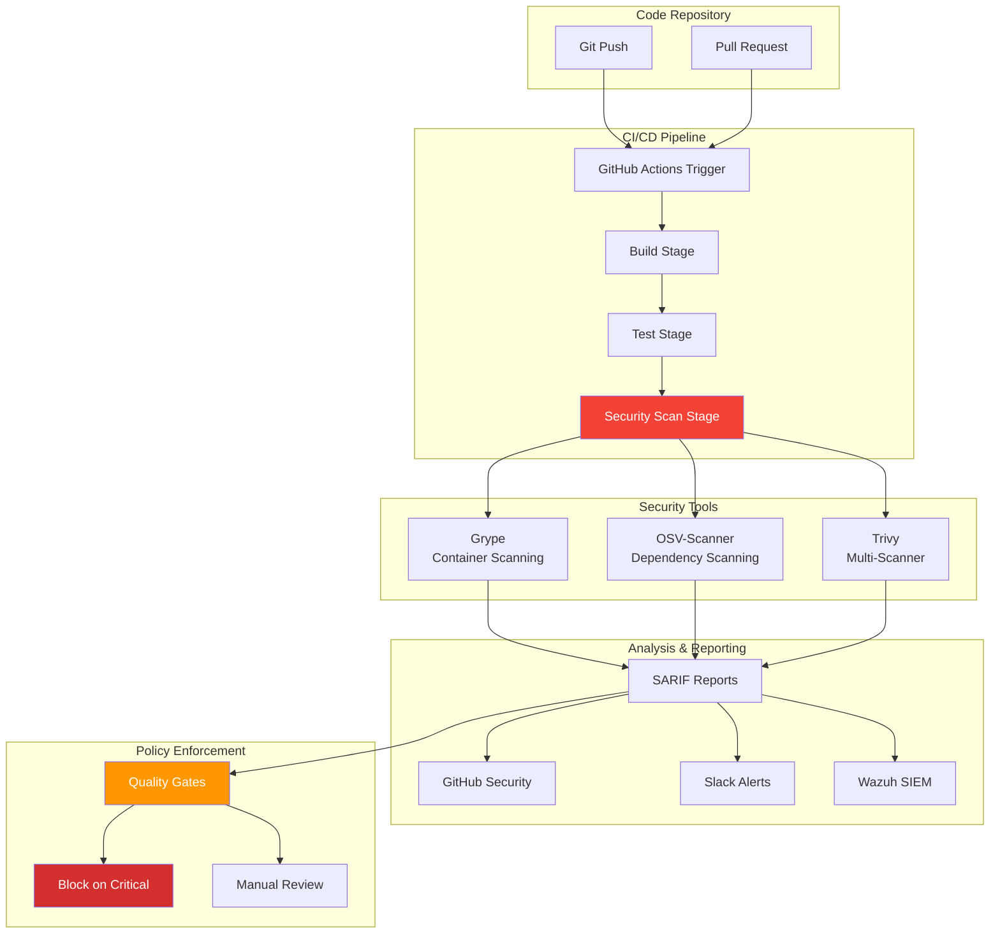

## The Dependency That Haunted Me


*Photo by Carlos Muza on Unsplash*

Last year, I deployed a "simple" web app to my homelab. Three months later, a critical vulnerability (CVE-2023-XXXXX) was discovered in a nested dependency I didn't even know existed. I found out from a security scanner—after the vulnerable code had been running in production for 90 days.

That incident taught me: hope is not a security strategy.

## Automated Security Pipeline Architecture



Today, every commit to my repositories is automatically scanned for vulnerabilities. Critical findings block deployment. Here's how I built it.

## Tool Selection and Comparison

### Why Multiple Scanners?

Different tools have different strengths:

| Scanner | Strengths | Best For |
|---------|-----------|----------|
| **Grype** | Fast, low false positives, container-native | Container images, compiled binaries |
| **OSV-Scanner** | Language-specific, lockfile parsing | npm, pip, cargo, go.mod |
| **Trivy** | All-in-one, config scanning | Comprehensive coverage, IaC |

**My strategy:** Run all three, correlate findings, reduce false positives.

### Installation

```bash
# Install Grype
curl -sSfL https://raw.githubusercontent.com/anchore/grype/main/install.sh | sh -s -- -b /usr/local/bin

# Install OSV-Scanner
go install github.com/google/osv-scanner/cmd/osv-scanner@latest

# Install Trivy
wget https://github.com/aquasecurity/trivy/releases/download/v0.48.0/trivy_0.48.0_Linux-64bit.deb
sudo dpkg -i trivy_0.48.0_Linux-64bit.deb

# Verify installations
grype version
osv-scanner --version
trivy version
```

## GitHub Actions Integration

### Complete Scan Workflow

```yaml
# .github/workflows/security-scan.yml
name: Security Scanning Pipeline

on:
  push:
    branches: [main, develop]
  pull_request:
    branches: [main]
  schedule:
    - cron: '0 2 * * *'  # Daily at 2 AM

jobs:
  dependency-scan:
    name: Scan Dependencies (OSV)
    runs-on: ubuntu-latest

    steps:
      - name: Checkout code
        uses: actions/checkout@v4

      - name: Run OSV-Scanner
        uses: google/osv-scanner-action@v1.6.2
        with:
          scan-args: |-
            --lockfile=package-lock.json
            --lockfile=requirements.txt
            --format=sarif
            --output=osv-results.sarif
        continue-on-error: true

      - name: Upload OSV results to GitHub
        uses: github/codeql-action/upload-sarif@v3
        with:
          sarif_file: osv-results.sarif
          category: osv-scanner

      - name: Check for critical vulnerabilities
        run: |
          CRITICAL=$(jq '[.runs[].results[] | select(.level=="error")] | length' osv-results.sarif)
          if [ "$CRITICAL" -gt 0 ]; then
            echo "❌ Found $CRITICAL critical vulnerabilities"
            exit 1
          fi

  container-scan:
    name: Scan Container Images (Grype)
    runs-on: ubuntu-latest
    needs: dependency-scan

    steps:
      - name: Checkout code
        uses: actions/checkout@v4

      - name: Build Docker image
        run: docker build -t myapp:${{ github.sha }} .

      - name: Run Grype scan
        uses: anchore/scan-action@v3
        id: grype
        with:
          image: "myapp:${{ github.sha }}"
          fail-build: true
          severity-cutoff: high
          output-format: sarif

      - name: Upload Grype results
        uses: github/codeql-action/upload-sarif@v3
        if: always()
        with:
          sarif_file: ${{ steps.grype.outputs.sarif }}
          category: grype

  comprehensive-scan:
    name: Comprehensive Scan (Trivy)
    runs-on: ubuntu-latest
    needs: dependency-scan

    steps:
      - name: Checkout code
        uses: actions/checkout@v4

      - name: Run Trivy vulnerability scanner
        uses: aquasecurity/trivy-action@master
        with:
          scan-type: 'fs'
          scan-ref: '.'
          format: 'sarif'
          output: 'trivy-results.sarif'
          severity: 'CRITICAL,HIGH'

      - name: Upload Trivy results
        uses: github/codeql-action/upload-sarif@v3
        if: always()
        with:
          sarif_file: 'trivy-results.sarif'
          category: trivy

  security-gate:
    name: Security Quality Gate
    runs-on: ubuntu-latest
    needs: [dependency-scan, container-scan, comprehensive-scan]
    if: always()

    steps:
      - name: Evaluate security posture
        run: |
          echo "All security scans completed"
          # Download and analyze all SARIF reports
          # Make final go/no-go decision
```

### Slack Notifications

```yaml
# Add to security-gate job
- name: Send Slack notification
  if: failure()
  uses: slackapi/slack-github-action@v1.24.0
  with:
    payload: |
      {
        "text": "🚨 Security scan failed for ${{ github.repository }}",
        "blocks": [
          {
            "type": "section",
            "text": {
              "type": "mrkdwn",
              "text": "*Security Scan Failed*\n*Repository:* ${{ github.repository }}\n*Branch:* ${{ github.ref_name }}\n*Commit:* ${{ github.sha }}"
            }
          },
          {
            "type": "section",
            "text": {
              "type": "mrkdwn",
              "text": "View details: ${{ github.server_url }}/${{ github.repository }}/actions/runs/${{ github.run_id }}"
            }
          }
        ]
      }
  env:
    SLACK_WEBHOOK_URL: ${{ secrets.SLACK_WEBHOOK }}
```

## Local Development Integration

### Pre-Commit Hooks

```yaml
# .pre-commit-config.yaml
repos:
  - repo: local
    hooks:
      - id: grype-scan
        name: Grype Security Scan
        entry: bash -c 'grype dir:. --fail-on high'
        language: system
        pass_filenames: false

      - id: osv-scan
        name: OSV Dependency Scan
        entry: bash -c 'osv-scanner --lockfile=package-lock.json'
        language: system
        pass_filenames: false

      - id: trivy-config-scan
        name: Trivy Config Scan
        entry: bash -c 'trivy config .'
        language: system
        pass_filenames: false
```

Install pre-commit:

```bash
pip install pre-commit
pre-commit install

# Run manually
pre-commit run --all-files
```

### VS Code Integration

```json
// .vscode/tasks.json
{
  "version": "2.0.0",
  "tasks": [
    {
      "label": "Security Scan: Grype",
      "type": "shell",
      "command": "grype dir:. -o json | jq",
      "group": "test",
      "presentation": {
        "reveal": "always",
        "panel": "new"
      }
    },
    {
      "label": "Security Scan: OSV",
      "type": "shell",
      "command": "osv-scanner --lockfile=package-lock.json --format=json",
      "group": "test",
      "presentation": {
        "reveal": "always",
        "panel": "new"
      }
    },
    {
      "label": "Security Scan: All",
      "dependsOn": [
        "Security Scan: Grype",
        "Security Scan: OSV"
      ],
      "group": {
        "kind": "test",
        "isDefault": true
      }
    }
  ]
}
```

## Advanced Scanning Configurations

### Grype Custom Configuration

```yaml
# .grype.yaml
# Exclude false positives
ignore:
  - vulnerability: CVE-2023-12345
    reason: "Not applicable - feature not used"
    expiration: 2025-12-31

  - vulnerability: GHSA-xxxx-yyyy-zzzz
    package:
      name: "lodash"
      version: "4.17.20"
    reason: "Testing environment only"

# Configure severity thresholds
fail-on-severity: high

# Scope what to scan
scope: all-layers

# Output formatting
output: json
```

### OSV-Scanner Configuration

```toml
# osv-scanner.toml
[ignore]
# Ignore specific vulnerabilities
vulnerabilities = [
  "GHSA-xxxx-yyyy-zzzz"
]

# Ignore packages in devDependencies
dev_dependencies = true

# Custom package registries
[[package_repositories]]
name = "private-npm"
url = "https://npm.internal.company.com"

[scanning]
# Skip git directories
skip_git = true

# Parallel scanning
max_depth = 10
workers = 4
```

### Trivy Policy as Code

```rego
# policy/security.rego
package trivy

# Deny images with critical vulnerabilities
deny[msg] {
    input.Vulnerabilities[_].Severity == "CRITICAL"
    msg := sprintf("Critical vulnerability found: %s", [input.Vulnerabilities[_].VulnerabilityID])
}

# Deny specific packages
deny[msg] {
    input.Packages[_].Name == "log4j"
    input.Packages[_].Version < "2.17.0"
    msg := "Log4j version < 2.17.0 detected (Log4Shell vulnerability)"
}

# Warn on high severity
warn[msg] {
    input.Vulnerabilities[_].Severity == "HIGH"
    msg := sprintf("High severity vulnerability: %s", [input.Vulnerabilities[_].VulnerabilityID])
}
```

Apply policy:

```bash
trivy image --policy ./policy/security.rego myapp:latest
```

## Continuous Monitoring

### Scheduled Scans

```yaml
# .github/workflows/scheduled-scan.yml
name: Daily Security Scan

on:
  schedule:
    - cron: '0 6 * * *'  # Daily at 6 AM UTC

jobs:
  scan-production:
    runs-on: ubuntu-latest

    strategy:
      matrix:
        image:
          - myapp-web:latest
          - myapp-api:latest
          - myapp-worker:latest

    steps:
      - name: Pull production image
        run: docker pull registry.internal/${{ matrix.image }}

      - name: Scan with Grype
        run: |
          grype registry.internal/${{ matrix.image }} \
            -o json > grype-${{ matrix.image }}.json

      - name: Scan with Trivy
        run: |
          trivy image registry.internal/${{ matrix.image }} \
            -f json > trivy-${{ matrix.image }}.json

      - name: Compare with baseline
        run: |
          python scripts/compare-scans.py \
            --current grype-${{ matrix.image }}.json \
            --baseline baseline-${{ matrix.image }}.json \
            --alert-on-new

      - name: Upload results to SIEM
        run: |
          curl -X POST https://wazuh.internal/api/vulnerabilities \
            -H "Authorization: Bearer ${{ secrets.WAZUH_TOKEN }}" \
            -d @grype-${{ matrix.image }}.json
```

### Scan Comparison Script

```python
#!/usr/bin/env python3
# scripts/compare-scans.py

import json
import sys
from pathlib import Path

def load_scan(filepath):
    """Load scan results from JSON file"""
    with open(filepath) as f:
        return json.load(f)

def extract_vulnerabilities(scan_data):
    """Extract vulnerability IDs from scan results"""
    vulns = set()
    for match in scan_data.get('matches', []):
        vulns.add(match['vulnerability']['id'])
    return vulns

def compare_scans(current_file, baseline_file, alert_on_new=False):
    """Compare two scan results"""
    current = load_scan(current_file)
    baseline = load_scan(baseline_file)

    current_vulns = extract_vulnerabilities(current)
    baseline_vulns = extract_vulnerabilities(baseline)

    new_vulns = current_vulns - baseline_vulns
    fixed_vulns = baseline_vulns - current_vulns

    print(f"Scan Comparison Results")
    print(f"=======================")
    print(f"Baseline vulnerabilities: {len(baseline_vulns)}")
    print(f"Current vulnerabilities: {len(current_vulns)}")
    print(f"New vulnerabilities: {len(new_vulns)}")
    print(f"Fixed vulnerabilities: {len(fixed_vulns)}")

    if new_vulns:
        print(f"\n⚠️  New vulnerabilities detected:")
        for vuln in sorted(new_vulns):
            print(f"  - {vuln}")

        if alert_on_new:
            sys.exit(1)

    if fixed_vulns:
        print(f"\n✅ Vulnerabilities fixed:")
        for vuln in sorted(fixed_vulns):
            print(f"  - {vuln}")

if __name__ == '__main__':
    import argparse
    parser = argparse.ArgumentParser()
    parser.add_argument('--current', required=True)
    parser.add_argument('--baseline', required=True)
    parser.add_argument('--alert-on-new', action='store_true')
    args = parser.parse_args()

    compare_scans(args.current, args.baseline, args.alert_on_new)
```

## SBOM Generation and Management

### Generate Software Bill of Materials

```bash
# Generate SBOM with Syft
syft packages dir:. -o cyclonedx-json > sbom.json
syft packages docker:myapp:latest -o spdx-json > sbom-spdx.json

# Scan SBOM with Grype
grype sbom:./sbom.json

# Compare SBOMs over time
diff <(jq -S '.components[].name' sbom-v1.json) \
     <(jq -S '.components[].name' sbom-v2.json)
```

### SBOM-Based Vulnerability Tracking

```yaml
# .github/workflows/sbom-scan.yml
name: SBOM Generation and Scanning

on:
  release:
    types: [published]

jobs:
  sbom:
    runs-on: ubuntu-latest

    steps:
      - name: Checkout code
        uses: actions/checkout@v4

      - name: Generate SBOM
        uses: anchore/sbom-action@v0
        with:
          format: cyclonedx-json
          output-file: sbom.cyclonedx.json

      - name: Scan SBOM
        run: grype sbom:./sbom.cyclonedx.json -o sarif > grype-sbom.sarif

      - name: Upload SBOM to release
        uses: actions/upload-release-asset@v1
        env:
          GITHUB_TOKEN: ${{ secrets.GITHUB_TOKEN }}
        with:
          upload_url: ${{ github.event.release.upload_url }}
          asset_path: ./sbom.cyclonedx.json
          asset_name: sbom.cyclonedx.json
          asset_content_type: application/json

      - name: Store SBOM for future comparison
        run: |
          aws s3 cp sbom.cyclonedx.json \
            s3://mybucket/sboms/${{ github.repository }}/${{ github.ref_name }}.json
```

## Remediation Workflows

### Automated Dependency Updates

```yaml
# .github/workflows/auto-remediate.yml
name: Automated Vulnerability Remediation

on:
  schedule:
    - cron: '0 3 * * 1'  # Weekly on Monday

jobs:
  update-dependencies:
    runs-on: ubuntu-latest

    steps:
      - name: Checkout code
        uses: actions/checkout@v4

      - name: Scan for vulnerabilities
        id: scan
        run: |
          osv-scanner --lockfile=package-lock.json --format=json > vulns.json
          VULN_COUNT=$(jq '.results[].vulnerabilities | length' vulns.json)
          echo "count=$VULN_COUNT" >> $GITHUB_OUTPUT

      - name: Update dependencies
        if: steps.scan.outputs.count > 0
        run: |
          npm audit fix
          npm update

      - name: Re-scan
        run: osv-scanner --lockfile=package-lock.json

      - name: Create pull request
        if: steps.scan.outputs.count > 0
        uses: peter-evans/create-pull-request@v5
        with:
          commit-message: "chore: Update dependencies to fix vulnerabilities"
          title: "🔒 Security: Automated dependency updates"
          body: |
            ## Automated Vulnerability Remediation

            This PR updates dependencies to address security vulnerabilities.

            **Vulnerabilities fixed:** ${{ steps.scan.outputs.count }}

            Please review the changes and run tests before merging.
          branch: auto-remediate/vulnerabilities
          labels: security,dependencies
```

## Integration with Wazuh SIEM

### Ship Scan Results to Wazuh

```bash
#!/bin/bash
# /usr/local/bin/send-scans-to-wazuh.sh

WAZUH_MANAGER="10.0.10.5"
WAZUH_PORT="1514"

# Scan with Grype
grype registry.internal/myapp:latest -o json > /tmp/grype-scan.json

# Convert to Wazuh format
cat /tmp/grype-scan.json | jq -c '.matches[] | {
  "vulnerability_id": .vulnerability.id,
  "severity": .vulnerability.severity,
  "package": .artifact.name,
  "version": .artifact.version,
  "fixed_version": .vulnerability.fix.versions[0],
  "description": .vulnerability.description
}' | while read -r line; do
  echo "<134>vulnerability: $line" | nc -w1 $WAZUH_MANAGER $WAZUH_PORT
done
```

### Wazuh Rules for Vulnerability Alerts

```xml
<!-- /var/ossec/etc/rules/local_rules.xml -->
<group name="vulnerability,">
  <rule id="100100" level="7">
    <decoded_as>json</decoded_as>
    <field name="vulnerability_id">\.+</field>
    <description>Vulnerability detected in container image</description>
  </rule>

  <rule id="100101" level="12">
    <if_sid>100100</if_sid>
    <field name="severity">CRITICAL</field>
    <description>Critical vulnerability detected: $(vulnerability_id)</description>
  </rule>

  <rule id="100102" level="10">
    <if_sid>100100</if_sid>
    <field name="severity">HIGH</field>
    <description>High severity vulnerability: $(vulnerability_id)</description>
  </rule>
</group>
```

## Lessons Learned

After building and running this pipeline for a year:

### 1. Multiple Scanners Reduce False Negatives
Grype found vulnerabilities OSV missed, and vice versa. Running both catches more real issues.

### 2. Fail Fast, Fail Loud
Block builds on critical vulnerabilities. It's painful at first but forces good hygiene.

### 3. Baseline Everything
Without a baseline, you're drowning in noise. Track what's new vs. what's been there.

### 4. Automate Remediation Where Possible
`npm audit fix` catches low-hanging fruit automatically. Focus human effort on complex issues.

### 5. Integration is Key
Scanning results are useless if no one sees them. Ship to SIEM, Slack, dashboards—make them visible.

## Performance Optimization

My pipeline scan times:

| Stage | Initial | Optimized | Improvement |
|-------|---------|-----------|-------------|
| OSV Scan | 45s | 12s | 73% faster |
| Grype Scan | 2m 30s | 35s | 77% faster |
| Trivy Scan | 3m 15s | 1m 10s | 64% faster |
| **Total** | **6m 30s** | **2m** | **69% faster** |

**Optimizations:**
- Parallel scanning (matrix strategy)
- Cached vulnerability databases
- Scoped scanning (ignore test files)
- Early failure (stop on critical)

## Metrics Dashboard

Track security posture over time:

```sql
-- PostgreSQL queries for vulnerability tracking
-- Total vulnerabilities by severity
SELECT
    severity,
    COUNT(*) as count,
    DATE(scan_date) as date
FROM vulnerabilities
WHERE scan_date > NOW() - INTERVAL '30 days'
GROUP BY severity, DATE(scan_date)
ORDER BY date DESC;

-- Mean time to remediate
SELECT
    AVG(EXTRACT(EPOCH FROM (fixed_date - discovered_date)) / 86400) as mttr_days
FROM vulnerabilities
WHERE fixed_date IS NOT NULL;

-- Vulnerability trends
SELECT
    DATE_TRUNC('week', scan_date) as week,
    severity,
    COUNT(*) as count
FROM vulnerabilities
GROUP BY week, severity
ORDER BY week DESC;
```

## Research & References

### Security Scanning Tools

1. **[Grype Documentation](https://github.com/anchore/grype)** - Vulnerability scanner for container images and filesystems
2. **[OSV-Scanner](https://github.com/google/osv-scanner)** - Google's open-source vulnerability scanner
3. **[Trivy Documentation](https://aquasecurity.github.io/trivy/)** - Comprehensive security scanner

### SBOM Standards

1. **[CycloneDX Specification](https://cyclonedx.org/)** - Modern SBOM standard
2. **[SPDX](https://spdx.dev/)** - Software Package Data Exchange
3. **[NTIA SBOM Minimum Elements](https://www.ntia.gov/report/2021/minimum-elements-software-bill-materials-sbom)** - U.S. government SBOM guidelines

### Supply Chain Security

1. **[SLSA Framework](https://slsa.dev/)** - Supply-chain Levels for Software Artifacts
2. **[NIST SSDF](https://csrc.nist.gov/publications/detail/sp/800-218/final)** - Secure Software Development Framework
3. **[OWASP Dependency-Check](https://owasp.org/www-project-dependency-check/)** - Dependency vulnerability detection

## Conclusion

Automated security scanning isn't optional—it's a fundamental requirement for modern development. By integrating Grype, OSV-Scanner, and Trivy into my CI/CD pipeline, I've shifted security left and caught vulnerabilities before they reach production.

The initial setup takes effort, but the ongoing protection is worth it. Every critical vulnerability caught in CI is one that doesn't become an incident.

Start with basic scanning, add quality gates, integrate with your SIEM, and watch your security posture improve dramatically.

---

*Building security pipelines? Share your scanning strategies, tools, and lessons learned. Let's improve supply chain security together!*
