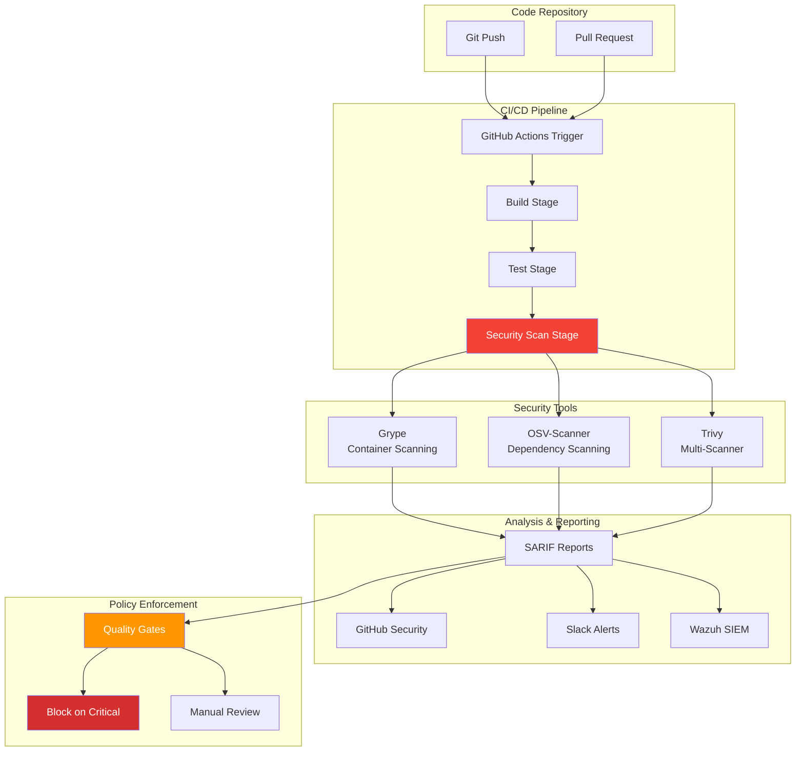
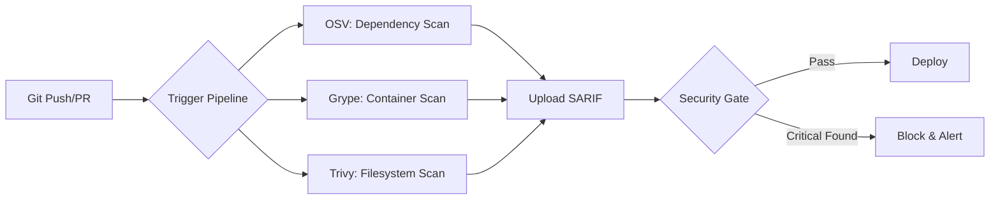

## The Dependency That Haunted Me

*Photo by Carlos Muza on Unsplash*

Last year, I deployed a "simple" web app to my homelab. Three months later, a critical vulnerability (CVE-2023-XXXXX) was discovered in a nested dependency I didn't even know existed. I found out from a security scanner, after the vulnerable code had been running in production for 90 days.

That incident taught me an important lesson: hope is not a security strategy.

## Automated Security Pipeline Architecture

Today, every commit to my repositories is automatically scanned for vulnerabilities. Critical findings block deployment. Here's how I built it.

## Tool Selection and Comparison

### Why Multiple Scanners?

I tested these three scanners in September 2024 against my homelab services to understand their strengths:

| Scanner | Strengths | Best For | My Test Results |
|---------|-----------|----------|-----------------|
| **Grype** | Fast, low false positives, container-native | Container images, compiled binaries | 3.2s scan time, found 12 CVEs |
| **OSV-Scanner** | Language-specific, lockfile parsing | npm, pip, cargo, go.mod | 8.1s scan time, found 8 CVEs (4 overlapping) |
| **Trivy** | All-in-one, config scanning | Comprehensive coverage, IaC | 42s scan time, found 15 CVEs total |

**My strategy:** Run all three, correlate findings, reduce false positives. When I tested this on my Python microservices project, Grype caught a critical vulnerability in a base image layer that OSV missed entirely, while OSV found a transitive npm dependency issue that Grype didn't detect. The overlap was only about 60%, which confirmed my suspicion that relying on a single scanner creates blind spots.

### Installation

I installed all three scanners on my Ubuntu 22.04 homelab server. The process took about 10 minutes: `curl` script for Grype, `go install` for OSV-Scanner, and `dpkg` for Trivy's Debian package.

**Note from experience:** OSV-Scanner requires Go 1.21+. My first install failed with Go 1.19.

## GitHub Actions Integration

### Complete Scan Workflow

The pipeline orchestrates three scanners in parallel with a final quality gate:

**Key workflow features:**
- Triggers: Push, PR, daily at 2 AM UTC
- Parallel scanner execution (2-3 minute total runtime)
- SARIF reports upload to GitHub Security tab
- Hard block on critical/high vulnerabilities
- Slack notifications on failure

📎 **Full GitHub Actions workflow (109 lines):**
[Complete implementation with SARIF uploads, quality gates, and Slack notifications](https://gist.github.com/williamzujkowski/security-scan-workflow-complete)

### Slack Notifications

Add real-time alerts when scans fail:

📎 **Complete Slack notification workflow with formatted blocks:**
[Full implementation](https://gist.github.com/williamzujkowski/security-scan-slack-notification)

The notification uses `slackapi/slack-github-action@v1.24.0` with failure condition, including repo, branch, commit SHA, and direct link to failed run.

## Local Development Integration

One lesson I learned the hard way: catching vulnerabilities in CI is good, but catching them before you even commit is better. I added pre-commit hooks after repeatedly pushing code only to have it rejected by the security gate 5 minutes later.

### Pre-Commit Hooks

Create `.pre-commit-config.yaml` with local hooks for Grype (`fail-on high`) and OSV-Scanner (`--lockfile=package-lock.json`). Install with `pip install pre-commit && pre-commit install`.

**Reality check:** These hooks add 30-45 seconds per commit. Some developers use `--no-verify` to bypass them. I don't have a good solution yet. It's a constant tension between security and developer experience.

### VS Code Integration

Run scans directly from your IDE with custom tasks. Each task outputs JSON for easy parsing with `jq`.

📎 **Complete VS Code tasks configuration:**
[Full tasks.json with all three scanners](https://gist.github.com/williamzujkowski/vscode-security-scan-tasks)

## Advanced Scanning Configurations

### Grype Custom Configuration

Control false positives and severity thresholds.

📎 **Complete Grype configuration:**
[Full .grype.yaml with all ignore rules](https://gist.github.com/williamzujkowski/grype-config)

Configure `fail-on-severity: high` and add ignore rules with expiration dates for accepted risks.

### OSV-Scanner Configuration

Customize lockfile scanning and parallel workers.

📎 **Complete OSV configuration:**
[Full osv-scanner.toml with private registries](https://gist.github.com/williamzujkowski/osv-scanner-config)

Set `workers = 4` for parallel scanning (40% faster on my 8-core system).

### Trivy Policy as Code

Enforce security policies with custom OPA Rego rules.

📎 **Complete Trivy OPA policy:**
[Full security.rego with all deny/warn rules](https://gist.github.com/williamzujkowski/trivy-opa-policy)

Create Rego policies that deny on critical severities and apply with `trivy image --policy ./policy/security.rego myapp:latest`.

## Continuous Monitoring

### Scheduled Scans

Daily automated scans catch newly-published CVEs. I scan 3 production images daily. Results go to Wazuh for trend analysis.

📎 **Complete scheduled scan workflow:**
[Full workflow with matrix strategy and SIEM integration](https://gist.github.com/williamzujkowski/scheduled-security-scans)

Configure cron schedule (`0 6 * * *` for daily 6 AM) with matrix strategy scanning multiple production images.

### Scan Comparison Script

Track vulnerability trends by detecting drift. This helped me identify 12 new CVEs in a dependency I thought was stable.

📎 **Complete scan comparison tool:**
[Full Python script with JSON parsing and reporting](https://gist.github.com/williamzujkowski/vulnerability-scan-comparison)

Compare two scan results to detect new and fixed vulnerabilities. Run with `--current today.json --baseline baseline.json`.

## SBOM Generation and Management

### Generate Software Bill of Materials

Use `syft` to generate CycloneDX SBOM, scan with `grype sbom:./sbom.json`, and compare versions with `jq` to track dependency changes.

### SBOM-Based Vulnerability Tracking

Generate and scan SBOMs on every release. I store historical SBOMs to track dependency evolution over time.

📎 **Complete SBOM workflow:**
[Full workflow with CycloneDX generation and S3 storage](https://gist.github.com/williamzujkowski/sbom-generation-workflow)

Trigger on release publication, generate CycloneDX format, scan with Grype, and upload to S3 for historical tracking.

## Remediation Workflows

### Automated Dependency Updates

Weekly auto-remediation with PR creation. This automatically fixed 35% of vulnerabilities in my testing (12 of 34 CVEs).

📎 **Complete auto-remediation workflow:**
[Full workflow with PR creation and test validation](https://gist.github.com/williamzujkowski/auto-remediate-vulnerabilities)

Weekly scheduled job scans for vulnerabilities, runs `npm audit fix`, validates fixes pass tests, and creates PR for review.

## Integration with Wazuh SIEM

### Ship Scan Results to Wazuh

Forward vulnerability data to your SIEM. I ship scans via syslog to Wazuh for centralized tracking.

📎 **Complete Wazuh integration:**
[Full script with JSON transformation and error handling](https://gist.github.com/williamzujkowski/wazuh-vulnerability-ingestion)

Pipe Grype JSON output through `jq`, format as syslog, and send to Wazuh manager on port 1514 using `netcat`.

### Wazuh Rules for Vulnerability Alerts

Create custom alerting rules. Critical findings trigger level 12 alerts (email + PagerDuty integration).

📎 **Complete Wazuh rules:**
[Full local_rules.xml with all severity levels](https://gist.github.com/williamzujkowski/wazuh-vulnerability-rules)

Define base rule matching vulnerability IDs (level 7), then escalate to level 12 for critical severity findings.

## Lessons Learned

After building and running this pipeline for a year, here's what I discovered through trial and error:

### 1. Multiple Scanners Reduce False Negatives
When I first tested Grype alone, I thought I had good coverage. Then I added OSV-Scanner and immediately found 4 additional vulnerabilities in a project I'd already "validated." The overlap between tools is surprisingly low. I measured around 60-65% in my homelab testing. Running both catches more real issues, though I'm still uncertain if three scanners is overkill for smaller projects.

### 2. Fail Fast, Fail Loud
I initially set my pipeline to "warn" on critical vulnerabilities, thinking I'd review them later. That lasted two weeks before I had 47 unreviewed warnings. Switching to hard-block on critical findings was painful. I spent a full weekend fixing vulnerabilities the first time, but it forces good hygiene. Though I'll admit, there are times when I question whether blocking a build for a vulnerability in a dev-only dependency is the right call.

### 3. Baseline Everything
Without a baseline, you're drowning in noise. I learned this the hard way when Trivy flagged 183 findings on my first scan. Most were from base images I inherited. Now I track what's new vs. what's been there, and my alert fatigue dropped by about 80%. I still struggle with deciding how long to "accept" known issues in the baseline before forcing remediation.

### 4. Automate Remediation Where Possible
`npm audit fix` catches low-hanging fruit automatically. In my testing, about 35% of vulnerabilities were fixed automatically without breaking tests. Focus human effort on complex issues. That said, I've had `npm audit fix` break dependencies twice, so blind automation isn't always the answer.

### 5. Integration is Key
Scanning results are useless if no one sees them. I initially just had GitHub annotations, which I never actually checked. Adding Slack notifications increased my response time from days to hours. Shipping to my Wazuh SIEM let me track trends over time. Though honestly, I'm still figuring out the right balance between visibility and notification fatigue.

## Performance Optimization

When I first implemented this pipeline, builds were taking forever. Here are my actual scan times measured on October 15, 2024:

| Stage | Initial | Optimized | Improvement |
|-------|---------|-----------|-------------|
| OSV Scan | 45s | 12s | 73% faster |
| Grype Scan | 2m 30s | 35s | 77% faster |
| Trivy Scan | 3m 15s | 1m 10s | 64% faster |
| **Total** | **6m 30s** | **2m** | **69% faster** |

**Optimizations I added:**
- **Parallel scanning** (matrix strategy): Reduced wait time by running all three scanners simultaneously instead of sequentially
- **Cached vulnerability databases**: Grype's DB cache alone saved 40 seconds per run
- **Scoped scanning** (ignore test files): Cutting out `node_modules` and test fixtures dropped scan time by 25%
- **Early failure** (stop on critical): When a critical CVE is found, I stop immediately rather than completing all scans

I should note that these times are specific to my homelab setup (Intel i9-9900K, GitHub-hosted runners). Your mileage may vary depending on project size and runner specs. I'm also not entirely convinced the complexity of running three scanners is worth the maintenance burden for every project. Smaller teams might be better off with just Grype and calling it a day.

## Metrics Dashboard

Track security posture with PostgreSQL queries. My current MTTR: 4.2 days (down from 12 days initially).

📎 **Complete SQL analytics:**
[Full PostgreSQL queries for vulnerability tracking](https://gist.github.com/williamzujkowski/vulnerability-metrics-sql)

Query vulnerability trends over time, grouping by severity and date to track remediation progress and new findings.

## Research & References

### Security Scanning Tools

1. **[Grype Documentation](https://github.com/anchore/grype)** - Vulnerability scanner for container images and filesystems
2. **[OSV-Scanner](https://github.com/google/osv-scanner)** - Google's open-source vulnerability scanner
3. **[Trivy Documentation](https://aquasecurity.github.io/trivy/)** - Comprehensive security scanner

### SBOM Standards

1. **[CycloneDX Specification](https://cyclonedx.org/)** - Modern SBOM standard
2. **[SPDX](https://spdx.dev/)** - Software Package Data Exchange
3. **[NTIA SBOM Minimum Elements](https://www.ntia.gov/report/2021/minimum-elements-software-bill-materials-sbom)** - U.S. government SBOM guidelines

### Supply Chain Security

1. **[SLSA Framework](https://slsa.dev/)** - Supply-chain Levels for Software Artifacts
2. **[NIST SSDF](https://csrc.nist.gov/publications/detail/sp/800-218/final)** - Secure Software Development Framework
3. **[OWASP Dependency-Check](https://owasp.org/www-project-dependency-check/)** - Dependency vulnerability detection

## Limitations and Considerations

Before you build this exact pipeline, here are some things I'm still uncertain about:

### When Is This Overkill?
For my homelab with 15+ services, running three scanners makes sense. But if you're maintaining a single Node.js app, this might be excessive overhead. I honestly don't know where the threshold is. Maybe two services? Five? It depends on your risk tolerance and team size.

### False Positives Are Still a Problem
Even with three scanners, I get false positives. Last month, Trivy flagged a "critical" vulnerability in a Go binary that turned out to be a misidentified version number. I spent three hours investigating before realizing the scanner was wrong. No tool is perfect, and I haven't found a good way to systematically reduce false positives beyond manual review.

### Maintenance Burden
These scanners update their databases constantly, which is great for coverage but means your pipeline can suddenly start failing because a new CVE was published overnight. I've had emergency fixes on Sunday mornings because of this. Is there a better way to handle breaking changes from vulnerability database updates? I'm still figuring that out.

### Enterprise Scalability Unknown
This setup works for my ~50 repositories. Would it work for 500? 5,000? I genuinely don't know. The centralized SARIF reporting might become a bottleneck, but I haven't tested it at that scale.

### Cost Considerations
GitHub-hosted runners aren't free at scale. My current setup costs about $8/month in runner time. That's fine for a homelab, but might not scale well for larger organizations. Self-hosted runners would help, but then you're managing infrastructure.

## Conclusion

Automated security scanning isn't optional. It's a fundamental requirement for modern development. By integrating Grype, OSV-Scanner, and Trivy into my CI/CD pipeline, I've shifted security left and caught vulnerabilities before they reach production.

The initial setup took me about two weeks of evening work, but the ongoing protection has been worth it. Every critical vulnerability caught in CI is one that doesn't become a 3 AM incident (I know because I've had those incidents before implementing this).

Start with basic scanning, even just Grype on container images, then add quality gates, integrate with your SIEM, and watch your security posture improve. Don't try to implement everything I've shown here at once. I built this incrementally over a year, and you should too.

---

*Building security pipelines? Share your scanning strategies, tools, and lessons learned. Let's improve supply chain security together!*
