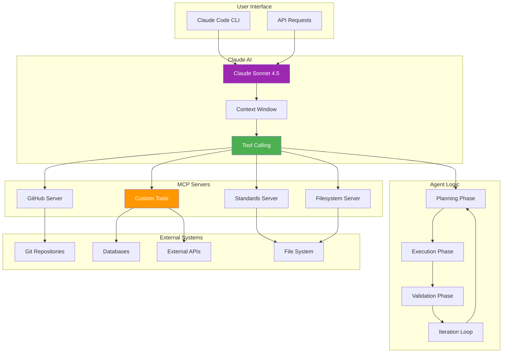

## The Moment AI Clicked


*Photo by Google DeepMind on Unsplash*

Last month, I was manually reviewing security logs, extracting indicators of compromise, updating firewall rules, and documenting incidents. It was tedious, repetitive, and soul-crushing. Then I built an AI agent that does all of it—better and faster than I ever could.

That agent changed how I think about automation.

## AI Agent Architecture with MCP



## What Are MCP Servers?

**Model Context Protocol (MCP)** is Anthropic's standard for connecting AI models to external tools and data sources. Think of it as an API gateway for AI agents.

### MCP Server Types

**Built-in Servers:**
- `filesystem` - Read/write files
- `fetch` - HTTP requests
- `github` - GitHub API integration
- `postgres` - Database queries
- `puppeteer` - Browser automation

**Custom Servers:**
- Any tool you can imagine
- Written in TypeScript/Python
- Expose functions to Claude

## Building Your First MCP Server

### Simple Python MCP Server

```python
#!/usr/bin/env python3
# security-tools-mcp-server.py

from mcp.server import Server
from mcp.types import Tool, TextContent
import subprocess
import json

app = Server("security-tools")

@app.tool()
async def scan_ports(host: str, ports: str = "1-1000") -> TextContent:
    """Scan open ports on a host using nmap"""
    try:
        result = subprocess.run(
            ["nmap", "-p", ports, host],
            capture_output=True,
            text=True,
            timeout=60
        )
        return TextContent(
            type="text",
            text=f"Port scan results:\n{result.stdout}"
        )
    except subprocess.TimeoutExpired:
        return TextContent(
            type="text",
            text=f"Scan timed out for {host}"
        )
    except Exception as e:
        return TextContent(
            type="text",
            text=f"Error scanning {host}: {str(e)}"
        )

@app.tool()
async def check_vulnerabilities(package: str, version: str) -> TextContent:
    """Check for known vulnerabilities in a package"""
    try:
        result = subprocess.run(
            ["osv-scanner", "--package", f"{package}@{version}"],
            capture_output=True,
            text=True
        )
        return TextContent(
            type="text",
            text=f"Vulnerability scan:\n{result.stdout}"
        )
    except Exception as e:
        return TextContent(
            type="text",
            text=f"Error checking vulnerabilities: {str(e)}"
        )

@app.tool()
async def analyze_logs(log_file: str, pattern: str) -> TextContent:
    """Search security logs for suspicious patterns"""
    try:
        with open(log_file, 'r') as f:
            matches = [line for line in f if pattern in line]

        return TextContent(
            type="text",
            text=f"Found {len(matches)} matches:\n" + "\n".join(matches[:50])
        )
    except FileNotFoundError:
        return TextContent(
            type="text",
            text=f"Log file not found: {log_file}"
        )

if __name__ == "__main__":
    app.run()
```

### TypeScript MCP Server

```typescript
// homelab-mcp-server.ts
import { Server } from "@modelcontextprotocol/sdk/server/index.js";
import { StdioServerTransport } from "@modelcontextprotocol/sdk/server/stdio.js";
import { ListToolsRequestSchema, CallToolRequestSchema } from "@modelcontextprotocol/sdk/types.js";
import { exec } from "child_process";
import { promisify } from "util";

const execAsync = promisify(exec);

const server = new Server({
  name: "homelab-tools",
  version: "1.0.0"
}, {
  capabilities: {
    tools: {}
  }
});

// Define available tools
server.setRequestHandler(ListToolsRequestSchema, async () => ({
  tools: [
    {
      name: "check_proxmox_vm",
      description: "Check status of Proxmox VM",
      inputSchema: {
        type: "object",
        properties: {
          vmid: {
            type: "number",
            description: "VM ID to check"
          }
        },
        required: ["vmid"]
      }
    },
    {
      name: "restart_docker_container",
      description: "Restart a Docker container",
      inputSchema: {
        type: "object",
        properties: {
          container: {
            type: "string",
            description: "Container name or ID"
          }
        },
        required: ["container"]
      }
    },
    {
      name: "query_wazuh_alerts",
      description: "Query recent Wazuh security alerts",
      inputSchema: {
        type: "object",
        properties: {
          hours: {
            type: "number",
            description: "Number of hours to look back",
            default: 24
          },
          severity: {
            type: "string",
            description: "Minimum severity level",
            enum: ["low", "medium", "high", "critical"]
          }
        }
      }
    }
  ]
}));

// Implement tool execution
server.setRequestHandler(CallToolRequestSchema, async (request) => {
  const { name, arguments: args } = request.params;

  switch (name) {
    case "check_proxmox_vm": {
      const { vmid } = args as { vmid: number };
      try {
        const { stdout } = await execAsync(`pvesh get /nodes/pve1/qemu/${vmid}/status/current`);
        return {
          content: [{
            type: "text",
            text: `VM ${vmid} status:\n${stdout}`
          }]
        };
      } catch (error) {
        return {
          content: [{
            type: "text",
            text: `Error checking VM ${vmid}: ${error.message}`
          }]
        };
      }
    }

    case "restart_docker_container": {
      const { container } = args as { container: string };
      try {
        await execAsync(`docker restart ${container}`);
        return {
          content: [{
            type: "text",
            text: `Successfully restarted container: ${container}`
          }]
        };
      } catch (error) {
        return {
          content: [{
            type: "text",
            text: `Error restarting ${container}: ${error.message}`
          }]
        };
      }
    }

    case "query_wazuh_alerts": {
      const { hours = 24, severity = "medium" } = args as { hours?: number; severity?: string };

      try {
        // Query Wazuh API
        const response = await fetch(`https://wazuh.internal/api/alerts`, {
          method: "POST",
          headers: {
            "Authorization": `Bearer ${process.env.WAZUH_TOKEN}`,
            "Content-Type": "application/json"
          },
          body: JSON.stringify({
            query: {
              bool: {
                must: [
                  { range: { timestamp: { gte: `now-${hours}h` } } },
                  { terms: { severity: getSeverityLevels(severity) } }
                ]
              }
            }
          })
        });

        const data = await response.json();

        return {
          content: [{
            type: "text",
            text: `Found ${data.hits.total} alerts in last ${hours} hours:\n${JSON.stringify(data.hits.hits, null, 2)}`
          }]
        };
      } catch (error) {
        return {
          content: [{
            type: "text",
            text: `Error querying Wazuh: ${error.message}`
          }]
        };
      }
    }

    default:
      throw new Error(`Unknown tool: ${name}`);
  }
});

function getSeverityLevels(minSeverity: string): number[] {
  const levels = { low: 3, medium: 7, high: 10, critical: 12 };
  const threshold = levels[minSeverity] || 7;
  return Object.values(levels).filter(v => v >= threshold);
}

// Start server
async function main() {
  const transport = new StdioServerTransport();
  await server.connect(transport);
  console.error("Homelab MCP server running on stdio");
}

main().catch(console.error);
```

### Install MCP Server

```bash
# Add to Claude Code config
claude mcp add homelab-tools node /path/to/homelab-mcp-server.js

# Test the server
claude mcp list
claude mcp test homelab-tools check_proxmox_vm --vmid 100
```

## Building Intelligent Agents

### Security Incident Response Agent

```python
# agent-security-incident-response.py

from anthropic import Anthropic
import json

client = Anthropic(api_key="your-api-key")

SYSTEM_PROMPT = """You are a security incident response agent for a homelab environment.

Your capabilities:
1. Analyze Wazuh security alerts
2. Correlate events across logs
3. Identify indicators of compromise (IOCs)
4. Recommend containment actions
5. Update firewall rules
6. Document incidents

Your process:
1. Receive alert notification
2. Gather context from logs and systems
3. Analyze the threat
4. Determine severity and impact
5. Recommend response actions
6. Execute approved actions
7. Document the incident

Always explain your reasoning and ask for confirmation before taking destructive actions."""

def handle_security_incident(alert_data: dict) -> dict:
    """Process a security alert and respond appropriately"""

    messages = [
        {
            "role": "user",
            "content": f"""Security alert received:

{json.dumps(alert_data, indent=2)}

Please analyze this alert and recommend response actions."""
        }
    ]

    # Agent thinks and plans response
    response = client.messages.create(
        model="claude-sonnet-4-20250514",
        max_tokens=4000,
        system=SYSTEM_PROMPT,
        messages=messages,
        tools=[
            {
                "name": "query_wazuh_alerts",
                "description": "Query related security alerts",
                "input_schema": {
                    "type": "object",
                    "properties": {
                        "query": {"type": "string"},
                        "hours": {"type": "number"}
                    }
                }
            },
            {
                "name": "analyze_logs",
                "description": "Analyze system logs for patterns",
                "input_schema": {
                    "type": "object",
                    "properties": {
                        "log_file": {"type": "string"},
                        "pattern": {"type": "string"}
                    }
                }
            },
            {
                "name": "block_ip",
                "description": "Add IP to firewall blocklist",
                "input_schema": {
                    "type": "object",
                    "properties": {
                        "ip_address": {"type": "string"},
                        "reason": {"type": "string"}
                    }
                }
            }
        ]
    )

    # Handle tool calls
    while response.stop_reason == "tool_use":
        tool_results = []

        for block in response.content:
            if block.type == "tool_use":
                result = execute_tool(block.name, block.input)
                tool_results.append({
                    "type": "tool_result",
                    "tool_use_id": block.id,
                    "content": result
                })

        # Continue conversation with tool results
        messages.extend([
            {"role": "assistant", "content": response.content},
            {"role": "user", "content": tool_results}
        ])

        response = client.messages.create(
            model="claude-sonnet-4-20250514",
            max_tokens=4000,
            system=SYSTEM_PROMPT,
            messages=messages,
            tools=tools
        )

    return {
        "analysis": extract_text(response.content),
        "actions_taken": extract_tool_calls(messages)
    }

def execute_tool(name: str, args: dict) -> str:
    """Execute a tool and return results"""
    if name == "query_wazuh_alerts":
        # Query Wazuh API
        return query_wazuh(args["query"], args["hours"])

    elif name == "analyze_logs":
        # Search log files
        return analyze_log_file(args["log_file"], args["pattern"])

    elif name == "block_ip":
        # Add firewall rule
        return block_ip_address(args["ip_address"], args["reason"])

    return "Tool not found"
```

### Homelab Automation Agent

```typescript
// agent-homelab-automation.ts

import { Anthropic } from "@anthropic-ai/sdk";

const anthropic = new Anthropic({
  apiKey: process.env.ANTHROPIC_API_KEY
});

const SYSTEM_PROMPT = `You are a homelab automation agent with access to:

- Proxmox virtualization platform
- Docker containers
- Kubernetes (K3s) cluster
- Network infrastructure (Ubiquiti)
- Monitoring systems (Grafana, Wazuh)

Your capabilities:
1. Manage VMs and containers
2. Deploy applications
3. Monitor system health
4. Perform routine maintenance
5. Respond to alerts
6. Optimize resource usage

Guidelines:
- Always check current state before making changes
- Validate operations succeeded
- Document what you did and why
- Be conservative with destructive operations
- Ask for confirmation on major changes`;

async function automateHomelabTask(task: string): Promise<void> {
  const messages = [
    {
      role: "user" as const,
      content: `Task: ${task}\n\nPlease analyze what needs to be done and execute it.`
    }
  ];

  let response = await anthropic.messages.create({
    model: "claude-sonnet-4-20250514",
    max_tokens: 8000,
    system: SYSTEM_PROMPT,
    messages,
    tools: [
      {
        name: "execute_command",
        description: "Execute a shell command on the homelab server",
        input_schema: {
          type: "object",
          properties: {
            command: { type: "string" },
            host: { type: "string" }
          }
        }
      },
      {
        name: "deploy_container",
        description: "Deploy a Docker container",
        input_schema: {
          type: "object",
          properties: {
            image: { type: "string" },
            name: { type: "string" },
            ports: { type: "array" },
            environment: { type: "object" }
          }
        }
      },
      {
        name: "check_system_health",
        description: "Check health of homelab systems",
        input_schema: {
          type: "object",
          properties: {
            systems: { type: "array", items: { type: "string" } }
          }
        }
      }
    ]
  });

  // Agent execution loop
  while (response.stop_reason === "tool_use") {
    console.log("Agent is using tools...");

    const toolResults = [];

    for (const block of response.content) {
      if (block.type === "tool_use") {
        console.log(`Executing: ${block.name}`, block.input);

        const result = await executeTool(block.name, block.input);

        toolResults.push({
          type: "tool_result",
          tool_use_id: block.id,
          content: result
        });
      }
    }

    messages.push(
      { role: "assistant", content: response.content },
      { role: "user", content: toolResults }
    );

    response = await anthropic.messages.create({
      model: "claude-sonnet-4-20250514",
      max_tokens: 8000,
      system: SYSTEM_PROMPT,
      messages,
      tools: response.tools
    });
  }

  // Extract final response
  const finalText = response.content
    .filter(block => block.type === "text")
    .map(block => block.text)
    .join("\n");

  console.log("\nAgent completed task:");
  console.log(finalText);
}

async function executeTool(name: string, input: any): Promise<string> {
  // Tool implementations
  switch (name) {
    case "execute_command":
      return executeRemoteCommand(input.command, input.host);

    case "deploy_container":
      return deployDockerContainer(input);

    case "check_system_health":
      return checkSystemsHealth(input.systems);

    default:
      return `Unknown tool: ${name}`;
  }
}

// Example usage
automateHomelabTask("Deploy a new monitoring stack with Prometheus and Grafana")
  .catch(console.error);
```

## Multi-Agent Orchestration

### Agent Swarm for Complex Tasks

```python
# agent-swarm-coordinator.py

from typing import List, Dict
import asyncio

class AgentSwarm:
    """Coordinate multiple AI agents for complex tasks"""

    def __init__(self):
        self.agents = {}
        self.shared_memory = {}

    def register_agent(self, name: str, role: str, capabilities: List[str]):
        """Register a new agent in the swarm"""
        self.agents[name] = {
            "role": role,
            "capabilities": capabilities,
            "status": "idle"
        }

    async def delegate_task(self, task: str) -> Dict:
        """Break down task and delegate to appropriate agents"""

        # Coordinator agent analyzes the task
        breakdown = await self.analyze_task(task)

        # Assign subtasks to specialized agents
        results = await asyncio.gather(*[
            self.execute_subtask(subtask)
            for subtask in breakdown["subtasks"]
        ])

        # Synthesize results
        final_result = await self.synthesize_results(results)

        return final_result

    async def analyze_task(self, task: str) -> Dict:
        """Use coordinator agent to break down complex task"""
        response = await anthropic.messages.create(
            model="claude-sonnet-4-20250514",
            max_tokens=2000,
            system="""You are a task coordinator. Break down complex tasks into
            subtasks that can be delegated to specialized agents.

            Available agents:
            - security-analyst: Analyzes threats and vulnerabilities
            - system-admin: Manages infrastructure and deployments
            - developer: Writes and reviews code
            - documenter: Creates documentation

            Output format:
            {
              "subtasks": [
                {"agent": "agent-name", "task": "description", "priority": 1-5}
              ]
            }""",
            messages=[{"role": "user", "content": task}]
        )

        return extract_json(response.content)

    async def execute_subtask(self, subtask: Dict) -> Dict:
        """Execute subtask with appropriate agent"""
        agent_name = subtask["agent"]

        # Get agent-specific prompt
        agent_prompt = self.get_agent_prompt(agent_name)

        response = await anthropic.messages.create(
            model="claude-sonnet-4-20250514",
            max_tokens=4000,
            system=agent_prompt,
            messages=[
                {"role": "user", "content": subtask["task"]},
                {"role": "user", "content": f"Shared context: {json.dumps(self.shared_memory)}"}
            ],
            tools=self.get_agent_tools(agent_name)
        )

        result = {
            "agent": agent_name,
            "task": subtask["task"],
            "output": extract_text(response.content),
            "tools_used": extract_tool_calls(response)
        }

        # Update shared memory
        self.shared_memory[f"{agent_name}_result"] = result

        return result

    async def synthesize_results(self, results: List[Dict]) -> Dict:
        """Combine agent results into final output"""
        synthesis_prompt = f"""Review the results from multiple agents and synthesize
        a comprehensive response.

        Agent results:
        {json.dumps(results, indent=2)}

        Provide:
        1. Summary of what was accomplished
        2. Key findings or outputs
        3. Recommendations for next steps"""

        response = await anthropic.messages.create(
            model="claude-sonnet-4-20250514",
            max_tokens=3000,
            messages=[{"role": "user", "content": synthesis_prompt}]
        )

        return {
            "synthesis": extract_text(response.content),
            "agent_results": results
        }

# Example usage
async def main():
    swarm = AgentSwarm()

    # Register agents
    swarm.register_agent(
        "security-analyst",
        role="Security analysis and threat detection",
        capabilities=["vulnerability-scanning", "log-analysis", "threat-hunting"]
    )

    swarm.register_agent(
        "system-admin",
        role="Infrastructure management",
        capabilities=["deployment", "configuration", "monitoring"]
    )

    # Execute complex task
    result = await swarm.delegate_task(
        "Audit the homelab security posture and deploy improvements"
    )

    print(json.dumps(result, indent=2))

asyncio.run(main())
```

## Best Practices

### 1. Give Agents Clear Personas

```python
GOOD_PROMPT = """You are a security incident responder. Your priority is
containment first, forensics second. Be decisive but document everything."""

BAD_PROMPT = """You are a helpful AI assistant."""
```

### 2. Provide Rich Context

```python
# Include relevant system state
context = {
    "current_alerts": get_active_alerts(),
    "system_health": check_health(),
    "recent_changes": get_recent_deployments(),
    "known_issues": load_known_issues()
}

messages.append({
    "role": "user",
    "content": f"Current context:\n{json.dumps(context, indent=2)}"
})
```

### 3. Validate Agent Actions

```python
def validate_action(action: dict) -> bool:
    """Validate agent-proposed action before execution"""

    # Check if action is destructive
    if action["type"] in ["delete", "terminate", "shutdown"]:
        return require_approval(action)

    # Validate against policy
    if not complies_with_policy(action):
        return False

    return True
```

### 4. Implement Guardrails

```python
SAFETY_CHECKS = {
    "max_containers_deleted": 5,
    "max_firewall_rules": 50,
    "require_approval": ["production", "critical"]
}

def check_safety(action: dict) -> bool:
    """Ensure action doesn't violate safety constraints"""
    # Implement safety logic
    pass
```

## Lessons Learned

After building AI agents for my homelab:

### 1. Agents Need Clear Boundaries
Don't give agents unlimited power. Define what they can and can't do explicitly.

### 2. Context is Everything
More context = better decisions. Share system state, recent changes, and historical data.

### 3. Validate Before Executing
Never trust agent output blindly. Validate actions before execution.

### 4. Human-in-the-Loop for Critical Decisions
Agents propose, humans approve. Especially for destructive actions.

### 5. Log Everything
Agent decisions, tool calls, and reasoning—log it all for debugging and auditing.

## Conclusion

AI agents powered by Claude and MCP servers have transformed my homelab from a collection of manual tasks into an intelligent, self-managing system. The security incident response agent handles alerts faster than I ever could. The homelab automation agent performs routine maintenance while I sleep.

Building agents isn't about replacing humans—it's about augmenting our capabilities and freeing us to focus on interesting problems. Start with simple MCP servers, build agents for repetitive tasks, and gradually expand their autonomy as you gain confidence.

The future of homelab management is autonomous, intelligent, and surprisingly accessible.

---

*Building AI agents for your homelab? What tasks have you automated? Share your agent architectures and lessons learned!*
