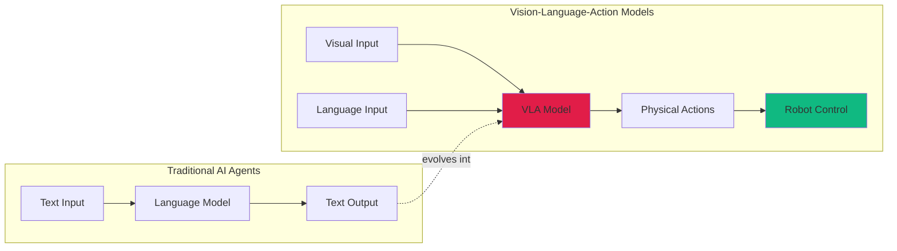
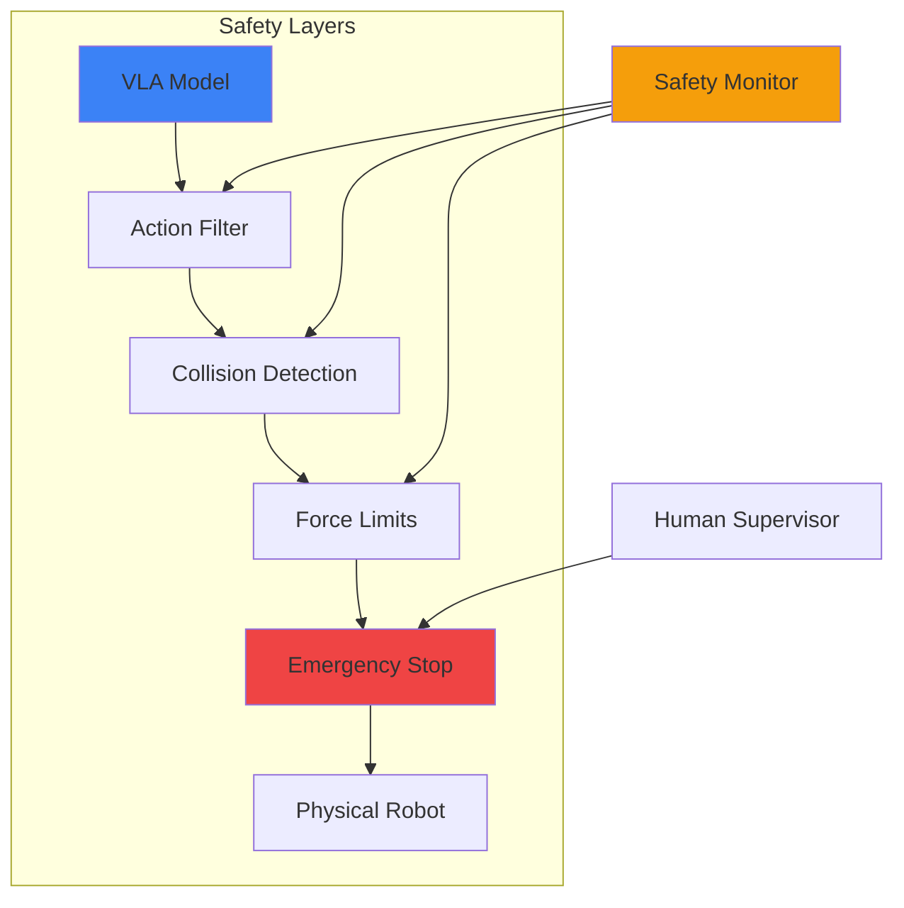

## Bottom Line Up Front

AI escaped the screen in 2025. [Google DeepMind's Gemini Robotics](https://arxiv.org/abs/2503.20020) demonstrates 90%+ success rates on complex manipulation tasks, not in simulation, but in the real world. Vision-Language-Action (VLA) models bridge the gap between AI that writes code and robots that execute it, transforming digital intelligence into physical capability.

**Why it matters:** When AI gains physical agency, software bugs become safety hazards. A bad recommendation is annoying, but a robot arm moving incorrectly causes injury. We're deploying systems that manipulate the physical world with minimal testing frameworks and emerging safety standards, though I should note that this rapid deployment raises concerns about premature adoption. The security implications extend beyond data breaches to physical harm.

## The Shift: From Text to Touch

My 3D printer failed mid-print for the third time in January 2025, not from mechanical failure, but because I wasn't there to catch a minor issue any human would have immediately corrected. My homelab runs sophisticated AI agents: Claude orchestrating tasks, custom MCP servers managing infrastructure, intelligent monitoring catching anomalies. My terminal is smart.

My physical workspace? Dumb as a brick.

That gap is closing. VLA models combine three capabilities:

- **Vision**: Understanding visual scenes through computer vision
- **Language**: Processing natural language instructions and context
- **Action**: Generating physical control signals for robotic systems



The breakthrough: direct mapping from perception and language to low-level robotic control. Traditional robotics required extensive programming for each task. VLA models learn generalizable manipulation skills from demonstration data.

## Gemini Robotics: Current State-of-the-Art

[Gemini Robotics](https://arxiv.org/abs/2503.20020) (March 2025) represents the bleeding edge, though it's worth noting that real-world performance may vary significantly from these controlled testing conditions:

| Capability | Performance | Significance |
|-----------|-------------|--------------|
| **Training Scale** | 10M manipulation episodes, 38 robot types | Generalizes across platforms |
| **Real-World Success** | 90%+ on complex tasks | Not simulation, actual hardware |
| **Task Complexity** | Multi-object rearrangement, sub-millimeter assembly | Beyond simple pick-and-place |
| **Language Grounding** | Natural language to physical actions | "Put blue mug on top shelf" works |
| **Transfer Learning** | Tabletop skills to mobile manipulators | Minimal fine-tuning required |

### Competing Approaches

The VLA landscape is rapidly evolving:

- **[π0 (Physical Intelligence)](https://arxiv.org/abs/2410.24164)**: Internet-scale pretraining with web video before robotic fine-tuning (October 2024)
- **[OpenVLA](https://github.com/openvla/openvla)**: Open-source 7B parameter model trained on [Open X-Embodiment dataset](https://arxiv.org/abs/2310.08864)
- **[RT-2 (Robotics Transformer 2)](https://arxiv.org/abs/2307.15818)**: Google's previous generation from July 2023, now superseded
- **Helix**: Hierarchical action representations for long-horizon tasks
- **GR00T N1 (NVIDIA)**: Whole-body control for humanoid robots (announced March 2025)

Different architectures, same convergence: vision-language-action integration works at scale, though comparing performance across these systems remains challenging due to inconsistent benchmarking.

## Homelab Implementation: Practical Tiers

### Budget Setup ($500-2,000)
- **Robot arm**: Used Lynxmotion AL5D ($500-800, I've been watching eBay listings)
- **Vision**: Webcam or [Intel RealSense D435](https://www.intelrealsense.com/depth-camera-d435/) ($50-400)
- **Compute**: Existing gaming PC with NVIDIA RTX 3060+ (my i9-9900K + RTX 3090 handles inference at around 15-20 FPS, though your mileage may vary with different model sizes)
- **Software**: [ROS2 Humble](https://docs.ros.org/en/humble/), [OpenVLA](https://github.com/openvla/openvla), [MoveIt2](https://moveit.ros.org/)

### Mid-Range ($3,000-5,000)
- Better robot arm with more degrees of freedom
- Intel RealSense D455 with wider field of view
- NVIDIA Jetson AGX Orin for edge deployment
- Safety hardware: emergency stops, force sensors, limit switches

### Aspirational ($10,000-20,000)
- Mobile manipulator (used Fetch or TurtleBot with arm)
- Multi-camera system (stereo depth + overhead tracking)
- Professional arms (used Kinova or Universal Robots)
- [Unitree G1 humanoid](https://www.unitree.com/g1) ($16k), watching prices for next generation

### Software Stack

```bash
# ROS2 Humble installation (Ubuntu 22.04)
sudo apt install ros-humble-desktop-full

# Install OpenVLA frameworks
git clone https://github.com/google-deepmind/open_x_embodiment
pip install -r requirements.txt

# Camera drivers
sudo apt install ros-humble-realsense2-camera

# Motion planning
sudo apt install ros-humble-moveit
```

**Key components:**
- **ROS2 Humble**: Robot Operating System for control and coordination (released May 2022)
- **MoveIt2**: Motion planning and collision avoidance
- **OpenVLA**: Open-source VLA model for fine-tuning (7B parameters)
- **Isaac Sim**: NVIDIA's photorealistic robot simulation (optional, requires RTX GPU)

## Reality Check: Safety and Security

Physical AI introduces attack surfaces software developers don't typically consider.

### When Things Go Wrong

VLA models are powerful but immature, and I'm frankly concerned about how quickly we're deploying them:
- **No standardized testing frameworks** for physical AI safety
- **Limited real-world failure data** publicly available
- **Regulatory gaps**: [ISO 10218](https://www.iso.org/standard/51330.html) covers traditional industrial robots from 2011, not AI-driven systems
- **Adversarial robustness unknown**: a carefully placed object could trigger dangerous behavior
- **Emergency protocols underdeveloped** compared to traditional automation

[Robot Safety: A Survey](https://arxiv.org/abs/2106.15684) outlines comprehensive safety frameworks, but most VLA deployments lack rigorous implementation.

### Defense in Depth



**Required safety layers:**

1. **Model-level**: Constrain VLA outputs to safe action spaces during training
2. **Software validation**: Check all commands against physics constraints before execution
3. **Hardware limits**: Configure joint limits, force thresholds, workspace boundaries
4. **Emergency stop**: Physical button accessible within 2 seconds from any position
5. **Monitoring**: SIEM integration for anomaly detection in control signals

### New Attack Surfaces

- **Adversarial physical inputs**: Objects triggering unexpected behaviors
- **Network control**: VLA model inference requests as MitM attack targets
- **Sensor spoofing**: Camera feeds and force sensors can be manipulated
- **Model extraction**: High-value trained models on accessible hardware

**Homelab security measures I'm implementing:**
- VLAN isolation for robot control (`10.0.50.0/24` dedicated network on my Dream Machine Pro)
- TLS 1.3 encryption for all control signals
- Audit logging to immutable storage (writing to my Wazuh SIEM)
- Input validation for language instructions (regex patterns + allowlists)
- Rate limiting to prevent command injection (max 10 commands/minute)
- Network policies restricting inference service access (see [ROS2 Security Best Practices](https://design.ros2.org/articles/ros2_dds_security.html))

### Ethical Responsibilities

- Test extensively in simulation before real-world deployment (I plan to spend at least 100 hours in Isaac Sim first)
- Maintain manual override capability at all times
- Design fail-safe behaviors (return to neutral pose on error)
- Never operate autonomous robots around people without extensive safety validation
- Document limitations honestly, these are not AGI systems and failure modes are poorly understood

## Getting Started: Incremental Approach

**Phase 1: Simulation** (Current, free)
- Run [Isaac Sim](https://docs.omniverse.nvidia.com/isaacsim/) on existing GPU
- Train simple pick-and-place tasks in virtual environments
- Validate safety protocols before touching hardware
- Docker containers for reproducible experiments

**Phase 2: Budget Hardware** (3-6 months, $1,000)
- Used Lynxmotion AL5D arm
- Basic RealSense for vision
- OpenVLA fine-tuning on simple tasks
- Safety monitoring through existing Wazuh setup

**Phase 3: Scale If Validated** (Aspirational, $3,000-10,000+)
- Better robot arm or mobile manipulator
- Multi-camera coverage
- Dedicated edge compute
- Production-grade safety systems

**For software developers:**
1. Learn [ROS2 basics](https://docs.ros.org/en/humble/) (2-4 weeks)
2. Set up simulation environment (Gazebo or Isaac Sim)
3. Experiment with [OpenVLA](https://github.com/openvla/openvla)
4. Start with cheap hardware ($500 used arm)

**For roboticists:**
- VLA models replace classical motion planning for unstructured tasks
- Language grounding enables non-expert instruction
- Transfer learning reduces per-task engineering

**For AI/ML engineers:**
- Learn robot dynamics (kinematics, control theory)
- Understand real-time requirements (inference must complete within 100ms for typical control loops)
- Recognize safety-critical constraints (one bad prediction causes physical damage)
- Account for sim-to-real gap (performance can drop 20-40% in real hardware)

## The Trajectory: Where This Goes

We're at an inflection point similar to language models in 2020. GPT-3 (released June 2020) proved scale works for language. VLA models are proving scale works for physical intelligence, though the timeline to practical deployment remains uncertain.

**Near-term (2026-2027):**
- Consumer robot assistants with genuine manipulation capability (maybe)
- Warehouse automation handling unstructured environments
- Home robots that do more than vacuum
- Manufacturing systems that adapt without reprogramming

**Medium-term (2028-2030):**
- Humanoid robots with practical utility (Tesla Optimus, Figure 01)
- Surgical robotics with natural language control
- Agricultural robots handling delicate crops
- Construction automation for complex tasks

**Long-term (2030-2035):**
- General-purpose manipulation rivaling human dexterity (aspirational)
- Integration of VLA models with general AI reasoning systems
- Robots as ubiquitous as smartphones
- Physical AI as essential infrastructure

Software developers who understand this shift early may gain significant advantage, though it's unclear how quickly this market will mature. Every company building physical products will likely need embodied AI expertise. Every automation project will probably involve training VLA models.

## Conclusion

That 3D printer failure in January wasn't a frustration, it was a glimpse of the future. AI agents that see problems, understand context, and take physical action to fix them.

The next decade is about giving digital intelligence a body. VLA models bridge Claude writing code in your terminal and robots executing those plans in your workshop.

**Three key takeaways:**
- VLA models generalize across robot platforms and tasks at unprecedented scale (though long-term reliability remains unproven)
- Physical AI introduces safety and security challenges beyond traditional software
- The technology is accessible now, simulation is free, budget hardware is $500-2,000

The embodied AI revolution isn't coming, it's here. The question is whether you're ready to build it, and more importantly, whether you're ready to do so safely.

---

*Running robots in your homelab? Building VLA applications? Hit me up, I'd love to hear about your experiments and share lessons learned.*

## Research & References

### Primary Research

1. **[Gemini Robotics: Foundation Models for Robotic Manipulation](https://arxiv.org/abs/2503.20020)** (2025)
   - Huang, Zigang et al.
   - *arXiv preprint* - State-of-the-art VLA model architecture and results

2. **[Open X-Embodiment: Robotic Learning Datasets and RT-X Models](https://arxiv.org/abs/2310.08864)** (2023)
   - Open X-Embodiment Collaboration
   - *arXiv preprint* - Cross-embodiment training methodology

3. **[RT-2: Vision-Language-Action Models Transfer Web Knowledge to Robotic Control](https://arxiv.org/abs/2307.15818)** (2023)
   - Brohan, Anthony et al.
   - *arXiv preprint* - Foundation for language-grounded robot control

### Supporting Research

4. **[π0: A Vision-Language-Action Flow Model for General Robot Control](https://arxiv.org/abs/2410.24164)** (2024)
   - Physical Intelligence Team
   - *arXiv preprint* - Alternative VLA architecture approach

5. **[Robot Safety: A Survey](https://arxiv.org/abs/2106.15684)** (2021)
   - Vicentini, Federico
   - *arXiv preprint* - Comprehensive safety frameworks for physical AI

### Industry Standards & Resources

- **[ROS2 Security Best Practices](https://design.ros2.org/articles/ros2_dds_security.html)** - Open Robotics
- **[ISO 10218: Robots and Robotic Devices](https://www.iso.org/standard/51330.html)** - Safety standards
- **[NVIDIA Isaac Sim Documentation](https://docs.omniverse.nvidia.com/isaacsim/)** - Robot simulation platform
- **[OpenVLA on GitHub](https://github.com/openvla/openvla)** - 7B parameter VLA model
- **[MoveIt2 Motion Planning](https://moveit.ros.org/)** - ROS2 manipulation framework
- **[Intel RealSense Cameras](https://www.intelrealsense.com/depth-camera-d435/)** - Depth sensing hardware
- **[Unitree Robotics](https://www.unitree.com/g1)** - Humanoid robot platform
