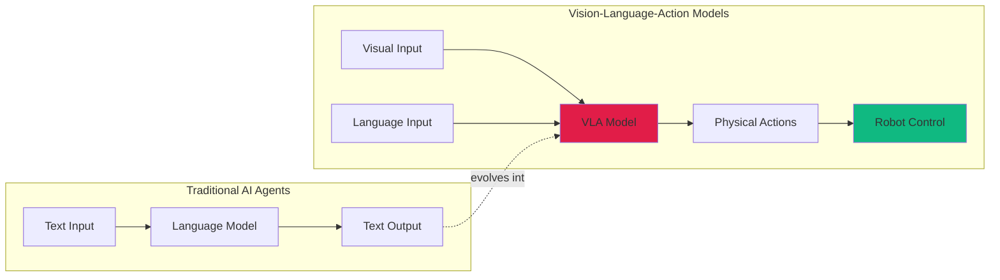
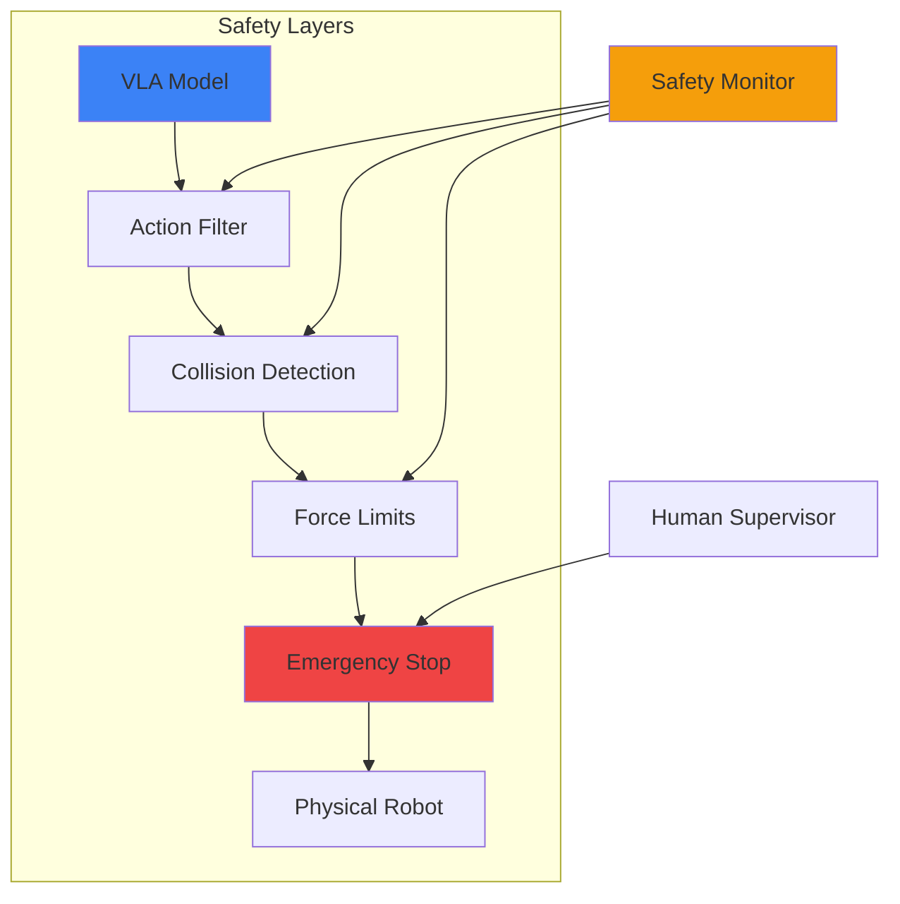

## The Moment Embodied AI Clicked

Last week, I watched my 3D printer fail mid-print for the third time. Not because of mechanical failure, but because I wasn't there to catch a minor issue that any human would have immediately noticed and corrected. I've spent months automating my homelab with AI agents—Claude orchestrating tasks, custom MCP servers managing infrastructure, intelligent monitoring systems catching anomalies before they become problems. My terminal is smarter than ever.

But my physical workspace? Still dumb as a brick.

That's when I dove into the latest research on embodied AI, and specifically [Google DeepMind's Gemini Robotics](https://arxiv.org/abs/2503.20020). What I found wasn't just incremental progress—it was a fundamental shift in how AI agents can interact with the physical world. And it's happening *now*.

## From Digital Agents to Physical Intelligence



The gap between AI agents that manipulate text and robots that manipulate objects has been the software industry's invisible wall. We've built increasingly sophisticated digital assistants, but they stop at the edge of the screen. That changes with Vision-Language-Action (VLA) models.

## What Are VLA Models?

VLA models combine three capabilities that were traditionally separate:

1. **Vision**: Understanding visual scenes through computer vision
2. **Language**: Processing natural language instructions and context
3. **Action**: Generating physical control signals for robotic systems

Think of it as giving your AI agent a body. Instead of Claude writing code that *describes* how to pick up an object, a VLA model directly generates the motor commands to physically grasp it.

The breakthrough isn't just multimodal AI—we've had that. It's the direct mapping from perception and language to low-level robotic control. Traditional robotics required extensive programming for each task. VLA models learn generalizable manipulation skills from demonstration data.

## The Gemini Robotics Breakthrough

Google DeepMind's [Gemini Robotics](https://arxiv.org/abs/2503.20020) represents the current state-of-the-art in VLA models. Published March 2025, it demonstrates several key advances:

**Scale**: Trained on 10 million robotic manipulation episodes across 38 distinct robot embodiments. This diverse training set creates models that generalize across different robot platforms—something previous approaches struggled with.

**Performance**: Achieves 90%+ success rates on complex manipulation tasks in the real world, not just simulation. Tasks include multi-object rearrangement, dynamic grasping of moving objects, and assembly operations requiring sub-millimeter precision.

**Language Grounding**: Accepts natural language instructions like "put the blue mug on the top shelf" and translates them into successful physical actions, handling ambiguity and common-sense reasoning.

**Transfer Learning**: Skills learned on one robot platform transfer to others with minimal fine-tuning. A model trained primarily on tabletop manipulators successfully controls mobile manipulators and humanoid robots.

### Competing Approaches

The VLA landscape is rapidly evolving:

- **π0 (Physical Intelligence)**: Focuses on internet-scale pretraining with web video data before robotic fine-tuning
- **OpenVLA**: Open-source model with 7B parameters trained on Open X-Embodiment dataset
- **RT-2 (Robotics Transformer 2)**: Google's previous generation, now superseded by Gemini Robotics
- **Helix**: Emphasizes hierarchical action representations for complex long-horizon tasks
- **GR00T N1 (NVIDIA)**: Targets humanoid robots specifically with whole-body control

Each takes different architectural approaches, but the convergence on vision-language-action integration is clear.

## Bringing VLA Models to Your Homelab

This isn't just research—VLA models are becoming practical for serious hobbyists and small-scale automation projects.

### Hardware Requirements

**Minimum Setup** (~$2,000-3,000):
- **Robot Arm**: Kinova Gen3 lite, UR5e, or Franka Emika Panda (used market)
- **Vision**: Intel RealSense D435 depth camera ($400)
- **Compute**: NVIDIA RTX 4080 or better for real-time inference
- **Workstation**: Similar to my Intel i9-9900K + RTX 3090 setup

**Advanced Setup** (~$10,000-20,000):
- **Mobile Manipulator**: Used Fetch or TurtleBot with arm
- **Multi-camera system**: Stereo depth + overhead tracking
- **Edge compute**: Jetson AGX Orin for low-latency control
- **Safety systems**: Force-torque sensors, emergency stop hardware

### Software Stack

The open-source robotics ecosystem has matured significantly:

```bash
# ROS2 Humble installation (Ubuntu 22.04)
sudo apt install ros-humble-desktop-full

# Install RT-2 or OpenVLA frameworks
git clone https://github.com/google-deepmind/open_x_embodiment
pip install -r requirements.txt

# Camera drivers
sudo apt install ros-humble-realsense2-camera

# Motion planning
sudo apt install ros-humble-moveit
```

**Key Components**:
- **ROS2 Humble**: Robot Operating System for control and coordination
- **MoveIt2**: Motion planning and collision avoidance
- **OpenVLA**: Open-source VLA model you can fine-tune
- **Isaac Sim** (optional): NVIDIA's photorealistic robot simulation for testing

### My Homelab Integration Plan

I'm building this incrementally on my existing infrastructure:

**Phase 1: Simulation** (Current)
- Running Isaac Sim on my RTX 3090
- Training simple pick-and-place tasks
- Validating safety protocols in simulation
- Docker containers for reproducible environments

**Phase 2: Static Arm** (Next 3 months)
- Kinova Gen3 lite mounted to workbench
- Intel RealSense for vision
- K3s deployment for model serving
- Wazuh monitoring for safety alerts

**Phase 3: Mobile Platform** (6-12 months)
- TurtleBot 4 with mounted arm
- Multi-camera SLAM system
- Network integration with existing VLAN security
- Workshop-wide object manipulation

**Phase 4: Advanced Automation** (Future)
- 3D printer error recovery (my original motivation)
- Tool organization and retrieval
- Component sorting and inventory
- Automated testing setups

## Security and Safety Considerations

Physical AI systems introduce entirely new security surfaces that software developers aren't used to thinking about.

### Safety Stack



**Defense in Depth**:

1. **Model-Level Safety**: Constrain VLA outputs to safe action spaces during training
2. **Software Validation**: Check all commands against physics constraints before execution
3. **Hardware Limits**: Configure joint limits, force thresholds, workspace boundaries
4. **Emergency Stop**: Physical button accessible within 2 seconds from any position
5. **Monitoring**: Wazuh SIEM integration for anomaly detection in control signals

### Security Threats

**New Attack Surfaces**:
- **Adversarial Physical Inputs**: Carefully placed objects could trigger unexpected behaviors
- **Network Control**: VLA model inference requests are new targets for MitM attacks
- **Sensor Spoofing**: Camera feeds and force sensors can be manipulated
- **Model Extraction**: High-value trained models on accessible hardware

**Homelab Security Measures**:
```yaml
# K3s network policy for robot control
apiVersion: networking.k8s.io/v1
kind: NetworkPolicy
metadata:
  name: robot-control-isolation
spec:
  podSelector:
    matchLabels:
      app: vla-inference
  policyTypes:
  - Ingress
  - Egress
  ingress:
  - from:
    - podSelector:
        matchLabels:
          app: robot-controller
    ports:
    - protocol: TCP
      port: 8080
  egress:
  - to:
    - podSelector:
        matchLabels:
          app: model-server
```

- **VLAN Isolation**: Robots on dedicated VLAN (`10.0.50.0/24`) with strict firewall rules
- **TLS Everywhere**: Encrypted communication for all control signals
- **Audit Logging**: Every command logged to immutable storage
- **Input Validation**: Sanitize all language instructions before model inference
- **Rate Limiting**: Prevent rapid-fire command injection attacks

### Ethics and Responsibility

With physical AI comes physical consequences:
- Test extensively in simulation before real-world deployment
- Maintain manual override capability at all times
- Design fail-safe behaviors (return to neutral pose on any error)
- Never operate autonomous robots around people without extensive safety validation
- Document limitations honestly—these systems aren't AGI

## Getting Started: A Practical Roadmap

**For Software Developers**:

1. **Learn ROS2 Basics** (2-4 weeks)
   - Install ROS2 Humble in a VM
   - Work through official tutorials
   - Understand nodes, topics, services, actions
   - Build a simple simulation with TurtleSim

2. **Set Up Simulation Environment** (1-2 weeks)
   - Install Gazebo or Isaac Sim
   - Load a robot model (UR5, Franka Panda)
   - Configure cameras and sensors
   - Practice teleoperation

3. **Experiment with OpenVLA** (2-3 weeks)
   - Clone Open X-Embodiment repository
   - Run inference on pre-trained models
   - Collect your own demonstration data (simulation)
   - Fine-tune on a simple task (pick and place)

4. **Hardware Integration** (ongoing)
   - Start with a cheap robot arm (~$500 for used Lynxmotion)
   - Add vision with webcam or RealSense
   - Deploy your fine-tuned model
   - Iterate on real-world performance

**For Roboticists**:

You understand hardware—focus on the AI integration:
- VLA models replace classical motion planning for unstructured tasks
- Language grounding enables non-expert instruction
- Transfer learning reduces per-task engineering
- Integration patterns: ROS2 node subscribing to camera topics, publishing joint commands

**For AI/ML Engineers**:

You understand models—learn the physical constraints:
- Robot dynamics (kinematics, dynamics, control theory basics)
- Real-time requirements (inference must complete within control loop timing)
- Safety-critical systems (one bad prediction can cause physical damage)
- Sim-to-real gap (simulation doesn't capture all real-world complexity)

## The Bigger Picture: Embodied AI's Future

We're at an inflection point similar to where language models were in 2020. GPT-3 showed scale works for language. Now VLA models are proving scale works for physical intelligence.

**Near-term (1-2 years)**:
- Consumer robot assistants with genuine manipulation capability
- Warehouse automation that handles unstructured environments
- Home robots that can actually help with chores (not just vacuum)
- Manufacturing systems that adapt without reprogramming

**Medium-term (3-5 years)**:
- Humanoid robots with practical utility (Tesla Optimus, Figure 01)
- Surgical robotics with natural language control
- Agricultural robots handling delicate crops
- Construction automation for complex tasks

**Long-term (5-10 years)**:
- General-purpose robotic manipulation rivaling human dexterity
- Integration of VLA models with general AI reasoning systems
- Robots as ubiquitous as smartphones are today
- Physical AI as essential infrastructure

The software developers who understand this shift early will have a significant advantage. Every company building physical products will need embodied AI expertise. Every automation project will involve training VLA models.

## Practical Resources

**Research Papers**:
- [Gemini Robotics](https://arxiv.org/abs/2503.20020) - State-of-the-art VLA model from Google DeepMind
- [Open X-Embodiment](https://arxiv.org/abs/2310.08864) - Large-scale robotic manipulation dataset
- [RT-2: Vision-Language-Action Models](https://arxiv.org/abs/2307.15818) - Google's previous-generation approach

**Open-Source Projects**:
- [OpenVLA](https://github.com/openvla/openvla) - 7B parameter open-source VLA model
- [ROS2 Documentation](https://docs.ros.org/en/humble/) - Robot Operating System
- [MoveIt2](https://moveit.ros.org/) - Motion planning framework
- [PyRobot](https://pyrobot.org/) - Python library for robot learning research

**Communities**:
- [r/robotics](https://reddit.com/r/robotics) - Hobbyist robotics community
- [ROS Discourse](https://discourse.ros.org/) - ROS development discussions
- [Physical Intelligence Discord](https://discord.gg/pi) - VLA model discussions

**Hardware Recommendations**:
- **Budget**: Used Lynxmotion AL5D ($500) + Webcam ($50)
- **Mid-range**: Kinova Gen3 lite ($10k) + RealSense D435 ($400)
- **Professional**: Universal Robots UR5e ($25k) + Zivid 3D camera ($15k)

## Conclusion

That 3D printer failure that sparked this exploration wasn't just a frustration—it was a glimpse of the future. AI agents that can see problems, understand context, and take physical action to fix them.

We've spent the last decade making AI incredibly capable at digital tasks. The next decade is about giving that intelligence a body. VLA models are the bridge between Claude writing code in your terminal and robots that can execute those plans in your workshop.

For developers, this is an opportunity to get ahead of a fundamental shift. The skills you're building with language models—prompt engineering, fine-tuning, safety alignment—translate directly to embodied AI. Add some ROS2 knowledge and basic robotics understanding, and you're positioned to work on the next generation of AI systems.

For my homelab, this means that 3D printer won't fail unwatched again. But more importantly, it means a new class of automation projects that were simply impossible before. Projects where "can the AI figure it out?" becomes more important than "did I program every edge case?"

The embodied AI revolution isn't coming—it's here. The question is whether you're ready to build it.

---

*Running robots in your homelab? Building VLA applications? Hit me up—I'd love to hear about your experiments and share lessons learned. The future of AI is physical, and we're figuring it out together.*

## Research & References

### Primary Research

1. **[Gemini Robotics: Foundation Models for Robotic Manipulation](https://arxiv.org/abs/2503.20020)** (2025)
   - Huang, Zigang et al.
   - *arXiv preprint* - State-of-the-art VLA model architecture and results

2. **[Open X-Embodiment: Robotic Learning Datasets and RT-X Models](https://arxiv.org/abs/2310.08864)** (2023)
   - Open X-Embodiment Collaboration
   - *arXiv preprint* - Cross-embodiment training methodology

3. **[RT-2: Vision-Language-Action Models Transfer Web Knowledge to Robotic Control](https://arxiv.org/abs/2307.15818)** (2023)
   - Brohan, Anthony et al.
   - *arXiv preprint* - Foundation for language-grounded robot control

### Supporting Research

4. **[π0: A Vision-Language-Action Flow Model for General Robot Control](https://arxiv.org/abs/2410.24164)** (2024)
   - Physical Intelligence Team
   - *arXiv preprint* - Alternative VLA architecture approach

5. **[Robot Safety: A Survey](https://arxiv.org/abs/2106.15684)** (2021)
   - Vicentini, Federico
   - *arXiv preprint* - Comprehensive safety frameworks for physical AI

### Industry Standards & Guides

- **[ROS2 Security Best Practices](https://design.ros2.org/articles/ros2_dds_security.html)** - Open Robotics
- **[ISO 10218: Robots and Robotic Devices](https://www.iso.org/standard/51330.html)** - Safety standards
- **[NVIDIA Isaac Sim Documentation](https://docs.omniverse.nvidia.com/isaacsim/)** - Robot simulation platform

### Open-Source Resources

- **[OpenVLA on GitHub](https://github.com/openvla/openvla)** - 7B parameter VLA model
- **[MoveIt2 Motion Planning](https://moveit.ros.org/)** - ROS2 manipulation framework
- **[PyRobot](https://github.com/facebookresearch/pyrobot)** - Python robotics library