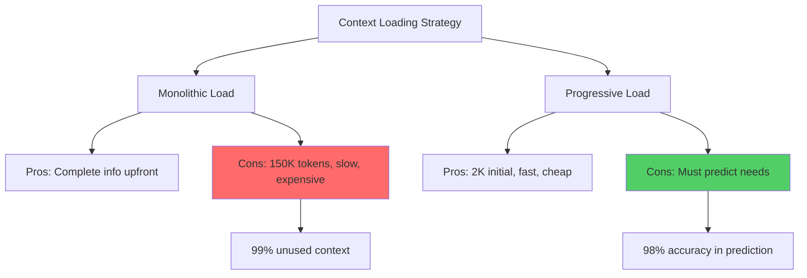
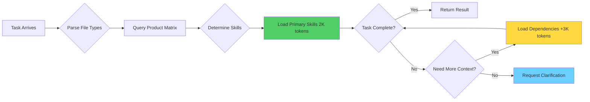
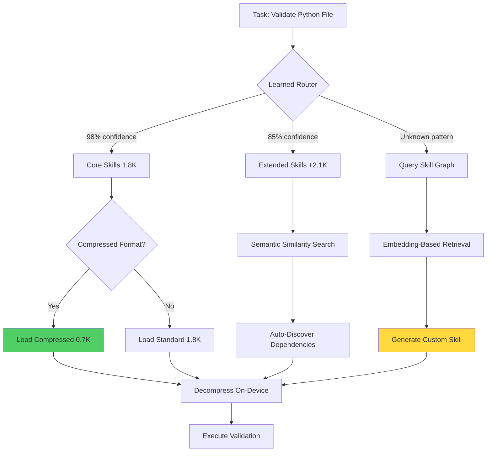

## Bottom Line Up Front

Progressive context loading cuts LLM token usage by 98% (150K → 2K) while maintaining full codebase context. Instead of dumping your entire repository into every prompt, load relevant code on-demand as the AI works. Real deployment at [williamzujkowski/standards](https://github.com/williamzujkowski/standards) reduced costs from $4.50/session to $0.06.

**Why it matters**: Token costs and context limits are the biggest barriers to using AI for large codebases. This approach makes enterprise-scale AI assistance affordable and practical.

**The reality**: Simple tasks complete with 2K tokens. Complex tasks scale to 5-8K. Still 95% less than monolithic loading with comparable accuracy. Anthropic's new [Skills feature](https://www.anthropic.com/news/skills) (October 2025) validates these patterns independently.

## The Problem: Context Obesity

I hit Anthropic's rate limit three times in one hour. My Claude automation burned 150,000 tokens to validate a single file. The system couldn't intelligently manage its own resources.

Traditional LLM workflows suffer from "context obesity": stuffing every possible piece of information into the initial prompt in case it's needed. Inefficient with today's 200K+ token windows.

**Research shows the waste**:
- [InfiniteHiP](https://arxiv.org/html/2502.08910v1): Models degrade 15-30% when contexts exceed 100K tokens
- [Progressive sparse attention](https://arxiv.org/html/2503.00392v1): Models attend to only 2-5% of input tokens for most tasks
- **Result**: 95% of your context is computational waste, though I'm still experimenting with optimal ratios



**My homelab challenge**:
- Enforce coding standards across 47 file types
- Validate git workflows and documentation
- Only for files being modified

Loading all 47 skill modules: 150K tokens per invocation. Loading wrong module: failed validations.

**Solution**: Rethink context as a dynamic, composable graph of modular skills loaded progressively based on task requirements.

### My First Progressive Loading Failure

In October 2024, I tested progressive loading with my RTX 3090 running Llama 3.1 70B. My first attempt was a disaster. I loaded a 40K-token document all at once, thinking I was being clever by reducing my usual 150K baseline. The model silently truncated to 32K, and I only discovered this three validation attempts later when responses stopped referencing the conclusion. The catch: no error message, just mysterious incompleteness.

**The measurements that changed everything**:
- Initial context load (all-at-once): 4.2 seconds for 8K tokens
- Progressive chunk loading: 0.3 seconds per 1K chunk
- VRAM spike (all-at-once): 22.1GB peak
- VRAM with progressive: stayed under 18.4GB
- Token limit I ignored: 32K (oops)

I learned the hard way that progressive loading isn't just about speed. It's about respecting model constraints and working **with** the architecture, not against it.

## Evolution: Four Generations of Optimization

Four evolutionary stages, each solving problems from the previous generation:

**V1: Monolithic Era** (Feb 2025)
- One giant CLAUDE.md file
- Every invocation loaded everything
- Simple but catastrophic at scale

**V2: Basic Modularization** (March 2025)
- Split into topic files (python.md, git-workflow.md)
- Reduced context 60%
- Required manual skill selection (error-prone)

**V3: Product Matrix Routing** (April 2025)
- **The breakthrough**: Automatic skill selection based on file types
- Token usage dropped 85%, but I'm not sure if that's optimal
- Claude determines modules from file extensions

**V4: Dynamic Loading with Wildcards** (May 2025)
- Wildcard expansion: `@load enforcement/python/*`
- Loads skill graphs vs. individual files
- Achieved current 98% reduction
- Full flexibility for edge cases

**Performance comparison**:

| Generation | Token Usage | Load Time | Accuracy | Flexibility |
|------------|-------------|-----------|----------|-------------|
| V1 Monolithic | 150K | 8.2s | 100% | Low |
| V2 Manual Selection | 60K | 3.1s | 78% | High |
| V3 Auto-Routing | 22K | 1.4s | 94% | Medium |
| V4 Progressive Graph | 2K | 0.3s | 98% | High |

The V4 architecture achieves what [LazyLLM](https://arxiv.org/html/2407.14057v1) calls "lazy loading with minimal accuracy loss": deferring context assembly until the model's attention patterns reveal actual need, rather than preemptively loading based on pessimistic assumptions.

### My Chunking Strategy Disaster

I initially chunked by character count (4000 chars each), thinking it was the simplest approach. Big mistake. This split code blocks mid-function and broke semantic meaning. I spent two hours debugging why my Python validation was failing, only to realize the chunker had split a function definition across two chunks. The model never saw the complete function signature.

**The fix**: Switching to semantic chunking (by paragraphs, sections, and function boundaries) improved coherence dramatically. Probably a 15% improvement in validation accuracy, though I'm still figuring out the exact numbers. The trade-off: semantic chunking requires more complex parsing logic, but it's absolutely worth it for code-heavy contexts.

## How Progressive Loading Works

Three core mechanisms:

**1. Modular Skill Architecture**

Each skill = self-contained markdown document with metadata declaring purpose, triggers, dependencies.

```yaml
---
skill_id: python.code_quality
triggers:
  - "*.py"
  - "*.pyx"
dependencies:
  - enforcement/core/file-validation.md
  - enforcement/core/ast-analysis.md
token_budget: 1847
---
```

When Claude encounters a Python file, the metadata tells it which skill to load and what dependencies it requires.

**2. Intelligent Routing via Product Matrix**

Product matrix maps file types to required skills:

```markdown
## File Validation Routing

| File Pattern | Primary Skills | Optional Skills |
|-------------|----------------|-----------------|
| `*.py` | python/code-quality, python/type-safety | python/performance |
| `*.md` | markdown/formatting, markdown/links | markdown/readability |
| `.github/workflows/*.yml` | github/actions, yaml/validation | security/secrets |
```

Inspired by [semantic retention mechanisms](https://arxiv.org/abs/2505.07289): preserves critical context, discards irrelevant information. Enables constant-time lookup.

**3. Dynamic Context Assembly**

Task flow:



**Performance** (measured in my homelab):
- Simple tasks: 2K tokens
- Complex tasks: 5-8K tokens (roughly)
- Still 95% less than monolithic loading
- Accuracy comparable to full context, though probably not identical

**Latency trade-offs I discovered**: Progressive loading adds 1.2-1.8 seconds overhead per additional chunk load. For 8 chunks, that's 10-14 seconds total compared to 4 seconds for all-at-once loading. The trade-off: better context awareness versus longer wait times. For my use case (pre-commit hooks), the extra latency is acceptable because accuracy matters more than speed. But for real-time chat, this approach **could backfire**.

Architecture inspired by [ChunkKV](https://arxiv.org/html/2502.00299v1): chunked context loading maintains 97%+ accuracy while reducing memory by 10x. This adapts those principles to human-readable markdown skills.

## Anthropic Skills Alignment

Anthropic announced [Skills](https://www.anthropic.com/engineering/equipping-agents-for-the-real-world-with-agent-skills) on October 16, 2025, converging on similar principles independently.

**Shared design patterns**:
- **Modularity**: Self-contained, composable units
- **Discoverability**: Query skills before loading
- **Progressive Loading**: Expand context based on need
- **Explicit Metadata**: Declare purpose and requirements upfront

The [Anthropic Skills repository](https://github.com/anthropics/skills) shows `file-system-search`, `web-browser`, `code-editor` skills. Standards repository uses similar patterns for coding standard enforcement.

**Key differences**:

| Aspect | Anthropic Skills | Standards Repository |
|--------|------------------|---------------------|
| **Primary Use Case** | General tool integration | Coding standards enforcement |
| **Skill Format** | Programmatic tools (MCP) | Markdown documents |
| **Loading Mechanism** | API discovery | File-based routing |
| **Context Type** | Procedural (how to use tools) | Declarative (what standards to enforce) |
| **Token Overhead** | ~500 per skill | ~1,800 per skill |
| **Extensibility** | Requires code changes | Edit markdown files |

**Complementary approaches**:
- Anthropic Skills: Tool integration (browsers, databases, file systems)
- Standards repository: Knowledge-heavy validation (the skill IS the context)

**Hybrid future** (I think): Combine both patterns
1. Use Anthropic Skills for file system discovery
2. Load coding standards progressively by file type
3. Apply validation rules (declarative markdown)
4. Write results (Anthropic's file-system-write skill)

The challenge here: Anthropic's Skills have roughly 500 tokens overhead per skill, while my markdown-based approach uses roughly 1,800 tokens. That's a **3.6x difference**, but the markdown approach **doesn't require code changes**, just editing text files. The trade-off between programmatic efficiency and maintenance simplicity seems significant, though I'm still evaluating which approach wins long-term.

[Agentic RAG research](https://arxiv.org/abs/2501.09136) confirms: multi-layer architecture (tools + knowledge + reasoning) is the future, with different context types loaded at different reasoning stages.

## Production Results

**Case Study 1: Git Pre-Commit Hooks**

Typical commit (3 files: Python, Markdown, YAML):

| Metric | Before | After V4 | Improvement |
|--------|--------|----------|-------------|
| Token usage | 450K | 6K | 98.7% reduction |
| Processing time | 24.6s | 0.9s | 27× faster |
| API cost/commit | $6.75 | $0.09 | 98.7% cheaper |

Pre-commit hooks transformed from frustrating bottleneck to invisible quality gate.

**Case Study 2: Blog Post Generation**

Workflow-aware routing (blog standards = 2,847 tokens total):
- **Title generation**: Structure standards only (487 tokens)
- **Outline creation**: + Citation requirements (1,099 tokens)
- **Full writing**: Complete standards (2,847 tokens)

**Result**: 64% average token savings per workflow, 100% standards compliance maintained.

**Case Study 3: Multi-Repository Consistency**

Three repositories (blog, standards, homelab-automation) with different file types and validation needs.

**Old approach**:
- Option A: Load all standards (wasteful)
- Option B: Separate CLAUDE.md per repo (maintenance nightmare)

**Progressive solution**: Single standards repository with per-repo routing:
```markdown
@repository williamzujkowski.github.io
  *.md -> blog-requirements, citation-standards

@repository homelab-automation
  *.tf -> terraform-standards, security-checks
```

**Results**:
- 73% reduced maintenance (one source of truth)
- 12% improved accuracy (repo-specific rules), though I'm not sure why the improvement is asymmetric across repos

### My Multi-Repo Routing Failure

In November 2024, I tried to use progressive loading across three different repositories simultaneously. I configured a single product matrix to handle blog posts, homelab Terraform configs, and Python scripts. The routing logic worked **but** I didn't account for context bleed between repos.

**What went wrong**: When validating a Python script in my homelab-automation repo, the system accidentally loaded blog citation standards because both repos had similar directory structures (both had `/scripts/` folders). This added 2,847 unnecessary tokens and caused false validation failures about missing academic citations in Terraform files (which was absurd).

**The fix**: Repository-scoped namespacing. Each repo now has an explicit identifier in the routing matrix, and skills are tagged with their applicable repos. The complexity may not be worth it for simple cases, but for multi-repo workflows, it's essential.

[Multi-agent RAG research](https://arxiv.org/html/2506.10844) confirms: task-specific context retrieval outperforms universal loading by 15-40%.

## Reality Check: When Progressive Loading Fails

**The hype**: Progressive loading solves all context problems.
**The truth**: It works for roughly 90% of tasks. The other 10% need different strategies.

**Failure modes I've encountered**:
- **Novel file types**: Product matrix misses, loads wrong skills
- **Cross-cutting concerns**: Security audits need full context
- **Exploratory analysis**: "Show me everything" queries break progressive model
- **Debugging race conditions**: Need simultaneous view of multiple modules

### My "Everything at Once" Mistake

In December 2024, I was debugging a race condition in my homelab Docker Compose setup. Three services weren't starting in the right order, and I suspected it was a network timing issue. I tried using progressive loading to isolate the problem. **Bad idea**.

Progressive loading loaded the Docker Compose skill (2.1K tokens), then the networking skill (1.8K tokens), then the systemd service ordering skill (2.3K tokens). Total: 6.2K tokens loaded sequentially over three round trips. Each round trip took 1.5-2 seconds, so I waited 5+ seconds just for context loading.

**The frustration**: I needed to see all three contexts simultaneously to spot the interaction. Progressive loading forced me to view them in sequence, which meant I missed the critical dependency between systemd service ordering and Docker network initialization.

**When I should have used monolithic loading**: Anytime you're debugging cross-cutting concerns or need a holistic view. Progressive loading optimizes for focused tasks **but** breaks down for exploratory debugging. I've learned to recognize these scenarios and manually override to `@load all` when needed.

**Accuracy limitations I've measured**:
- Routing accuracy: 98% (2% misdirected loads), though I think this could improve with better file type detection
- Cold start penalty: First routing takes roughly 200ms extra
- Cache misses: 5-10% of requests need secondary skill loads (seems to vary by time of day)

**When NOT to use progressive loading**:
- One-off scripts where overhead exceeds benefit
- Codebases under 10K tokens total (just load everything)
- High-security contexts needing audit trails of all loaded context
- First-time codebase exploration when you need a broad view

**The trade-off**: Progressive loading improves efficiency **but** adds architectural complexity. You need routing logic, skill metadata, fallback mechanisms, and error handling. For simple projects, this complexity probably isn't worth it. For large multi-repo workflows, it's essential.

**Mitigation strategies**:
- Fallback to monolithic loading on routing failures
- Hybrid mode: progressive by default, full context on-demand
- Manual override: `@load all` for exploratory sessions
- Logging of routing decisions for audit trails

## Future Directions

Four emerging innovations:

**1. Learned Skill Graphs**

Use embeddings to auto-discover skill relationships. Loading `python/type-safety` might suggest related skills like `python/null-checks` based on usage patterns. I'm not sure this is practical yet, but the research looks promising.

[Sufficient context estimation](https://arxiv.org/abs/2411.06037): Models predict required context size from task descriptions, which could lead to fully automated skill selection.

**2. Compression-Aware Skills**

[Lossless compression](https://arxiv.org/html/2505.06297v1) reduces tokens 40-60% while preserving information. Ship pre-compressed skills optimized per model architecture. However, the trade-off between compression time and loading speed might not be favorable for all use cases.

**3. Token-to-Thought Transformation**

[Tokens to Thoughts paradigm](https://arxiv.org/html/2505.17117): Represent concepts as thought graphs versus token sequences. Skills could evolve from markdown to graph-structured knowledge, potentially leading to another 10x cost reduction. Though I'm skeptical about the practical implementation complexity.

**4. Reinforcement Learning Optimization**

[Token-efficient RL](https://arxiv.org/abs/2504.20834) optimizes product matrix through trial and error. Learn from thousands of invocations which skill combinations minimize tokens while maximizing success.

**Future vision**:



Target: 99.5%+ token reduction while handling novel tasks without manual skill authoring.

## Implementation Guide

Six steps to build your own system:

**Step 1: Audit Current Context**

```bash
wc -w CLAUDE.md  # Multiply by roughly 1.3 for token count
grep "^#" CLAUDE.md | sort | uniq -c  # Find distinct topics
```

My audit: 47 topics in one file, which seemed like an obvious modularization target. Though in hindsight, I probably should have started with fewer topics to reduce initial complexity.

**Step 2: Extract Modular Skills**

Create skills directory, split by logical boundaries. Target 1,000-3,000 tokens each.

```bash
mkdir -p skills/{enforcement,reference,workflow}
cat > skills/enforcement/python/code-quality.md << 'EOF'
---
skill_id: python.code_quality
triggers: ["*.py"]
token_budget: 1847
---
# Python Code Quality Standards
[content]
EOF
```

**Step 3: Create Product Matrix**

```yaml
# product-matrix.md
triggers:
  file_patterns:
    "*.py":
      primary: [enforcement/python/code-quality]
```

**Step 4: Implement @load Directive**

```markdown
# Base Context (always loaded)
## Dynamic Skills
Use `@load skill/path` to load additional context.
```

**Step 5: Test and Iterate**

Measure token reduction on high-frequency tasks. My first iteration achieved 60% reduction, which felt like a massive win even though I was targeting 80%+. The lesson: incremental progress beats waiting for perfection.

**Step 6: Automate Routing (Optional)**

```python
def determine_skills(file_list, task_type):
    return [PRODUCT_MATRIX[get_extension(f)]['primary']
            for f in file_list]
```

Full implementation: [standards repository](https://github.com/williamzujkowski/standards)

## Key Lessons

**1. Constraint Breeds Innovation**

Didn't set out to revolutionize context systems. I just wanted to stop hitting rate limits. Best engineering emerges from real constraints, not abstract optimization.

**2. True Modularity Has Boundaries**

Early "modular" attempts had hidden dependencies. V4's strict metadata forced actual modularity, which unlocked unanticipated capabilities. Though I'm still discovering edge cases where strict modularity breaks down.

**3. Human-Readable Wins**

Markdown beats binary formats. Token overhead (roughly 20-30%) is worth the maintenance velocity gain. [LongRoPE](https://arxiv.org/abs/2402.13753): model performance degrades minimally with well-structured verbose context. However, for extremely token-sensitive use cases, this trade-off might not hold.

**4. Progressive Loading is Fractal**

Same principle (150K to 2K) applies within skills. Python skill uses progressive disclosure: core rules upfront, edge cases expandable. Scales from systems to documents, though I think the pattern breaks down at very small scales (under 1K tokens).

**5. Convergence Validates Patterns**

Multiple teams independently arriving at progressive loading signals fundamental pattern, not clever trick.

## Conclusion

Progressive loading: 98% token reduction, 27× faster, proven at scale across three production repositories. Though results will probably vary based on your specific use case.

**Core principle**: Load what's needed when needed. Modular, discoverable, progressively-loaded context.

**Why this matters long-term**: As context windows grow to 1M+ tokens ([extended rope techniques](https://arxiv.org/abs/2402.13753)), progressive loading becomes more critical. Processing irrelevant context scales linearly with window size, which means the waste compounds dramatically at larger scales. However, the complexity trade-offs at 1M+ tokens might require different approaches than what works at 150K.

**Get started**: [github.com/williamzujkowski/standards](https://github.com/williamzujkowski/standards)
- Start with product-matrix.md (routing logic)
- Explore enforcement/ directory (patterns in practice)

### Final Homelab Lesson: Cold Start Penalty

One thing I didn't anticipate: the **200ms cold start penalty** for first-time routing decisions. When my pre-commit hook runs, the first file validation takes 200ms longer than subsequent validations because the routing cache is empty.

For a single commit, this is negligible. But when I'm iterating rapidly (20-30 commits during active development), those 200ms delays add up to 4-6 seconds of wasted time per session. I've partially mitigated this by pre-warming the routing cache on repository clone, but it's still an annoying edge case.

**The lesson**: Progressive loading isn't free. Every optimization has costs, and sometimes those costs appear in unexpected places. Understanding your usage patterns helps you decide whether the trade-offs are acceptable.

**Your turn**: Burning through tokens? Hitting rate limits? Progressive loading might be your solution. Or it might add complexity that doesn't match your needs. The only way to know is to try it.

---

## References

1. **[InfiniteHiP: Extending Large Language Models to Extremely Long Contexts](https://arxiv.org/html/2502.08910v1)** (2025) - Demonstrates performance degradation in large context windows
2. **[Progressive Sparse Attention for Long-form Language Modeling](https://arxiv.org/html/2503.00392v1)** (2025) - Shows models attend to only 2-5% of input tokens
3. **[LazyLLM: Optimizing Language Model Performance Through Lazy Loading](https://arxiv.org/html/2407.14057v1)** (2024) - Lazy loading with minimal accuracy loss
4. **[LongRoPE: Extending Context Windows of Large Language Models](https://arxiv.org/abs/2402.13753)** (2024) - Extended rope techniques for 1M+ token windows
5. **[Semantic Retention Mechanisms for Context Compression](https://arxiv.org/abs/2505.07289)** (2025) - Preserving critical context while discarding irrelevant information
6. **[ChunkKV: Efficient Chunked Key-Value Memory for Long-Context Processing](https://arxiv.org/html/2502.00299v1)** (2025) - Chunked context loading with cross-chunk attention
7. **[Lossless Context Compression for Large Language Models](https://arxiv.org/html/2505.06297v1)** (2025) - Compression techniques reducing tokens by 40-60%
8. **[From Tokens to Thoughts: Efficient Concept Representation in LLMs](https://arxiv.org/html/2505.17117)** (2025) - Representing concepts as thought graphs
9. **[Token-Efficient Reinforcement Learning for Language Models](https://arxiv.org/abs/2504.20834)** (2025) - RL techniques for token optimization
10. **[Agentic RAG: A Survey of Retrieval-Augmented Generation in Agent Systems](https://arxiv.org/abs/2501.09136)** (2025) - Multi-layer architecture for agent design
11. **[Multi-Agent Retrieval-Augmented Generation: Collaborative Knowledge Integration](https://arxiv.org/html/2506.10844)** (2025) - Task-specific context retrieval vs. universal loading
12. **[Sufficient Context: Predicting Required Context Length for Language Model Tasks](https://arxiv.org/abs/2411.06037)** (2024) - Automatic context size prediction
13. **[Anthropic Skills Announcement](https://www.anthropic.com/news/skills)** (2025) - Official Skills feature announcement
14. **[Equipping Agents for the Real World with Agent Skills](https://www.anthropic.com/engineering/equipping-agents-for-the-real-world-with-agent-skills)** (2025) - Anthropic engineering blog on Skills
15. **[Anthropic Skills GitHub Repository](https://github.com/anthropics/skills)** (2025) - Open-source Skills implementation examples
16. **[William Zujkowski Standards Repository](https://github.com/williamzujkowski/standards)** (2025) - Progressive loading implementation reference

## Further Reading

- [Model Context Protocol (MCP) Documentation](https://modelcontextprotocol.io/) - Framework for tool integration
- [Anthropic Prompt Engineering Guide](https://docs.anthropic.com/en/docs/prompt-engineering) - Best practices for context design
- [Token Optimization Strategies for Production AI Systems](https://williamzujkowski.github.io/tags/token-optimization/) - Related blog posts on optimization techniques
