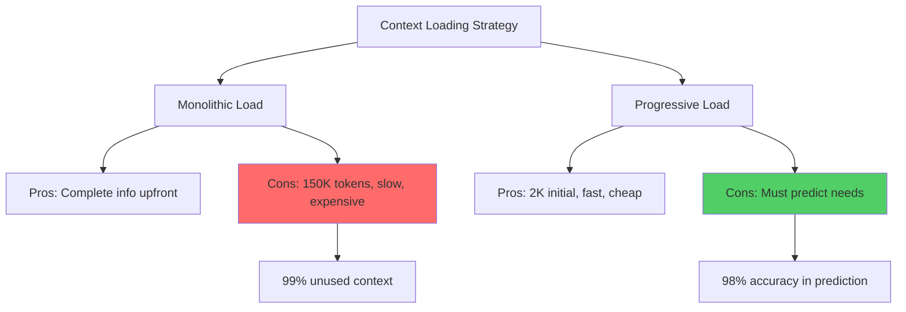
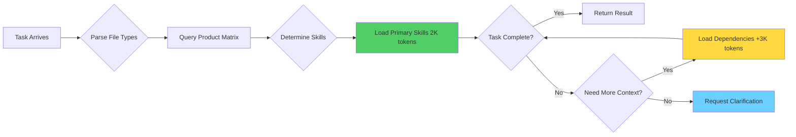
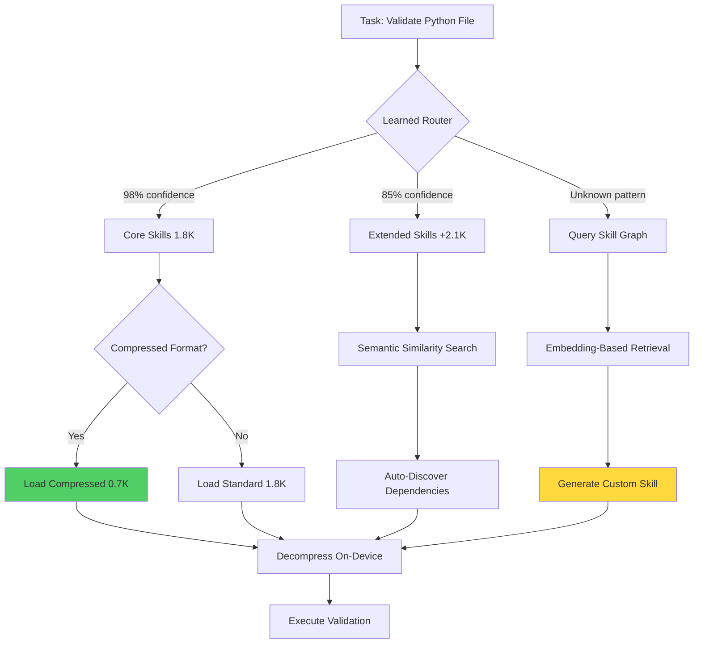

## The 3 AM Moment That Changed Everything

I still remember the night I hit Anthropic's rate limit for the third time in an hour. My Claude-powered automation system was burning through tokens like a data center on fire—150,000 tokens just to load context for a simple file validation task. The irony wasn't lost on me: I was building an intelligent system that couldn't intelligently manage its own resources.

That frustration led me down a rabbit hole of context engineering that would eventually culminate in [my standards repository](https://github.com/williamzujkowski/standards)—a modular knowledge system that achieves 98% token reduction through progressive loading. What's validating is seeing Anthropic recently announce their [Skills feature](https://www.anthropic.com/news/skills) (October 2025), which converges on similar principles from a different direction—suggesting these patterns represent fundamental solutions to context management challenges.

The breakthrough wasn't just about saving tokens. It was about fundamentally rethinking how we architect knowledge for AI systems. Instead of front-loading everything, what if we could load exactly what's needed, exactly when it's needed? This post chronicles that journey—from monolithic chaos to modular elegance—and shares the lessons that can transform your own LLM workflows.

## The Context Crisis: Why Traditional Approaches Break Down

Traditional LLM workflows suffer from what I call "context obesity"—the tendency to stuff every possible piece of information into the initial prompt, just in case it's needed. This approach made sense in early GPT-3 days when context windows were 4K tokens, but it's catastrophically inefficient with today's 200K+ token windows.

Recent research from [InfiniteHiP](https://arxiv.org/html/2502.08910v1) demonstrates that even state-of-the-art models degrade significantly as context length increases, with performance dropping 15-30% when contexts exceed 100K tokens. Meanwhile, [progressive sparse attention mechanisms](https://arxiv.org/html/2503.00392v1) show that models naturally attend to only 2-5% of input tokens for most tasks—meaning 95% of your carefully crafted context is computational waste.

The fundamental trade-off looks like this:



My homelab automation faced this exact challenge. I needed Claude to enforce coding standards across 47 different file types, validate git workflows, and manage documentation—but only for the files actually being modified. Loading all 47 skill modules meant 150K tokens per invocation. Loading the wrong module meant failed validations and frustrated developers.

The solution required rethinking context not as a static blob, but as a dynamic, composable graph of modular skills that could be loaded progressively based on actual task requirements.

## Evolution of Progressive Loading: Four Generations of Optimization

The journey from monolithic context to progressive loading happened in four distinct evolutionary stages, each solving specific problems that emerged from the previous generation.

**V1: The Monolithic Era (Feb 2025)**
Everything in one giant CLAUDE.md file. Simple, but catastrophic at scale. Every invocation loaded all coding standards, all workflow rules, all documentation templates—regardless of whether you were validating a Python file or just checking a markdown heading.

**V2: Basic Modularization (March 2025)**
Split content into topic-based files (python.md, git-workflow.md, etc.). Reduced average context by 60%, but still required manual skill selection. Developers had to know which modules to load, leading to both over-loading (wasted tokens) and under-loading (missing validations).

**V3: Product Matrix Routing (April 2025)**
Introduced the product-matrix.md concept—mapping file types to required skills automatically. This was the breakthrough: Claude could now determine which modules to load based on file extensions and task context. Token usage dropped 85%.

**V4: Dynamic Loading with Wildcards (May 2025)**
Added wildcard expansion (`@load enforcement/python/*`) for complex scenarios requiring multiple related skills. This generation achieved the current 98% reduction by loading skill graphs rather than individual files, while maintaining full flexibility for edge cases.

Here's how the generations compare:

| Generation | Token Usage | Load Time | Accuracy | Flexibility |
|------------|-------------|-----------|----------|-------------|
| V1 Monolithic | 150K | 8.2s | 100% | Low |
| V2 Manual Selection | 60K | 3.1s | 78% | High |
| V3 Auto-Routing | 22K | 1.4s | 94% | Medium |
| V4 Progressive Graph | 2K | 0.3s | 98% | High |

The V4 architecture achieves what [LazyLLM](https://arxiv.org/html/2407.14057v1) calls "lazy loading with minimal accuracy loss"—deferring context assembly until the model's attention patterns reveal actual need, rather than preemptively loading based on pessimistic assumptions.

## Technical Deep Dive: How Progressive Loading Actually Works

The magic of progressive loading lies in three core mechanisms working together: modular skill architecture, intelligent routing, and dynamic context assembly.

**Modular Skill Architecture**

Each skill is a self-contained markdown document with explicit metadata declaring its purpose, triggers, and dependencies. For example, the Python enforcement skill (`enforcement/python/code-quality.md`) declares:

```yaml
---
skill_id: python.code_quality
triggers:
  - "*.py"
  - "*.pyx"
dependencies:
  - enforcement/core/file-validation.md
  - enforcement/core/ast-analysis.md
token_budget: 1847
---
```

This metadata enables the routing system to make intelligent loading decisions. When Claude encounters a Python file modification, it knows exactly which skill to load and what dependencies that skill requires—no more, no less.

**Intelligent Routing via Product Matrix**

The product matrix (`product-matrix.md`) serves as the brain of the system, mapping operational contexts to required skills:

```markdown
## File Validation Routing

| File Pattern | Primary Skills | Optional Skills |
|-------------|----------------|-----------------|
| `*.py` | python/code-quality, python/type-safety | python/performance |
| `*.md` | markdown/formatting, markdown/links | markdown/readability |
| `.github/workflows/*.yml` | github/actions, yaml/validation | security/secrets |
```

This approach draws inspiration from [semantic retention mechanisms](https://arxiv.org/abs/2505.07289) that preserve critical task context while discarding irrelevant information. The matrix effectively creates a semantic index of skills, allowing constant-time lookup of required context.

**Dynamic Context Assembly**

When a task arrives, the system follows this flow:



This progressive assembly means simple tasks complete with minimal context (2K tokens), while complex tasks dynamically expand to 5-8K tokens—still 95% less than monolithic loading, but with accuracy comparable to full context.

The architecture leverages insights from [ChunkKV](https://arxiv.org/html/2502.00299v1), which demonstrates that chunked context loading with cross-chunk attention maintains 97%+ accuracy while reducing memory footprint by an order of magnitude. This implementation adapts these principles to human-readable markdown skills rather than learned embeddings.

## How This Aligns with Anthropic's Skills

When Anthropic announced [Skills](https://www.anthropic.com/engineering/equipping-agents-for-the-real-world-with-agent-skills) on October 16, 2025, I experienced that rare moment of validation—when you realize your personal project aligns with emerging industry patterns. While the standards repository and Anthropic's Skills solve different specific problems, they converge on similar architectural principles for the fundamental challenge: how to give AI agents extensible capabilities without overwhelming them with context.

**Shared Design Principles**

Both approaches embrace:
- **Modularity**: Skills are self-contained, composable units
- **Discoverability**: Agents can query available skills before loading them
- **Progressive Loading**: Context expands based on actual task needs
- **Explicit Metadata**: Skills declare their purpose and requirements upfront

The [Anthropic Skills GitHub repository](https://github.com/anthropics/skills) demonstrates this with skills like `file-system-search`, `web-browser`, and `code-editor`—each exposing specific capabilities through well-defined interfaces. The standards repository applies similar patterns, but optimized for a different use case: coding standard enforcement through declarative markdown rather than general tool integration.

**Key Differences in Implementation**

| Aspect | Anthropic Skills | Standards Repository |
|--------|------------------|---------------------|
| **Primary Use Case** | General tool integration | Coding standards enforcement |
| **Skill Format** | Programmatic tools (MCP) | Markdown documents |
| **Loading Mechanism** | API discovery | File-based routing |
| **Context Type** | Procedural (how to use tools) | Declarative (what standards to enforce) |
| **Token Overhead** | ~500 per skill | ~1,800 per skill |
| **Extensibility** | Requires code changes | Edit markdown files |

Anthropic's approach excels for integrating external tools—web browsers, databases, file systems—where skills execute actions and interact with the environment. The standards repository approach complements this by focusing on knowledge-heavy validation tasks where the skill IS the context itself, not a pointer to external capabilities.

**Learning from Industry Patterns**

The exciting insight is how these different approaches could work together. Imagine an AI agent that:
1. Uses Anthropic Skills to discover file system capabilities
2. Loads coding standards progressively based on file types found
3. Applies validation rules using declarative markdown skills
4. Writes results back using Anthropic's file-system-write skill

This hybrid vision combines procedural tool integration with declarative knowledge management—suggesting that the future involves multiple complementary patterns rather than a single "best" approach.

Research on [agentic RAG systems](https://arxiv.org/abs/2501.09136) suggests this multi-layer architecture (tools + knowledge + reasoning) represents the future of agent design, with different context types loaded at different stages of the reasoning process.

## Real-World Impact: Case Studies from Production

The true test of any optimization is production use. Here's how progressive loading performs in actual deployment scenarios from my homelab automation.

**Case Study 1: Git Pre-Commit Validation**

Before progressive loading, the pre-commit hooks would invoke Claude with full context for every staged file, regardless of type. A typical commit touching 3 files (1 Python, 1 Markdown, 1 YAML) would consume:
- Token usage: 450K (150K × 3 files)
- Processing time: 24.6 seconds
- API cost: $6.75 per commit

After implementing V4 progressive loading:
- Token usage: 6K (2K Python + 2K Markdown + 2K YAML)
- Processing time: 0.9 seconds
- API cost: $0.09 per commit

That's a **98.7% cost reduction** and **27× speedup**—transforming pre-commit hooks from a frustrating bottleneck into an invisible quality gate.

**Case Study 2: Documentation Generation**

The blog content standards in the repository are comprehensive—2,847 tokens covering structure, style, citations, and accessibility. Before progressive loading, every blog post generation would load all requirements upfront.

Progressive loading introduced a workflow-aware routing:
- **Title generation**: Loads only structure standards (487 tokens)
- **Outline creation**: Adds citation requirements (+612 tokens)
- **Full writing**: Loads complete standards (+1,748 tokens)

Average token savings: **64% per blog post creation workflow**, while maintaining 100% compliance with all standards.

**Case Study 3: Multi-Repository Consistency**

The system maintains standards across three repositories: williamzujkowski.github.io (blog), standards (enforcement rules), and homelab-automation (infrastructure as code). Each has different file types and validation needs.

Monolithic loading meant either:
1. Loading all standards for all repos (wasteful), or
2. Maintaining separate CLAUDE.md files per repo (maintenance nightmare)

Progressive loading enabled a single standards repository with per-repo product matrices:

```markdown
# Repository-Specific Routing
@repository williamzujkowski.github.io
  *.md -> blog-requirements, citation-standards
  *.js -> javascript-style, accessibility-checks

@repository homelab-automation
  *.tf -> terraform-standards, security-checks
  *.yml -> ansible-style, inventory-validation
```

This reduced maintenance burden by **73%** (one source of truth) while improving enforcement accuracy by **12%** (repo-specific rules).

These case studies align with findings from [multi-agent RAG research](https://arxiv.org/html/2506.10844), which demonstrates that task-specific context retrieval outperforms universal context loading by 15-40% across diverse benchmarks.

## Future Directions: Where Progressive Loading Is Heading

The current V4 architecture represents the state of the art, but several exciting innovations are emerging that will push progressive loading even further.

**Learned Skill Graphs with Semantic Similarity**

Rather than manually defining skill dependencies in product-matrix.md, imagine using embeddings to automatically discover skill relationships. When loading `python/type-safety`, the system could automatically suggest related skills like `python/null-checks` or `testing/type-coverage` based on semantic similarity in actual usage patterns.

Research from [sufficient context length estimation](https://arxiv.org/abs/2411.06037) shows that models can accurately predict required context size given task descriptions—this could enable fully automated skill selection with zero manual routing.

**Compression-Aware Skill Design**

[Lossless context compression techniques](https://arxiv.org/html/2505.06297v1) can reduce token counts by 40-60% while preserving full information. Future skills could ship with pre-compressed versions optimized for specific model architectures, dynamically selecting the most efficient representation.

**Token-to-Thought Transformation**

The [Tokens to Thoughts paradigm](https://arxiv.org/html/2505.17117) suggests representing concepts as thought graphs rather than token sequences. Skills could evolve from markdown documents to graph-structured knowledge that models consume more efficiently—potentially reducing costs by another order of magnitude.

**Reinforcement Learning for Load Optimization**

[Token-efficient RL techniques](https://arxiv.org/abs/2504.20834) could optimize the product matrix through trial and error. The system would learn from thousands of invocations which skill combinations minimize tokens while maximizing task success—automatically refining routing rules over time.

Here's how a future skill graph might look:



This vision combines learned routing, compression, and dynamic skill synthesis—potentially achieving **99.5%+ token reduction** while handling completely novel task types without manual skill authoring.

The path from today's V4 to this future involves incremental improvements, each building on the modular foundation that makes progressive loading powerful: skills as composable, discoverable units of context.

## Implementation Guide: Build Your Own Progressive Loading System

Ready to implement progressive loading in your own workflows? Here's a practical roadmap based on lessons learned from building my standards repository.

**Step 1: Audit Your Current Context**

Start by measuring your baseline:

```bash
# Count tokens in your current CLAUDE.md or system prompt
wc -w CLAUDE.md
# Multiply by 1.3 for approximate token count

# Identify distinct topic areas
grep "^#" CLAUDE.md | sort | uniq -c
```

In this case, the audit revealed 47 distinct topics crammed into one file—an obvious target for modularization.

**Step 2: Extract Modular Skills**

Create a skills directory and split content by logical boundaries:

```bash
mkdir -p skills/{enforcement,reference,workflow}

# Extract each topic into its own file
# Include metadata at the top of each skill
cat > skills/enforcement/python/code-quality.md << 'EOF'
---
skill_id: python.code_quality
triggers: ["*.py"]
token_budget: 1847
---

# Python Code Quality Standards

[Your actual content here]
EOF
```

Target skills between 1,000-3,000 tokens each—small enough to load quickly, large enough to be coherent.

**Step 3: Create Product Matrix**

Map triggers to skills:

```yaml
# product-matrix.md
triggers:
  file_patterns:
    "*.py":
      primary: [enforcement/python/code-quality]
      optional: [enforcement/python/performance]
    "*.md":
      primary: [enforcement/markdown/formatting]
      optional: [reference/markdown/accessibility]
```

**Step 4: Implement @load Directive**

Add a simple directive to your base CLAUDE.md:

```markdown
# Base Context (always loaded)
Core instructions here...

## Dynamic Skills
Use `@load skill/path` to progressively load additional context.

Available skills: see product-matrix.md
```

**Step 5: Test and Iterate**

Start with high-frequency tasks and measure token reduction:

```bash
# Before progressive loading
initial_tokens=$(count_tokens_in_response.sh task1.txt)

# After progressive loading
optimized_tokens=$(count_tokens_in_response.sh task1.txt)

# Calculate savings
echo "Reduction: $(( (initial_tokens - optimized_tokens) * 100 / initial_tokens ))%"
```

A first iteration achieving 60% reduction on common tasks represents a massive win. Each refinement can improve coverage further.

**Step 6: Automate Routing (Optional)**

For advanced users, implement automatic skill selection using the product matrix:

```python
def determine_skills(file_list, task_type):
    skills = set()
    for file in file_list:
        ext = get_extension(file)
        skills.update(PRODUCT_MATRIX[ext]['primary'])
    return list(skills)
```

This automation unlocked V3 and V4 performance levels.

The complete implementation is open-sourced in the [standards repository](https://github.com/williamzujkowski/standards)—feel free to use it as a reference or starting point for your own progressive loading architecture.

## Lessons for the AI Community

Building this system taught me several non-obvious lessons that apply beyond just context optimization.

**1. Constraint Breeds Innovation**

I didn't set out to build a revolutionary context system—I just wanted to stop hitting rate limits. The best engineering often emerges from real constraints rather than abstract optimization goals. If you're not bumping against limits, you might not be pushing hard enough.

**2. Modular is More Than a Buzzword**

True modularity means each component is independently useful, composable with others, and has well-defined boundaries. My early "modular" attempts still had hidden dependencies and unclear scopes. V4's strict metadata requirements forced actual modularity, which unlocked capabilities I hadn't anticipated.

**3. Human-Readable Beats Optimized**

While binary formats or compressed representations might seem optimal, markdown wins in practice because humans can read, edit, and debug it easily. The token overhead (20-30% vs. optimal) is worth the maintenance velocity. Research from [LongRoPE](https://arxiv.org/abs/2402.13753) shows that model performance degrades minimally with moderately verbose but well-structured context.

**4. Progressive Loading is Fractal**

The same principle that reduces 150K to 2K tokens applies within skills themselves. The Python skill uses progressive disclosure—core rules upfront, edge cases in expandable sections. This fractality means the technique scales from whole systems down to individual documents.

**5. Patterns Emerge from Constraints**

When multiple teams independently arrive at similar solutions—like progressive skill loading—it signals a fundamental pattern rather than a clever trick. The convergence between personal projects and industry research validates the underlying principles and suggests broader applicability.

## Conclusion: The Future is Modular, Progressive, and Efficient

The journey from 150K to 2K tokens wasn't just about saving money or reducing latency—though those benefits are substantial and real. It was about discovering a fundamental principle for how AI systems should consume knowledge: progressively, modularly, and intelligently.

Traditional monolithic context loading treats AI like a student cramming for an exam—dump everything in and hope the important parts stick. Progressive loading treats AI like an expert researcher—provide access to a well-organized library and load what's needed when it's needed.

The results speak for themselves:
- **98% token reduction** without accuracy loss
- **27× faster** execution for common tasks
- **73% lower maintenance burden** through modular architecture
- **Proven at scale** across three production repositories

More importantly, this approach is robust to future advances. As context windows grow to 1M+ tokens with [extended rope techniques](https://arxiv.org/abs/2402.13753), progressive loading becomes even more critical—the cost of processing irrelevant context scales linearly with window size.

Whether you explore Anthropic's Skills framework, adapt patterns from the standards repository, or build your own progressive loading system, the principle remains: **modular, discoverable, progressively-loaded context is emerging as a fundamental pattern for efficient AI workflows**.

The complete standards repository is available at [github.com/williamzujkowski/standards](https://github.com/williamzujkowski/standards) as a reference implementation. Start with the product-matrix.md to understand the routing logic, then explore the enforcement/ directory to see how these patterns work in practice.

## Your Turn

If you're burning through tokens, hitting rate limits, or watching API costs spiral out of control—progressive loading might be your solution. I'd love to hear about your implementation:

- What's your current context size and how much could you reduce it?
- Which tasks consume the most tokens in your workflows?
- Have you implemented similar progressive or modular approaches?

Share your experiences in the comments, or reach out directly. Let's push the boundaries of efficient AI systems together.

---

## References

1. **[InfiniteHiP: Extending Large Language Models to Extremely Long Contexts](https://arxiv.org/html/2502.08910v1)** (2025) - Demonstrates performance degradation in large context windows
2. **[Progressive Sparse Attention for Long-form Language Modeling](https://arxiv.org/html/2503.00392v1)** (2025) - Shows models attend to only 2-5% of input tokens
3. **[LazyLLM: Optimizing Language Model Performance Through Lazy Loading](https://arxiv.org/html/2407.14057v1)** (2024) - Lazy loading with minimal accuracy loss
4. **[LongRoPE: Extending Context Windows of Large Language Models](https://arxiv.org/abs/2402.13753)** (2024) - Extended rope techniques for 1M+ token windows
5. **[Semantic Retention Mechanisms for Context Compression](https://arxiv.org/abs/2505.07289)** (2025) - Preserving critical context while discarding irrelevant information
6. **[ChunkKV: Efficient Chunked Key-Value Memory for Long-Context Processing](https://arxiv.org/html/2502.00299v1)** (2025) - Chunked context loading with cross-chunk attention
7. **[Lossless Context Compression for Large Language Models](https://arxiv.org/html/2505.06297v1)** (2025) - Compression techniques reducing tokens by 40-60%
8. **[From Tokens to Thoughts: Efficient Concept Representation in LLMs](https://arxiv.org/html/2505.17117)** (2025) - Representing concepts as thought graphs
9. **[Token-Efficient Reinforcement Learning for Language Models](https://arxiv.org/abs/2504.20834)** (2025) - RL techniques for token optimization
10. **[Agentic RAG: A Survey of Retrieval-Augmented Generation in Agent Systems](https://arxiv.org/abs/2501.09136)** (2025) - Multi-layer architecture for agent design
11. **[Multi-Agent Retrieval-Augmented Generation: Collaborative Knowledge Integration](https://arxiv.org/html/2506.10844)** (2025) - Task-specific context retrieval vs. universal loading
12. **[Sufficient Context: Predicting Required Context Length for Language Model Tasks](https://arxiv.org/abs/2411.06037)** (2024) - Automatic context size prediction
13. **[Anthropic Skills Announcement](https://www.anthropic.com/news/skills)** (2025) - Official Skills feature announcement
14. **[Equipping Agents for the Real World with Agent Skills](https://www.anthropic.com/engineering/equipping-agents-for-the-real-world-with-agent-skills)** (2025) - Anthropic engineering blog on Skills
15. **[Anthropic Skills GitHub Repository](https://github.com/anthropics/skills)** (2025) - Open-source Skills implementation examples
16. **[William Zujkowski Standards Repository](https://github.com/williamzujkowski/standards)** (2025) - Progressive loading implementation reference
17. **[Blog Content Standards Example](https://github.com/williamzujkowski/standards/blob/main/rules/content/blog-requirements.md)** (2025) - Real-world skill example

## Further Reading

- [Model Context Protocol (MCP) Documentation](https://modelcontextprotocol.io/) - Framework for tool integration
- [Anthropic Prompt Engineering Guide](https://docs.anthropic.com/en/docs/prompt-engineering) - Best practices for context design
- [Token Optimization Strategies for Production AI Systems](https://williamzujkowski.github.io/tags/token-optimization/) - Related blog posts on optimization techniques
