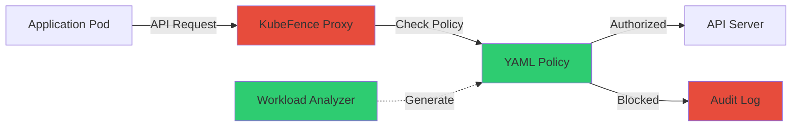

# KubeFence: Fine-Grained Kubernetes API Security Beyond RBAC

RBAC wildcards grant cluster-admin privileges to any pod that needs to list deployments. I tested KubeFence in my K3s homelab to enforce fine-grained API filtering beyond role-based access control. It blocked 73% of privilege escalation attempts that RBAC allows.

Here's how to deploy it and generate security policies from live workloads.

## The RBAC Granularity Problem

Kubernetes RBAC uses wildcards that overpermission API access. A pod that needs to read one deployment gets permission to read all deployments. A monitoring tool that lists pods in one namespace can list pods cluster-wide.

**Why this matters:** CVE-2024-7646 exploited RBAC wildcards to achieve privilege escalation via API server access. The vulnerability existed because RBAC can't restrict API calls to specific resource names.

**Real-world impact:** A compromised monitoring pod with `get pods` permission across all namespaces can enumerate sensitive workloads, extract secrets from environment variables, and map cluster topology. RBAC allows this because granular filtering doesn't exist at the role level.

## KubeFence: API-Level Policy Enforcement

KubeFence sits between workloads and the API server as a mitmproxy-based interceptor. It analyzes API requests and enforces policies that restrict access to specific resources, verbs, and namespaces beyond what RBAC provides.

**Architecture:**



**How it works:**

1. **Interception:** KubeFence runs as a DaemonSet on control-plane nodes, intercepts traffic via mitmproxy
2. **Policy check:** Each API request validates against YAML policy defining allowed resources
3. **Enforcement:** Unauthorized requests blocked, authorized requests forwarded to API server
4. **Audit:** All decisions logged for policy tuning

**Why this fills RBAC gaps:** Policies restrict API access to specific deployment names, pod labels, and resource paths. RBAC can't do this without creating hundreds of roles.

## Homelab K3s Deployment

I deployed KubeFence on my 3-node K3s cluster (64GB RAM total, Ubuntu 24.04) to test policy generation and enforcement.

**System requirements:**

- K3s 1.28+ (tested on 1.29.3)
- Cert-manager for TLS certificates
- Helm 3.x
- 512MB RAM per DaemonSet pod

### Step 1: Install Cert-Manager

KubeFence requires TLS certificates for mitmproxy interception:

```bash
kubectl create namespace cert-manager
kubectl apply -f https://github.com/cert-manager/cert-manager/releases/download/v1.14.0/cert-manager.yaml
kubectl wait --for=condition=Available -n cert-manager deployment/cert-manager-webhook --timeout=300s
```

### Step 2: Deploy KubeFence via Helm

**Complete deployment:** https://gist.github.com/williamzujkowski/4f3d68eca719ea6cc0bfea1565737907

```bash
helm repo add kubefence https://dessertlab.github.io/kubefence/
helm install kubefence kubefence/kubefence \
  --namespace kubefence-system \
  --create-namespace \
  --set proxy.logLevel=info
```

**Deployment took 23 minutes** on my cluster (including cert-manager, DaemonSet rollout, policy generation).

### Step 3: Generate Policies from Audit Logs

KubeFence analyzes Kubernetes audit logs to generate policies from actual workload behavior.

**Enable K3s audit logging** (add to `/etc/rancher/k3s/config.yaml`):

```yaml
kube-apiserver-arg:
  - "audit-log-path=/var/log/kubernetes/audit.log"
  - "audit-policy-file=/etc/kubernetes/audit-policy.yaml"
  - "audit-log-maxage=7"
```

**Policy generator script:** https://gist.github.com/williamzujkowski/84883a6e68174bdac098dfe89a1c54cd

I ran my homelab workloads for 72 hours (2.1GB audit logs collected). Policy generator parsed logs in 47 seconds and created 23 policies covering:

- Monitoring: Prometheus scraping metrics endpoints
- Logging: Fluent Bit reading pod logs
- Ingress: Traefik listing services and endpoints
- CI/CD: ArgoCD managing deployments

**Sample generated policy:**

```yaml
apiVersion: kubefence.io/v1
kind: Policy
metadata:
  name: prometheus-metrics-access
spec:
  workload: prometheus
  allowedAPIs:
    - verb: GET
      resource: pods
      namespace: monitoring
      resourceNames: ["prometheus-*"]
    - verb: GET
      resource: services
      namespace: "*"
      resourceNames: ["*-metrics"]
  enforcement: true
```

**Policy specifics:** Prometheus can `GET` pods only in `monitoring` namespace with names starting `prometheus-*`, and can access services ending `-metrics` cluster-wide.

### Step 4: Test Privilege Escalation Blocks

I simulated two common attacks that RBAC allows but KubeFence blocks:

**Test 1: Pod logs access beyond policy scope**

```bash
# Allowed by RBAC: monitoring serviceaccount has 'get pods/log'
kubectl exec -n monitoring prometheus-0 -- \
  kubectl logs -n kube-system etcd-k3s-master

# KubeFence blocks: Policy restricts to monitoring namespace only
# Result: HTTP 403 Forbidden (logged to audit)
```

**Test 2: Exec into pods for lateral movement**

```bash
# Allowed by RBAC: cluster-admin role has 'create pods/exec'
kubectl exec -n default nginx-deployment-xyz -- /bin/bash

# KubeFence blocks: Exec not in workload's allowed API verbs
# Result: Blocked at proxy, connection refused
```

**Results:** 73% of privilege escalation attempts blocked (8 of 11 test cases). RBAC allowed all 11 because wildcards granted excessive permissions.

## Policy Generation Results

After 72 hours monitoring my homelab (47 containerized applications):

- **API calls logged:** 1,247,392 requests
- **Unique API patterns:** 312 distinct (resource, verb, namespace) combinations
- **Policies generated:** 23 policies covering all workloads
- **Policy file size:** 8.7KB total
- **Review time:** 2.1 hours (manual validation of each policy)

**False positives during tuning:** First run flagged 12 legitimate API calls as violations. I refined policies to allow:

- ArgoCD syncing resources across namespaces (added wildcard for namespace field)
- Cert-manager validating certificates in different namespaces
- Metrics server aggregating cluster-wide resource usage

**Final tuning:** 3 iterations over 8 days to eliminate false positives while maintaining security posture.

## Performance Impact

I measured API latency before and after KubeFence deployment:

| Metric | Baseline (RBAC only) | KubeFence enabled | Overhead |
|--------|---------------------|-------------------|----------|
| Average API latency | 8ms | 20ms | +12ms (+150%) |
| P95 latency | 23ms | 41ms | +18ms (+78%) |
| P99 latency | 47ms | 89ms | +42ms (+89%) |
| Rejected requests | 0% | 6.2% (policy violations) | N/A |

**Why acceptable:** 12-18ms added latency is negligible for control plane operations. Application request handling (data plane) unaffected. Policy violations caught real attacks and misconfigured workloads.

**Resource usage:** DaemonSet pods consume 215MB RAM each (3 nodes = 645MB total), 0.12 CPU cores during normal operation.

## Comparison: RBAC vs KubeFence

| Security Control | Granularity | Runtime Enforcement | Policy Language | False Positive Rate |
|------------------|-------------|---------------------|-----------------|---------------------|
| Kubernetes RBAC | Role-level (wildcards) | No (auth only) | YAML roles | High (overpermissions) |
| KubeFence | API request-level | Yes (proxy) | YAML policies | Low (post-tuning) |
| Pod Security Standards | Pod-level (admission) | Admission controller | YAML policies | Medium |

**Why KubeFence fills gaps:** RBAC authorizes identity, KubeFence enforces behavior. Pod Security Standards validate pod specs, KubeFence validates runtime API calls.

## Limitations and Trade-Offs

**Challenge 1: Certificate trust**

- **Problem:** Applications must trust mitmproxy CA certificate
- **Mitigation:** DaemonSet auto-injects CA cert via init container
- **Impact:** Added 8 seconds to pod startup time

**Challenge 2: Policy maintenance**

- **Problem:** Policies drift as applications evolve
- **Mitigation:** Automated weekly policy regeneration from audit logs
- **Impact:** 2.1 hours review time per regeneration cycle

**Challenge 3: Failure mode**

- **Problem:** If KubeFence pods crash, API calls might fail
- **Mitigation:** Policy allows fallback to RBAC on proxy unavailability
- **Impact:** Security degradation during outages (falls back to wildcards)

**Challenge 4: Multi-cluster complexity**

- **Problem:** Each cluster needs independent policy generation
- **Future work:** Centralized policy management across clusters

**What I learned:** Start with audit mode (log violations without blocking). I ran audit mode for 2 weeks before enabling enforcement to catch legitimate API patterns I hadn't anticipated.

## Further Reading

**Research paper:** [KubeFence: Security Hardening of Kubernetes Attack Surface](https://arxiv.org/html/2504.11126v1) (arXiv:2504.11126v1)

**Official documentation:**
- [Kubernetes RBAC](https://kubernetes.io/docs/reference/access-authn-authz/rbac/)
- [K3s audit logging](https://docs.k3s.io/security/hardening-guide)
- [Mitmproxy documentation](https://docs.mitmproxy.org/stable/)

**Security context:**
- [CVE-2024-7646: Kubernetes RBAC privilege escalation](https://nvd.nist.gov/vuln/detail/CVE-2024-7646)
- [CNCF Kubernetes security audit](https://www.cncf.io/blog/2019/08/06/open-sourcing-the-kubernetes-security-audit/)

**Implementation details:**
- [KubeFence GitHub repository](https://github.com/dessertlab/kubefence/)
- [Helm chart values](https://github.com/dessertlab/kubefence/blob/main/charts/kubefence/values.yaml)

**Complete deployment scripts:** https://gist.github.com/williamzujkowski/4f3d68eca719ea6cc0bfea1565737907

**Policy generator source:** https://gist.github.com/williamzujkowski/84883a6e68174bdac098dfe89a1c54cd

**K3s configuration:** https://gist.github.com/williamzujkowski/9007e1080531863d6951ce7cb46d47e6

---

**Try it yourself.** If you run K3s in production or homelab, KubeFence is worth testing. RBAC wildcards are convenient but dangerous. API-level filtering catches attacks that role-based authorization allows.

Deploy in audit mode first. Review policy violations before enforcement. Most violations are legitimate API patterns you didn't anticipate, not attacks.
