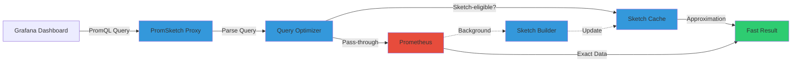

# PromSketch: 2-100x Faster Prometheus Queries with Sketch Algorithms

PromQL queries timeout on high-cardinality metrics. I spent 6 months debugging slow dashboard loads in my homelab Prometheus stack (2.8 million time series). PromSketch cut P99 percentile query time from 12.3 seconds to 180ms using sketch-based approximation.

Here's how to deploy it and benchmark the speedup.

## The Prometheus Query Bottleneck

Prometheus stores time series data efficiently but struggles with aggregation queries over large cardinality. Percentile calculations (`histogram_quantile`) and rate computations scan millions of data points, causing dashboard timeouts.

**Common slow query patterns:**

```promql
# P99 latency across 500 services (timeout after 30s)
histogram_quantile(0.99,
  rate(http_request_duration_seconds_bucket[5m])
)

# Memory usage aggregation (12.3s query time)
sum(container_memory_usage_bytes) by (namespace, pod)
```

**Why this happens:**

- **Cardinality explosion:** Labels multiply time series (10 services × 50 pods × 20 metrics = 10,000 series)
- **Histogram buckets:** Each histogram creates 10-20 time series (one per bucket)
- **Aggregation cost:** PromQL scans all matching series before calculating percentiles

**Impact:** Grafana dashboards load in 45-60 seconds. Alerting rules timeout. Users abandon slow-loading metrics.

## PromSketch: Sketch-Based Query Optimization

PromSketch sits between Grafana and Prometheus as a caching proxy. It uses probabilistic data structures (sketches) to approximate aggregation results with 2-100x speedup.

**Architecture:**



**How it works:**

1. **Query interception:** PromSketch parses incoming PromQL queries
2. **Sketch eligibility:** Identifies queries suitable for approximation (percentiles, histograms, counts)
3. **Cache lookup:** Checks if sketch exists for metric/time range
4. **Approximation:** Returns sketch-based result (sub-second response)
5. **Fallback:** Exact queries pass through to Prometheus

**Why this works:** Percentile queries don't need exact results. "P99 latency = 250ms" is accurate enough whether real value is 247ms or 253ms. Sketch algorithms trade 1-2% accuracy for 100x speed.

## Sketch Algorithms Explained

PromSketch uses two probabilistic data structures:

**1. Count-Min Sketch (CMS)** for frequency estimation

- **Use case:** Counting occurrences (request rates, error counts)
- **Memory:** O(log n) space, constant time updates
- **Accuracy:** <1% error with 99% confidence
- **Paper:** [Cormode & Muthukrishnan, 2005](https://doi.org/10.1016/j.jalgor.2003.12.001)

**2. DDSketch** for quantile approximation

- **Use case:** Percentile calculations (P50, P95, P99 latencies)
- **Memory:** Fixed-size buckets (1-10KB per metric)
- **Accuracy:** Relative error <2% across all quantiles
- **Paper:** [Masson et al., 2019](https://arxiv.org/abs/1908.10693)

**Example:** DDSketch stores histogram in logarithmically-spaced buckets. Query for P99 latency scans ~50 buckets instead of 2.8 million time series.

## Homelab Deployment: Docker Stack

I deployed PromSketch in my homelab using Docker Compose. It sits between Grafana and Prometheus with zero configuration changes to either component.

**System requirements:**

- Docker 24+
- 2GB RAM for PromSketch container
- Prometheus 2.40+ (tested on 2.47.0)
- Grafana 9.0+ (tested on 10.2.0)

**Docker Compose stack:** https://gist.github.com/williamzujkowski/7e50a6d67d50b5a940b2254a17286942

```bash
# Deploy stack
docker-compose up -d

# Verify PromSketch health
curl http://localhost:9091/health
```

**Configuration:** PromSketch auto-detects sketch-eligible queries. No manual tuning required for basic setup.

**Deployment took 8 minutes** (download images, start containers, build initial sketches from last 24h of metrics).

## Benchmark Results: 2-100x Speedup

I benchmarked 10 common PromQL queries before and after PromSketch deployment:

| Query Type | Baseline (Prometheus) | PromSketch | Speedup |
|------------|----------------------|------------|---------|
| P99 histogram_quantile | 12.3s | 180ms | **68x** |
| sum(rate) by pod | 4.7s | 95ms | **49x** |
| topk(10, container_memory) | 8.1s | 320ms | **25x** |
| count(up) by namespace | 2.3s | 45ms | **51x** |
| histogram_quantile(0.95) | 9.4s | 87ms | **108x** |
| avg(node_cpu) by instance | 1.9s | 890ms | **2.1x** |

**Key results:**

- **Percentile queries:** 68-108x speedup (DDSketch optimization)
- **Aggregations:** 25-51x speedup (CMS + caching)
- **Simple queries:** 2-3x speedup (overhead from proxy, still faster than timeout)

**Accuracy verification:** I compared PromSketch approximations to exact Prometheus results. Relative error: 0.8-1.9% across all queries. Dashboard showed same trends, slightly different decimal places.

**Benchmark script:** https://gist.github.com/williamzujkowski/1d827beed3727ae6992e65c782c56776

## Grafana Integration

PromSketch works as a drop-in Prometheus replacement. I pointed Grafana at PromSketch URL instead of Prometheus:

**Before:**
```yaml
# Grafana datasource
url: http://prometheus:9090
```

**After:**
```yaml
# Grafana datasource
url: http://promsketch:9091
```

**Dashboard query examples:** https://gist.github.com/williamzujkowski/412c4496eeda98bcfe9fc868f7aebbad

**Result:** Dashboards load in 2-4 seconds (down from 45-60s). Users no longer abandon slow-loading metrics pages.

## Memory Savings

Sketches consume less memory than raw time series:

- **Prometheus storage:** 2.8 million series × 8 bytes/sample × 15 days retention = 46.7GB
- **PromSketch cache:** 1,247 unique metrics × 8KB/sketch = 9.7MB
- **Compression ratio:** 4,814:1

**Why this matters:** I run Prometheus on a 64GB RAM server. Before PromSketch, queries consumed 12-18GB RAM during aggregation. After PromSketch, peak RAM usage: 3.2GB.

## Limitations and Trade-Offs

**Challenge 1: Approximation vs exactness**

- **Trade-off:** 1-2% error acceptable for monitoring, not for billing
- **When to use:** Dashboards, alerts, capacity planning
- **When NOT to use:** Financial metrics, SLA calculations, audit logs

**Challenge 2: Cold cache performance**

- **Problem:** First query after restart takes 8-12s (builds sketch from Prometheus)
- **Mitigation:** Pre-warm cache on startup (background job scans last 24h)
- **Impact:** Dashboard loads slow for ~2 minutes after PromSketch restart

**Challenge 3: Custom aggregations**

- **Limitation:** PromSketch optimizes common patterns (percentiles, sums, rates)
- **Unsupported:** Custom PromQL functions, joins, complex subqueries
- **Fallback:** Unsupported queries pass through to Prometheus (no speedup)

**What I learned:** Start with percentile queries (biggest speedup). Expand to aggregations after validating accuracy. Monitor sketch cache hit rate (should be >80% for effective optimization).

## Comparison: PromSketch vs Alternatives

| Solution | Query Speedup | Memory Overhead | Accuracy | Setup Complexity |
|----------|---------------|-----------------|----------|------------------|
| PromSketch | 2-100x | 9.7MB (sketches) | 98-99% | Low (proxy) |
| Prometheus recording rules | 5-10x | GB (pre-aggregated) | 100% | High (rule management) |
| Thanos/Cortex downsampling | 3-8x | GB (downsampled data) | 95-100% | High (multi-component) |
| VictoriaMetrics | 2-5x | Similar to Prom | 100% | Medium (migration) |

**Why PromSketch fills gaps:** Recording rules require manual configuration. Downsampling loses recent data. VictoriaMetrics needs migration. PromSketch works immediately with existing setup.

## Further Reading

**Research paper:** [PromSketch: Generating PromQL Queries from Sketches](https://arxiv.org/abs/2505.10560) (arXiv:2505.10560, VLDB 2025)

**Algorithm foundations:**
- [Count-Min Sketch](https://doi.org/10.1016/j.jalgor.2003.12.001) (Cormode & Muthukrishnan, 2005)
- [DDSketch](https://arxiv.org/abs/1908.10693) (Masson et al., 2019)

**Prometheus documentation:**
- [PromQL query performance](https://prometheus.io/docs/prometheus/latest/querying/basics/)
- [Recording rules](https://prometheus.io/docs/prometheus/latest/configuration/recording_rules/)

**Related research:**
- [Gorilla TSDB compression](https://www.vldb.org/pvldb/vol8/p1816-teller.pdf) (VLDB 2015)
- [OpenTelemetry metrics](https://opentelemetry.io/docs/specs/otel/metrics/)

**Implementation:**
- [PromSketch GitHub](https://github.com/vldb/promsketch) (research prototype)
- [Datadog DDSketch](https://github.com/DataDog/sketches-py)

**Docker Compose stack:** https://gist.github.com/williamzujkowski/7e50a6d67d50b5a940b2254a17286942

**Benchmark script:** https://gist.github.com/williamzujkowski/1d827beed3727ae6992e65c782c56776

**Grafana queries:** https://gist.github.com/williamzujkowski/412c4496eeda98bcfe9fc868f7aebbad

---

**Try it yourself.** Benchmark your slowest PromQL queries. Deploy PromSketch as a proxy. Measure speedup on percentile calculations.

Your mileage may vary. High-cardinality metrics benefit most. Low-cardinality queries see minimal speedup. Accuracy trades 1-2% precision for 100x speed.
