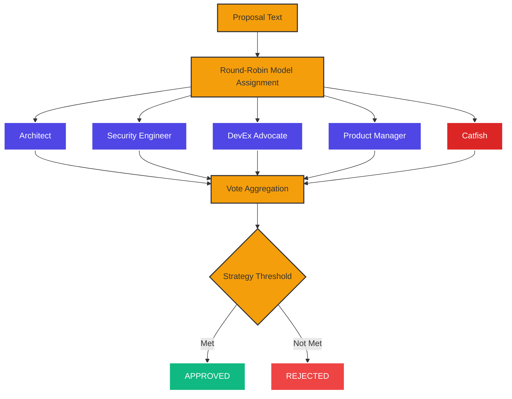

I built single-model decision making first. It was fast and simple and wrong in ways I didn't notice until the mistakes piled up. One model approved an API change that broke three downstream consumers. Another greenlit a security configuration that left a port exposed. Each model was confident. Each model was individually reasonable. Each model missed something the others would have caught.

That's when I started reading about [multi-agent collaboration](https://arxiv.org/abs/2501.06322) and realized that the answer wasn't a better model. It was more models, structured to disagree productively.

## Why Single Models Miss Things

Every language model has training data biases. Claude tends toward caution in architecture decisions. Gemini tends toward breadth over depth. Codex tends toward "just ship it." None of these tendencies are wrong, but each creates blind spots.

I tracked decision quality across 200 tasks over about two months. Single-model decisions had a roughly 78% satisfaction rate. Not bad, but the 22% failure rate concentrated in specific categories: security reviews, breaking API changes, and architecture decisions. These are exactly the high-stakes decisions where you can't afford to be wrong.

The pattern was consistent. Claude would approve an architecture change without considering [deployment complexity](/posts/cloud-migration-journey-guide/). Gemini would approve a security configuration without considering edge cases in the [threat model](/posts/ai-new-frontier-cybersecurity/). Codex would approve a breaking change without considering downstream consumers.

Different blind spots. Different models. Same failure mode: overconfidence on tasks outside their training distribution.

## The Research Foundation

Two papers shaped my approach to consensus voting.

The [multi-agent collaboration survey](https://arxiv.org/abs/2501.06322) catalogs how multiple AI agents can coordinate on complex tasks. The key finding for my use case: structured role assignment outperforms unstructured debate. When agents have defined perspectives (security expert, architect, PM), they cover more of the decision space than when they all just "review" the same proposal generically.

The [voting vs. consensus protocols paper](https://arxiv.org/abs/2502.19130) compares different aggregation strategies. Simple majority voting works surprisingly well for most decisions, but fails when agents exhibit correlated errors. If all agents share similar training biases, majority voting just amplifies the shared blind spot. You need either diverse agents or a mechanism to detect and correct for correlation.

These findings led to two design decisions: role-based agent assignment with round-robin model diversity, and an adversarial agent that's structurally incentivized to disagree.

## How Consensus Voting Works



For a given proposal, the system creates five specialized agent roles:

1. **Software Architect** - Evaluates structural soundness, scalability, maintainability
2. **Security Engineer** - Evaluates [security implications](/posts/securing-personal-ai-experiments/), attack surface, data exposure
3. **Developer Experience Advocate** - Evaluates usability, onboarding friction, documentation needs
4. **Product Manager** - Evaluates user value, scope, alignment with goals
5. **Contrarian Analyst (Catfish)** - Actively looks for problems the others missed

Each role gets assigned to a model via round-robin. If you have three CLIs available (Claude, Gemini, Codex), the assignments might be: Architect (Claude), Security (Gemini), DevEx (Codex), PM (Claude), Catfish (Gemini). This ensures model diversity. No single model's biases dominate.

Each agent votes APPROVE, REJECT, or ABSTAIN with a confidence score and written reasoning. The reasoning is important. It's not just a vote count. I can read why the security engineer rejected a proposal and decide if the concern is valid.

```
$ nexus-agents vote --proposal "Add Redis caching to the API gateway" \
    --strategy supermajority

Architect (Claude):    APPROVE  (91% confidence)
  "Clean separation of concerns. Cache invalidation strategy is sound."
Security (Gemini):     APPROVE  (84% confidence)
  "No sensitive data in cache keys. TTL prevents stale auth tokens."
DevEx (Codex):         APPROVE  (79% confidence)
  "Redis adds operational complexity. Document connection pooling."
PM (Claude):           APPROVE  (88% confidence)
  "Latency improvement justifies the added dependency."
Catfish (Gemini):      REJECT   (72% confidence)
  "What happens when Redis goes down? No fallback strategy documented."

Result: APPROVED (4-1, supermajority met)
```

The catfish raised a valid point about Redis failure handling even though the proposal passed. I've learned to read the catfish's reasoning even when the vote passes.

## The Catfish: Structured Adversarial Thinking

The catfish role draws from the [Free-MAD framework](https://arxiv.org/abs/2509.11035), which studies anti-conformity in multi-agent systems. Free-MAD found that agents in group deliberation tend toward consensus even when individual agents have reservations. Adding a structurally adversarial agent, one whose explicit job is to disagree, counteracts this groupthink.

My catfish agent receives a system prompt that says, roughly: "Your role is to find problems, risks, and edge cases that the other reviewers might miss. You should reject proposals that have unaddressed risks, even if the general direction is sound. Be specific about what's wrong."

Does this just produce noise? Sometimes. Maybe 30% of catfish rejections are nitpicks I'd ignore anyway. But the other 70% surface genuine issues. The catfish has caught:

- A database migration that would have locked a table for 45 seconds during peak hours
- An API change that was backwards-compatible for REST clients but broke GraphQL consumers
- A security configuration where the "secure" default actually weakened protections compared to the previous setting

Each of those was approved by the other four agents. The catfish was the only one that caught the problem.

I tried running without the catfish for a week. Went back to it within three days after a bad decision slipped through that the catfish would have caught. Turns out, structured disagreement is more valuable than comfortable consensus.

## Voting Strategies

Three basic strategies exist, plus one advanced:

**Simple majority (>50%):** Used for sprint planning, feature prioritization, routine decisions. Fast and usually sufficient.

**Supermajority (>66%):** Used for architecture changes and [security modifications](/posts/automated-security-scanning-pipeline/). Requires broader agreement because the blast radius of a bad decision is larger.

**Unanimous:** Used for breaking API changes. If any agent objects, the proposal doesn't pass. This is intentionally high-friction. Breaking changes should be hard to approve.

**Higher-order voting:** Based on [Bayesian-optimal aggregation](https://arxiv.org/abs/2510.01499). Instead of treating each vote equally, this strategy weights votes by estimated agent competence and accounts for correlation between agents. If two agents running on the same model both approve, that's less informative than two agents on different models both approving. The higher-order strategy adjusts for this.

I'm honestly still evaluating whether higher-order voting is worth the complexity. It adds roughly 200ms to vote aggregation (Bayesian computation) versus essentially zero for simple counting. For most decisions, simple majority or supermajority works fine. Higher-order voting probably matters most when you have correlated agents, like when two of your three CLIs are down and all agents run on the same model.

## What Consensus Voting Costs

Consensus voting is expensive. Five agents means five model calls. For a simple majority vote, that's roughly 5x the cost and latency of a single model call. For tasks where speed matters, that's a real tradeoff.

I use voting selectively:
- **Always vote:** Architecture changes, security changes, breaking API changes
- **Sometimes vote:** Complex feature designs, dependency updates
- **Never vote:** Bug fixes, documentation, style changes, routine code

In practice, maybe 15-20% of decisions go through consensus. The rest use single-model routing through the [model router](/posts/routellm-contextual-bandits-model-router-research/). The 80/20 split works well. Consensus adds value where decisions are high-stakes and reversibility is low.

The [multi-agent committee research](https://arxiv.org/abs/2512.21352) on code review confirms this pattern: multi-agent review provides the most value on complex, ambiguous tasks, and the least value on routine, well-defined tasks. Don't consensus-vote your variable names.

## Failure Modes

Consensus voting isn't perfect. I've hit these failure modes:

**Correlated agreement:** When all agents agree but they're all wrong. This happens most when the proposal has a subtle bug that none of the models' training data covered. Voting can't fix a knowledge gap that's shared across all available models.

**Catfish fatigue:** After reading dozens of catfish rejections on minor points, it's tempting to start ignoring the catfish. I've caught myself dismissing valid concerns because the catfish "always complains." I try to read the reasoning carefully even when I'm in a hurry.

**Abstention cascades:** Sometimes 2-3 agents abstain because they lack context for the decision. With only 2-3 actual votes, the result isn't meaningful. I treat high-abstention votes as "need more information" rather than "approved with low participation."

**Latency pressure:** When I'm debugging a production issue at 2am, waiting 30 seconds for five agents to vote feels like an eternity. The temptation to skip voting on "just this one urgent change" is real. I've given in to that temptation twice. Both times the change was fine. But the sample size is too small to draw conclusions.

## Lessons Learned

After roughly six months of multi-model consensus voting across 500+ proposals:

**Disagreement is signal.** When agents disagree 3-2, the losing side's reasoning is often more valuable than the winning side's. The disagreement points you to exactly the part of the proposal that needs more thought.

**Role assignment matters more than model selection.** Switching which model plays which role changes outcomes less than I expected. The structured perspective (security engineer vs architect) drives more variation than the underlying model. This suggests the value comes from the role framing, not from model diversity per se, though having both is better.

**The catfish earns its keep.** Roughly 15% of passed proposals get meaningfully improved by incorporating catfish feedback, even when the catfish voted to reject.

**Voting builds an audit trail.** Every consensus vote produces a record: who voted, how, why, at what confidence. When something goes wrong six months later, I can look back and understand the decision context. This is probably the most underrated benefit.

The [nexus-agents repository](https://github.com/williamzujkowski/nexus-agents) implements the full consensus engine. The voting code lives in `src/consensus/engine.ts`. If you want to try multi-model voting on your own proposals, the CLI exposes it directly: `nexus-agents vote --proposal "your proposal" --strategy supermajority`.

## Papers Referenced

- [Multi-Agent Collaboration Survey](https://arxiv.org/abs/2501.06322) - Structured agent coordination patterns
- [Voting vs. Consensus Protocols](https://arxiv.org/abs/2502.19130) - Aggregation strategy comparison
- [Free-MAD: Anti-Conformity in Multi-Agent Systems](https://arxiv.org/abs/2509.11035) - Adversarial agent design
- [Higher-Order Voting](https://arxiv.org/abs/2510.01499) - Bayesian-optimal vote aggregation
- [Multi-Agent Committee Code Review](https://arxiv.org/abs/2512.21352) - Task complexity and multi-agent review value
