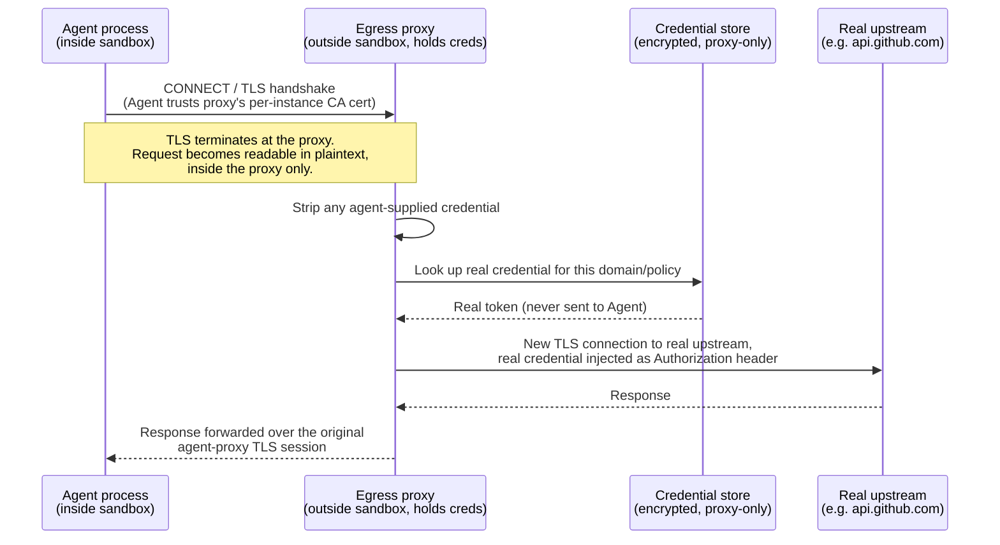

Run an AI coding agent against a real repo for a week and you'll eventually give it a GitHub token, a cloud API key, or both. By mid-2026, some form of sandboxing ships with most mainstream agent tooling, but the boundary strength and defaults vary a lot. Claude Code's own sandbox is opt-in via the `/sandbox` command, with configurable filesystem and network rules rather than one fixed default-deny wall ([Anthropic engineering blog](https://www.anthropic.com/engineering/claude-code-sandboxing)). So "is the agent sandboxed" is the wrong first question. The one that matters is: **when the agent makes an outbound HTTPS request, does the plaintext credential ever pass through the same process that's reading a prompt-injected web page?**

For most of the open-source sandbox tooling a homelab operator can actually install today, the answer is yes. That's the gap this post is about.

## The isolation primitives are mature

The isolation ladder for untrusted agent code has several well-established rungs. Plain namespaces and seccomp are the weakest, cheapest option: shared host kernel, no hardware boundary. gVisor intercepts syscalls in userspace with no VM boot, but adds 10-30% overhead on I/O-heavy work. I measured this directly in my own K3s cluster: syscall-heavy workloads ran [15-38% slower under gVisor, and startup overhead hit 59%](/posts/2024-09-25-gvisor-container-sandboxing-security). The isolation held against every escape attempt I threw at it. The performance cost was real too.

Kata Containers and Firecracker sit one rung up: every workload runs inside a dedicated guest kernel behind a KVM-enforced boundary. Worth being precise about what that boundary actually is: it's the VMM/KVM interface, not the guest kernel. An agent's code already runs *as* the guest workload, so escaping to the host doesn't require first "compromising" a guest kernel the attacker's own code is already running inside of. It requires a bug in the hypervisor or its device-emulation surface, virtio, KVM itself, not a two-stage break-in. Firecracker boots in as little as 125ms and consumes about 5MiB of memory per microVM ([AWS: Firecracker for serverless computing](https://aws.amazon.com/blogs/aws/firecracker-lightweight-virtualization-for-serverless-computing/)). It's the substrate under AWS Lambda, and under managed agent-sandbox products including E2B ([E2B/Firecracker integration](https://deepwiki.com/e2b-dev/infra/3.2-firecracker-integration)) and Fly.io Sprites ([Fly Sprites overview](https://northflank.com/blog/top-fly-io-sprites-alternatives-for-secure-ai-code-execution-and-sandboxed-environments)).

One recommendation shows up repeatedly across 2026 write-ups on this topic, though it traces mostly to the same cluster of vendor and practitioner blogs rather than a single standards body: default to microVMs for untrusted agent-generated code, and only relax to gVisor or plain containers when the specific threat model justifies it ([zylos.ai](https://zylos.ai/research/2026-04-04-ai-agent-sandboxing-security-isolation/)). Whether or not it rises to "consensus," plain shared-kernel isolation alone is a weaker starting point for adversarial code than either alternative.

Every major vendor has shipped something here. Anthropic's Claude Code uses bubblewrap on Linux and Seatbelt on macOS, forcing network traffic through a local proxy with a default-deny domain policy when the sandbox is enabled. Internally, that cut permission prompts by 84% ([Anthropic engineering blog](https://www.anthropic.com/engineering/claude-code-sandboxing)). OpenAI's Codex CLI takes the same platform-native approach: "the implementation differs between macOS, Linux, WSL2, and native Windows, but the idea is the same across surfaces" ([OpenAI: Codex sandboxing](https://learn.chatgpt.com/docs/sandboxing)). Apple shipped `container` 1.0.0 on June 9, 2026: a tool that boots a dedicated VM per container on macOS via the Virtualization framework, the same kernel-per-workload boundary Kata and Firecracker use in multi-tenant clouds, now running locally on a laptop ([apple/container](https://github.com/apple/container)). Self-hosted OSS options exist too. microsandbox boots a full VM in about 320ms and runs standard OCI images: call it the E2B isolation tier, self-hosted.

These primitives are mature and well-documented. What they get you is filesystem and process containment. Policy, defaults, and network egress are still where implementations differ, and where most of the remaining risk sits. That's the layer this post is actually about.

## The credential is still sitting in the room

Filesystem and process isolation, properly configured, can stop an agent from reading `~/.ssh` or escaping to the host kernel. Not automatically: some sandboxes default to much broader filesystem access than that, so this depends on the policy you set, not just the primitive underneath it. That's the same boundary I leaned on for [network segmentation and model isolation when I first started running local LLMs in the homelab](/posts/2025-04-10-securing-personal-ai-experiments). Neither approach does anything about a `GITHUB_TOKEN` sitting in the agent's own environment variables, readable by the agent's own process, which can put it in its own context and hand it to a tool call. A prompt-injected web page, a poisoned dependency's README, or an ambiguous instruction doesn't need to escape the sandbox. It just needs to ask the agent, which is already inside the trust boundary with the secret, to use it somewhere it shouldn't.

The strongest version of this fix, and the one the diagram below matches, is credential-injection egress proxying: force outbound traffic through an MITM proxy that sits *outside* the sandbox boundary, terminate TLS with a locally-trusted, per-instance ephemeral CA, strip whatever the agent attached, inject the real credential from a store only the proxy can read, then open a fresh, properly verified TLS connection to the real upstream. The agent's process never has the plaintext secret in memory, on disk, or in its context window.

Cloudflare Sandbox documents exactly this mechanism. Outbound handlers "run in the Workers runtime, outside the sandbox," so "they can hold secrets the sandbox never sees," with a unique ephemeral CA generated per sandbox instance ([Cloudflare changelog](https://developers.cloudflare.com/changelog/post/2026-04-13-sandbox-outbound-workers-tls-auth/)). Vercel Sandbox reaches a similar practical outcome through a different documented route: network policy matches outbound requests by domain, including wildcards like `*.github.com`, and the firewall "adds or replaces the specified headers before forwarding the request." Injected headers overwrite anything the sandboxed code tried to set, and Vercel is explicit about the threat model: "there's nothing to exfiltrate, as the credentials only exist in a layer outside the VM" ([Vercel changelog](https://vercel.com/changelog/safely-inject-credentials-in-http-headers-with-vercel-sandbox)). Vercel's own docs don't spell out a client-facing ephemeral-CA design the way Cloudflare's do, so treat the two as the same *outcome*, the agent never holds the real credential, reached by two different and not fully equivalent documented mechanisms. Anthropic does a scoped version of this for git specifically: "sensitive credentials (such as git credentials or signing keys) are never inside the sandbox with Claude Code." A custom proxy validates each git interaction before attaching a scoped token ([Anthropic engineering blog](https://www.anthropic.com/engineering/claude-code-sandboxing)).

Infisical's Agent Vault is the closest thing to an installable, interface-agnostic version of this pattern. It sets `HTTPS_PROXY` in the agent's environment, intercepts every outbound request, and "attaches credentials onto it before forwarding the request to the target outbound API," pulling from an AES-256-GCM-encrypted local store or a pluggable secrets backend ([Infisical/agent-vault](https://github.com/Infisical/agent-vault)). It works with Claude Code, Cursor, Codex, or a hand-rolled agent wrapper, because the mechanism underneath is just an HTTP(S) proxy and a trusted CA cert. That's also its edge: `HTTPS_PROXY` is an environment-variable convention, not a kernel-enforced control. A tool that ignores the proxy variable, opens a raw TCP socket, or resolves and connects directly instead of honoring the system proxy setting routes straight past it. Agent Vault only does what it claims if it's paired with network-level lockdown, egress rules that force all outbound traffic through the proxy port and block everything else, not just an environment variable the agent's process is trusted to respect.

## Who ships this, who doesn't

Here's the falsifiable part. As of mid-2026, the self-hostable open-source sandbox runtimes a homelab operator would actually reach for (Anthropic's `sandbox-runtime`, a hand-rolled bubblewrap/Landlock setup, microsandbox) do not ship a documented, first-party MITM credential-injection egress proxy with the same specificity as Cloudflare's: matched-domain header injection, per-instance ephemeral CA, policy-driven, agent-opaque. `sandbox-runtime`'s own docs mention credential injection thinly and point at TLS-trust env vars (`SSL_CERT_FILE`, `GIT_SSL_CAINFO`) rather than a fully specified policy engine ([anthropic-experimental/sandbox-runtime](https://github.com/anthropic-experimental/sandbox-runtime)). E2B, arguably the most popular managed sandbox product, sets secrets as plain environment variables inside the VM. Its own docs note that these variables "are not private in the OS," meaning anything running inside that VM, including the agent, can read them ([E2B docs: environment variables](https://e2b.dev/docs/sandbox/environment-variables)). Modal's documented pattern is the same shape: secrets are injected into a function and "accessed... as environment variables" in the code that runs, with no MITM interception layer described anywhere in the docs ([Modal docs: secrets](https://modal.com/docs/guide/secrets)).

If any of the named OSS runtimes ships this as a genuine first-party feature by the time you read this, the claim is wrong and I'd like to know about it. Until then: if you want the Cloudflare-grade property on your own infrastructure, you're bolting on a separate tool. That's not a criticism of the sandbox projects. Filesystem/process isolation and credential brokering are different engineering problems with different owners. It just means "I sandboxed my agent" and "my agent's credentials are protected" are not the same claim, and most homelab writeups conflate them.

## What proxying doesn't fix

Here's the nuance that matters more than the mechanism. A proxied, injected token still grants the agent the *capability* to act with that identity. The proxy hides the bytes of the secret from the agent's context, but it has no concept of intent, only of which requests match a policy. If the injected GitHub token has `repo:write` and a prompt-injected agent issues `git push --force` or deletes a branch through the proxy, the proxy authenticates that request happily. It was never designed to know the difference between the agent doing its job and the agent doing something it was tricked into.

**Proxying prevents credential theft. It does not prevent credential misuse.** Scope still matters: narrow the token to the minimum the task needs, not the minimum you were willing to configure. Lifetime still matters too: a long-lived token used across dozens of sessions is a wide blast-radius window regardless of whether it ever touched the agent's context. And audit matters most of all. Vercel, Cloudflare, and Agent Vault all support logging proxied requests, and that log, when it's turned on and retained, is what lets you detect and investigate misuse after the fact. The proxy is a control point, not a guarantee. A write-up on sandboxing agents behind GKE Workload Identity makes the same point from the platform-engineering side: the isolation layer "manages the execution environment," but it doesn't monitor what the agent does with the access it was legitimately granted ([Armosec: sandboxing AI agents with GKE Workload Identity](https://www.armosec.io/blog/sandboxing-ai-agents-gke-workload-identity/)). No amount of isolation helps once the agent is authorized to do the damaging thing and is convinced to do it.

There's a second leak surface that proxying can't touch at all: the model provider itself. If a secret ever ends up inside a prompt or completion sent to a hosted model API, whether pasted into a chat or echoed back through a misconfigured tool response, it's subject to that provider's retention policy. That's a separate trust boundary from the sandbox entirely. For Anthropic specifically, the picture has layers. Outside of any Zero Data Retention (ZDR) arrangement, the commercial policy is to delete API inputs and outputs within 30 days of receipt or generation ([Anthropic: commercial data retention](https://privacy.claude.com/en/articles/7996866-how-long-do-you-store-my-organization-s-data)). Under a ZDR arrangement, prompts and responses aren't stored at rest after the response is returned, for eligible features and models. But ZDR doesn't apply universally: Claude Fable 5 and Claude Mythos 5 are designated "Covered Models" and require 30-day retention regardless of arrangement, so ZDR isn't available for either of them. And regardless of any arrangement, flagged content, anything caught by abuse-detection systems, can be retained for up to two years ([Anthropic API retention docs](https://platform.claude.com/docs/en/manage-claude/api-and-data-retention)). A perfectly proxied sandbox does nothing about any of this. It's a different problem with a different fix (don't put secrets in prompts, full stop), but it's worth naming, because "I proxy my credentials" can create false confidence about a leak surface the proxy was never positioned to cover.

And the debug-log path deserves its own line, because it's the one that actually fires most often in practice: an empirical study of agent skills and frameworks found that `print`/`console.log` statements account for **73.5% of credential-leak vulnerabilities** (1,007 of 1,371 issues), because agent frameworks pipe stdout straight into the LLM's context window, where an adversary can query the model to regurgitate whatever got logged ([arXiv:2604.03070](https://arxiv.org/html/2604.03070v1)). Proxying the network path doesn't help if the credential was never in an outbound request in the first place. It was in a log line the agent itself wrote and then read back.

## What I'd actually run

I haven't built this stack yet. This post is the research pass; a build post with actual configs follows once I've run it against my own homelab agent traffic for a few weeks. The ranking below splits on threat model. Items 1-3 assume a single-operator homelab running agents against your own repos and services, where the main risk is a prompt-injected or misconfigured agent, not a nation-state adversary. Items 4-5 assume you're deliberately running adversarial, untrusted, or unreviewed code and want a hardware-enforced VM boundary against a fully compromised agent. Ranked by effort against what it buys:

1. **Anthropic's `sandbox-runtime` (`srt`)** for filesystem and network confinement. Free, OSS, works with any agent process, near-zero overhead, no VM boot. This is the floor, not the ceiling. Start here regardless of what gets layered on top.
2. **A credential-injection proxy in front of every agent's egress.** Infisical Agent Vault over a hand-rolled `mitmproxy` script, unless the point is specifically to understand the MITM-CA mechanism by building it yourself. This is the actual fix for the gap this post describes. Without it, `srt`'s domain allowlisting still happily delivers a plaintext secret to a permitted domain if that secret is sitting in an env var the agent can read. And per the caveat above, it needs network-level lockdown to actually hold.
3. **Tailscale ACLs plus a self-hosted resolver (AdGuard Home)** for default-deny, DNS-visible egress. Cheap, orthogonal to the credential layer, and it catches the case credential proxying can't: an agent calling an attacker-controlled domain that doesn't need a credential at all.
4. **microsandbox** for anything running fully untrusted, adversarial-controlled code, testing an unreviewed PR's generated code, say. Worth the jump to VM-per-session isolation only once the threat model includes "assume the agent is fully compromised and tries a hypervisor-level exploit," which is a higher bar than most single-operator homelab setups.
5. **Kata Containers via `RuntimeClass`**, only if a Kubernetes cluster already exists for other reasons. Not worth standing one up purely for this.

Isolation was the easy 80%. The credential path is the harder 20%. It's the one most homelab agent setups, mine included until now, skip entirely.

---

## Sources

- [AWS: Firecracker — lightweight virtualization for serverless computing](https://aws.amazon.com/blogs/aws/firecracker-lightweight-virtualization-for-serverless-computing/)
- [E2B/Firecracker integration (deepwiki)](https://deepwiki.com/e2b-dev/infra/3.2-firecracker-integration)
- [Fly.io Sprites overview (Northflank)](https://northflank.com/blog/top-fly-io-sprites-alternatives-for-secure-ai-code-execution-and-sandboxed-environments)
- [zylos.ai: AI agent sandboxing, security & isolation](https://zylos.ai/research/2026-04-04-ai-agent-sandboxing-security-isolation/)
- [Anthropic: Claude Code sandboxing](https://www.anthropic.com/engineering/claude-code-sandboxing)
- [OpenAI: Codex sandboxing](https://learn.chatgpt.com/docs/sandboxing)
- [apple/container](https://github.com/apple/container)
- [Vercel: Safely inject credentials in HTTP headers with Vercel Sandbox](https://vercel.com/changelog/safely-inject-credentials-in-http-headers-with-vercel-sandbox)
- [Cloudflare: Sandbox outbound Workers, TLS auth](https://developers.cloudflare.com/changelog/post/2026-04-13-sandbox-outbound-workers-tls-auth/)
- [Infisical/agent-vault](https://github.com/Infisical/agent-vault)
- [anthropic-experimental/sandbox-runtime](https://github.com/anthropic-experimental/sandbox-runtime)
- [E2B docs: environment variables](https://e2b.dev/docs/sandbox/environment-variables)
- [Modal docs: secrets](https://modal.com/docs/guide/secrets)
- [Armosec: sandboxing AI agents with GKE Workload Identity](https://www.armosec.io/blog/sandboxing-ai-agents-gke-workload-identity/)
- [Anthropic: API and data retention](https://platform.claude.com/docs/en/manage-claude/api-and-data-retention)
- [Anthropic: commercial data retention policy](https://privacy.claude.com/en/articles/7996866-how-long-do-you-store-my-organization-s-data)
- [arXiv:2604.03070 — credential leak vulnerabilities in agent skills](https://arxiv.org/html/2604.03070v1)
- [gVisor container sandboxing: my K3s benchmarks](/posts/2024-09-25-gvisor-container-sandboxing-security)
- [Securing personal AI/ML experiments in the homelab](/posts/2025-04-10-securing-personal-ai-experiments)
