The theme picker in this site's header — the little swatch icon next to the light/dark toggle — offers twelve terminal color schemes. Dracula, Nord, Gruvbox, Catppuccin, a few others. Pick one and the whole site repaints: body text, code blocks, links, borders. Every one of those twelve is guaranteed to clear WCAG AAA body-text contrast, not because I tested each one by eye, but because a build script refuses to emit a theme that doesn't.

That guarantee comes from [oklch-terminal-themes](https://github.com/williamzujkowski/oklch-terminal-themes), a separate project that's the actual subject of this post. It's the data pipeline behind [Remarque](/posts/2026-04-10-remarque-typography-first-design-system/)'s color story: 545 terminal color schemes, scraped from a dozen upstream repos, converted to OKLCH, tagged with real WCAG contrast numbers, and republished as an npm package. This site is the first real consumer of it.

## Where the raw data comes from

Terminal color scheme authors don't publish OKLCH. They publish iTerm2 XML, Alacritty TOML, Windows Terminal JSON, Ghostty config files with no file extension at all. `sources.json` in the repo lists twelve upstream sources, each pinned to a commit SHA and each MIT- or Apache-2.0-licensed: [`mbadolato/iTerm2-Color-Schemes`](https://github.com/mbadolato/iTerm2-Color-Schemes) supplies the bulk of it, plus smaller sets from Neovim theme plugins (`cyberdream.nvim`, `koda.nvim`), a few Ghostty-native theme packs, and Warp's special-edition themes. A `fetch-upstream.ts` script does a sparse clone of each, records the SHA it landed on, and a weekly GitHub Actions cron (`update.yml`, Mondays 06:00 UTC) reruns the whole pipeline and opens a PR only when something actually changed upstream.

That's 545 themes as of the last successful sync, up from the 485 the project shipped with in April when it only pulled from two sources. The README, the npm package description, and the GitHub repo's own topic description each say a different number right now — 485, 485, and "450+" respectively — because each one froze at whatever sync had last happened when someone touched that file. None of them are lying. They're just three snapshots of a dataset that grows every week and nobody bothered to templatize.

## Hex in, OKLCH out, ΔE2000 gate

The conversion itself is unglamorous. Each upstream scheme is 20 color slots — background, foreground, cursor, selection, 16 ANSI colors — each a hex string. `convert.ts` runs every hex through [`culori`](https://culorijs.org/)'s OKLCH converter, clamps lightness to `[0,1]` and chroma to `[0,0.5]`, and coerces `undefined` hue (which culori returns for genuinely achromatic colors) to `0` so the JSON stays finite:

```ts
export function convertHexToColor(hex: string): ColorValue {
  const normalizedHex = hex.toLowerCase();
  const ok = toOklch(parse(normalizedHex));
  const oklch = {
    l: round(clamp(ok.l, 0, 1), 4),
    c: round(clamp(ok.c, 0, 0.5), 4),
    h: ok.h !== undefined && Number.isFinite(ok.h) ? round(ok.h, 1) : 0,
  };
  return { hex: normalizedHex, oklch, oklchCss: `oklch(${oklch.l} ${oklch.c} ${oklch.h})` };
}
```

That conversion is checked, not trusted. `validate.ts` converts every OKLCH value straight back to sRGB and measures the round-trip color difference with CIEDE2000. Anything over ΔE 1.0 — a difference a trained eye can barely detect — fails the build. If the conversion math ever drifts (a culori upgrade, a rounding change), this is what catches it before it ships.

## WCAG tags come from plain relative luminance, not from OKLCH

Here's a detail worth being precise about, because it's easy to get wrong: the WCAG contrast tags (`wcag-aaa`, `wcag-aa`, `wcag-fail`, `ansi-legible`) are **not** computed from the OKLCH values. `classify.ts` runs the standard WCAG 2.x relative-luminance formula directly on the original hex — gamma-corrected sRGB channels, the same math any contrast checker uses. OKLCH doesn't change what WCAG measures; it changes what you can *do* with the result, which is the actual thesis of this post and I'll get to it.

The tagging is mechanical: `fgOnBg ≥ 7` gets `wcag-aaa`, `≥ 4.5` gets `wcag-aa`, `≥ 3` gets `wcag-aa-large`, anything below is `wcag-fail`. A separate `ansi-legible` tag checks the worst-case contrast of any ANSI color slot against the background — excluding `black`/`brightBlack` on dark themes and `white`/`brightWhite` on light themes, since those are conventionally meant to blend near-invisibly with the background and would otherwise false-flag well-formed themes.

Real numbers from the current dataset: 465 of 545 themes (85%) clear AAA on foreground-versus-background contrast. 522 clear AA. Only 9 fail outright — mostly aesthetic schemes built for vibe over legibility. 288 (53%) pass `ansi-legible`, meaning every colored ANSI slot, not just the base text, stays readable. Contrast tagging doesn't make a theme accessible by fiat; it tells you which of the 545 already are, so you don't have to check by hand.

## Same lightness number, wildly different brightness

The actual reason OKLCH matters here, and not just as a vanity color space, is perceptual uniformity: a given lightness value looks equally bright regardless of hue. HSL doesn't have that property, and the gap isn't subtle. I checked it directly rather than take the claim on faith:

| Color space | Two colors, same "lightness" | Relative luminance | Contrast between them |
|---|---|---:|---:|
| HSL | `hsl(60 100% 50%)` yellow vs `hsl(240 100% 50%)` blue | 0.928 vs 0.072 | **8.0 : 1** |
| OKLCH | `oklch(0.70 0.15 90)` vs `oklch(0.70 0.15 260)` | 0.342 vs 0.339 | **1.01 : 1** |

Two HSL colors that both claim "50% lightness" can differ in actual measured brightness by a factor of eight. Two OKLCH colors at the same `L` are, for practical purposes, identical in brightness. That's not a rounding difference: it's the difference between a color model that tracks a display register and one that tracks a human eye.

## The pipeline, end to end

```mermaid
flowchart LR
    U["12 upstream repos<br/>(sources.json, pinned SHAs)"] --> F["fetch-upstream.ts"]
    F --> B["build.ts<br/>hex to OKLCH (culori)"]
    B --> C["classify.ts<br/>WCAG tags, isDark, chroma"]
    C --> V["validate.ts<br/>ΔE2000 < 1.0, Zod schema"]
    V --> D[("themes.json<br/>545 records")]
    D --> G["generate.py<br/>curate 12, contrast-validate"]
    G --> T["theme-deck.json / theme-deck.css"]
    T --> P["ThemeDeck.astro<br/>this site's header picker"]
```



Everything left of `themes.json` lives in the `oklch-terminal-themes` repo and runs weekly on a cron. Everything right of it lives in *this* repo, runs once per manual invocation, and is the part that actually proves the perceptual-uniformity claim matters.

## What this site actually consumes

The picker doesn't pull the npm package at runtime. `scripts/theme-deck/generate.py` reads a local clone of the dataset and hand-selects 12 slugs — not a programmatic `popular ∩ wcag-aaa` query, but a curated list guided by those two tags plus "does a reader recognize the name." Eight dark themes, four light. The comment in the script is refreshingly upfront about at least one exclusion: "classic solarized fails AAA (fg/bg 4.7 dark, 4.1 light) so the higher-contrast variant stands in; no AAA solarized-light exists." Solarized is popular. It didn't make the cut in its original form because it doesn't clear the floor this site set for itself.

For each curated theme, `generate.py` derives a dozen CSS tokens — muted text, borders, code background, selection, accent, accent-hover — by mixing the theme's own foreground and background in OKLCH space, with shortest-arc hue interpolation so a mix never swings the long way around the color wheel:

```python
def mix(lch_a, lch_b, share_a):
    la, ca, ha = lch_a
    lb, cb, hb = lch_b
    dh = ((hb - ha + 180) % 360) - 180
    return (la * share_a + lb * (1 - share_a),
            ca * share_a + cb * (1 - share_a),
            (ha + dh * (1 - share_a)) % 360)
```

Every derived token is contrast-checked against the same floors the source data uses: 7.0 for body text (AAA), 4.5 for accents and muted text (AA — not AAA; that distinction matters and the script doesn't pretend otherwise). If a mixed color can't clear its floor, the script raises and the build fails. That's the actual payoff of perceptual uniformity: it's not that OKLCH computes WCAG contrast for you: plain relative luminance does that, color-space agnostic. It's that *derived* colors, colors nobody hand-picked, stay predictable enough to gate on. Mix two OKLCH colors and the midpoint's brightness lands where you'd expect. Do the same mix in HSL and, per the yellow/blue example above, it can land almost anywhere.

I didn't rerun `generate.py` with the interpolation swapped to HSL to produce a failure count: that's a fair thing to ask for and I don't have it. But the change is small (`mix()` is six lines total, all in `scripts/theme-deck/generate.py`), the floors are already asserted in code, and the twelve curated themes span enough hue range that I'd be surprised if at least one derived token didn't miss. That's the falsifiable version of this post's claim: swap the color space, rerun the twelve, count the failures. If nothing breaks, I'm wrong about how load-bearing this is.

## The honest gaps

The npm package (`@williamzujkowski/oklch-terminal-themes@0.1.0`, published in April) is a single, un-bumped release: the live dataset has moved past what's published to the registry. This site doesn't consume the npm package at all right now; it consumes a vendored JSON snapshot generated by pointing the Python script at a local git clone. That's dogfooding at the source level, not the package level, and closing that gap is the obvious next step.

## Numbers

| Metric | Value |
|---|---:|
| Total themes in dataset | 545 |
| Upstream sources | 12 |
| WCAG AAA (fg/bg ≥ 7:1) | 465 (85%) |
| WCAG AA (fg/bg ≥ 4.5:1) | 522 (96%) |
| WCAG fail (fg/bg < 3:1) | 9 |
| ANSI-legible (all colored slots ≥ 3:1) | 288 (53%) |
| Max round-trip ΔE2000 | < 1.0 (build gate) |
| Themes curated for this site | 12 (8 dark, 4 light) |
| This site's fg/bg contrast floor | 7.0 (AAA) |
| This site's accent/muted floor | 4.5 (AA) |
| Sync cadence | weekly, Mondays 06:00 UTC |

If you're building a theme picker and reaching for HSL because it's the color space you already know, the yellow/blue table above is the whole argument for switching. The source is at [github.com/williamzujkowski/oklch-terminal-themes](https://github.com/williamzujkowski/oklch-terminal-themes); the curation script that turns it into this site's header widget is `scripts/theme-deck/generate.py` in this repo.

## Sources

- [oklch-terminal-themes](https://github.com/williamzujkowski/oklch-terminal-themes) — the dataset, conversion pipeline, and npm package this post is about
- [mbadolato/iTerm2-Color-Schemes](https://github.com/mbadolato/iTerm2-Color-Schemes) — primary upstream source of terminal color schemes
- [culori](https://culorijs.org/) — the color conversion library used for hex → OKLCH
- [oklch.com](https://oklch.com/) — interactive OKLCH color picker and reference
- [Björn Ottosson, "A perceptual color space for image processing"](https://bottosson.github.io/posts/oklab/) — the Oklab color space OKLCH is built on
- [WCAG 2.1, Success Criterion 1.4.6 (Contrast Enhanced)](https://www.w3.org/TR/WCAG21/#contrast-enhanced) — the AAA contrast floor this project tags against
