```mermaid
flowchart LR
    U["12 upstream repos<br/>(sources.json, pinned SHAs)"] --> F["fetch-upstream.ts"]
    F --> B["build.ts<br/>hex to OKLCH (culori)"]
    B --> C["classify.ts<br/>WCAG tags, isDark, chroma"]
    C --> V["validate.ts<br/>ΔE2000 < 1.0, Zod schema"]
    V --> D[("themes.json<br/>545 records")]
    D --> G["generate.py<br/>curate 12, contrast-validate"]
    G --> T["theme-deck.json / theme-deck.css"]
    T --> P["ThemeDeck.astro<br/>this site's header picker"]
```

Terminal color schemes are a genre unto themselves: hobbyist projects named Dracula, Nord, Catppuccin, Gruvbox, each one twenty hex codes and a small devoted following. Somewhere past the two-hundredth one I'd installed, I stopped picking favorites and started wondering what they had in common as data. [oklch-terminal-themes](https://github.com/williamzujkowski/oklch-terminal-themes) is what came out of that question. Every terminal theme I could find, scraped from a dozen open-source repos, run through a color space that behaves the way eyes actually do, and republished as a JSON dataset, an npm package, and — the part that makes the rest of it worth doing — the swatch picker in this site's own header.

Click that swatch icon next to the light/dark toggle and the whole site repaints: body text, code blocks, links, borders, twelve options deep. None of it is hand-tuned CSS. Every color on that menu is derived, at build time, from the same dataset this post is about, and it's the same color story I described building into [Remarque](/posts/2026-04-10-remarque-typography-first-design-system/), this site's design system, back in April.

## Where 545 themes come from, and why the count keeps moving

Terminal theme authors have never agreed on a file format, and nobody seems bothered by it. iTerm2 wants XML. Alacritty wants TOML. Windows Terminal wants JSON. Ghostty wants a config file with no extension at all, as if extensions were for people with something to prove. `sources.json` lists twelve upstream sources, each pinned to a commit SHA and MIT- or Apache-2.0-licensed — [`mbadolato/iTerm2-Color-Schemes`](https://github.com/mbadolato/iTerm2-Color-Schemes) supplies the bulk of it, with the rest from Neovim plugin repos, a couple of Ghostty-native packs, and Warp's special editions. `fetch-upstream.ts` sparse-clones each source and records the SHA it landed on; a weekly GitHub Actions cron reruns the whole pipeline every Monday at 06:00 UTC and opens a PR only when something upstream actually changed. Nobody has to remember to go check; the robot checks.

That cron is why the count is 545 as of the last successful sync, up from 485 back in April when the pipeline only pulled from two sources. It's also why nothing on the project's public face agrees on the number: the README and the source `package.json` both say 485, the published npm listing and the GitHub repo's own "About" blurb both still say "450+", and none of the four is 545. Nobody is lying. Each figure is a snapshot frozen at whatever sync was current the last time someone happened to be editing that particular file, and nothing recomputes them automatically. I found this out by running `gh api` against the live dataset while writing this sentence, which is either due diligence or a mild indictment of how long those numbers sat there uncorrected. Possibly both.

## Hex in, OKLCH out, checked against itself

The conversion is satisfying the way sorting a junk drawer is satisfying: tedious, mechanical, weirdly calming once you're in it. Each upstream scheme is twenty color slots — background, foreground, cursor, selection, sixteen ANSI colors — each a hex string. `convert.ts` runs every one through [`culori`](https://culorijs.org/)'s OKLCH converter, clamping lightness to `[0,1]` and chroma to `[0,0.5]`. An `undefined` hue (culori's answer for genuinely achromatic grays — there's no such thing as "the hue of gray") gets coerced to `0`, so the JSON stays finite instead of growing `NaN`s:

```ts
export function convertHexToColor(hex: string): ColorValue {
  const normalizedHex = hex.toLowerCase();
  const ok = toOklch(parse(normalizedHex));
  const oklch = {
    l: round(clamp(ok.l, 0, 1), 4),
    c: round(clamp(ok.c, 0, 0.5), 4),
    h: ok.h !== undefined && Number.isFinite(ok.h) ? round(ok.h, 1) : 0,
  };
  return { hex: normalizedHex, oklch, oklchCss: `oklch(${oklch.l} ${oklch.c} ${oklch.h})` };
}
```

I don't trust that conversion just because it compiled. `validate.ts` converts every OKLCH value straight back to sRGB and measures the round-trip difference with CIEDE2000; anything over ΔE 1.0 — often treated as around the just-noticeable difference under controlled conditions — fails the build. Belt-and-suspenders for a function six lines long, which sounds excessive until a `culori` upgrade silently changes a rounding behavior and this is the thing that notices before a reader does.

## The actual reason OKLCH is fun, not just correct

Here's the fact that got me into this in the first place, and it's a genuinely fun one, not a homework assignment: in OKLCH, a given lightness value is designed to look close to equally bright regardless of the hue it's attached to. HSL doesn't have that property, and it's not a subtle miss:

| Color space | Two colors, same "lightness" | Relative luminance | Contrast between them |
|---|---|---:|---:|
| HSL | `hsl(60 100% 50%)` yellow vs `hsl(240 100% 50%)` blue | 0.928 vs 0.072 | **8.0 : 1** |
| OKLCH | `oklch(0.70 0.15 90)` vs `oklch(0.70 0.15 260)` | 0.342 vs 0.339 | **1.01 : 1** |

Two HSL colors that both claim "50% lightness" can differ in actual measured brightness by a factor of eight. That yellow is loud and that blue is nearly a shadow, and HSL's own number system insists they're twins. Two OKLCH colors at the same `L`, meanwhile, really are twins. It's the difference between a color model that tracks a display register and one that tracks a retina, and once you've seen the gap it's hard to unsee it in every `hsl()` call you've ever written.

## I predicted a disaster and went and checked

I said, in an earlier draft of this post, that I'd be surprised if swapping this project's color-mixing function from OKLCH to HSL didn't break at least one of the twelve curated themes on this site. That's a testable claim, so instead of leaving it as a confident aside, I built the counterfactual: a second `mix()` that converts each OKLCH endpoint to sRGB, interpolates in HSL, and converts back, dropped into a copy of `generate.py` and run against the real 545-theme dataset.

Result: zero floor violations, in either color space. I was wrong, and the reason is more interesting than being right would have been. `find_mix_share()` climbs the foreground's share in 5% steps and stops at the first share that clears the contrast floor. At 100% share, the "mixed" color simply *is* the foreground, which already clears the floor against the background by definition. That's what "foreground" means. The floor can't fail to be met eventually. The color space only changes how much foreground it takes to get there, not whether you arrive. Across the twelve curated themes, HSL needed a bigger foreground share than OKLCH in one of them, by a single 5% step (catppuccin-mocha, 0.60 to 0.70), and needed *less* in another (solarized-dark-higher-contrast, 0.70 to 0.55). A wash, not a trend. A theme's own foreground and background are rarely sitting at opposite hues the way my yellow-and-blue example was rigged to be.

The two themes whose accent color is itself synthesized by `mix()` told the more honest story. Nord Light has no ANSI slot that clears the accent floor on its own; Catppuccin Latte has exactly one. In both, the HSL-derived accent came out *more* saturated than the OKLCH original, not less — the opposite of what I'd have bet on. So the claim I actually get to keep is narrower than the one I started with: perceptual uniformity doesn't protect this pipeline from build failures. The escape-hatch design of `find_mix_share()` already does that, in any color space. What it does is make the yellow-blue gap in the table above a property of the color space itself, not an artifact of these twelve themes dodging it. The `mix()` function is six lines and the dataset is public; rerun it yourself if you don't believe a word of this paragraph.

## A floor you don't have to check by hand

The dataset also tags each theme with plain WCAG contrast ratios. `classify.ts` runs the standard relative-luminance formula on the original hex values, not the OKLCH ones, because OKLCH doesn't change what WCAG measures, only what you can build with the result. `fgOnBg ≥ 7` earns `wcag-aaa`, `≥ 4.5` earns `wcag-aa`, down to `wcag-fail`. Of the 545: 465 clear AAA, 522 clear AA, and 9 fail outright — mostly schemes built for vibe over legibility, a legitimate design goal right up until someone tries to read a stack trace in one. It's not a security control. It's a label on a shelf, so I don't have to squint at twenty hex codes and do luminance math in my head every time I want to know if a theme is safe to actually work in.

## What this site does with it

`scripts/theme-deck/generate.py` reads a local clone of the dataset and hand-picks twelve slugs — eight dark, four light. The `popular` and `wcag-aaa` tags narrowed the list; "would a reader recognize this name" made the final call, not a query. The script's comment is upfront about the one exclusion that stung: "classic solarized fails AAA (fg/bg 4.7 dark, 4.1 light) so the higher-contrast variant stands in; no AAA solarized-light exists." Solarized is arguably the most famous terminal theme ever made, and it still didn't clear this project's own bar.

For each curated theme, the script derives a dozen CSS tokens — muted text, borders, code background, accent, accent-hover — by mixing the theme's foreground and background in OKLCH space, with shortest-arc hue interpolation so a blend never takes the scenic route around the color wheel. Every derived token gets checked against the same floors as the source data. If a mixed color can't clear its floor, the script raises and the build fails. That's the actual payoff of all of this: not that OKLCH computes contrast for you (plain luminance math does that, color-space agnostic), but that colors nobody hand-picked stay predictable enough to gate a build on.



Everything left of `themes.json` lives in the `oklch-terminal-themes` repo and runs weekly, unattended. Everything right of it lives in this repo and runs once per manual invocation — the part where 545 rows of somebody else's color choices turn into twelve you can actually click.

## The honest gaps

The npm package, `@williamzujkowski/oklch-terminal-themes@0.1.0`, published back in April, is a single un-bumped release. The live dataset has moved well past what's in the registry. This site doesn't even consume the npm package; it consumes a vendored JSON snapshot generated by pointing the Python script at a local git clone. That's dogfooding at the source level, not the package level, which is a nicer way of saying I haven't run `npm publish` in three months. Closing that gap is the obvious next step, and I'm noting it here specifically so it's harder to keep not doing.

## Numbers

| Metric | Value |
|---|---:|
| Themes in the dataset | 545 |
| Max round-trip ΔE2000 | < 1.0 (build gate) |
| This site's fg/bg contrast floor | 7.0 (AAA) |
| This site's accent/muted floor | 4.5 (AA) |
| HSL-vs-OKLCH floor violations, 12 curated themes | 0 (either color space) |
| Sync cadence | weekly, Mondays 06:00 UTC |

If you're reaching for HSL because it's the color space you already know, the yellow-blue table a few sections up is the whole argument for not doing that. Everything else in this post is just what happens after you take that argument seriously and go looking for 545 examples to test it against.

## Sources

- [oklch-terminal-themes](https://github.com/williamzujkowski/oklch-terminal-themes) — the dataset, conversion pipeline, and npm package this post is about
- [mbadolato/iTerm2-Color-Schemes](https://github.com/mbadolato/iTerm2-Color-Schemes) — primary upstream source of terminal color schemes
- [culori](https://culorijs.org/) — the color conversion library used for hex → OKLCH
- [oklch.com](https://oklch.com/) — interactive OKLCH color picker and reference
- [Björn Ottosson, "A perceptual color space for image processing"](https://bottosson.github.io/posts/oklab/) — the Oklab color space OKLCH is built on
- [WCAG 2.1, Success Criterion 1.4.6 (Contrast Enhanced)](https://www.w3.org/TR/WCAG21/#contrast-enhanced) — the AAA contrast floor this project tags against
