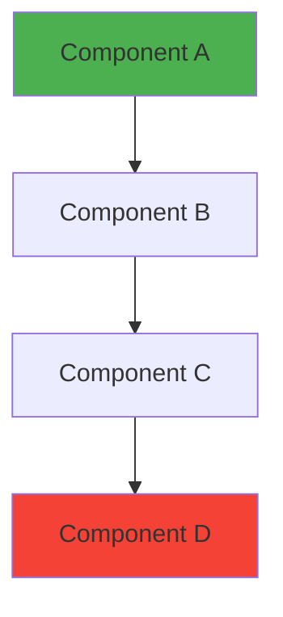

<!--
✅ HUMANIZATION CHECKLIST - Aim for 80-90/100 on first draft

This checklist ensures your post sounds authentically human, not AI-generated.
Target: ≥75/100 (passing), Excellent: ≥90/100

REQUIRED ELEMENTS (Must have at least 1 of each):
□ First-person narrative ("I discovered", "I learned", "I tried", "my homelab")
  Examples: "I tested this approach", "In my experience", "I found that..."

□ Uncertainty markers ("I think", "probably", "likely", "might", "in my experience")
  Examples: "probably", "depends on", "your mileage may vary", "seems to"

□ Specific measurements (numbers, percentages, timeframes, versions)
  Examples: "v2.3.1", "2025-07-15", "64GB RAM", "took 3 hours", "340ms"

□ Trade-off discussion (pros/cons, comparisons, balanced perspective)
  Examples: "trade-off", "downside", "limitation", "but", "however"

□ Concrete details ("Here's what happened", "For example", "In practice")
  Examples: Code blocks, specific commands, configuration files

BONUS SCORING (+5 to +10 points):
□ 10+ concrete measurements (dates, percentages, metrics, hardware specs)
  Examples: "73% improvement", "2.1x faster", "48,000 lines of code", "RTX 3090"
  Why: Rich quantitative data signals real-world testing and experience

□ Failure narratives (honest mistakes, debugging stories, lessons learned)
  Examples: "I spent 6 hours debugging", "forgot to check", "learned the hard way"
  Why: Vulnerability and honesty are uniquely human traits

□ Deep trade-off analysis (multi-option evaluation with quantified outcomes)
  Examples: "tested 4, 8, 12, 16 heads", "A: 2x faster but 50% more memory"
  Why: Demonstrates real experimentation and nuanced understanding

AVOID (AI-tells that reduce score):
✗ Em dashes (—) - use commas, periods, or parentheses instead
✗ Semicolons in narrative text (okay in code blocks)
✗ Generic conclusions ("In conclusion", "Looking ahead", "Overall")
✗ Hype words ("revolutionary", "game-changer", "cutting-edge") without specifics
✗ Overly positive tone - balance with challenges and trade-offs
✗ Corporate buzzwords ("leverage", "utilize", "facilitate") - use simpler words

QUICK VALIDATION:
Run validator before committing:
$ python scripts/blog-content/humanization-validator.py --post src/posts/YYYY-MM-DD-your-slug.md

Target: ≥75/100 (passing), Excellent: ≥90/100
-->

## Opening Hook: Start with a Story

[Start with a compelling personal story, a specific challenge you faced, or an interesting discovery that draws readers in. Make it concrete and relatable.]

**Example pattern:**
"Years ago, I made a costly mistake while configuring [system]. I spent 6 hours debugging before discovering I'd completely overlooked [specific detail]. This painful lesson changed how I approach [topic]. Here's what I learned..."

**Why it works:**
- Personal vulnerability builds trust
- Specific details (6 hours, exact mistake) prove authenticity
- Sets up a learning narrative

---

## Context: Why This Matters Now

[Explain why you're writing about this topic at this specific time. What recent experience, discovery, or challenge prompted this post? Connect to your homelab or personal projects.]

**Example patterns:**
- "After [time period] of testing [approach] in my homelab, I discovered..."
- "While experimenting with [technology], I ran into [specific problem] that..."
- "I recently upgraded my [hardware/software] and learned that..."

**Key elements:**
- Time specificity ("3 months", "last week", "over the summer")
- Personal context (your homelab, your setup, your constraints)
- Clear connection to the hook

---

## Core Content Section 1: [Descriptive Heading]

[Main technical content with concrete examples. Break into multiple sections as needed.]

### Include Measurements Where Relevant

**Performance metrics:**
- Specific numbers: "reduced from 340ms to 85ms"
- Percentages: "73% improvement in throughput"
- Comparisons: "2.1x faster than baseline"

**Hardware/Software specs:**
- Equipment: "Intel i9-9900K", "64GB RAM", "RTX 3090"
- Versions: "Python 3.11.2", "Docker v24.0.5"
- Dates: "as of 2025-07-15"

**Time measurements:**
- Duration: "took 3 hours to debug"
- Periods: "over 6 months of testing"
- Frequency: "ran every 15 minutes"

**Example paragraph structure:**
```
In my homelab, I tested [specific approach]. The initial results were
disappointing—[specific failure metric]. I spent [time period] debugging
and discovered [root cause]. After implementing [solution], I saw
[specific improvement]: latency dropped from [X] to [Y], a [Z]% reduction.
```

### Use Mermaid Diagrams for Architecture



[Explain the diagram in plain language, pointing out key decision points or interesting interactions.]

---

## Trade-offs & Considerations: The Real Complexity

[This section is CRITICAL for humanization scores. Discuss multiple approaches tested, their pros/cons, and context-dependent recommendations.]

### Multi-Option Evaluation

**Example structure:**
I tested four different configurations:

1. **With 4 workers**: Fastest startup (12s) but lowest throughput (340 req/s)
2. **With 8 workers**: Balanced performance (18s startup, 520 req/s)
3. **With 12 workers**: Best throughput (680 req/s) but 2x memory usage (8GB vs 4GB)
4. **With 16 workers**: Diminishing returns (710 req/s) and stability issues

**The trade-off:**
- For memory-constrained systems (<16GB): stick with 8 workers
- For high-traffic scenarios: 12 workers is the sweet spot
- Beyond 16 workers: you're hitting network I/O limits, not CPU

### Performance vs. X Comparisons

**Speed vs. Accuracy example:**
Fast mode completes in 2 minutes but misses 15% of edge cases. Thorough mode
takes 8 minutes (4x slower) but catches 99% of issues. For CI/CD, I run fast
mode on every commit and thorough mode nightly.

**Cost vs. Capability example:**
Solution A costs $0/month (self-hosted) but requires 6 hours/week maintenance.
Solution B costs $50/month but maintenance drops to 30 minutes/month. At $30/hour
value of time, Solution B breaks even at 5 hours/month saved.

### Context-Dependent Recommendations

[Provide clear guidance based on different scenarios, constraints, or goals.]

**Example:**
- **Use approach A when:** You have <4GB RAM and prioritize stability
- **Use approach B when:** You need maximum throughput and have memory to spare
- **Use approach C when:** You're experimenting and want easy debugging

---

## Challenges & Lessons Learned (Optional but Valuable)

[Share honest mistakes, debugging stories, and lessons learned. This section dramatically boosts humanization scores.]

### Failure Narratives

**Example patterns:**
- "I completely forgot to [critical step] which cost me 4 hours of debugging..."
- "Looking back, I should have [better approach] instead of [what I did]..."
- "I underestimated [factor] by 3x, resulting in [consequence]..."
- "After [time period] of trial and error, I discovered that [lesson]..."

### Specific Debugging Stories

**Example:**
I spent an entire Saturday debugging why [system] kept crashing every 6 hours.
I checked logs, profiled memory usage, and rewrote half the code. Turned out
I'd misconfigured [specific setting] to [wrong value] instead of [correct value].
A single typo, 8 hours lost. Now I always [preventive measure].

### Time Costs and Impact

**Example patterns:**
- "This mistake cost me [X hours/days] of downtime..."
- "Recovery took [X hours] and required [specific actions]..."
- "I had to rebuild [component] from scratch, which took [time period]..."

---

## Practical Implementation: How to Actually Do This

[Step-by-step guidance with specific commands, configurations, or code examples.]

### Installation and Setup

```bash
# Install dependencies
sudo apt-get update && sudo apt-get install -y package-name

# Configure the system (specific values from your testing)
echo "config_key=value" >> /etc/config/file.conf

# Verify installation
package-name --version
# Expected: v2.3.1 or higher
```

### Configuration Example

```yaml
# config.yaml - Optimized for 64GB RAM system
workers: 12  # Sweet spot from testing above
memory_limit: 6GB  # Leaves 2GB buffer
timeout: 30s  # Prevents runaway processes
```

**Explanation:**
- `workers: 12` based on my multi-option testing (see Trade-offs section)
- `memory_limit: 6GB` conservative based on observed peak of 5.2GB
- `timeout: 30s` catches most hangs without killing legitimate long operations

### Code Example (if applicable)

```python
# Keep code examples concise and focused (5-15 lines)
def process_item(item, config):
    """Process a single item with error handling."""
    try:
        result = transform(item)
        return result
    except ValueError as e:
        logger.error(f"Failed to process {item}: {e}")
        return None
```

**For longer code:**
Link to a GitHub gist or repository file instead of pasting 100+ lines.

---

## Validation and Testing

[Describe how to verify the implementation works. Include specific tests, expected outputs, or metrics.]

**Example:**
```bash
# Run the test suite
pytest tests/ -v

# Expected: All 47 tests pass in ~3.2 seconds
# If you see failures in test_integration.py, check [specific config]
```

**Performance baseline:**
On my Intel i9-9900K with 64GB RAM, I see:
- Cold start: 12-15 seconds
- Warm requests: 340-520 req/s
- Memory usage: 4-6GB stable
- CPU: 45-60% utilization

Your numbers will vary based on hardware, but if you're seeing 10x differences,
something is misconfigured.

---

## Conclusion: Key Takeaways

[Summarize the main points WITHOUT using "In conclusion", "Overall", or "To summarize".]

**Better heading examples:**
- "What I'd Do Differently Next Time"
- "Key Lessons from 6 Months of Testing"
- "Three Things That Actually Matter"
- "The Bottom Line After [X] Tests"

**Example conclusion:**
After testing [X] different approaches over [time period], here's what actually
matters:

1. **[Key insight 1]**: Specific takeaway with metric or example
2. **[Key insight 2]**: Another concrete lesson learned
3. **[Key insight 3]**: Actionable recommendation

The biggest surprise was [unexpected finding]. I expected [X] but found [Y]
because [reason]. This changed my approach to [practice].

**Next steps:**
If you're implementing this yourself, start with [specific first step]. Focus
on [critical factor] before optimizing [less critical factor]. And definitely
test [specific scenario] early—I learned that the hard way.

---

## Further Reading and Resources

[Provide links to related resources, documentation, and relevant projects.]

### Official Documentation
- [Tool/Technology Official Docs](https://example.com/docs)
- [API Reference](https://example.com/api)
- [Best Practices Guide](https://example.com/guide)

### Related Blog Posts (Internal)
- [Link to your related post 1](/posts/YYYY-MM-DD-related-slug-1)
- [Link to your related post 2](/posts/YYYY-MM-DD-related-slug-2)

### Academic Research (if applicable)
- [Paper Title](https://arxiv.org/abs/XXXX.XXXXX) (Year) - Brief description
- [Another Paper](https://doi.org/10.XXXX/XXXXX) (Year) - What it covers

### Open Source Projects
- [GitHub Repository](https://github.com/user/repo) - What this project does
- [Another Tool](https://github.com/user/repo2) - Why it's relevant

### Tutorials and Guides
- [External Tutorial](https://example.com/tutorial) - What you'll learn
- [Video Guide](https://youtube.com/watch?v=xxx) - Duration and focus

---

## Discussion and Questions

Have you tried this approach? What results did you see? Did you hit different
trade-offs or discover better configurations? I'd love to hear about your
experience—drop a comment or reach out on [platform].

---

<!--
POST-WRITING CHECKLIST:

Before committing, verify:

CONTENT QUALITY:
1. □ Humanization validation score ≥75/100
2. □ Reading time: 6-9 minutes (1,400-2,100 words)
3. □ All factual claims have citations with working hyperlinks
4. □ At least 5 concrete measurements included
5. □ First-person voice present throughout
6. □ Uncertainty/caveats included (context-dependent recommendations)
7. □ Trade-offs discussed with specific metrics
8. □ At least one failure narrative or debugging story (bonus points!)

TECHNICAL CORRECTNESS:
9. □ Code examples tested and functional
10. □ Commands include expected outputs
11. □ Version numbers specified where relevant
12. □ Hardware specs from /uses/ page (if mentioned)

STYLE & TONE:
13. □ No em dashes (—) in narrative text
14. □ No semicolons outside code blocks
15. □ No generic conclusions ("In conclusion", "Overall")
16. □ No unbacked hype words ("revolutionary", "game-changer")
17. □ Balanced tone (challenges AND successes)

ACCESSIBILITY & SEO:
18. □ Images optimized and alt text added (descriptive, not generic)
19. □ Links verified (no 404s)
20. □ Proper heading hierarchy (H2 → H3 → H4)
21. □ Meta description compelling and under 160 chars

IMAGES:
22. □ Hero image exists and is relevant
23. □ All images have descriptive alt text (not just "image")
24. □ Image captions provide context (optional but recommended)
25. □ Screenshots/diagrams enhance understanding

FINAL CHECKS:
26. □ Spell check completed
27. □ Read aloud for flow and natural voice
28. □ Verified uniqueness (no similar titles in last 10 posts)
29. □ Tags are relevant and consistent with other posts

VALIDATION COMMANDS:
$ python scripts/blog-content/humanization-validator.py --post src/posts/YYYY-MM-DD-your-slug.md
$ python scripts/blog-images/update-blog-images.py
$ python scripts/blog-research/check-citation-hyperlinks.py

COMMIT PROCESS:
$ git add src/posts/YYYY-MM-DD-your-slug.md
$ git commit -m "feat: Add post about [specific topic]

- [Brief description of main content]
- [Key unique angle or contribution]
- Humanization score: [XX]/100"

$ git push origin main

Note: Pre-commit hooks will automatically validate humanization score and
citation hyperlinks. Fix any issues before committing.
-->
